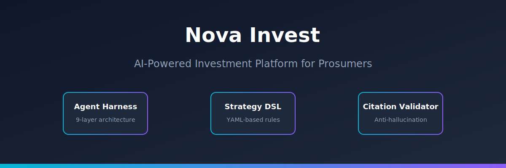
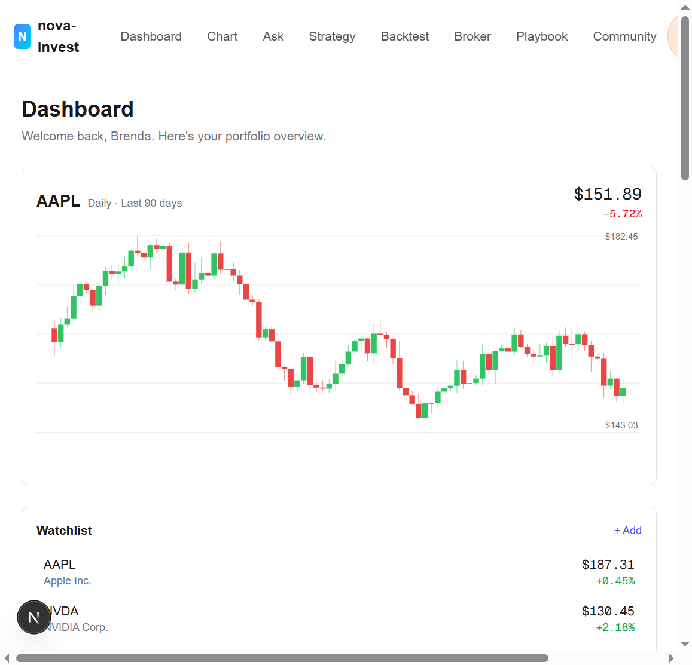
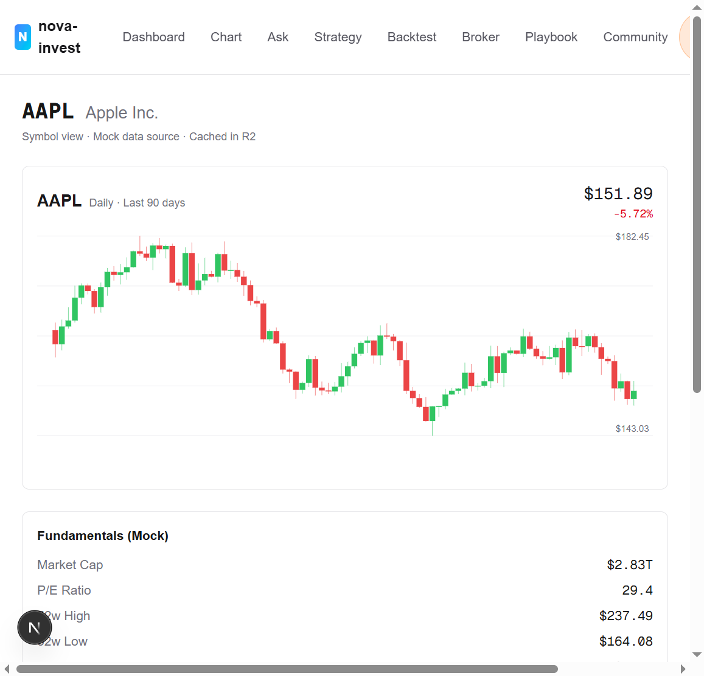
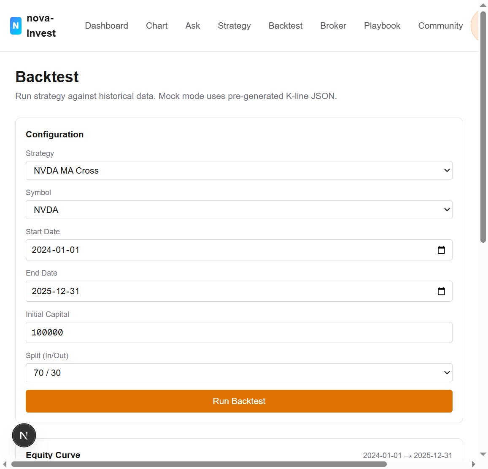
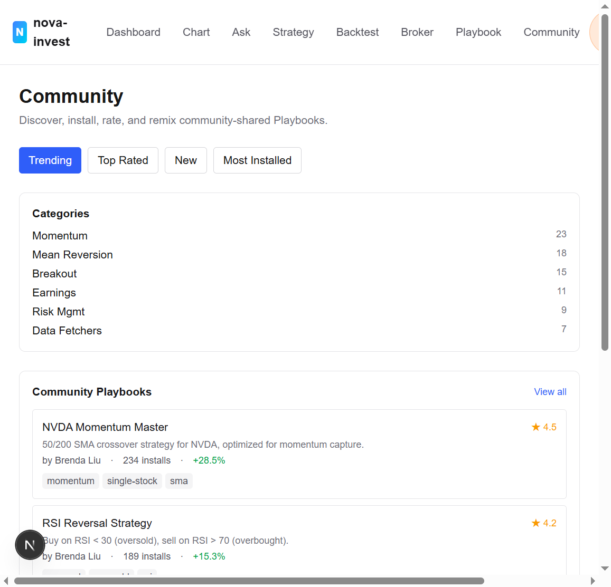
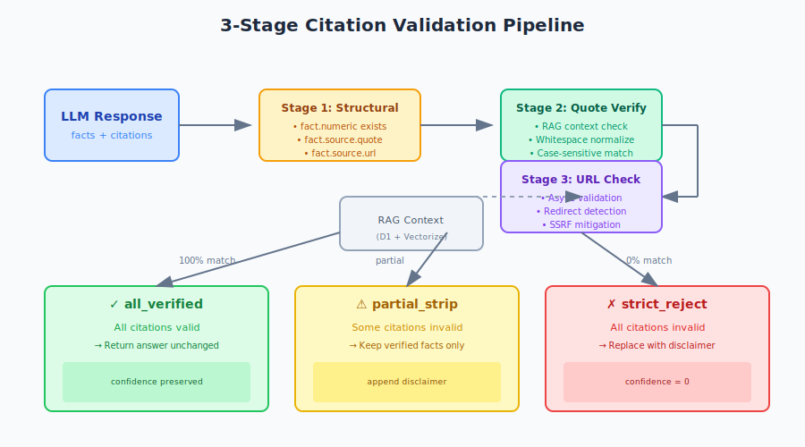

# Nova Invest · 新星投研

> **把自然语言变成可验证的交易策略。**
>
> AI 原生的"信息 → 判断 → 策略 → 监控"完整投研工作流系统。

[](https://github.com/ZedeX/nova-invest/actions/workflows/tests.yml)
[](https://www.typescriptlang.org/)
[](https://nextjs.org/)
[](https://workers.cloudflare.com/)
[](./LICENSE)



---

## ✨ Nova Invest 是什么？

**Nova Invest** 是一个 AI 原生的投研工作站，把传统的多工具研究工作流
（Bloomberg + Excel + TradingView + ChatGPT + Discord）压缩到一个统一的、
有强烈主张的平台上。三大核心能力，一条连续的工作流：

| # | 能力 | 入口 | 频次 |
|---|------|------|------|
| 1 | **Ask** — 深度研究 | 自然语言提问 | 一次性 |
| 2 | **Build Strategy** — 自然语言 → 策略 → 回测 | 自然语言描述 + DSL 编辑器 | 周期迭代 |
| 3 | **Build Dashboard** — 监控看板 | 选定策略 + 信号配置 | 长期监控 |

### 一个典型工作流

> *"现在应该买 NVDA 吗？"*

1. **Ask** — 输入问题。Ask Agent 通过 RAG 拉取 SEC 公告、新闻和价格数据，
   返回结构化回答，**每个数字都绑定到可验证的引用来源**（不产生幻觉数字）。
2. **Build Strategy** — 用大白话描述你的逻辑：
   *"当 NVDA 的 20 日 SMA 上穿 50 日 SMA 且 RSI(14) < 30 时买入"*。
   系统翻译成可组合的 YAML DSL，然后对 10+ 年历史数据回测，
   输出完整指标（Sharpe、Sortino、最大回撤、胜率、盈亏比）。
3. **Build Dashboard** — 把验证过的策略钉到看板。获取实时信号、
   执行模拟下单、监控持仓——全部在一个工作区里。
4. **Share** — 把你的策略作为版本化的 "Playbook"（语义化版本号）
   发布到社区。安装别人的 Playbook，评分评论。相当于 *"交易策略界的 GitHub"*。

> 💡 **设计哲学**：AI 回答中的每一个数字都能追溯到可验证的来源引用。
> 绝不出现幻觉数字。
> （[ADR-0007 反幻觉验证器](./docs/architecture/adr-0007-citation-validator.md)）

---

## 🎯 为什么选择 Nova Invest？

### 当前的痛点

零售和准专业投资者今天要回答 *"现在应该买 NVDA 吗？"* 这样一个简单问题，
需要切换 5+ 个工具：

- ❌ ChatGPT 用自信的语气幻觉出财务数字
- ❌ 雅虎财经只给数据，没有分析
- ❌ TradingView 只看图，没有自然语言问答
- ❌ Excel 回测和实时数据完全脱节
- ❌ Discord / Reddit 信号群没有审计追溯

### Nova Invest 的解法

✅ **Ask Agent** — 自然语言深度研究，配合 **3 阶段引用验证**
（结构验证 + 引文子串验证 + URL 可达性验证）。每个数字都链接到可验证的
SEC EDGAR / Yahoo Finance / Bloomberg 来源。

✅ **策略 DSL** — 用大白话描述你的逻辑，系统翻译成可组合的 YAML DSL
（`sma(20) > sma(50) AND rsi(14) < 30`），然后对 10+ 年历史数据回测。

✅ **实时看板** — 把验证过的策略钉到看板，获取实时信号、执行模拟下单、
监控持仓——全部在一个工作区里。

✅ **社区 Playbook** — 把你的策略作为版本化的 "Playbook"（语义化版本号）
分享，安装别人的 Playbook，评分评论。相当于 *"交易策略界的 GitHub"*。

---

## 📸 产品截图

Mock 模式下运行的实际 UI（无需 API Key）：

| 仪表盘 | Ask Agent |
|:-----:|:---------:|
|  |  |

| 策略编辑器 | K线图表 (AAPL) |
|:---------:|:-------------:|
|  |  |

| 回测 | 社区 |
|:----:|:----:|
|  |  |

---

## 🚀 快速开始

### 前置条件

- **Node.js** ≥ 20.0.0
- **pnpm** ≥ 9.0.0
- **Python** ≥ 3.10（仅用于重新生成 Mock 数据）

### 安装并运行（Mock 模式 — 零 API Key）

```bash
git clone https://github.com/ZedeX/nova-invest.git
cd nova-invest/web
pnpm install
pnpm mock:generate    # 生成 10 个标的 × 日线 K 线 + 5 个 QA 样本
pnpm dev              # http://localhost:3000
```

就这样。`USE_MOCK=true` 模式（默认）**不需要任何外部 API Key、
不需要 Cloudflare 绑定、不需要数据库**——完美适合本地开发和 Demo。

### 生产部署（Cloudflare Workers + D1 + R2 + Vectorize）

```bash
cd web
cp .env.example .env.production      # 填入 API Key
pnpm cf:create                       # 创建 D1 + R2 + KV + Vectorize 资源
pnpm db:migrate:prod                 # 应用 9 个 migration（25 张表）
pnpm db:seed                         # 灌入 10 个 mockup 标的 + 测试用户
pnpm deploy                          # wrangler 部署到 Cloudflare
```

📖 **完整部署指南**：[docs/prd/appendix/deployment_cloudflare.md](./docs/prd/appendix/deployment_cloudflare.md)

---

## 🏗️ 架构一览


### 技术栈

| 层级 | 技术 | 选择理由 |
|------|------|---------|
| **前端** | Next.js 16.2 + React 19.2 + Tailwind 4 | App Router + RSC 流式 SSR |
| **边缘运行时** | Cloudflare Workers 4 | 全球边缘 < 50ms，按请求付费 |
| **数据库** | Cloudflare D1（SQLite） | 25 张表，5GB 免费额度，SQL 外键约束 |
| **对象存储** | Cloudflare R2 | K 线缓存、Playbook YAML，零出口流量费 |
| **向量数据库** | Cloudflare Vectorize | SEC 公告 + 新闻的 RAG 嵌入 |
| **会话状态** | Cloudflare KV | 短期记忆 + 熔断器计数器 |
| **LLM 路由** | LM Studio（本地）/ 火山引擎 Ark（云端）/ Mock | 成本上限 + pro→lite 自动降级 |

### 数据流：4 级降级

当你请求行情数据（如 AAPL K 线），系统按顺序逐级尝试，直到有一级成功：

```
R2 缓存（瞬间，免费）
   ↓ 未命中
雅虎财经（免费，实时）
   ↓ 限频
Alpha Vantage（免费增值，需 Key）
   ↓ 不可达
Mock Provider（本地 JSON，永远可用）
```

这保证了 UI 在所有外部 API 宕机时仍然能渲染。
参见 [ADR-0002 R2 缓存白名单](./docs/architecture/adr-0002-r2-cache-whitelist.md)
和 [ADR-0016 熔断器](./docs/architecture/adr-0016-circuit-breaker.md)。

### LLM 路由：成本上限 + 自动降级

每个查询被分类为四种意图之一，各有独立的模型层级和成本上限：

| 意图 | 本地模型 | 云端模型 | 成本上限 |
|------|---------|---------|---------|
| `simple_qa` | qwen2.5-7b | doubao-lite-4k | $0.001 |
| `deep_research` | qwen2.5-32b | doubao-pro-32k | $0.05 |
| `tool_call` | qwen2.5-7b | doubao-pro-32k | $0.01 |
| `clarify` | qwen2.5-7b | doubao-lite-4k | $0.0005 |

每次调用前先运行 `estimateCost()`。若估计超出上限，模型自动降级
（pro → lite，便宜 10 倍）。参见
[ADR-0003 LLM 路由 + 成本上限](./docs/architecture/adr-0003-llm-routing-cost-cap.md)。

### 16 份 ADR（架构决策记录）

每个重大技术决策都有 ADR 文档。完整注册表在
[docs/architecture/](./docs/architecture/)。

| # | ADR | 领域 | 状态 |
|---|-----|------|------|
| 0001 | [USE_MOCK 双模开关](./docs/architecture/adr-0001-use-mock-dual-mode-switch.md) | 横切 | Accepted |
| 0002 | [R2 缓存白名单](./docs/architecture/adr-0002-r2-cache-whitelist.md) | 数据层 | Accepted |
| 0003 | [LLM 路由 + 成本上限](./docs/architecture/adr-0003-llm-routing-cost-cap.md) | Ask Agent | Accepted |
| 0004 | [Agent Loop 设计](./docs/architecture/adr-0004-agent-loop-design.md) | Ask Agent | Accepted |
| 0005 | [记忆层（KV + D1）](./docs/architecture/adr-0005-memory-layer.md) | Ask Agent | Accepted |
| 0006 | [Tool 协议](./docs/architecture/adr-0006-tool-protocol.md) | Ask Agent | Accepted |
| 0007 | [引用验证器（反幻觉）](./docs/architecture/adr-0007-citation-validator.md) | Ask Agent | Accepted |
| 0008 | [策略 DSL Schema](./docs/architecture/adr-0008-strategy-dsl-schema.md) | 策略 | Accepted |
| 0009 | [回测引擎](./docs/architecture/adr-0009-backtest-engine.md) | 策略 | Accepted |
| 0010 | [看板布局](./docs/architecture/adr-0010-dashboard-layout.md) | 看板 | Accepted |
| 0011 | [D1 Schema Master（25 张表）](./docs/architecture/adr-0011-d1-schema-master.md) | 数据层 | Accepted |
| 0012 | [社区 UGC](./docs/architecture/adr-0012-community-ugc.md) | 社区 | Accepted |
| 0013 | [Playbook 系统](./docs/architecture/adr-0013-playbook-system.md) | Playbook | Accepted |
| 0014 | [Ask RAG 管线](./docs/architecture/adr-0014-ask-rag-pipeline.md) | Ask Agent | Accepted |
| 0015 | [SSE 流式传输](./docs/architecture/adr-0015-sse-streaming.md) | 横切 | Accepted |
| 0016 | [熔断器](./docs/architecture/adr-0016-circuit-breaker.md) | 数据层 | Accepted |

---

## 🧠 反幻觉：引用验证器

Nova Invest 最具差异化的能力。AI 生成回答中的每个数字都会经过
**3 阶段验证管线**：



| 阶段 | 检查内容 | 失败行为 |
|------|---------|---------|
| **1. 结构验证** | URL 可解析、HTTPS、主机在白名单、来源标签有效、置信度 ∈ [0,1]、数值有限、单位非空 | 剥离该事实，记录 `structural` 失败 |
| **2. 引文子串验证** | `fact.source.quote` 作为精确子串（大小写敏感，空白归一化）出现在 RAG 上下文中 | 剥离该事实，记录 `quote_substring` 失败 |
| **3. URL 可达性** | （异步，仅 Cloud 模式）HTTP GET 配合 `redirect:"manual"` SSRF 防御 | 写入 `url_check_queue` 表；**不阻塞**响应 |

**失败模式**：
- ✅ **all_verified** — 所有事实通过阶段 1+2，回答原样返回
- ⚠️ **partial_strip** — 部分事实失败，保留通过的事实 + 追加免责声明
- 🚫 **strict_reject** — 所有事实失败，把摘要替换为
  *"I don't have reliable data for this question."*

📖 **完整规范**：[ADR-0007](./docs/architecture/adr-0007-citation-validator.md)

---

## 📊 项目结构

```
nova-invest/
├── docs/                    # 📚 全部项目文档
│   ├── architecture/        # 16 份 ADR + 架构评审历史
│   ├── prd/                 # Master PRD + 8 个 Epic 规格 + 附录
│   ├── roadmap/             # 3 阶段 18 个月路线图
│   ├── spec/                # API 规格、数据模型、DSL 规格
│   └── reviews/             # 代码 / 安全评审报告
├── web/                     # 🚀 Next.js 16 应用
│   ├── src/
│   │   ├── app/             # Next.js App Router（9 个路由 + 6 个 API 端点）
│   │   ├── components/      # React 组件（Header, Sidebar, 7 个 widget）
│   │   └── lib/             # 业务逻辑（16 个模块）
│   │       ├── agent/       # ADR-0004 Agent Loop
│   │       ├── ask/         # ADR-0007 Stage 2 引用验证器
│   │       ├── backtest/    # ADR-0009 回测引擎
│   │       ├── citation/    # ADR-0007 Stage 1 + Stage 3
│   │       ├── community/   # ADR-0012 社区 UGC
│   │       ├── dashboard/   # ADR-0010 看板布局
│   │       ├── data/        # ADR-0002 + ADR-0016 数据层 + 熔断器
│   │       ├── db/          # ADR-0011 D1 Schema Master（25 张表）
│   │       ├── llm/         # ADR-0003 LLM 路由
│   │       ├── memory/      # ADR-0005 记忆层（KV + D1）
│   │       ├── playbook/    # ADR-0013 Playbook 系统
│   │       ├── rag/         # ADR-0014 RAG 管线
│   │       ├── sse/         # ADR-0015 SSE 流式传输
│   │       ├── strategy/    # ADR-0008 策略 DSL
│   │       └── tools/       # ADR-0006 Tool 协议
│   ├── public/mock/         # Mock JSON 数据（10 标的, 5 QA 样本）
│   └── migrations/          # D1 SQL migration（001-009, 25 张表）
├── scripts/                 # Python Mock 数据生成器
└── project_memory.md        # 🧠 会话记忆（agent 自动更新）
```

---

## 📈 路线图

| 阶段 | 窗口 | 主题 | 退出标准 |
|------|------|------|---------|
| **Phase 1: PMF 验证** | 0-6 月 | 验证产品假设，跑通最小闭环 | 100 DAU + WAU-CW > 30 |
| **Phase 2: PMF 放大** | 7-12 月 | 扩大用户基数，验证商业模式 | 5000 注册 + 5% 付费 |
| **Phase 3: 平台化** | 13-18 月 | 开放生态，多市场扩张 | 50K 用户 + 5000+ UGC Playbook |

📖 **完整路线图**：[docs/roadmap/Roadmap.md](./docs/roadmap/Roadmap.md)

---

## 🔒 安全

Nova Invest 严肃对待安全。关键措施：

- **SSRF 防御（CWE-918）**：所有出站 HTTP 调用（引用 URL 可达性检查）
  使用 `redirect: "manual"` + `opaqueredirect` 检测。杜绝开放重定向
  转向内部地址。
- **SQL 注入封堵**：D1 表名硬编码为 `as const` 字面量，
  绝不从调用方输入插值。
- **边界校验**：`validateMemoryRef()` 在每个 `MemoryStore.save()` 顶部
  调用，拒绝畸形 ref 进入存储。
- **生产环境 Fail-Fast**：`getMemoryStore()` 在 `USE_MOCK='false'` 但
  `env.DB` 缺失时抛错——生产环境绝不静默回退到 Mock。
- **来源白名单**：引用 URL 主机名必须在
  `{sec.gov, finance.yahoo.com, alphavantage.co, bloomberg.com, reuters.com}` 中。

📖 **安全评审**：[docs/reviews/security-review-2026-07-20.md](./docs/reviews/security-review-2026-07-20.md)

---

## 📚 文档索引

| 文档 | 路径 | 描述 |
|------|------|------|
| 📋 **Master PRD** | [docs/prd/Master_PRD.md](./docs/prd/Master_PRD.md) | 产品需求（8 个 Epic） |
| 🏗️ **架构** | [docs/architecture/](./docs/architecture/) | 16 份 ADR + 架构评审 |
| 🗺️ **路线图** | [docs/roadmap/Roadmap.md](./docs/roadmap/Roadmap.md) | 3 阶段 18 个月规划 |
| 🔌 **API 规格** | [docs/spec/api_spec.md](./docs/spec/api_spec.md) | REST + SSE API 契约 |
| 📊 **数据模型** | [docs/spec/data_model.md](./docs/spec/data_model.md) | D1 schema + R2 布局 |
| ⚖️ **策略 DSL** | [docs/spec/strategy_dsl_spec.md](./docs/spec/strategy_dsl_spec.md) | YAML DSL 语法 |
| 🔒 **安全评审** | [docs/reviews/security-review-2026-07-20.md](./docs/reviews/security-review-2026-07-20.md) | 2026-07-20 审计 |
| 🌐 **English README** | [README.md](./README.md) | Project documentation in English |

---

## 🤝 贡献

欢迎贡献！请先阅读：

1. [Master PRD](./docs/prd/Master_PRD.md) — 理解产品愿景
2. [架构文档](./docs/architecture/architecture.md) — 理解系统
3. 提交 PR 前运行 `pnpm test`——所有测试必须通过

### 代码风格

- **TypeScript** 严格模式（业务逻辑 0 `any`，0 `unknown` 强转）
- **ESLint** + **Prettier** 强制
- **Conventional Commits**（`feat:`、`fix:`、`docs:`、`refactor:`、`test:`）
- **ADR 优先**：任何架构变更必须同步更新 ADR

---

## 📄 许可证

[MIT](./LICENSE) © 2026 ZedeX

---

## 🙏 致谢

Nova Invest 是一个展示 AI 原生全栈工程的作品集项目。**不**隶属于 Bloomberg、
Reuters 或任何金融数据提供商。所有 Mock 数据均为教育目的合成生成。

用 ❤️ 构建，使用了：

[](https://nextjs.org/)
[](https://workers.cloudflare.com/)
[](https://www.typescriptlang.org/)
