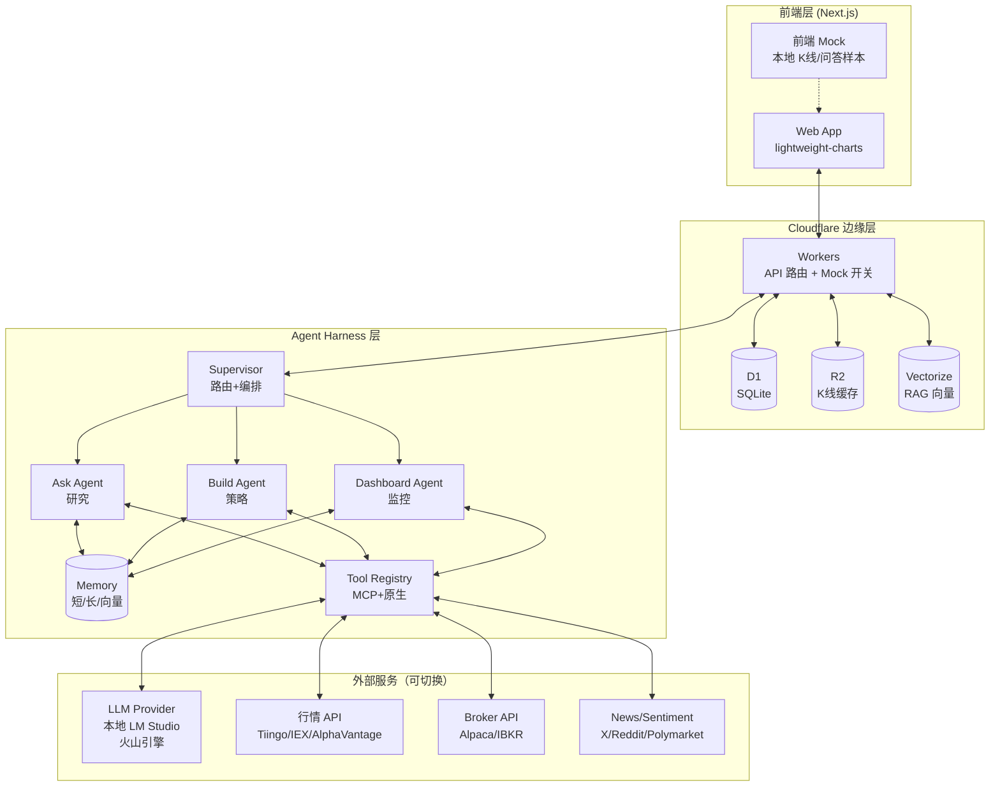
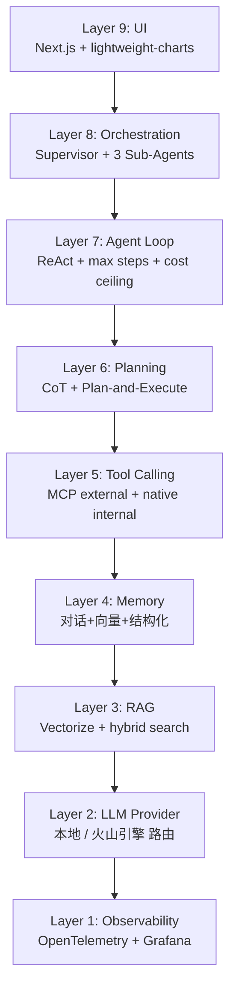
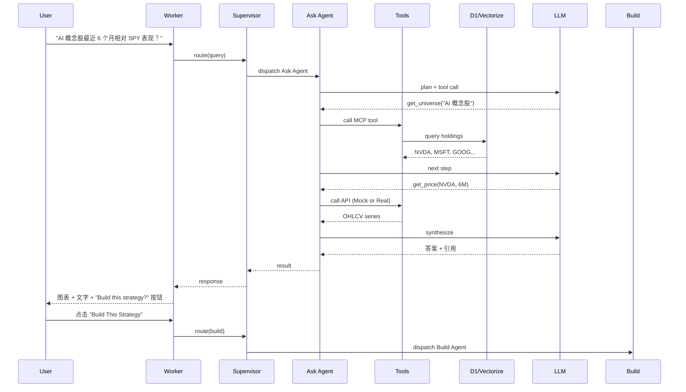
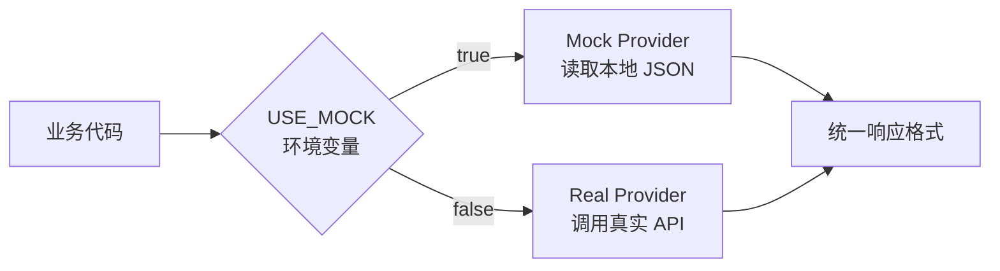
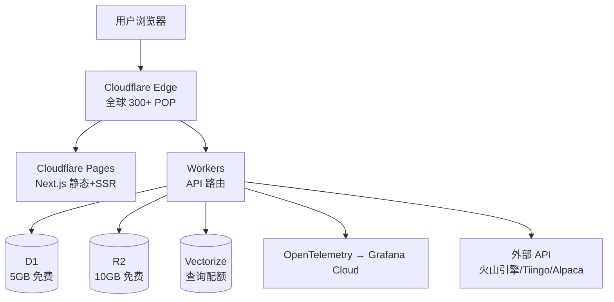
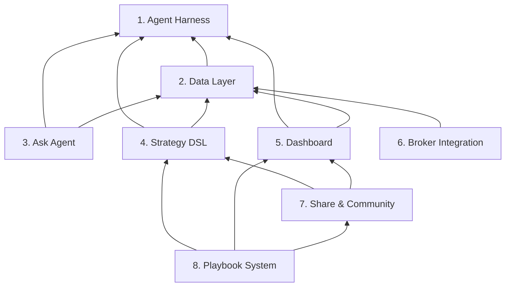

# Nova Invest 系统架构文档

> **版本**: v1.0 · **日期**: 2026-07-19 · **状态**: \[B] 规范性 + \[C] 求职作品型
>
> **说明**: 本文档定义 Nova Invest（Alva-inspired AI 投研工作流系统）的整体技术架构。所有 Epic 文档应引用本文档作为架构基线。

***

## 1. 设计原则

| # | 原则                 | 说明                                    |
| - | ------------------ | ------------------------------------- |
| 1 | **AI-Native 优先**   | 不是把 AI 贴在传统工具上，而是从 Agent 重构工作流        |
| 2 | **Mock/真实双模**      | 一切外部依赖（LLM、行情、券商、向量库）通过开关切换 Mock / 真实 |
| 3 | **Cloudflare 技术栈** | 全栈部署在 Cloudflare 上，可演示可上线             |
| 4 | **模块解耦**           | 8 大模块独立可测，通过明确接口协作                    |
| 5 | **可观测优先**          | 每次 LLM 调用、工具调用、回测结果都全链路 trace         |

***

## 2. 系统全景图



***

## 3. 9 层 Agent Harness 架构



### 各层职责

| 层               | 职责                                 | 技术选型                                      |
| --------------- | ---------------------------------- | ----------------------------------------- |
| 9 UI            | Web 入口，lightweight-charts 图表        | Next.js 16 + lightweight-charts (Apache 2.0) |
| 8 Orchestration | Supervisor 路由 Ask/Build/Dashboard  | 自研轻量编排器                                   |
| 7 Agent Loop    | ReAct + max\_steps + 成本/延迟 ceiling | TypeScript                                |
| 6 Planning      | CoT + Plan-and-Execute             | LLM 原生                                    |
| 5 Tool Calling  | MCP（外部数据源）+ 原生 function call（内部）   | MCP SDK + native                          |
| 4 Memory        | 对话 buffer + 向量（Vectorize）+ 结构化（D1） | Cloudflare 三件套                            |
| 3 RAG           | 金融语料库 + 检索 + rerank                | Cloudflare Vectorize + 自研 rerank          |
| 2 LLM Provider  | 本地 LM Studio + Cloudflare 部署后接火山引擎 | LiteLLM 风格路由                              |
| 1 Observability | trace + replay + 成本监控              | OpenTelemetry + Grafana Cloud free        |

***

## 4. 数据流：用户提问 → 完整工作流



***

## 5. Mock / 真实模式切换

### 5.1 切换架构



### 5.2 环境变量配置

```bash
# .env.local (本地开发)
USE_MOCK=true                    # 启用 Mock
LLM_BASE_URL=http://localhost:1234 # LM Studio
LLM_API_KEY=mock

# .env.production (Cloudflare 部署)
USE_MOCK=false
LLM_BASE_URL=https://ark.cn-beijing.volces.com  # 火山引擎
LLM_API_KEY=${{ARK_API_KEY}}
```

### 5.3 Mock 数据集清单

| 类型    | 位置                                    | 内容                    |
| ----- | ------------------------------------- | --------------------- |
| K 线   | `web/public/mock/klines/*.json`       | NVDA/MSFT/SPY 等日线+分钟线 (运行时 URL: `/mock/klines/*.json`) |
| 财报    | `web/public/mock/earnings/*.json`     | NVDA/MSFT 财报文本+结构化 (运行时 URL: `/mock/earnings/*.json`) |
| 问答样本  | `web/public/mock/qa_samples/*.json`   | 50+ 预写问答对 (运行时 URL: `/mock/qa_samples/*.json`) |
| 用户/策略 | D1 seed                       | 测试账号、Credit、策略草稿      |
| 回测结果  | D1 seed                       | 预生成回测报告               |
| 社区    | D1 seed                       | Playbook 样本 + 创作者档案   |

***

## 6. 部署架构（Cloudflare 免费栈）



### 免费额度约束

| 服务        | 免费额度                    | 我们的使用           | 余量    |
| --------- | ----------------------- | --------------- | ----- |
| Workers   | 100K 请求/天               | \~10K 估算        | 90K   |
| D1        | 5GB 存储 + 5M 行读/天        | \~100MB + 50K 读 | 充足    |
| R2        | 10GB + 1M Class A ops/月 | \~500MB K线缓存    | 9.5GB |
| Vectorize | 30M 查询/月（beta）          | \~100K 估算       | 充足    |
| Pages     | 500 builds/月 + 无限请求     | \~30 builds     | 充足    |

***

## 7. 模块依赖关系



***

## 8. 技术栈一览

| 层             | 技术                            | 版本     |
| ------------- | ----------------------------- | ------ |
| 前端框架          | Next.js                       | 16.2   |
| UI 库          | React                         | 19.2   |
| 样式            | Tailwind CSS                  | 4.3    |
| 图表            | lightweight-charts (Apache 2.0) | latest — Phase 1: SVG 占位；Phase 1.5: 接入 lightweight-charts |
| UI 组件         | shadcn/ui                     | latest |
| 后端            | Cloudflare Workers            | latest |
| 数据库           | Cloudflare D1 (SQLite)        | -      |
| 对象存储          | Cloudflare R2                 | -      |
| 向量库           | Cloudflare Vectorize          | -      |
| LLM 路由        | 自研 adapter                    | -      |
| LLM Provider  | 本地 LM Studio / 火山引擎 Ark       | -      |
| Observability | OpenTelemetry + Grafana Cloud | -      |
| 包管理           | pnpm                          | 11.9   |
| 部署            | Cloudflare Pages + Workers    | -      |
| 版本控制          | git + GitHub                  | -      |

***

## 9. 关键技术决策

### 9.1 为什么不用 Postgres？

- Cloudflare D1 免费层够用（5GB）
- 边缘部署延迟低
- 后续可平滑迁移到 Neon/Supabase Postgres

### 9.2 为什么用 Supervisor-Worker 多 Agent？

- Ask / Build / Dashboard 三大能力差异大，单 Agent 上下文臃肿
- 多 Agent 允许独立 prompt 调优
- Hand-off 协议清晰

### 9.3 为什么用自定义 DSL 而非 Python？

- 可验证 + 可审计 + 可分享
- LLM 易生成
- 比 Python 安全（无代码注入）

### 9.4 为什么 LLM 路由支持本地 + 云？

- 本地：开发调试免费
- 云：生产部署可控
- 配置化切换，不绑死供应商

***

## 10. 安全与合规边界

| 维度      | 边界                               |
| ------- | -------------------------------- |
| 用户数据    | D1 加密 + 用户隔离                     |
| API key | wrangler secret 注入，不入库           |
| LLM 调用  | rate limit + cost ceiling        |
| 交易      | Phase 2 才接 broker，Phase 1 仅 Mock |
| 合规      | Publisher 定位 + 免责声明 + 不持用户资金     |

***

## 附录：架构演进路径

```
v1.0 (当前)  →  v1.1            →  v2.0
Mock 单机     真实 API + Cloudflare   多区域 + 付费层
```

> 末次更新：2026-07-19

