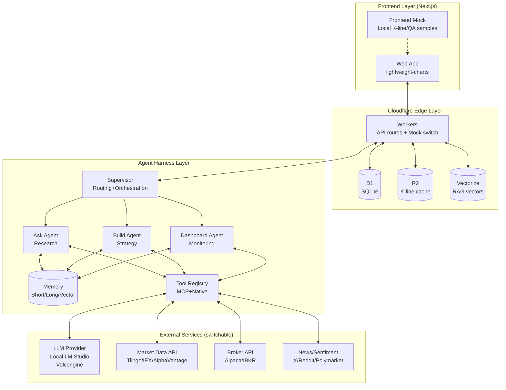
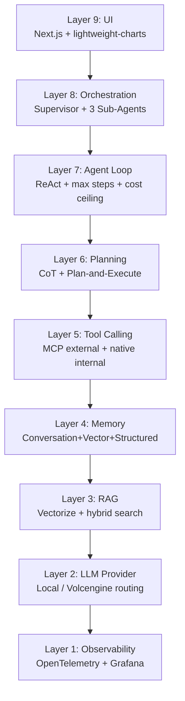
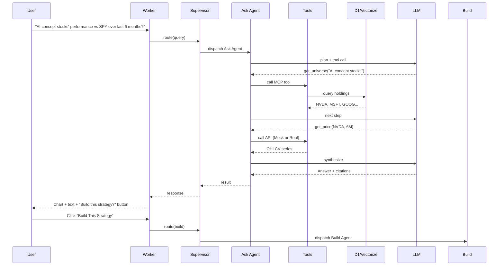
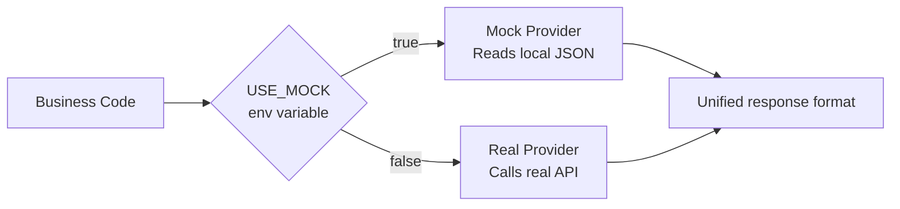
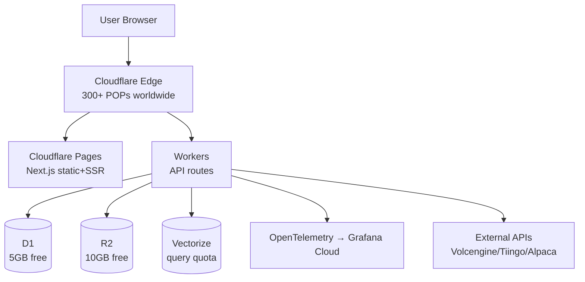
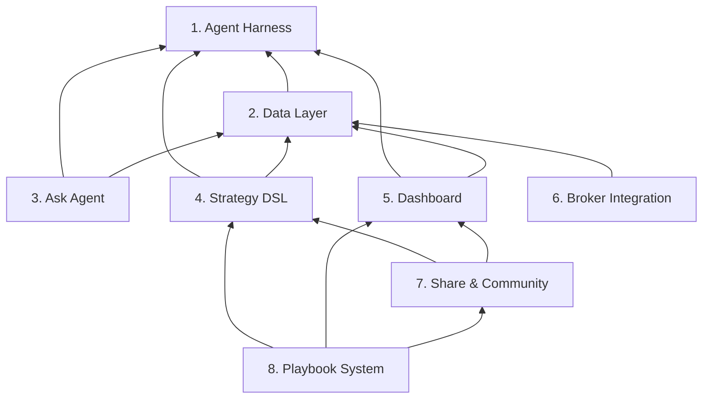

# Nova Invest System Architecture Document

> **Version**: v1.0 · **Date**: 2026-07-19 · **Status**: \[B] Normative + \[C] Personal Project Type
>
> **Note**: This document defines the overall technical architecture of Nova Invest (AI investment research workflow system). All Epic documents should reference this document as the architecture baseline.

***

## 1. Design Principles

| # | Principle | Description |
| - | ------------------ | ------------------------------------- |
| 1 | **AI-Native First** | Not bolting AI onto traditional tools, but reconstructing workflow from the Agent up |
| 2 | **Mock/Real Dual Mode** | All external dependencies (LLM, market data, brokers, vector DB) switch between Mock / Real via toggle |
| 3 | **Cloudflare Stack** | Full stack deployed on Cloudflare, demonstrable and production-ready |
| 4 | **Module Decoupling** | 8 major modules independently testable, collaborating through clear interfaces |
| 5 | **Observability First** | Every LLM call, tool call, backtest result has full-link trace |

***

## 2. System Panorama



***

## 3. 9-Layer Agent Harness Architecture



### Layer Responsibilities

| Layer | Responsibility | Technology Choice |
| --------------- | ---------------------------------- | ----------------------------------------- |
| 9 UI | Web entry, lightweight-charts charts | Next.js 16 + lightweight-charts (Apache 2.0) |
| 8 Orchestration | Supervisor routes Ask/Build/Dashboard | Self-developed lightweight orchestrator |
| 7 Agent Loop | ReAct + max\_steps + cost/latency ceiling + SSE streaming | TypeScript (see [ADR-0004](./adr-0004-agent-loop-design.md); streaming [ADR-0015](./adr-0015-sse-streaming.md))                            |
| 6 Planning | CoT + Plan-and-Execute | LLM native |
| 5 Tool Calling | MCP (external data sources) + native function call (internal) + Circuit Breaker | MCP SDK + native (see [ADR-0006](./adr-0006-tool-protocol.md); circuit breaker [ADR-0016](./adr-0016-circuit-breaker.md))                          |
| 4 Memory | Conversation buffer + vector (Vectorize) + structured (D1) | Cloudflare trio (see [ADR-0005](./adr-0005-memory-layer.md))                            |
| 3 RAG | Financial corpus + retrieval + rerank | Cloudflare Vectorize + self-developed rerank (see [ADR-0014](./adr-0014-ask-rag-pipeline.md))          |
| 2 LLM Provider | Local LM Studio + Cloudflare deployment then Volcengine + streaming | LiteLLM-style routing (see [ADR-0003](./adr-0003-llm-routing-cost-cap.md))                              |
| 1 Observability | trace + replay + cost monitoring | OpenTelemetry + Grafana Cloud free        |

***

## 4. Data Flow: User Question → Complete Workflow



***

## 5. Mock / Real Mode Switching

> **Architecture Decision**: see [ADR-0001: Use-Mock Dual-Mode Switch](./adr-0001-use-mock-dual-mode-switch.md)

### 5.1 Switching Architecture



### 5.2 Environment Variable Configuration

```bash
# .env.local (local development)
USE_MOCK=true                    # Enable Mock
LLM_BASE_URL=http://localhost:1234 # LM Studio
LLM_API_KEY=mock

# .env.production (Cloudflare deployment)
USE_MOCK=false
LLM_BASE_URL=https://ark.cn-beijing.volces.com  # Volcengine
LLM_API_KEY=${{ARK_API_KEY}}
```

### 5.3 Mock Dataset Inventory

| Type | Location | Content |
| ----- | ------------------------------------- | --------------------- |
| K-line | `web/public/mock/klines/*.json` | NVDA/MSFT/SPY daily+minute lines (runtime URL: `/mock/klines/*.json`) |
| Earnings | `web/public/mock/earnings/*.json` | NVDA/MSFT earnings text+structured (runtime URL: `/mock/earnings/*.json`) |
| QA samples | `web/public/mock/qa_samples/*.json` | 50+ pre-written Q&A pairs (runtime URL: `/mock/qa_samples/*.json`) |
| Community | `web/public/mock/community/*.json` | Preset Playbook samples + creator profiles (runtime URL: `/mock/community/*.json`) |
| User/Strategy | D1 seed | Test accounts, Credit, strategy drafts |
| Backtest results | D1 seed | Pre-generated backtest reports |

***

## 6. Deployment Architecture (Cloudflare Free Stack)

> **R2 Cache Whitelist**: see [ADR-0002: R2 Cache Whitelist](./adr-0002-r2-cache-whitelist.md)
>
> **D1 Schema Master**: see [ADR-0011: D1 Schema Master](./adr-0011-d1-schema-master.md)



### Free Tier Constraints

| Service | Free Quota | Our Usage | Headroom |
| --------- | ----------------------- | --------------- | ----- |
| Workers | 100K requests/day | ~10K estimated | 90K |
| D1 | 5GB storage + 5M row reads/day | ~100MB + 50K reads | Sufficient |
| R2 | 10GB + 1M Class A ops/month | ~500MB K-line cache | 9.5GB |
| Vectorize | 30M queries/month (beta) | ~100K estimated | Sufficient |
| Pages | 500 builds/month + unlimited requests | ~30 builds | Sufficient |

***

## 7. Module Dependencies



***

## 8. Technology Stack Overview

| Layer | Technology | Version |
| ------------- | ----------------------------- | ------ |
| Frontend Framework | Next.js | 16.2 |
| UI Library | React | 19.2 |
| Styling | Tailwind CSS | 4.3 |
| Charts | lightweight-charts (Apache 2.0) | latest — Phase 1: SVG placeholder; Phase 1.5: integrate lightweight-charts |
| UI Components | shadcn/ui | latest |
| Backend | Cloudflare Workers | latest |
| Database | Cloudflare D1 (SQLite) | - |
| Object Storage | Cloudflare R2 | - |
| Vector DB | Cloudflare Vectorize | - |
| LLM Routing | Self-developed adapter | - |
| LLM Provider | Local LM Studio / Volcengine Ark | - |
| Observability | OpenTelemetry + Grafana Cloud | - |
| Package Manager | pnpm | 11.9 |
| Deployment | Cloudflare Pages + Workers | - |
| Version Control | git + GitHub | - |

***

## 9. Key Technical Decisions

### 9.1 Why Not Postgres?

- Cloudflare D1 free tier is sufficient (5GB)
- Edge deployment has low latency
- Can smoothly migrate to Neon/Supabase Postgres later

### 9.2 Why Supervisor-Worker Multi-Agent?

- Ask / Build / Dashboard have very different capabilities; single Agent would have bloated context
- Multi-Agent allows independent prompt tuning
- Clear hand-off protocol

### 9.3 Why Custom DSL Instead of Python?

- Verifiable + auditable + shareable
- Easy for LLM to generate
- Safer than Python (no code injection)

### 9.4 Why Does LLM Routing Support Mock + Local + Cloud?

> **3-tier model (per [ADR-0003](./adr-0003-llm-routing-cost-cap.md))**:
> - **Mock**: `USE_MOCK=true` -> MockLLM, zero API calls, returns pre-generated JSON samples. Used for demos and testing.
> - **Local**: `USE_MOCK=false` + `ENVIRONMENT!="production"` -> RealLLM with LM Studio. Free for development debugging.
> - **Cloud**: `USE_MOCK=false` + `ENVIRONMENT="production"` -> RealLLM with Volcengine Ark. Controllable production deployment.

- Mock: zero-dependency demos, reproducible tests
- Local: free development debugging
- Cloud: controllable production deployment
- Configuration-driven switching, no vendor lock-in

***

## 10. Security and Compliance Boundaries

| Dimension | Boundary |
| ------- | -------------------------------- |
| User Data | D1 encryption + user isolation |
| API key | wrangler secret injection, not persisted in DB |
| LLM Calls | rate limit + cost ceiling |
| Trading | Phase 2 only connects to broker, Phase 1 only Mock |
| Compliance | Publisher positioning + disclaimer + does not hold user funds |

***

## 11. Architecture Decision Records (ADR)

| ADR | Title | Status | Coverage Layer |
|-----|------|------|--------|
| [ADR-0001](./adr-0001-use-mock-dual-mode-switch.md) | Use-Mock Dual-Mode Switch | Accepted | §5 Mock/Real |
| [ADR-0002](./adr-0002-r2-cache-whitelist.md) | R2 Cache Whitelist | Accepted | §6 Deployment/R2 |
| [ADR-0003](./adr-0003-llm-routing-cost-cap.md) | LLM Routing + Cost Cap | Accepted | §9.4 LLM Routing |
| [ADR-0004](./adr-0004-agent-loop-design.md) | Agent Loop Design | Accepted | §3 Layer 7 |
| [ADR-0005](./adr-0005-memory-layer.md) | Memory Layer (2/3 Phase 1) | Accepted | §3 Layer 4 |
| [ADR-0006](./adr-0006-tool-protocol.md) | Tool Protocol (Native+MCP) | Accepted | §3 Layer 5 |
| [ADR-0007](./adr-0007-citation-validator.md) | Citation Validator | Accepted | Ask Agent §2 |
| [ADR-0008](./adr-0008-strategy-dsl-schema.md) | Strategy DSL Schema | Accepted | §3 EP04 Strategy |
| [ADR-0009](./adr-0009-backtest-engine.md) | Backtest Engine + PaperBroker | Accepted | §3 EP04/EP06 |
| [ADR-0010](./adr-0010-dashboard-layout.md) | Dashboard Layout + Widgets | Accepted | §3 EP05 Dashboard |
| [ADR-0011](./adr-0011-d1-schema-master.md) | D1 Schema Master | Accepted | §6 Deployment/D1 |
| [ADR-0012](./adr-0012-community-ugc.md) | Community UGC + Moderation | Accepted | §3 EP07 Community |
| [ADR-0013](./adr-0013-playbook-system.md) | Playbook System | Accepted | §3 EP08 Playbook |
| [ADR-0014](./adr-0014-ask-rag-pipeline.md) | Ask RAG Pipeline (Embed→Retrieve→Assemble) | Accepted | §3 Layer 3 RAG |
| [ADR-0015](./adr-0015-sse-streaming.md) | SSE Streaming for Long-Running Ask Responses | Accepted | §3 Layer 7 (transport) |
| [ADR-0016](./adr-0016-circuit-breaker.md) | Circuit Breaker for External Data Sources | Accepted | §3 Layer 5 (data reliability) |

***

## Appendix: Architecture Evolution Path

```
v1.0 (current)  →  v1.1            →  v2.0
Mock standalone     Real API + Cloudflare   Multi-region + paid tier
```

> Last updated: 2026-07-19
