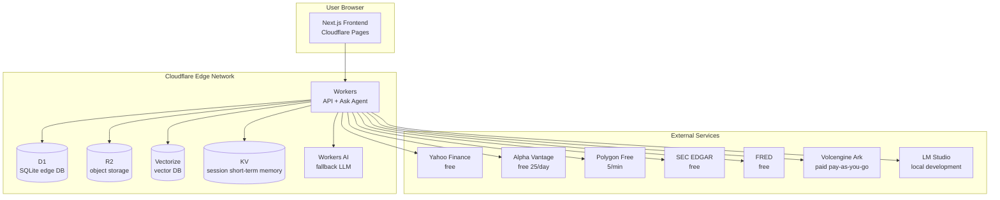

# Appendix C: Cloudflare Deployment Architecture

**Appendix Type**: Deployment Architecture + Free Tier Constraints
**Document Nature Tag**: [A] + [B] + [C]
**Last Updated**: 2026-07-19

---

## 1. Overall Deployment Architecture [B]



---

## 2. Cloudflare Free Tier Constraints [B] - **Key Decision**

### 2.1 Free Tier Allowance Table

| Service | Free Allowance | nova-invest Estimated Usage | Headroom |
|---|---|---|---|
| Workers | 100,000 req/day | ~10,000 req/day | 90% |
| Workers CPU | 10ms/req | ~5ms/req | 50% |
| D1 | 5 GB storage + 5M rows read/day | ~500MB + 100K rows/day | 90% |
| R2 | 10 GB storage + 1M Class A ops/month + 10M Class B ops/month | ~50MB + 10K ops/month | 99% |
| Vectorize | 30M queried vectors/month + 100K stored vectors | ~1M queries + 10K stored | 96% |
| KV | 100K reads/day + 1K writes/day | ~50K reads + 100 writes | 50% |
| Pages | 500 builds/month + unlimited bandwidth | ~30 builds/month | 94% |
| Workers AI | 10K Neurons/day | fallback only | 99% |

### 2.2 Capacity Planning

**Target user scale (Phase 1 PMF Validation, 6 months)**:
- Registered users: 1,000
- Daily active users (DAU): 100
- Per-user daily requests: 100 (charts + Ask + backtest)
- Total daily requests: 10,000 → well below 100K Workers limit

**Phase 2 PMF Scaling (7-12 months)**:
- Registered users: 10,000
- DAU: 1,000
- Total daily requests: 100,000 → reaches Workers free tier limit → need Workers Paid ($5/month)

### 2.3 Risk Control

- **Vectorize**: only deep_research queries go through Vectorize, simple_qa doesn't → saves vector query volume
- **R2**: only cache 10 Mockup tickers → well below 10GB
- **Workers AI**: only as fallback, main route goes through external LLM → doesn't consume Neurons
- **D1 rows read**: avoid full-table scans, all queries go through indexes

---

## 3. Worker Deployment Architecture [B]

### 3.1 Worker Entry Routing

```typescript
// src/workers/index.ts
export default {
  async fetch(req: Request, env: Env): Promise<Response> {
    const url = new URL(req.url);
    const path = url.pathname;

    // API routes
    if (path.startsWith("/api/ask"))     return askHandler(req, env);
    if (path.startsWith("/api/data"))    return dataHandler(req, env);
    if (path.startsWith("/api/strategy")) return strategyHandler(req, env);
    if (path.startsWith("/api/broker"))  return brokerHandler(req, env);
    if (path.startsWith("/api/playbook")) return playbookHandler(req, env);
    if (path.startsWith("/api/community")) return communityHandler(req, env);
    if (path.startsWith("/api/credits"))  return creditsHandler(req, env);

    // Static assets (Next.js)
    return env.ASSETS.fetch(req);
  }
};
```

### 3.2 wrangler.toml Configuration

```toml
name = "nova-invest"
main = "src/workers/index.ts"
compatibility_date = "2025-12-01"
compatibility_flags = ["nodejs_compat"]

# Static assets (Next.js static export)
[assets]
directory = "./dist"
binding = "ASSETS"

# D1 database
[[d1_databases]]
binding = "DB"
database_name = "nova-invest-db"
database_id = "<your-database-id>"

# R2 bucket
[[r2_buckets]]
binding = "R2"
bucket_name = "nova-invest-r2"

# KV namespace (short-term session memory)
[[kv_namespaces]]
binding = "SESSION_KV"
id = "<your-kv-namespace-id>"

# Vectorize index
[[vectorize]]
binding = "VECTORIZE"
index_name = "nova-invest-vectors"

# Environment variables
[vars]
USE_MOCK = "false"  # production environment
LLM_PROVIDER = "ark"  # Volcengine
ENVIRONMENT = "production"

# Secrets (sensitive info set via wrangler secret put)
# LLM_API_KEY, ALPHA_VANTAGE_KEY, POLYGON_API_KEY, etc.
```

### 3.3 Multi-environment Deployment

| Environment | USE_MOCK | LLM_PROVIDER | Description |
|---|---|---|---|
| Local development | true | lmstudio | Fully local, zero cost |
| Staging | true | lmstudio | Mock mode + LM Studio |
| Production | false | ark | Real data + Volcengine |

### 3.4 Deployment Scripts

```bash
# .dev.vars (local development)
USE_MOCK=true
LLM_PROVIDER=lmstudio
LMSTUDIO_API_BASE=http://localhost:1234/v1
DATABASE_URL=local

# Deploy to Cloudflare
pnpm run deploy:cf

# package.json scripts
{
  "scripts": {
    "dev": "next dev",
    "build": "next build",
    "deploy:cf": "pnpm run build && wrangler deploy",
    "deploy:pages": "pnpm run build && wrangler pages deploy dist",
    "db:migrate": "wrangler d1 execute nova-invest-db --file=./migrations/0001_init.sql",
    "db:seed": "wrangler d1 execute nova-invest-db --file=./migrations/seed.sql",
    "gen:mock": "tsx scripts/generate_mock_data.ts"
  }
}
```

---

## 4. D1 Database Design [B]

### 4.1 Table Inventory (aggregated from all Epics)

| Epic | Table Name | Purpose |
|---|---|---|
| 02 DataLayer | symbols | ticker metadata |
| 02 DataLayer | watchlists | watchlist |
| 02 DataLayer | watchlist_items | watchlist entries |
| 02 DataLayer | kline_cache_index | R2 K-line cache index |
| 02 DataLayer | fundamentals | fundamentals |
| 03 AskAgent | user_profiles | user profiles |
| 03 AskAgent | conversation_history | conversation history |
| 04 Strategy DSL | strategies | strategies |
| 04 Strategy DSL | backtest_results | backtest results |
| 06 Broker | broker_accounts | broker accounts |
| 06 Broker | orders | orders |
| 06 Broker | positions | positions |
| 06 Broker | trades | trades |
| 07 Community | community_playbooks | community Playbooks |
| 07 Community | playbook_installs | install records |
| 07 Community | playbook_ratings | ratings |
| 07 Community | playbook_comments | comments |
| 07 Community | playbook_reports | reports |
| 08 Playbook | playbooks | Playbook main table |
| 08 Playbook | playbook_versions | versions |
| 08 Playbook | playbook_dependencies | dependency relations |
| 08 Playbook | user_playbooks | user installs |
| Billing | credit_balances | Credit balance |
| Billing | credit_transactions | Credit transactions |
| Billing | credit_orders | top-up orders |
| Auth | users | users |

### 4.2 Index Strategy

All tables are indexed based on `user_id`, avoiding full-table scans. See each Epic's D1 schema definition for details.

### 4.3 Migration Management

```
migrations/
├── 0001_init.sql        # initial schema
├── 0002_seed_symbols.sql # preset ticker metadata
├── 0003_seed_mock_users.sql # Mock mode preset users
├── 0004_seed_mock_playbooks.sql # Mock mode preset Playbooks
└── 0005_seed_mock_community.sql # Mock mode preset community data
```

### 4.4 Backup Strategy

- D1 auto-backup (provided by Cloudflare)
- Weekly manual SQL snapshot export to R2
- Manual backup before critical operations

---

## 5. R2 Storage Strategy [B]

### 5.1 R2 Object Structure

```
nova-invest-r2/
├── playbooks/                     # Epic 08 Playbook YAML
│   ├── pb_nvda_macross_v1/
│   │   ├── 1.0.0.yaml
│   │   ├── 1.1.0.yaml
│   │   └── 1.2.0.yaml
│   └── ...
├── klines/                        # Epic 02 R2 cache (10 Mockup tickers only)
│   ├── AAPL/
│   │   ├── 1d.json
│   │   └── 5m.json
│   ├── MSFT/...
│   └── ...
├── mock_data/                     # Mock dataset (synced with git repo)
│   ├── klines/
│   ├── earnings/
│   └── qa_samples/
├── strategy_exports/              # user strategy exports
│   └── user_xxx/
└── backups/                       # D1 backups
    └── 2026-07-19.sql.gz
```

### 5.2 Storage Budget

| Type | Estimated Size | Free Allowance |
|---|---|---|
| Playbooks | < 10MB (~10KB per YAML × 1000) | 10GB |
| K-line cache (10 tickers) | < 5MB | 10GB |
| Mock data | < 50MB | 10GB |
| Backups | < 100MB | 10GB |
| **Total** | < 200MB | Headroom 99% |

---

## 6. Vectorize Vector DB Strategy [B]

### 6.1 Purpose

Only used for Ask Agent's `deep_research` mode:
- Earnings RAG (SEC EDGAR documents)
- Long document semantic retrieval

### 6.2 Budget Control

```typescript
// Only deep_research goes through Vectorize
async function searchRAG(query: string, intent: QueryIntent): Promise<RAGResult[]> {
  if (intent !== "deep_research") {
    // simple_qa directly goes through keyword search D1
    return await keywordSearch(query);
  }
  // deep_research goes through Vectorize (consumes vector query volume)
  const embedding = await embed(query);
  return await VECTORIZE.query(embedding, { topK: 5 });
}
```

### 6.3 Index Structure

```
Vectorize Index: nova-invest-vectors
- Dimension: 768 (volcengine embedding)
- Metric: cosine
- Stored vectors: ~10K (earnings document chunks)
- Queried vectors/month: ~10K (deep_research only)
```

---

## 7. Monitoring and Observability [B]

### 7.1 OpenTelemetry Integration

**User decision**: "OpenTelemetry + Grafana"

```typescript
// src/lib/otel.ts
import { trace, metrics } from "@opentelemetry/api-api";

const tracer = trace.getTracer("nova-invest");

// Worker middleware
export function withTracing(handler: Handler): Handler {
  return async (req, env) => {
    const span = tracer.startSpan(`http.${req.url}`);
    try {
      const res = await handler(req, env);
      span.setAttribute("http.status_code", res.status);
      return res;
    } catch (e) {
      span.recordException(e);
      throw e;
    } finally {
      span.end();
    }
  };
}
```

### 7.2 Key Metrics

| Metric | Target | Alert Threshold |
|---|---|---|
| Worker p99 latency | < 500ms | > 2s |
| D1 query p99 | < 50ms | > 200ms |
| R2 GET p99 | < 100ms | > 500ms |
| LLM call success rate | > 95% | < 90% |
| Mock mode switch normal | true | false |
| Credit charge error rate | 0% | > 0.1% |

### 7.3 Logging Strategy

- **INFO**: user operation logs (no PII)
- **WARN**: API failures, degradation triggers
- **ERROR**: exceptions, bugs
- **DEBUG**: development environment only

Logs output to Cloudflare Workers Logs (free 7-day retention).

### 7.4 Grafana Dashboard

**Key panels**:
- Request volume / error rate / p99 latency
- D1 / R2 / Vectorize usage
- LLM call count / cost
- Credit consumption / top-up
- User activity / retention

---

## 8. CI/CD Process [B]

### 8.1 GitHub Actions Workflow

```yaml
# .github/workflows/deploy.yml
name: Deploy to Cloudflare
on:
  push:
    branches: [main]

jobs:
  test:
    runs-on: ubuntu-latest
    steps:
      - uses: actions/checkout@v4
      - uses: actions/setup-node@v4
        with: { node-version: 20 }
      - run: pnpm install
      - run: pnpm run lint
      - run: pnpm run test:unit
      - run: pnpm run test:integration

  deploy:
    needs: test
    runs-on: ubuntu-latest
    steps:
      - uses: actions/checkout@v4
      - uses: actions/setup-node@v4
        with: { node-version: 20 }
      - run: pnpm install
      - run: pnpm run build
      - name: Deploy Worker
        run: pnpm run deploy:cf
        env:
          CLOUDFLARE_API_TOKEN: ${{ secrets.CF_API_TOKEN }}
      - name: Run migrations
        run: pnpm run db:migrate
        env:
          CLOUDFLARE_API_TOKEN: ${{ secrets.CF_API_TOKEN }}
```

### 8.2 Environment Variable Management

| Type | Storage Location | Example |
|---|---|---|
| Non-sensitive | wrangler.toml `[vars]` | USE_MOCK, ENVIRONMENT |
| Sensitive | wrangler secret put | LLM_API_KEY, ALPHA_VANTAGE_KEY |
| GitHub Actions | Secrets | CF_API_TOKEN |

---

## 9. Mock / Production Environment Switch [B] - **Key Decision**

### 9.1 Dual-mode Architecture

**User decision**: `USE_MOCK` single switch

```typescript
// Any business code does not directly call external APIs
// Must go through Provider abstraction layer
const provider = getProvider(env);
const klines = await provider.getKlines("AAPL", "1d", from, to);
```

### 9.2 Switch Process

```
Local development (USE_MOCK=true)
  ↓
Push to staging (USE_MOCK=true)
  ↓
After manual verification, switch to production (USE_MOCK=false)
  ↓
Set wrangler secret: wrangler secret put USE_MOCK
```

### 9.3 Pre/Post Switch Verification

```bash
# Pre-switch verification
pnpm run test:mock          # Mock mode tests
pnpm run test:contract      # Contract tests (Mock vs Real data structure consistent)

# Post-switch verification
curl https://nova-invest.workers.dev/api/health
# Expected: { "status": "ok", "mode": "real", "version": "0.1.0" }
```

---

## 10. Domain and CDN [B]

### 10.1 Domain Planning

| Domain | Purpose |
|---|---|
| nova-invest.dev | Main site |
| api.nova-invest.dev | API (if separated) |
| app.nova-invest.dev | Web app |

Phase 1 can directly use `nova-invest.<your-subdomain>.workers.dev`, Phase 2 bind custom domain.

### 10.2 CDN Configuration

- Cloudflare Pages default CDN acceleration
- Static assets (Mock JSON) cached for 1 hour
- Dynamic API not cached

---

## 11. Deployment Checklist

### 11.1 First Deployment

- [ ] Create Cloudflare account
- [ ] Create D1 database
- [ ] Create R2 bucket
- [ ] Create KV namespace
- [ ] Create Vectorize index
- [ ] Run `wrangler login`
- [ ] Configure `wrangler.toml`
- [ ] Run `pnpm run db:migrate`
- [ ] Run `pnpm run db:seed`
- [ ] Set secrets: `wrangler secret put LLM_API_KEY`
- [ ] Upload Mock data to R2
- [ ] Deploy Worker: `pnpm run deploy:cf`
- [ ] Deploy Pages: `pnpm run deploy:pages`
- [ ] Verify health check
- [ ] Set up GitHub Actions

### 11.2 Daily Deployment

- [ ] PR triggers tests
- [ ] Merge to main triggers deployment
- [ ] Post-deployment health check
- [ ] Monitoring alert confirmation

### 11.3 Rollback

```bash
# List historical versions
wrangler deployments list

# Rollback to previous version
wrangler rollback
```

---

## 12. Version History

| Version | Date | Changes |
|---|---|---|
| 0.1 | 2026-07-19 | Initial draft, including free tier constraints, wrangler.toml, D1/R2/Vectorize strategy, Mock/Real switch, CI/CD |
