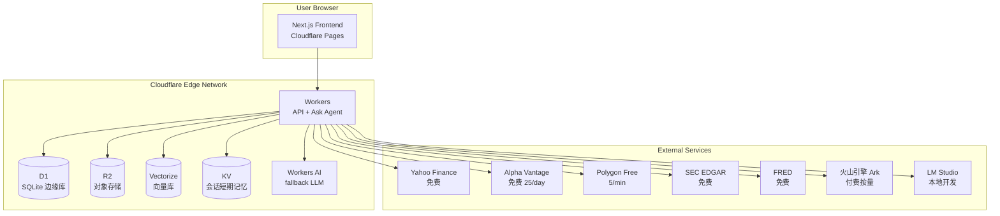

# 附录 C：Cloudflare 部署架构

**附录类型**: 部署架构 + 免费额度约束
**文档性质标签**: [A] + [B] + [C]
**最后更新**: 2026-07-19

---

## 1. 总体部署架构 [B]



---

## 2. Cloudflare 免费层约束 [B] - **关键决策**

### 2.1 免费层额度表

| 服务 | 免费额度 | nova-invest 预估用量 | 余量 |
|---|---|---|---|
| Workers | 100,000 req/day | ~10,000 req/day | 90% |
| Workers CPU | 10ms/req | ~5ms/req | 50% |
| D1 | 5 GB 存储 + 5M rows read/day | ~500MB + 100K rows/day | 90% |
| R2 | 10 GB 存储 + 1M Class A ops/month + 10M Class B ops/month | ~50MB + 10K ops/month | 99% |
| Vectorize | 30M queried vectors/month + 100K stored vectors | ~1M queries + 10K stored | 96% |
| KV | 100K reads/day + 1K writes/day | ~50K reads + 100 writes | 50% |
| Pages | 500 builds/month + unlimited bandwidth | ~30 builds/month | 94% |
| Workers AI | 10K Neurons/day | 仅 fallback 用 | 99% |

### 2.2 容量规划

**目标用户规模（Phase 1 PMF Validation，6 个月）**：
- 注册用户：1,000 人
- 日活用户（DAU）：100 人
- 每用户日均请求：100 次（图表 + Ask + 回测）
- 总日均请求：10,000 → 远低于 100K Workers 上限

**Phase 2 PMF Scaling（7-12 个月）**：
- 注册用户：10,000 人
- DAU：1,000 人
- 总日均请求：100,000 → 触达 Workers 免费上限 → 需 Workers Paid ($5/月)

### 2.3 风险控制

- **Vectorize**：仅 deep_research 查询走 Vectorize，simple_qa 不走 → 节省向量查询量
- **R2**：仅缓存 10 个 Mockup 标的 → 远低于 10GB
- **Workers AI**：仅作 fallback，主路由走外部 LLM → 不消耗 Neurons
- **D1 rows read**：避免全表扫描，所有查询走索引

---

## 3. Worker 部署架构 [B]

### 3.1 Worker 入口路由

```typescript
// src/workers/index.ts
export default {
  async fetch(req: Request, env: Env): Promise<Response> {
    const url = new URL(req.url);
    const path = url.pathname;

    // API 路由
    if (path.startsWith("/api/ask"))     return askHandler(req, env);
    if (path.startsWith("/api/data"))    return dataHandler(req, env);
    if (path.startsWith("/api/strategy")) return strategyHandler(req, env);
    if (path.startsWith("/api/broker"))  return brokerHandler(req, env);
    if (path.startsWith("/api/playbook")) return playbookHandler(req, env);
    if (path.startsWith("/api/community")) return communityHandler(req, env);
    if (path.startsWith("/api/credits"))  return creditsHandler(req, env);

    // Static assets (Next.js)
    return env.ASSETS.fetch(req);
  }
};
```

### 3.2 wrangler.toml 配置

```toml
name = "nova-invest"
main = "src/workers/index.ts"
compatibility_date = "2025-12-01"
compatibility_flags = ["nodejs_compat"]

# 静态资源（Next.js 静态导出）
[assets]
directory = "./dist"
binding = "ASSETS"

# D1 数据库
[[d1_databases]]
binding = "DB"
database_name = "nova-invest-db"
database_id = "<your-database-id>"

# R2 存储桶
[[r2_buckets]]
binding = "R2"
bucket_name = "nova-invest-r2"

# KV 命名空间（短期会话记忆）
[[kv_namespaces]]
binding = "SESSION_KV"
id = "<your-kv-namespace-id>"

# Vectorize 索引
[[vectorize]]
binding = "VECTORIZE"
index_name = "nova-invest-vectors"

# 环境变量
[vars]
USE_MOCK = "false"  # 生产环境
LLM_PROVIDER = "ark"  # 火山引擎
ENVIRONMENT = "production"

# Secrets（敏感信息通过 wrangler secret put 设置）
# LLM_API_KEY, ALPHA_VANTAGE_KEY, POLYGON_API_KEY, etc.
```

### 3.3 多环境部署

| 环境 | USE_MOCK | LLM_PROVIDER | 说明 |
|---|---|---|---|
| 本地开发 | true | lmstudio | 完全本地，零成本 |
| Staging | true | lmstudio | Mock 模式 + LM Studio |
| Production | false | ark | 真实数据 + 火山引擎 |

### 3.4 部署脚本

```bash
# .dev.vars (本地开发)
USE_MOCK=true
LLM_PROVIDER=lmstudio
LMSTUDIO_API_BASE=http://localhost:1234/v1
DATABASE_URL=local

# 部署到 Cloudflare
pnpm run deploy:cf

# package.json scripts
{
  "scripts": {
    "dev": "next dev",
    "build": "next build",
    "deploy:cf": "pnpm run build && wrangler deploy",
    "deploy:pages": "pnpm run build && wrangler pages deploy dist",
    "db:migrate": "wrangler d1 execute nova-invest-db --file=./migrations/0001_init.sql",
    "db:seed": "wrangler d1 execute nova-invest-db --file=./migrations/seed.sql",
    "gen:mock": "tsx scripts/generate_mock_data.ts"
  }
}
```

---

## 4. D1 数据库设计 [B]

### 4.1 表清单（汇总自各 Epic）

| Epic | 表名 | 用途 |
|---|---|---|
| 02 DataLayer | symbols | 标的元数据 |
| 02 DataLayer | watchlists | watchlist |
| 02 DataLayer | watchlist_items | watchlist 条目 |
| 02 DataLayer | kline_cache_index | R2 K 线缓存索引 |
| 02 DataLayer | fundamentals | 基本面 |
| 03 AskAgent | user_profiles | 用户画像 |
| 03 AskAgent | conversation_history | 对话历史 |
| 04 Strategy DSL | strategies | 策略 |
| 04 Strategy DSL | backtest_results | 回测结果 |
| 06 Broker | broker_accounts | 券商账户 |
| 06 Broker | orders | 订单 |
| 06 Broker | positions | 持仓 |
| 06 Broker | trades | 成交 |
| 07 Community | community_playbooks | 社区 Playbook |
| 07 Community | playbook_installs | 安装记录 |
| 07 Community | playbook_ratings | 评分 |
| 07 Community | playbook_comments | 评论 |
| 07 Community | playbook_reports | 举报 |
| 08 Playbook | playbooks | Playbook 主表 |
| 08 Playbook | playbook_versions | 版本 |
| 08 Playbook | playbook_dependencies | 依赖关系 |
| 08 Playbook | user_playbooks | 用户安装 |
| Billing | credit_balances | Credit 余额 |
| Billing | credit_transactions | Credit 流水 |
| Billing | credit_orders | 充值订单 |
| Auth | users | 用户 |

### 4.2 索引策略

所有表都基于 `user_id` 索引，避免全表扫描。详见各 Epic 的 D1 schema 定义。

### 4.3 迁移管理

```
migrations/
├── 0001_init.sql        # 初始 schema
├── 0002_seed_symbols.sql # 预置标的元数据
├── 0003_seed_mock_users.sql # Mock 模式预置用户
├── 0004_seed_mock_playbooks.sql # Mock 模式预置 Playbook
└── 0005_seed_mock_community.sql # Mock 模式预置社区数据
```

### 4.4 备份策略

- D1 自动备份（Cloudflare 提供）
- 每周手动导出 SQL 快照到 R2
- 关键操作前手动备份

---

## 5. R2 存储策略 [B]

### 5.1 R2 对象结构

```
nova-invest-r2/
├── playbooks/                     # Epic 08 Playbook YAML
│   ├── pb_nvda_macross_v1/
│   │   ├── 1.0.0.yaml
│   │   ├── 1.1.0.yaml
│   │   └── 1.2.0.yaml
│   └── ...
├── klines/                        # Epic 02 R2 缓存（仅 10 个 Mockup 标的）
│   ├── AAPL/
│   │   ├── 1d.json
│   │   └── 5m.json
│   ├── MSFT/...
│   └── ...
├── mock_data/                     # Mock 数据集（与 git repo 同步）
│   ├── klines/
│   ├── earnings/
│   └── qa_samples/
├── strategy_exports/              # 用户策略导出
│   └── user_xxx/
└── backups/                       # D1 备份
    └── 2026-07-19.sql.gz
```

### 5.2 存储预算

| 类型 | 预估大小 | 免费额度 |
|---|---|---|
| Playbooks | < 10MB（每 YAML ~10KB × 1000） | 10GB |
| K 线缓存（10 标的） | < 5MB | 10GB |
| Mock 数据 | < 50MB | 10GB |
| 备份 | < 100MB | 10GB |
| **总计** | < 200MB | 余量 99% |

---

## 6. Vectorize 向量库策略 [B]

### 6.1 用途

仅用于 Ask Agent 的 `deep_research` 模式：
- 财报 RAG（SEC EDGAR 文档）
- 长文档语义检索

### 6.2 预算控制

```typescript
// 仅 deep_research 走 Vectorize
async function searchRAG(query: string, intent: QueryIntent): Promise<RAGResult[]> {
  if (intent !== "deep_research") {
    // simple_qa 直接走关键词搜索 D1
    return await keywordSearch(query);
  }
  // deep_research 走 Vectorize（消耗向量查询量）
  const embedding = await embed(query);
  return await VECTORIZE.query(embedding, { topK: 5 });
}
```

### 6.3 索引结构

```
Vectorize Index: nova-invest-vectors
- Dimension: 768 (volcengine embedding)
- Metric: cosine
- Stored vectors: ~10K (财报文档片段)
- Queried vectors/month: ~10K (仅 deep_research)
```

---

## 7. 监控与可观测性 [B]

### 7.1 OpenTelemetry 集成

**用户决策**："OpenTelemetry + Grafana"

```typescript
// src/lib/otel.ts
import { trace, metrics } from "@opentelemetry/api-api";

const tracer = trace.getTracer("nova-invest");

// Worker 中间件
export function withTracing(handler: Handler): Handler {
  return async (req, env) => {
    const span = tracer.startSpan(`http.${req.url}`);
    try {
      const res = await handler(req, env);
      span.setAttribute("http.status_code", res.status);
      return res;
    } catch (e) {
      span.recordException(e);
      throw e;
    } finally {
      span.end();
    }
  };
}
```

### 7.2 关键指标

| 指标 | 目标 | 告警阈值 |
|---|---|---|
| Worker p99 延迟 | < 500ms | > 2s |
| D1 查询 p99 | < 50ms | > 200ms |
| R2 GET p99 | < 100ms | > 500ms |
| LLM 调用成功率 | > 95% | < 90% |
| Mock 模式切换正常 | true | false |
| Credit 扣费错误率 | 0% | > 0.1% |

### 7.3 日志策略

- **INFO**：用户操作日志（不存 PII）
- **WARN**：API 失败、降级触发
- **ERROR**：异常、Bug
- **DEBUG**：仅开发环境

日志输出到 Cloudflare Workers Logs（免费 7 天保留）。

### 7.4 Grafana Dashboard

**关键面板**：
- 请求量 / 错误率 / p99 延迟
- D1 / R2 / Vectorize 用量
- LLM 调用次数 / 成本
- Credit 消耗 / 充值
- 用户活跃 / 留存

---

## 8. CI/CD 流程 [B]

### 8.1 GitHub Actions 工作流

```yaml
# .github/workflows/deploy.yml
name: Deploy to Cloudflare
on:
  push:
    branches: [main]

jobs:
  test:
    runs-on: ubuntu-latest
    steps:
      - uses: actions/checkout@v4
      - uses: actions/setup-node@v4
        with: { node-version: 20 }
      - run: pnpm install
      - run: pnpm run lint
      - run: pnpm run test:unit
      - run: pnpm run test:integration

  deploy:
    needs: test
    runs-on: ubuntu-latest
    steps:
      - uses: actions/checkout@v4
      - uses: actions/setup-node@v4
        with: { node-version: 20 }
      - run: pnpm install
      - run: pnpm run build
      - name: Deploy Worker
        run: pnpm run deploy:cf
        env:
          CLOUDFLARE_API_TOKEN: ${{ secrets.CF_API_TOKEN }}
      - name: Run migrations
        run: pnpm run db:migrate
        env:
          CLOUDFLARE_API_TOKEN: ${{ secrets.CF_API_TOKEN }}
```

### 8.2 环境变量管理

| 类型 | 存储位置 | 示例 |
|---|---|---|
| 非敏感 | wrangler.toml `[vars]` | USE_MOCK, ENVIRONMENT |
| 敏感 | wrangler secret put | LLM_API_KEY, ALPHA_VANTAGE_KEY |
| GitHub Actions | Secrets | CF_API_TOKEN |

---

## 9. Mock / 生产环境切换 [B] - **关键决策**

### 9.1 双模架构

**用户决策**：`USE_MOCK` 单一开关

```typescript
// 任何业务代码不直接调用外部 API
// 必须通过 Provider 抽象层
const provider = getProvider(env);
const klines = await provider.getKlines("AAPL", "1d", from, to);
```

### 9.2 切换流程

```
本地开发（USE_MOCK=true）
  ↓
推送到 staging（USE_MOCK=true）
  ↓
人工验证后切换到 production（USE_MOCK=false）
  ↓
设置 wrangler secret: wrangler secret put USE_MOCK
```

### 9.3 切换前后验证

```bash
# 切换前验证
pnpm run test:mock          # Mock 模式测试
pnpm run test:contract      # Contract 测试（Mock vs Real 数据结构一致）

# 切换后验证
curl https://nova-invest.workers.dev/api/health
# 期望：{ "status": "ok", "mode": "real", "version": "0.1.0" }
```

---

## 10. 域名与 CDN [B]

### 10.1 域名规划

| 域名 | 用途 |
|---|---|
| nova-invest.dev | 主站 |
| api.nova-invest.dev | API（如需分离） |
| app.nova-invest.dev | Web 应用 |

Phase 1 可直接用 `nova-invest.<your-subdomain>.workers.dev`，Phase 2 再绑自定义域。

### 10.2 CDN 配置

- Cloudflare Pages 默认 CDN 加速
- 静态资源（Mock JSON）缓存 1 小时
- 动态 API 不缓存

---

## 11. 部署清单

### 11.1 首次部署

- [ ] 创建 Cloudflare 账户
- [ ] 创建 D1 数据库
- [ ] 创建 R2 存储桶
- [ ] 创建 KV 命名空间
- [ ] 创建 Vectorize 索引
- [ ] 运行 `wrangler login`
- [ ] 配置 `wrangler.toml`
- [ ] 运行 `pnpm run db:migrate`
- [ ] 运行 `pnpm run db:seed`
- [ ] 设置 secrets：`wrangler secret put LLM_API_KEY`
- [ ] 上传 Mock 数据到 R2
- [ ] 部署 Worker：`pnpm run deploy:cf`
- [ ] 部署 Pages：`pnpm run deploy:pages`
- [ ] 验证健康检查
- [ ] 设置 GitHub Actions

### 11.2 日常部署

- [ ] PR 触发测试
- [ ] Merge to main 触发部署
- [ ] 部署后健康检查
- [ ] 监控告警确认

### 11.3 回滚

```bash
# 列出历史版本
wrangler deployments list

# 回滚到上一版本
wrangler rollback
```

---

## 12. 版本历史

| 版本 | 日期 | 变更 |
|---|---|---|
| 0.1 | 2026-07-19 | 初稿，含免费层约束、wrangler.toml、D1/R2/Vectorize 策略、Mock/Real 切换、CI/CD |
