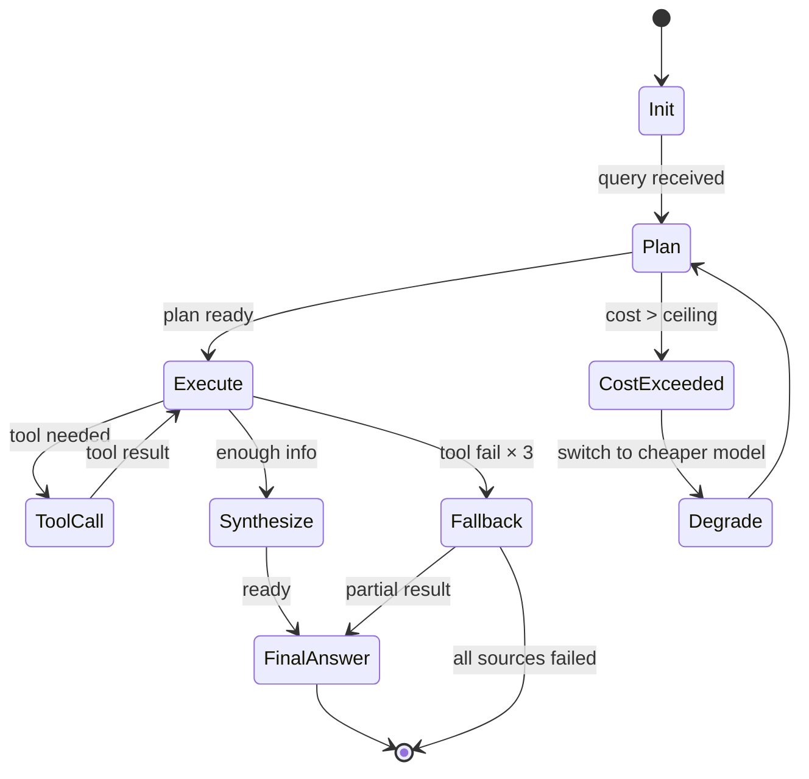

# Epic 01 · Agent Harness

> **Epic ID**: EPIC-AH · **Priority**: P0 · **Phase**: 1 (M1-M3)
> **Nature tags**: [A] Analyzing competitor status quo + [B] Normative + [C] Personal project
> **Dependencies**: None (foundation module) · **Depended on by**: All other Epics

---

## Problem Statement

### User-perspective Problem

As a Prosumer user, Brenda wants the AI assistant to work like a "financial research analyst" rather than simply doing Q&A, but the Agents in current AI investment research products lack:
1. Multi-step research capability (one question → multi-step retrieval → synthesized answer)
2. Long-term memory (forgets what I asked before, which tickers I like)
3. Tool-call observability (no idea what the Agent is doing)
4. Failure fallback (crashes on a single tool failure)
5. Cost control (one deep research burn through all Credits)

### Engineering-perspective Problem

No standard Agent Harness framework — each engineer reinvents the wheel, causing:
- Inconsistent tool implementations
- No eval baseline
- Uncontrolled cost
- Bugs that can't be reproduced

---

## Solution

### 9-layer Agent Harness Architecture (see [architecture.md](../../architecture/architecture.md) §3)

| Layer | Responsibility | Key Decision |
|---|---|---|
| L9 UI | Next.js + TradingView | Decided |
| L8 Orchestration | Supervisor + 3 Sub-Agents (Ask/Build/Dashboard) | In-house lightweight orchestration |
| L7 Agent Loop | ReAct + max_steps + cost ceiling | TypeScript |
| L6 Planning | CoT + Plan-and-Execute | LLM native |
| L5 Tool Calling | MCP (external) + native function call (internal) | Hybrid |
| L4 Memory | Conversation + vector + structured | Three layers |
| L3 RAG | Vectorize + hybrid search | Cloudflare Vectorize |
| L2 LLM Provider | Local LM Studio / Volcengine Ark | Multi-model routing |
| L1 Observability | OpenTelemetry + Grafana Cloud | In-house |

### Supervisor Routing Logic

```typescript
// Pseudocode: Supervisor routing
function route(query: string, context: Memory): AgentTask {
  const intent = classifyIntent(query);
  // intent: "ask" | "build" | "dashboard" | "share" | "ambiguous"

  switch (intent) {
    case "ask":       return { agent: "AskAgent",      context };
    case "build":     return { agent: "BuildAgent",    context };
    case "dashboard":return { agent: "DashboardAgent",context };
    case "share":    return { agent: "ShareAgent",    context };
    default:         return { agent: "AskAgent",      context }; // default
  }
}
```

---

## User Stories

### Job Stories (business motivation)

1. **When** I ask "How are AI concept stocks doing lately", **I want** the Agent to automatically decompose into multi-step research (find stock universe → pull prices → compare benchmark → synthesize), **so I can** get a deep answer rather than a simple search.
2. **When** an Agent tool call fails, **I want** automatic retry or source switching, **so I can** avoid being blocked by a single point of failure.
3. **When** I ask 5 related questions in a row, **I want** the Agent to remember context, **so I can** avoid repeating information.
4. **When** I exceed my Credit quota, **I want** an upfront prompt and degradation, **so I can** avoid being suddenly interrupted.

### As-a Stories (high-level user stories)

5. As a Prosumer, I want the Agent to explicitly annotate data sources and timestamps, so that I can verify answer credibility.
6. As a PM, I want full-chain traces, so that I can debug failure cases.
7. As a PM, I want each call to record its cost, so that I can optimize model routing.
8. As a Prosumer, I want to see intermediate steps ("Looking up NVDA earnings..."), so that long queries are not anxiety-inducing.

### BDD Acceptance (Given/When/Then)

```gherkin
Scenario: Multi-step research auto-decomposition
  Given user asks "AI concept stocks June performance vs SPY"
  When Supervisor routes to AskAgent
  Then AskAgent should output plan: [get_universe, get_price(NVDA), get_price(SPY), compare, synthesize]
  And each step should have a trace_id link
  And the final answer should contain ≥ 3 citation sources

Scenario: Tool failure fallback
  Given AskAgent calls get_price(NVDA) and it fails
  When failure count < 3
  Then it should auto-retry
  When failure count ≥ 3
  Then it should switch data source (Tiingo → AlphaVantage)
  When all sources fail
  Then it should return partial result + clearly state "price data unavailable"

Scenario: Cost ceiling
  Given single query cost > $5
  When cost ceiling is triggered
  Then it should auto-degrade to a cheaper model
  And the user should see a prompt "Switched model to control cost"
```

---

## Implementation Decisions

### ID-1: Multi-Agent Orchestration Pattern

**Decision**: Supervisor-Worker pattern, 3 Sub-Agents (Ask/Build/Dashboard)

**Rationale**:
- The three core capabilities differ significantly; a single Agent's context would be bloated
- Sub-Agents can be independently prompt-tuned
- Clear hand-off protocol

**Implementation**:
- Supervisor is a lightweight TypeScript function
- Sub-Agents share context via shared Memory
- No LangGraph (too heavy); in-house orchestrator within 100 lines

### ID-2: Tool Protocol

> **Note (revised 2026-07-19)**: This section's tool protocol has been formally standardized by [ADR-0006](../../architecture/adr-0006-tool-protocol.md) §Decision.
> ADR-0006 defines `ToolCall`/`ToolResult`/`ToolHandler` interfaces + `TOOL_REGISTRY` static registry (9 Phase 1 native tools) + `TOOL_METADATA` (LLM function calling).
> **Phase 1 scope**: 9/10 tools are native (`get_sentiment` deferred to Phase 2 MCP). `MCP_SERVERS` (brokerage + playbook_hub) deferred to Phase 2.
> **`search_news` classification clarification**: This section originally marked it MCP, but EP03 §2.6 `INTERNAL_TOOLS` marks it native. ADR-0006 adopts the EP03 §2.6 classification (Phase 1 native), overriding the original MCP classification in this section.
> **C6 conflict resolution**: EP03 §2.6's original `get_current_price` is unified as `get_quote` (this section's ID-2 tool table is authoritative).

**Decision**: Hybrid: MCP (external data sources) + native function call (internal)

**Rationale**:
- MCP gives ecosystem extension (users mount private data sources)
- Native gives performance (no MCP serialization overhead for internal tools)

**Built-in tool set**:

| Tool name | Protocol | Use | Owner Agent |
|---|---|---|---|
| `get_quote` | native | Real-time quote | Ask |
| `get_ohlc` | native | K-line | Ask |
| `get_earnings` | native | Earnings | Ask |
| `search_news` | MCP | News search | Ask |
| `get_macro` | native | Macro data | Ask |
| `get_sentiment` | MCP | X/Reddit sentiment | Ask |
| `plot_chart` | native | Generate chart | Ask |
| `build_strategy` | native | NL→DSL | Build |
| `run_backtest` | native | Trigger backtest | Build |
| `save_dashboard` | native | Persist dashboard | Dashboard |

### ID-3: Memory 3-layer Architecture

> **Note (revised 2026-07-19)**: This section's 3-layer Memory architecture has been formally standardized by [ADR-0005](../../architecture/adr-0005-memory-layer.md) §Decision.
>
> **Phase 1 scope (2/3 layers)**:
> - ✅ `short_term: Message[]` → Cloudflare KV (session-scoped, TTL 24h, context_window 4096 tokens)
> - ✅ `long_term_structured: UserPref` → D1 `user_profiles` table (per ADR-0011 Migration 003)
> - ⏸ `long_term_vector: Embedding[]` → Cloudflare Vectorize, **enabled in Phase 1.5** (trigger: query volume > 1000/day OR explicit semantic search need). `MemoryRef.vector_ref` field is reserved, Phase 1.5 activation requires no breaking change.
>
> **UserPref shape clarification**: The original `UserPref = { watchlist, preferences, past_strategies, credit_balance }` below is a **conceptual model**. The actual D1 `user_profiles` table (per ADR-0011) stores only `risk_tolerance` / `sectors` / `preferred_sources`; `watchlist` is derived from the `watchlists` table, `past_strategies` from the `strategies` table, `credit_balance` from the `credit_balances` table. The `UserPref` interface defined in ADR-0005 §Key Interfaces contains only the fields actually stored in D1; derived fields are obtained via SQL JOIN.
>
> **Pronoun resolution**: EP03 Job Story 3 "What about its EPS?" is implemented by including `short_term` history messages in the LLM prompt — no standalone NLP module needed (per ADR-0005 §Pronoun Resolution).
>
> **Mock mode**: Uses in-memory Map + seeded JSON (`web/public/mock/user_profile.json`), zero KV/D1/Vectorize calls (FP-0005 compliance).

```typescript
// Conceptual 3-layer Memory type (EP01 §ID-3 original).
// Phase 1 implements 2/3 layers per ADR-0005.
type Memory = {
  short_term: Message[];           // Conversation window (most recent N)  -- Phase 1: KV
  long_term_structured: UserPref;   // D1 user preferences            -- Phase 1: D1
  long_term_vector: Embedding[];    // Vectorize history retrieval      -- Phase 1.5: Vectorize
};

// Conceptual UserPref (EP01 §ID-3 original).
// NOTE: Actual D1 user_profiles table stores only risk_tolerance / sectors / preferred_sources.
// watchlist / past_strategies / credit_balance are derived via SQL JOIN on other tables.
type UserPref = {
  watchlist: string[];        // Watched tickers        -> derived from watchlists table
  preferences: Record<string, unknown>;
  past_strategies: string[];   // Past strategy IDs    -> derived from strategies table
  credit_balance: number;      -> derived from credit_balances table
};
```

### ID-4: Agent Loop State Machine

> **Note (revised 2026-07-19)**: This section's state machine has been formally standardized by [ADR-0004](../../architecture/adr-0004-agent-loop-design.md).
> ADR-0004 §State Machine defines the `LoopState` type (including the `Aborted` state); §Constants codifies the `MAX_STEPS=20` / `AGGREGATE_COST_CEILING_USD=5` / `TOOL_RETRY_LIMIT=3` hard limits.
> Implementation should follow `AgentLoop.run()` in ADR-0004 §Key Interfaces.



### ID-5: LLM Routing Strategy

> **Note (revised 2026-07-19)**: This section's original is inconsistent with ADR-0003. Aligned with ADR-0003's 3-tier model:
> - `USE_MOCK=true` → MockLLM (zero LLM API calls, returns pre-generated JSON samples)
> - `USE_MOCK=false` + `ENVIRONMENT!="production"` → RealLLM with LM Studio (local free)
> - `USE_MOCK=false` + `ENVIRONMENT="production"` → RealLLM with Volcengine Ark (cloud paid)
>
> See [ADR-0003](../../architecture/adr-0003-llm-routing-cost-cap.md).

```typescript
// LLM routing table (Ask Agent 4 intents; consistent with ADR-0003 ROUTING_RULES)
// Build Agent 4 intents (strategy_dsl / backtest_explain) pending ADR-0004 extension or new ADR
const ROUTING = {
  simple_qa:     { model: "haiku-tier",   max_tokens: 500,   cost_cap: 0.001 },  // ADR-0003 cloud
  deep_research: { model: "sonnet-tier",  max_tokens: 4000,  cost_cap: 0.05  },  // ADR-0003 cloud
  tool_call:     { model: "sonnet-tier",  max_tokens: 800,   cost_cap: 0.01  },  // ADR-0003 cloud
  clarify:       { model: "haiku-tier",   max_tokens: 200,   cost_cap: 0.0005 }, // ADR-0003 cloud
  // Build Agent intents (pending ADR-0004 for local/cloud config and cost_cap):
  strategy_dsl:      { model: "sonnet-tier",  max_tokens: 2000,  cost_cap: 0.20 },  // placeholder, pending ADR-0004
  backtest_explain:  { model: "haiku-tier",   max_tokens: 1000,  cost_cap: 0.05 },  // placeholder, pending ADR-0004
};

// Provider switching (3-tier per ADR-0003; USE_MOCK controls Mock/Real, ENVIRONMENT controls local/cloud)
function selectProvider(env: { USE_MOCK: string; ENVIRONMENT: string }): LLMProvider {
  if (env.USE_MOCK === "true") {
    return new MockLLM();  // zero API calls, returns mock-qa-sample JSON
  }
  if (env.ENVIRONMENT === "production") {
    return new RealLLM({ provider: "ark", api_base: process.env.LLM_BASE_URL, api_key: process.env.LLM_API_KEY });
  }
  return new RealLLM({ provider: "lmstudio", api_base: "http://localhost:1234/v1", api_key: "mock" });
}
```

### ID-6: Eval Golden Set

- 200+ labeled cases, 4 categories:
  - Simple QA (50)
  - Deep research (50)
  - Strategy construction (50)
  - Failure cases + adversarial (50)

- Evaluation metrics:
  - Tool call accuracy (tool name + args match) ≥ 90%
  - Answer accuracy (LLM-as-judge + human) ≥ 80%
  - Hallucination rate ≤ 5%

### ID-7: Observability Schema

> **Note (revised 2026-07-19)**: This section's `TraceStep` schema has been formally standardized by [ADR-0004](../../architecture/adr-0004-agent-loop-design.md) §Key Interfaces.
> ADR-0004 expands the original 7 fields to 9, adding `state: LoopState` (marking the state machine state that emitted the TraceStep) and `timestamp: string` (ISO 8601).
> The top-level `Trace` aggregate schema is still pending a future ADR-0014 Observability Schema.

```typescript
type Trace = {
  trace_id: string;          // UUID
  user_id: string;
  session_id: string;
  query: string;
  start_time: number;
  end_time: number;
  cost_usd: number;
  tokens_in: number;
  tokens_out: number;
  model: string;
  steps: TraceStep[];
};

type TraceStep = {
  step_id: string;
  parent_id: string;
  type: "plan" | "tool_call" | "llm_call" | "synthesize";
  input: unknown;
  output: unknown;
  duration_ms: number;
  cost_usd: number;
};
```

---

## Testing Decisions

### Test Seam Design

| Seam | Test method | Mock object |
|---|---|---|
| LLM Provider interface | Unit test | MockLLMClient (returns preset response) |
| Tool Registry | Unit test | MockTool (returns preset data) |
| Supervisor routing | Unit test | MockSubAgent |
| Memory read/write | Integration test | D1 local + Vectorize local simulation |
| End-to-end | E2E test | USE_MOCK=true full Mock |

### Test Strategy

| Layer | Tool | Coverage target |
|---|---|---|
| Unit | Vitest | 80% |
| Integration | Vitest + Miniflare | 70% |
| E2E | Playwright | Critical paths 100% |
| Eval | In-house + Golden Set | 200+ cases |

### Golden Set Maintenance

- Add 10 new cases monthly (including online failure cases)
- Quarterly full retest
- Every prompt change must run the Golden Set

---

## Out of Scope

### Explicit Exclusions

1. ❌ Multimodal (image/video input) — Phase 2+
2. ❌ Real-time audio conversation — Phase 3+
3. ❌ Self-trained LLM — not doing
4. ❌ LangGraph / CrewAI and other heavy frameworks — in-house lightweight
5. ❌ Cross-user Memory sharing — privacy issue
6. ❌ Agent proactive wake-up — Phase 2+
7. ❌ Custom Agent orchestration (user drag-and-drop) — Phase 3+

### Anti-Patterns

> **Note (revised 2026-07-19)**: The two anti-patterns below — `max_steps > 20` and `single query cost > $5` — have been codified as code constants by [ADR-0004](../../architecture/adr-0004-agent-loop-design.md) §Constants:
> - `MAX_STEPS = 20` hard limit - when exceeded the loop enters `Aborted` state, returns `abort_reason: "max_steps_exceeded"`
> - `AGGREGATE_COST_CEILING_USD = 5` hard limit (aggregate per user query) - when exceeded the loop enters `CostExceeded` state and aborts
> - Added `TOOL_RETRY_LIMIT = 3` - after 3 tool call failure retries, returns partial result
>
> Note: ADR-0004's `$5` is **aggregate per user query** (accumulated across multiple steps), and is additive (not a replacement) with ADR-0003's per-LLM-call `cost_cap`.

1. ❌ Do not let max_steps > 20 (loss-of-control risk)
2. ❌ Do not let single query cost > $5 (loss)
3. ❌ Do not skip schema validation on LLM outputs
4. ❌ Do not lose the Trace ID (debug difficulty)
5. ❌ Do not let Sub-Agents call each other directly (must go through Supervisor)

---

## Further Notes

### References

- Anthropic engineering blog "Agent Harness Design"
- Claude Code source (query.ts 1700+ lines)
- OpenClaw docs (https://docs.openclaw.ai/)
- LangGraph design docs (referenced but not adopted)

### Open Questions

1. Does Volcengine Ark support MCP? Needs investigation
2. Is the Cloudflare Vectorize free tier enough for 30M queries? Needs monitoring
3. In-house orchestrator vs Mastra SDK? Decide before M2

---

## Acceptance Criteria

- [ ] All 9 layers implemented + unit tests ≥ 80%
- [ ] Golden Set 200 cases pass rate ≥ 80%
- [ ] End-to-end demo runs Ask/Build/Dashboard scenarios
- [ ] USE_MOCK=true makes zero external API calls
- [ ] USE_MOCK=false can connect to LM Studio + Volcengine
- [ ] Full-chain trace viewable in Grafana
- [ ] Single query cost ≤ $0.001 (simple) / $0.05 (deep) per [ADR-0003](../../architecture/adr-0003-llm-routing-cost-cap.md)

---

> Last updated: 2026-07-19 · Author: Xun Zhao + AI collaboration
