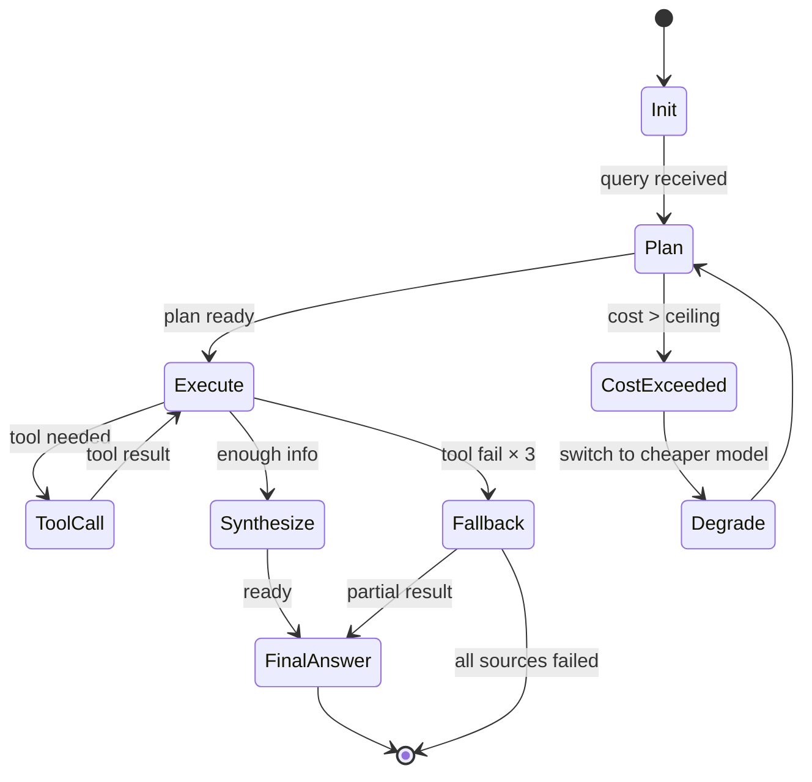

# Epic 01 · Agent Harness

> **Epic 编号**: EPIC-AH · **优先级**: P0 · **Phase**: 1 (M1-M3)
> **性质标签**: [A] 反向工程 Alva + [B] 规范 + [C] 求职作品
> **依赖**: 无（地基模块）· **被依赖**: 所有其他 Epic

---

## Problem Statement

### 用户视角问题

作为 Prosumer 用户 Brenda，我希望 Alva 能像一个"金融研究助理"那样工作，而不是简单地问答，但当前 Alva 的 Agent 缺乏：
1. 多步研究能力（一次问 → 多步查 → 综合答）
2. 长期记忆（忘记我之前问过的、喜欢什么标的）
3. 工具调用可观测性（不知道 Agent 在干什么）
4. 失败 fallback（一次工具失败就崩）
5. 成本可控（一次深度研究烧光 Credit）

### 工程视角问题

无标准 Agent Harness 框架，每个工程师自己造轮子，导致：
- 工具实现不一致
- Eval 无基线
- 成本不可控
- 无法复现 bug

---

## Solution

### 9 层 Agent Harness 架构（详见 [architecture.md](../../architecture/architecture.md) §3）

| 层 | 职责 | 关键决策 |
|---|---|---|
| L9 UI | Next.js + TradingView | 已定 |
| L8 Orchestration | Supervisor + 3 Sub-Agents (Ask/Build/Dashboard) | 自研轻量编排 |
| L7 Agent Loop | ReAct + max_steps + cost ceiling | TypeScript |
| L6 Planning | CoT + Plan-and-Execute | LLM 原生 |
| L5 Tool Calling | MCP（外部）+ 原生 function call（内部） | 混合 |
| L4 Memory | 对话 + 向量 + 结构化 | 三层 |
| L3 RAG | Vectorize + hybrid search | Cloudflare Vectorize |
| L2 LLM Provider | 本地 LM Studio / 火山引擎 Ark | 多模型路由 |
| L1 Observability | OpenTelemetry + Grafana Cloud | 自研 |

### Supervisor 路由逻辑

```typescript
// 伪代码：Supervisor 路由
function route(query: string, context: Memory): AgentTask {
  const intent = classifyIntent(query);
  // intent: "ask" | "build" | "dashboard" | "share" | "ambiguous"

  switch (intent) {
    case "ask":       return { agent: "AskAgent",      context };
    case "build":     return { agent: "BuildAgent",    context };
    case "dashboard":return { agent: "DashboardAgent",context };
    case "share":    return { agent: "ShareAgent",    context };
    default:         return { agent: "AskAgent",      context }; // 默认
  }
}
```

---

## User Stories

### Job Stories（业务动机）

1. **When** 我问"AI 概念股最近表现如何"时，**I want** Agent 自动拆解为多步研究（找股票集合→拉价格→对比基准→综合），**so I can** 得到深度答案而非简单搜索。
2. **When** Agent 工具调用失败时，**I want** 自动重试或换数据源，**so I can** 不被单点故障卡住。
3. **When** 我连续问 5 个相关问题时，**I want** Agent 记住上下文，**so I can** 不必重复信息。
4. **When** 我超出 Credit 额度时，**I want** 提前提示并降级，**so I can** 不被突然中断。

### As-a Stories（高层用户故事）

5. As a Prosumer, I want Agent 显式标注数据来源和时间戳，so that 我能验证答案可信度。
6. As a PM, I want 全链路 trace，so that 我能 debug 失败 case。
7. As a PM, I want 每次调用记录成本，so that 我能优化模型路由。
8. As a Prosumer, I want 看到中间步骤（"正在查 NVDA 财报..."），so that 长查询不焦虑。

### BDD 验收（Given/When/Then）

```gherkin
Scenario: 多步研究自动拆解
  Given 用户问 "AI 概念股 6 月相对 SPY 表现"
  When Supervisor 路由到 AskAgent
  Then AskAgent 应输出 plan: [get_universe, get_price(NVDA), get_price(SPY), compare, synthesize]
  And 每步应有 trace_id 关联
  And 最终答案应含 ≥ 3 个引用来源

Scenario: 工具失败 fallback
  Given AskAgent 调用 get_price(NVDA) 失败
  When 失败次数 < 3
  Then 应自动重试
  When 失败次数 ≥ 3
  Then 应换数据源（Tiingo → AlphaVantage）
  When 所有源失败
  Then 应返回部分结果 + 明确说明"价格数据不可用"

Scenario: 成本 ceiling
  Given 单次 query 成本 > $5
  When 触发 cost ceiling
  Then 应自动降级到更便宜模型
  And 用户应看到提示"为控制成本，已切换模型"
```

---

## Implementation Decisions

### ID-1: 多 Agent 编排模式

**决策**: Supervisor-Worker 模式，3 个 Sub-Agent（Ask/Build/Dashboard）

**理由**:
- 三大能力差异大，单 Agent 上下文臃肿
- 子 Agent 可独立 prompt 调优
- Hand-off 协议清晰

**实现**:
- Supervisor 是一个轻量级 TypeScript 函数
- Sub-Agent 之间通过共享 Memory 传递上下文
- 不用 LangGraph（太重），自研 100 行内编排器

### ID-2: Tool 协议

> **注意（2026-07-19 修订）**：本节 tool 协议已由 [ADR-0006](../../architecture/adr-0006-tool-protocol.md) §Decision 正式规范化。
> ADR-0006 定义 `ToolCall`/`ToolResult`/`ToolHandler` 接口 + `TOOL_REGISTRY` 静态注册表（9 个 Phase 1 native tools）+ `TOOL_METADATA`（LLM function calling）。
> **Phase 1 范围**: 9/10 tools 为 native（`get_sentiment` 延后至 Phase 2 MCP）。`MCP_SERVERS`（brokerage + playbook_hub）延后至 Phase 2。
> **`search_news` 分类澄清**: 本节原标 MCP，但 EP03 §2.6 `INTERNAL_TOOLS` 标为 native。ADR-0006 采用 EP03 §2.6 分类（Phase 1 native），覆盖本节原 MCP 分类。
> **C6 冲突解决**: EP03 §2.6 原 `get_current_price` 统一为 `get_quote`（本节 ID-2 tool table 为 authoritative）。

**决策**: 混合：MCP（外部数据源）+ 原生 function call（内部）

**理由**:
- MCP 给生态扩展（用户挂载私有数据源）
- 原生给性能（内部工具无需 MCP 序列化开销）

**内置工具集**:

| 工具名 | 协议 | 用途 | Owner Agent |
|---|---|---|---|
| `get_quote` | 原生 | 实时报价 | Ask |
| `get_ohlc` | 原生 | K 线 | Ask |
| `get_earnings` | 原生 | 财报 | Ask |
| `search_news` | MCP | 新闻搜索 | Ask |
| `get_macro` | 原生 | 宏观数据 | Ask |
| `get_sentiment` | MCP | X/Reddit 情绪 | Ask |
| `plot_chart` | 原生 | 生成图表 | Ask |
| `build_strategy` | 原生 | NL→DSL | Build |
| `run_backtest` | 原生 | 触发回测 | Build |
| `save_dashboard` | 原生 | 持久化看板 | Dashboard |

### ID-3: Memory 三层架构

> **注意（2026-07-19 修订）**：本节 3-layer Memory 架构已由 [ADR-0005](../../architecture/adr-0005-memory-layer.md) §Decision 正式规范化。
>
> **Phase 1 范围（2/3 layers）**：
> - ✅ `short_term: Message[]` → Cloudflare KV（session-scoped, TTL 24h, context_window 4096 tokens）
> - ✅ `long_term_structured: UserPref` → D1 `user_profiles` 表（per ADR-0011 Migration 003）
> - ⏸ `long_term_vector: Embedding[]` → Cloudflare Vectorize，**Phase 1.5 启用**（trigger: query volume > 1000/day OR explicit semantic search need）。`MemoryRef.vector_ref` 字段已预留，Phase 1.5 激活不需 breaking change。
>
> **UserPref 形状澄清**：下方原稿 `UserPref = { watchlist, preferences, past_strategies, credit_balance }` 是**概念模型**。实际 D1 `user_profiles` 表（per ADR-0011）只存储 `risk_tolerance` / `sectors` / `preferred_sources` 三个字段；`watchlist` 由 `watchlists` 表派生、`past_strategies` 由 `strategies` 表派生、`credit_balance` 由 `credit_balances` 表派生。ADR-0005 §Key Interfaces 定义的 `UserPref` interface 仅包含 D1 实际存储的字段，派生字段通过 SQL JOIN 获取。
>
> **代词解析**：EP03 Job Story 3 "那它的 EPS 呢?" 通过 LLM prompt 包含 `short_term` 历史消息实现，无需独立 NLP 模块（per ADR-0005 §Pronoun Resolution）。
>
> **Mock 模式**：使用 in-memory Map + seeded JSON（`web/public/mock/user_profile.json`），零 KV/D1/Vectorize 调用（FP-0005 compliance）。

```typescript
// Conceptual 3-layer Memory type (EP01 §ID-3 original).
// Phase 1 implements 2/3 layers per ADR-0005.
type Memory = {
  short_term: Message[];           // 对话窗口（最近 N 条）  -- Phase 1: KV
  long_term_structured: UserPref;   // D1 用户偏好            -- Phase 1: D1
  long_term_vector: Embedding[];    // Vectorize 历史检索      -- Phase 1.5: Vectorize
};

// Conceptual UserPref (EP01 §ID-3 original).
// NOTE: Actual D1 user_profiles table stores only risk_tolerance / sectors / preferred_sources.
// watchlist / past_strategies / credit_balance are derived via SQL JOIN on other tables.
type UserPref = {
  watchlist: string[];        // 关注股票        -> derived from watchlists table
  preferences: Record<string, unknown>;
  past_strategies: string[];   // 历史策略 ID    -> derived from strategies table
  credit_balance: number;      -> derived from credit_balances table
};
```

### ID-4: Agent Loop 状态机

> **注意（2026-07-19 修订）**：本节状态机已由 [ADR-0004](../../architecture/adr-0004-agent-loop-design.md) 正式规范化。
> ADR-0004 §State Machine 定义了 `LoopState` 类型（含 `Aborted` 状态），§Constants 固化了 `MAX_STEPS=20` / `AGGREGATE_COST_CEILING_USD=5` / `TOOL_RETRY_LIMIT=3` 硬上限。
> 实现时以 ADR-0004 §Key Interfaces 中的 `AgentLoop.run()` 为准。



### ID-5: LLM 路由策略

> **注意（2026-07-19 修订）**：本节原稿与 ADR-0003 不一致。已对齐 ADR-0003 的 3-tier 模型：
> - `USE_MOCK=true` → MockLLM（零 LLM API 调用，返回预生成 JSON 样本）
> - `USE_MOCK=false` + `ENVIRONMENT!="production"` → RealLLM with LM Studio（本地免费）
> - `USE_MOCK=false` + `ENVIRONMENT="production"` → RealLLM with Volcengine Ark（云端付费）
>
> 详见 [ADR-0003](../../architecture/adr-0003-llm-routing-cost-cap.md)。

```typescript
// LLM 路由表（Ask Agent 4 intents；与 ADR-0003 ROUTING_RULES 一致）
// Build Agent 4 intents（strategy_dsl / backtest_explain）待 ADR-0004 扩展或新建 ADR
const ROUTING = {
  simple_qa:     { model: "haiku-tier",   max_tokens: 500,   cost_cap: 0.001 },  // ADR-0003 cloud
  deep_research: { model: "sonnet-tier",  max_tokens: 4000,  cost_cap: 0.05  },  // ADR-0003 cloud
  tool_call:     { model: "sonnet-tier",  max_tokens: 800,   cost_cap: 0.01  },  // ADR-0003 cloud
  clarify:       { model: "haiku-tier",   max_tokens: 200,   cost_cap: 0.0005 }, // ADR-0003 cloud
  // Build Agent intents（待 ADR-0004 规定 local/cloud 配置与 cost_cap）:
  strategy_dsl:      { model: "sonnet-tier",  max_tokens: 2000,  cost_cap: 0.20 },  // 占位值，待 ADR-0004
  backtest_explain:  { model: "haiku-tier",   max_tokens: 1000,  cost_cap: 0.05 },  // 占位值，待 ADR-0004
};

// Provider 切换（3-tier per ADR-0003；USE_MOCK 控制 Mock/Real，ENVIRONMENT 控制 local/cloud）
function selectProvider(env: { USE_MOCK: string; ENVIRONMENT: string }): LLMProvider {
  if (env.USE_MOCK === "true") {
    return new MockLLM();  // 零 API 调用，返回 mock-qa-sample JSON
  }
  if (env.ENVIRONMENT === "production") {
    return new RealLLM({ provider: "ark", api_base: process.env.LLM_BASE_URL, api_key: process.env.LLM_API_KEY });
  }
  return new RealLLM({ provider: "lmstudio", api_base: "http://localhost:1234/v1", api_key: "mock" });
}
```

### ID-6: Eval Golden Set

- 200+ 标注案例，4 类：
  - 简单 QA（50）
  - 深度研究（50）
  - 策略构建（50）
  - 失效 case + adversarial（50）

- 评测指标：
  - 工具调用准确率（tool name + args match）≥ 90%
  - 答案准确率（LLM-as-judge + 人工）≥ 80%
  - 幻觉率 ≤ 5%

### ID-7: Observability Schema

> **注意（2026-07-19 修订）**：本节 `TraceStep` schema 已由 [ADR-0004](../../architecture/adr-0004-agent-loop-design.md) §Key Interfaces 正式规范化。
> ADR-0004 在原 7 字段基础上扩展为 9 字段，新增 `state: LoopState`（标记发出该 TraceStep 的状态机状态）和 `timestamp: string`（ISO 8601）。
> 顶层 `Trace` 聚合 schema 仍待未来 ADR-0014 Observability Schema 定义。

```typescript
type Trace = {
  trace_id: string;          // UUID
  user_id: string;
  session_id: string;
  query: string;
  start_time: number;
  end_time: number;
  cost_usd: number;
  tokens_in: number;
  tokens_out: number;
  model: string;
  steps: TraceStep[];
};

type TraceStep = {
  step_id: string;
  parent_id: string;
  type: "plan" | "tool_call" | "llm_call" | "synthesize";
  input: unknown;
  output: unknown;
  duration_ms: number;
  cost_usd: number;
};
```

---

## Testing Decisions

### 测试 Seam 设计

| Seam | 测试方式 | Mock 对象 |
|---|---|---|
| LLM Provider 接口 | 单元测试 | MockLLMClient（返回预设响应） |
| Tool Registry | 单元测试 | MockTool（返回预设数据） |
| Supervisor 路由 | 单元测试 | MockSubAgent |
| Memory 读写 | 集成测试 | D1 本地 + Vectorize 本地模拟 |
| 端到端 | E2E 测试 | USE_MOCK=true 全套 Mock |

### 测试策略

| 层 | 工具 | 覆盖率目标 |
|---|---|---|
| 单元 | Vitest | 80% |
| 集成 | Vitest + Miniflare | 70% |
| E2E | Playwright | 关键路径 100% |
| Eval | 自研 + Golden Set | 200+ cases |

### Golden Set 维护

- 每月新增 10 cases（含线上失效 case）
- 季度全量重测
- 每次 prompt 修改必须跑 Golden Set

---

## Out of Scope

### 显式排除

1. ❌ 多模态（图片/视频输入）— Phase 2+
2. ❌ 实时音频对话 — Phase 3+
3. ❌ 自研 LLM 训练 — 不做
4. ❌ LangGraph / CrewAI 等重框架 — 自研轻量
5. ❌ 跨用户 Memory 共享 — 隐私问题
6. ❌ Agent 主动 wake-up（proactive） — Phase 2+
7. ❌ 自定义 Agent 编排（用户拖拽） — Phase 3+

### 反模式

> **注意（2026-07-19 修订）**：以下 `max_steps > 20` 和 `单次 query 成本 > $5` 两条反模式已由 [ADR-0004](../../architecture/adr-0004-agent-loop-design.md) §Constants 固化为代码常量：
> - `MAX_STEPS = 20` 硬上限 - 超出时 loop 进入 `Aborted` 状态，返回 `abort_reason: "max_steps_exceeded"`
> - `AGGREGATE_COST_CEILING_USD = 5` 硬上限（aggregate per user query）- 超出时 loop 进入 `CostExceeded` 状态并 abort
> - 另增 `TOOL_RETRY_LIMIT = 3` - 工具调用失败重试 3 次后返回 partial result
>
> 注意：ADR-0004 的 `$5` 是 **aggregate per user query**（跨多步累计），与 ADR-0003 的 per-LLM-call `cost_cap` 是叠加关系而非替代。

1. ❌ 不要让 max_steps > 20（失控风险）
2. ❌ 不要让单次 query 成本 > $5（亏损）
3. ❌ 不要在 LLM 输出上不验证 schema
4. ❌ 不要把 Trace ID 丢失（debug 困难）
5. ❌ 不要让 Sub-Agent 之间直接调用（必须通过 Supervisor）

---

## Further Notes

### 参考资料

- Anthropic engineering blog "Agent Harness Design"
- Claude Code 源码（query.ts 1700+ 行）
- OpenClaw docs（https://docs.openclaw.ai/）
- LangGraph 设计文档（参考但不采用）

### 开放问题

1. 火山引擎 Ark 是否支持 MCP？需调研
2. Cloudflare Vectorize 免费层是否够 30M 查询？需监控
3. 自研编排器 vs 用 Mastra SDK？M2 前决定

---

## 验收标准 (Acceptance Criteria)

- [ ] 9 层架构全部实现 + 单元测试 ≥ 80%
- [ ] Golden Set 200 cases 通过率 ≥ 80%
- [ ] 端到端 demo 跑通 Ask/Build/Dashboard 三场景
- [ ] USE_MOCK=true 时无任何外部 API 调用
- [ ] USE_MOCK=false 时可接 LM Studio + 火山引擎
- [ ] 全链路 trace 可在 Grafana 查看
- [ ] 单次 query 成本 ≤ $0.001（简单）/ $0.05（深度） per [ADR-0003](../../architecture/adr-0003-llm-routing-cost-cap.md)

---

> 末次更新：2026-07-19 · 作者：赵勋 (Xun Zhao) + AI 协作
