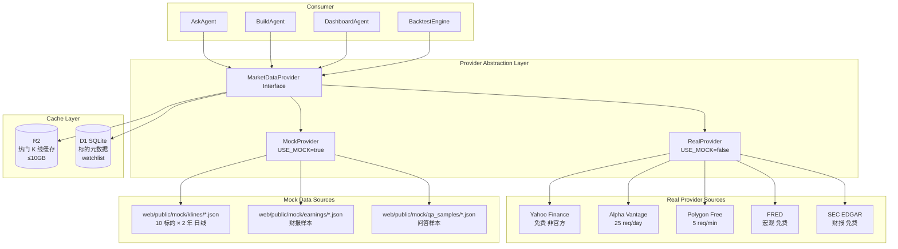

# Epic 02: Data Layer

**Epic 编号**: 02
**模块名称**: Data Layer
**优先级顺序**: 2（B3 优先级 1→5→2→3→4→6→7→8 中的"5"位置，上移后为第 2 个）
**文档性质标签**: [A] 反向工程 Alva 现状 + [B] 规划下一迭代 + [C] 求职作品型
**Spec 模板**: to-spec
**最后更新**: 2026-07-19

---

## 1. Problem Statement

### 1.1 用户视角问题 [B]

Prosumer Brenda 想分析 NVDA 时遇到的核心痛点：

- **数据散乱**：她需要从 Yahoo Finance 看价格、从 SEC EDGAR 找财报、从 StockTwits 看情绪、从 FRED 查宏观数据。每打开一个新源都要重新输入标的、重新调整时间窗口。
- **延迟与限流**：免费行情 API 限流严苛（Alpha Vantage 25 次/天、Yahoo 非官方接口易封 IP），她写一个简单的"过去 5 年所有财报日次日涨跌"分析就因为限流跑了 3 小时。
- **Mock 与生产不可切换**：现有市面"AI 投资助手"要么纯 Mock（演示漂亮但不可靠）要么纯生产（一上线就被 API 账单击垮），缺少可一键切换的双模架构。
- **R2 缓存策略不明**：用户细化决策明确"R2 仅存储部分 Mockup 用到的真实 K 线"，但哪些算"Mockup 用到"缺乏定义。

### 1.2 工程视角问题 [B]

- **多源异构**：行情（K 线/Tick）、基本面（财报/SEC filings）、新闻（RSS/Twitter）、宏观数据（FRED）数据格式完全不同，需要统一 normalize。
- **Mock/Real 双模**：本地开发用 LM Studio，部署到 Cloudflare 用火山引擎 Ark；K 线本地用预生成 JSON 包，生产用真实 API；必须有 Provider 抽象层 + `USE_MOCK` 开关。
- **免费额度约束**：Cloudflare D1 5GB、R2 10GB、Workers 100K req/day；Yahoo Finance 非官方接口易限流；Alpha Vantage 25 req/day 免费层；Polygon free tier 5 req/min。
- **回测引擎的数据需求**：用户明确"回测引擎需要用到 Mockup 的数据"，意味着 Mock 数据不能是简单的"10 天样本"，必须有足够长度（≥2 年）支撑真实回测。

### 1.3 反向工程 Alva 现状 [A]

Alva 当前在数据层呈现的能力 [INFERRED]：
- 内置 Yahoo Finance 数据源（从公开接口可推断）
- 自有财报 RAG（基于 SEC EDGAR）
- 实时行情延迟约 15 分钟（免费层特征）
- 未公开 Mock 模式切换

**本 Epic 要"做得比 Alva 更好"的关键点 [C]**：
- 显式 Mock/Real 双模开关（Alva 未公开此能力）
- R2 智能缓存热门 K 线（Alva 未提及缓存策略）
- 多源 fallback（Yahoo → Alpha Vantage → Polygon → Mock）— Phase 1 仅 Yahoo → Mock；Phase 1.5 起启用完整链

---

## 2. Solution

### 2.1 总体架构 [B]



### 2.2 Mock/Real 切换设计 [B] - **关键决策**

**单一开关 `USE_MOCK` 环境变量**：

```typescript
// src/lib/data/provider.ts
export type DataSourceMode = "mock" | "real";

interface ProviderConfig {
  mode: DataSourceMode;
  mockDataPath: string;      // 静态 JSON 路径
  realSources: SourcePriority[]; // 真实源优先级
  r2Cache: { enabled: boolean; ttl: number; maxSize: number };
}

function getProvider(env: Env): MarketDataProvider {
  const mode = env.USE_MOCK === "true" ? "mock" : "real";
  return mode === "mock" ? new MockProvider() : new RealProvider({
    sources: [
      // Phase 1: 仅 yahoo + mock fallback（当前实现）
      // Phase 1.5: 启用 alpha + polygon
      // Phase 2: 启用 sec + fred
      { name: "yahoo",   priority: 1, rateLimit: { req: 100, per: "minute" } },
      { name: "alpha",   priority: 2, rateLimit: { req: 25,   per: "day"    } }, // Phase 1.5
      { name: "polygon", priority: 3, rateLimit: { req: 5,    per: "minute" } }, // Phase 1.5
      { name: "mock",    priority: 99, fallback: true }, // 兜底（Phase 1 即启用）
    ],
    r2: { enabled: true, ttl: 3600, maxSize: 5 * 1024 * 1024 * 1024 /* 5GB */ },
  });
}
```

**Mock 数据落点**（用户 Q3 决策的"前端 + Worker 中间层 + D1"三层）：

| 层 | Mock 实现 | 数据来源 |
|---|---|---|
| 前端层 | `web/public/mock/*.json` 直接 fetch | 预生成静态文件 |
| Worker 层 | `MockProvider` 类拦截请求 | `web/public/mock/klines/*.json` |
| D1 层 | 启动脚本 `seed.sql` 预置 | 测试账号/Credit/策略草稿 |

### 2.3 R2 缓存策略（细化用户决策）[B]

**用户细化决策**："R2 仅存储部分 Mockup 用到的真实 K 线"

**"Mockup 用到"的精确定义**：
1. Mock 数据集 (`web/public/mock/klines/*.json`) 涵盖的 10 个标的
2. 这 10 个标的的真实历史 K 线（过去 2 年日线 + 过去 30 天分钟线）
3. 总量预估：10 标的 × 2 年 × 252 交易日 × 6 字段 ≈ 30K 条记录 → JSON ≈ 5MB → 完全在 R2 免费层内

**R2 缓存策略**：

```typescript
interface R2CacheStrategy {
  // 仅缓存"Mockup 命中标的"
  cachedSymbols: ["AAPL", "MSFT", "NVDA", "GOOG", "META", "AMZN", "TSLA", "NFLX", "AMD", "INTC"];
  // 不缓存冷门标的（生产模式下直接走 Yahoo API）
  cacheKey: (symbol, timeframe) => `klines/${symbol}/${timeframe}.json`;
  ttl: {
    daily: 86400,      // 1 天
    minute: 60,        // 1 分钟
    fundamental: 604800 // 7 天
  };
  // 优雅降级：R2 miss → 真实 API → 写回 R2 → 返回
  fallback: "real_api_then_cache";
}
```

**Mock 模式下 R2 行为**：
- Mock 模式下 R2 不参与（直接读 `web/public/mock/klines/*.json`）
- 仅在生产模式且标的在 `cachedSymbols` 列表内时才写 R2

### 2.4 D1 Schema [B]

```sql
-- 标的元数据表
CREATE TABLE symbols (
  ticker      TEXT PRIMARY KEY,
  name        TEXT NOT NULL,
  exchange    TEXT NOT NULL,  -- NYSE/NASDAQ/AMEX
  sector      TEXT,
  industry    TEXT,
  market_cap  INTEGER,        -- 单位：USD
  is_mockup   INTEGER DEFAULT 0,  -- 1 = 在 Mockup 池中
  created_at  TEXT DEFAULT (datetime('now'))
);

-- Watchlist
CREATE TABLE watchlists (
  id          INTEGER PRIMARY KEY AUTOINCREMENT,
  user_id     TEXT NOT NULL,
  name        TEXT NOT NULL,
  created_at  TEXT DEFAULT (datetime('now'))
);

CREATE TABLE watchlist_items (
  watchlist_id INTEGER NOT NULL REFERENCES watchlists(id) ON DELETE CASCADE,
  ticker       TEXT NOT NULL REFERENCES symbols(ticker),
  added_at     TEXT DEFAULT (datetime('now')),
  PRIMARY KEY (watchlist_id, ticker)
);

-- 行情缓存元数据（实际 K 线数据在 R2，这里只存指针）
CREATE TABLE kline_cache_index (
  ticker       TEXT NOT NULL,
  timeframe    TEXT NOT NULL,  -- 1d/5m/15m/1h
  cached_at    TEXT NOT NULL,
  r2_key       TEXT NOT NULL,
  PRIMARY KEY (ticker, timeframe)
);

-- 基本面数据缓存（小型，直接存 D1）
CREATE TABLE fundamentals (
  ticker       TEXT NOT NULL,
  field        TEXT NOT NULL,  -- pe_ratio/eps/revenue/...
  value        TEXT,
  period       TEXT,           -- 2024-Q4 / 2024-FY
  updated_at   TEXT DEFAULT (datetime('now')),
  PRIMARY KEY (ticker, field, period)
);
```

### 2.5 Mock K 线数据格式 [B]

**用户 Q3 决策**："本地预生成美股日线 / 分钟线 JSON 包"

**Mock K 线 JSON Schema**：

```json
{
  "$schema": "https://nova-invest.dev/schemas/kline.json",
  "ticker": "AAPL",
  "timeframe": "1d",
  "source": "mock",
  "generated_at": "2026-07-19T00:00:00Z",
  "data": [
    {
      "t": "2024-01-02",   // ISO date
      "o": 187.15,
      "h": 188.44,
      "l": 186.86,
      "c": 187.31,
      "v": 82488700,
      "adj_o": 186.51,
      "adj_h": 187.79,
      "adj_l": 186.22,
      "adj_c": 186.67
    }
  ]
}
```

**Mock 数据集清单**（`web/public/mock/klines/` 目录）：

| 文件 | 标的 | 时间跨度 | 数据点数 | 大小估算 |
|---|---|---|---|---|
| AAPL_1d.json | Apple | 2024-01-02 ~ 2025-12-31 | ~500 条 | ~80KB |
| AAPL_5m.json | Apple | 2025-06-01 ~ 2025-06-30 | ~12000 条 | ~2MB |
| MSFT_1d.json | Microsoft | 同上 | ~500 条 | ~80KB |
| ... | （共 10 标的 × 2 时间框架 = 20 文件） | | | **~30MB 总计** |

**Mock 数据生成脚本**（开发期一次性运行，从真实 Yahoo API 拉取后落盘）：

```typescript
// scripts/generate_mock_data.ts
import YahooAPI from "./providers/yahoo";

const MOCK_SYMBOLS = ["AAPL", "MSFT", "NVDA", "GOOG", "META",
                      "AMZN", "TSLA", "NFLX", "AMD", "INTC"];

async function main() {
  for (const symbol of MOCK_SYMBOLS) {
    const daily = await YahooAPI.getHistorical(symbol, "1d",
      "2024-01-01", "2025-12-31");
    await fs.writeFile(`web/public/mock/klines/${symbol}_1d.json`,
      JSON.stringify({ ticker: symbol, timeframe: "1d", source: "mock",
                      generated_at: new Date().toISOString(), data: daily }, null, 2));

    const minute = await YahooAPI.getHistorical(symbol, "5m",
      dayMinus30, today);
    await fs.writeFile(`web/public/mock/klines/${symbol}_5m.json`,
      JSON.stringify({ ticker: symbol, timeframe: "5m", source: "mock",
                      generated_at: new Date().toISOString(), data: minute }, null, 2));
  }
}
```

**注意**：生成脚本仅运行一次，生成的 JSON 作为静态资产提交到 Git。后续 Mock 模式不再依赖任何外部 API。

### 2.6 Provider Interface [B]

```typescript
// src/lib/data/types.ts
export interface MarketDataProvider {
  getKlines(symbol: string, timeframe: Timeframe,
            from: Date, to: Date): Promise<Kline[]>;
  getQuote(symbol: string): Promise<Quote>;
  getFundamentals(symbol: string): Promise<Fundamentals>;
  getEarnings(symbol: string, period: string): Promise<EarningsReport>;
  searchSymbols(query: string): Promise<SymbolSearchResult[]>;
}

export type Timeframe = "1m" | "5m" | "15m" | "1h" | "1d" | "1w";

export interface Kline {
  t: string;  // ISO date
  o: number; h: number; l: number; c: number; v: number;
  adj_o?: number; adj_h?: number; adj_l?: number; adj_c?: number;
}
```

---

## 3. User Stories

### Job Stories（业务动机） [B]

1. **When** Brenda 打开 NVDA 分析页，**I want to** 在 200ms 内看到 K 线图，**so that** 不需要等待 Yahoo API 响应。
2. **When** Brenda 在本地开发环境跑 demo，**I want to** 一键开启 Mock 模式无需配置 API key，**so that** 演示流畅且零成本。
3. **When** Brenda 查询一个冷门标的（如 RKLB），**I want to** 系统自动 fallback 到真实 API 且不被限流，**so that** 不会因单源失败导致整个分析中断。
4. **When** 回测引擎需要 2 年历史数据，**I want to** Mock 数据集已包含足够的真实历史，**so that** 回测结果可信。
5. **When** Brenda 在 Cloudflare 部署后切换到生产模式，**I want to** R2 缓存自动启用且不超 10GB，**so that** 不会产生 R2 费用。
6. **When** Brenda 重复查询 AAPL，**I want to** 第二次查询命中 R2 缓存（<50ms），**so that** Workers 请求数下降。

### As-a Stories [B]

1. As a Prosumer, I want to 查询任何美股标的的日线/分钟线 K 线，so that 可以做技术分析。
2. As a Prosumer, I want to 看到实时报价（延迟 ≤15 分钟免费层），so that 不需要离开 nova-invest 切换到其他工具。
3. As a Prosumer, I want to 查询标的财报数据（营收/利润/EPS），so that 可以做基本面分析。
4. As a Prosumer, I want to 创建多个 watchlist，so that 可以分组管理关注的标的。
5. As a Developer, I want to 通过 `USE_MOCK=true` 一键切换 Mock 模式，so that 本地开发无需 API key。
6. As a Developer, I want to 通过 Provider 抽象层扩展新数据源，so that 不需要修改业务代码。
7. As an Interviewer reviewing the repo, I want to 看到 Mock 数据集 + Mock/Real 切换设计，so that 评估候选人的工程能力。
8. As a Free-tier User, I want to 即使 Yahoo API 限流也能用 Mock 数据兜底，so that 不会因为免费层限制完全无法使用。

### BDD Gherkin 验收规则 [B]

```gherkin
Feature: Mock/Real 切换

  Scenario: Mock 模式下读 K 线
    Given 环境变量 USE_MOCK=true
    And web/public/mock/klines/AAPL_1d.json 存在
    When 用户请求 AAPL 日线
    Then 返回 web/public/mock/klines/AAPL_1d.json 的内容
    And 不发起任何外部 HTTP 请求
    And 响应时间 < 100ms

  Scenario: Real 模式下读 K 线命中 R2 缓存
    Given 环境变量 USE_MOCK=false
    And R2 中存在 klines/AAPL/1d.json
    When 用户请求 AAPL 日线
    Then 直接从 R2 读取返回
    And 不调用 Yahoo/Alpha Vantage API
    And 响应时间 < 50ms

  Scenario: Real 模式下 R2 miss 但在 cachedSymbols 内
    Given 环境变量 USE_MOCK=false
    And R2 中无 klines/NVDA/1d.json
    And NVDA 在 cachedSymbols 列表内
    When 用户请求 NVDA 日线
    Then 调用 Yahoo Finance API
    And 将结果写入 R2 缓存
    And 返回数据

  Scenario: Real 模式下冷门标的
    Given 环境变量 USE_MOCK=false
    And 用户请求 RKLB 日线
    And RKLB 不在 cachedSymbols 内
    When 调用 Yahoo Finance API
    Then 返回数据但不写 R2（避免缓存膨胀）

  Scenario: 多源 fallback
    Given USE_MOCK=false
    And Yahoo Finance 返回 429 限流
    When 用户请求 AAPL 日线
    Then 自动切换到 Alpha Vantage
    And Alpha Vantage 也失败时降级到 Mock 数据
    And 记录 warning 级别日志

  Scenario: Mock 数据集生成脚本
    Given 开发者运行 pnpm run gen:mock
    When 脚本从 Yahoo Finance 拉取 10 个标的 2 年日线
    Then 生成 web/public/mock/klines/{SYMBOL}_1d.json 共 10 个文件
    And 每个文件包含 500+ 条 K 线数据
    And 文件总大小 < 50MB
```

---

## 4. Implementation Decisions

### ID-1: Provider 抽象模式 [B]

采用 Strategy Pattern，所有业务代码只依赖 `MarketDataProvider` 接口，不感知具体实现。

```typescript
// 简化的 Provider 路由
class ProviderRouter implements MarketDataProvider {
  constructor(private primary: MarketDataProvider,
              private fallbacks: MarketDataProvider[]) {}

  async getKlines(symbol, tf, from, to) {
    try { return await this.primary.getKlines(symbol, tf, from, to); }
    catch (e) {
      for (const f of this.fallbacks) {
        try { return await f.getKlines(symbol, tf, from, to); }
        catch {}
      }
      throw e;
    }
  }
}
```

### ID-2: `USE_MOCK` 单一开关 [B]

- 单一环境变量 `USE_MOCK` 控制全局数据源
- `USE_MOCK=true` → 所有数据请求走 `MockProvider`
- `USE_MOCK=false` → 所有数据请求走 `RealProvider`（含 R2 缓存）
- `.dev.vars` 文件默认 `USE_MOCK=true`
- Cloudflare Workers 部署时通过 `wrangler secret put USE_MOCK` 设置为 `false`

### ID-3: R2 缓存"Mockup 命中标的"白名单 [B]

**用户细化决策的精确实施**：

```typescript
const R2_CACHE_SYMBOLS = new Set([
  "AAPL", "MSFT", "NVDA", "GOOG", "META",
  "AMZN", "TSLA", "NFLX", "AMD", "INTC"
]);

function shouldCacheR2(symbol: string): boolean {
  return R2_CACHE_SYMBOLS.has(symbol.toUpperCase());
}
```

**为何仅缓存这 10 个**：
- 这是 Mock 数据集涵盖的标的，保证 Mock 与 Real 模式下"看得见"的标的完全一致
- 10 个标的 × 2 年日线 × 6 字段 × 8 字节 ≈ 250KB/标的 → 总缓存 < 5MB，远低于 R2 10GB 免费层
- 冷门标的（用户查询 RKLB）不缓存，避免缓存膨胀

### ID-4: 真实数据源优先级 [B]

| 优先级 | 源 | 限流 | 用途 | 备注 | Phase |
|---|---|---|---|---|---|
| 1 | Yahoo Finance 非官方 | 100 req/min | K 线/报价 | 免费，无 key，但易封 IP | Phase 1 |
| 2 | Alpha Vantage Free | 25 req/day | K 线 + 基本面 | 需免费 API key | Phase 1.5 |
| 3 | Polygon Free | 5 req/min | K 线 | 需免费 API key | Phase 1.5 |
| 4 | SEC EDGAR | 无明确限流 | 财报 | 完全免费 | Phase 2 |
| 5 | FRED | 120 req/min | 宏观 | 完全免费 | Phase 2 |
| 99 | Mock 数据集 | 无限 | 兜底 fallback | 仅在所有真实源失败时 | Phase 1 |

**Phase 说明**:
- **Phase 1**（求职作品 demo）: 仅 Yahoo + Mock fallback。代码实现在 `web/src/lib/data/provider.ts`。
- **Phase 1.5**（生产灰度）: 增加 Alpha Vantage + Polygon 作为 Yahoo 限流时的 fallback。
- **Phase 2**（完整版）: 增加 SEC EDGAR + FRED 支持财报与宏观数据。

### ID-5: D1 作为元数据存储，K 线不入 D1 [B]

**决策**：K 线数据不入 D1（D1 5GB 限制 + 行查询慢），仅在 D1 存：
- `symbols` 表（标的元数据，~8000 行美股全量）
- `watchlists` 表（用户 watchlist）
- `kline_cache_index` 表（R2 缓存指针）
- `fundamentals` 表（基本面数据，小型）

### ID-6: 标的元数据预置 [B]

**预置标的清单**：
- Mockup 池：10 个（用户决策）
- 美股大盘指数成分股预置：S&P 500 前 100（降低 Symbol Search 频率）
- 启动脚本：`pnpm run db:seed` 一次性导入

### ID-7: 限流熔断器 [B]

```typescript
class CircuitBreaker {
  private failures = new Map<string, { count: number; lastFail: Date }>();
  private threshold = 5;
  private cooldownMs = 60000;

  isTripped(source: string): boolean {
    const s = this.failures.get(source);
    if (!s) return false;
    if (Date.now() - s.lastFail.getTime() > this.cooldownMs) {
      this.failures.delete(source);
      return false;
    }
    return s.count >= this.threshold;
  }

  recordFailure(source: string) {
    const s = this.failures.get(source) ?? { count: 0, lastFail: new Date(0) };
    s.count++;
    s.lastFail = new Date();
    this.failures.set(source, s);
  }
}
```

---

## 5. Testing Decisions

### 5.1 Test Seams 表 [B]

| Seam | 类型 | 测试内容 | 工具 |
|---|---|---|---|
| TS-1 | Unit | `MockProvider.getKlines()` 返回 JSON 文件内容 | Vitest |
| TS-2 | Unit | `RealProvider.getKlines()` 走 Yahoo API 路径 | Vitest + MSW mock |
| TS-3 | Integration | `ProviderRouter` fallback 链路 | Vitest + nock |
| TS-4 | Integration | R2 缓存命中/未命中 | Miniflare + Vitest |
| TS-5 | Contract | Provider 接口契约一致性（Mock 与 Real 返回同结构） | Vitest snapshot |

### 5.2 Golden Set（关键回归用例） [B]

```typescript
// tests/golden/data_provider.golden.test.ts
describe("Data Provider Golden Set", () => {
  it("Mock 与 Real 返回 AAPL 日线结构一致", async () => {
    const mockResult = await mockProvider.getKlines("AAPL", "1d", ...);
    const realResult = await realProvider.getKlines("AAPL", "1d", ...);
    expect(Object.keys(mockResult[0]).sort())
      .toEqual(Object.keys(realResult[0]).sort());
  });

  it("R2 缓存 10 个 Mockup 标的都存在", async () => {
    for (const sym of R2_CACHE_SYMBOLS) {
      const cached = await r2.get(`klines/${sym}/1d.json`);
      expect(cached).not.toBeNull();
    }
  });

  it("USE_MOCK=true 时所有外部 HTTP 被拦截", async () => {
    const fetches = mockFetch();
    const provider = getProvider({ USE_MOCK: "true" });
    await provider.getKlines("AAPL", "1d", ...);
    expect(fetches).toHaveLength(0);
  });
});
```

### 5.3 测试策略 [B]

- **Unit 测试**：每个 Provider 类的纯函数逻辑
- **Contract 测试**：Mock/Real 返回数据结构必须一致（避免下游 Bug）
- **Integration 测试**：用 Miniflare 模拟 Cloudflare 环境（D1 + R2）
- **Golden 测试**：每次 PR 跑 Golden Set，确保 Mock 数据未损坏
- **不测**：不测 Yahoo/Alpha Vantage 真实可用性（外部依赖）

---

## 6. Out of Scope

### 6.1 模块级非目标 [B]

- **Tick 级数据**：仅支持 1m 及以上时间框架，Tick 数据免费源不可得
- **期权/期货/外汇数据**：Phase 1 仅美股股票
- **A 股/港股数据**：地理范围限定美国市场（Master PRD E 项）
- **实时 Level 2 报价**：需付费数据源，超出 Phase 1 免费栈约束
- **历史 Tick 回测**：仅日/分钟级回测
- **SEC EDGAR XBRL 全量解析**：仅解析关键财务字段
- **新闻情感分析**：归 Epic 03 AskAgent，本 Epic 仅提供原始新闻

### 6.2 模块级反模式 [B]

- ❌ **真实存储所有美股 K 线**：R2 仅缓存 Mockup 命中的 10 个标的，不缓存冷门标的
- ❌ **D1 存 K 线数据**：D1 仅存元数据，K 线走 R2 或 Mock JSON
- ❌ **多个 Provider 并行查询竞争**：只用 fallback 链，不做并发请求
- ❌ **Mock 模式下也写 R2**：Mock 模式 0 R2 写入，避免污染缓存
- ❌ **无限 fallback 链**：最多 3 层 fallback（Real → 备用 Real → Mock）
- ❌ **同步生成 Mock 数据**：生成脚本仅开发期运行，生产部署不依赖

---

## 7. Further Notes

### 7.1 参考 [KNOWN]

- Yahoo Finance API 非官方接口：`https://query1.finance.yahoo.com/v8/finance/chart/{symbol}`
- Alpha Vantage Free：`https://www.alphavantage.co/query?function=TIME_SERIES_DAILY&symbol={symbol}&apikey={key}`
- Polygon Free：`https://api.polygon.io/v2/aggs/ticker/{symbol}/range/1/day/{from}/{to}?apiKey={key}`
- SEC EDGAR：`https://data.sec.gov/api/xbrl/companyfacts/CIK{cik}.json`
- FRED：`https://api.stlouisfed.org/fred/series.json?series_id={id}&api_key={key}`

### 7.2 待解问题 [B]

- Q1: 是否需要支持实时 WebSocket 推送？→ Phase 2 再考虑
- Q2: 是否需要标的基本面变更通知？→ Phase 2
- Q3: 是否需要支持港股/A股？→ Phase 3（Master PRD E 项排除）

### 7.3 依赖 [B]

- **上游依赖**：无（数据层是底层）
- **下游依赖**：Epic 01 AgentHarness（Worker 环境）、Epic 03 AskAgent（RAG 数据源）、Epic 04 Strategy DSL（回测数据）、Epic 05 Dashboard（K 线展示）、Epic 06 Broker（报价数据）

---

## 8. Acceptance Criteria

- [ ] `MarketDataProvider` 接口已定义且实现 MockProvider + RealProvider
- [ ] `USE_MOCK=true` 时所有请求走 Mock JSON 文件
- [ ] `USE_MOCK=false` 时按优先级走 Yahoo → Alpha Vantage → Polygon → Mock
- [ ] R2 缓存仅缓存 10 个 Mockup 命中标 的
- [ ] D1 schema 包含 symbols/watchlists/kline_cache_index/fundamentals 4 表
- [ ] Mock 数据集包含 10 标的 × 2 时间框架 = 20 个 JSON 文件
- [ ] 每个标的有 ≥500 条日线 + ≥10000 条 5m 线
- [ ] Mock 数据集总大小 < 50MB
- [ ] `pnpm run gen:mock` 脚本可一次性生成全部 Mock 数据
- [ ] `pnpm run db:seed` 脚本可初始化 D1 元数据
- [ ] 限流熔断器实现并通过测试
- [ ] Contract 测试：Mock 与 Real 返回数据结构一致
- [ ] Golden Set 测试全部通过
- [ ] Cloudflare 部署后 Real 模式下 R2 缓存命中率 > 60%（10 个标的重复查询）

---

## 9. 版本历史

| 版本 | 日期 | 变更 |
|---|---|---|
| 0.1 | 2026-07-19 | 初稿，基于 B3 优先级 + Q3 Mock 数据决策 + R2 细化决策 |
