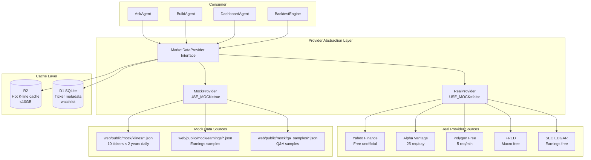

# Epic 02: Data Layer

**Epic ID**: 02
**Module name**: Data Layer
**Priority order**: 2 (the "5" position in B3 priority 1→5→2→3→4→6→7→8, the 2nd after being moved up)
**Document nature tags**: [A] Analyzing competitor status quo + [B] Planning next iteration + [C] Personal project type
**Spec template**: to-spec
**Last updated**: 2026-07-19

---

## 1. Problem Statement

### 1.1 User-perspective Problem [B]

Core pain points when Prosumer Brenda wants to analyze NVDA:

- **Scattered data**: She needs to look at prices on Yahoo Finance, find earnings on SEC EDGAR, view sentiment on StockTwits, query macro data on FRED. Each new source requires re-entering the ticker and re-adjusting the time window.
- **Latency and rate limiting**: Free market data APIs have severe rate limits (Alpha Vantage 25 requests/day, Yahoo's unofficial interface easily IP-banned). A simple "next-day price change for all earnings days over the past 5 years" analysis took 3 hours due to rate limiting.
- **Mock and production not switchable**: Existing "AI investment assistants" on the market are either pure Mock (pretty demo but unreliable) or pure production (instantly crushed by API bills on launch), lacking a one-click switchable dual-mode architecture.
- **Unclear R2 cache strategy**: The user's refined decision specifies "R2 only stores part of the real K-lines used by Mockup", but what counts as "used by Mockup" is undefined.

### 1.2 Engineering-perspective Problem [B]

- **Multi-source heterogeneity**: Market data (K-line/Tick), fundamentals (earnings/SEC filings), news (RSS/Twitter), macro data (FRED) have completely different formats and require unified normalization.
- **Mock/Real dual mode**: Local development uses LM Studio, deployment to Cloudflare uses Volcengine Ark; K-lines use pre-generated JSON packages locally, real APIs in production; must have a Provider abstraction layer + `USE_MOCK` switch.
- **Free quota constraints**: Cloudflare D1 5GB, R2 10GB, Workers 100K req/day; Yahoo Finance unofficial interface easily rate-limited; Alpha Vantage 25 req/day free tier; Polygon free tier 5 req/min.
- **Backtest engine data needs**: The user explicitly stated "the backtest engine needs to use Mockup data", meaning Mock data cannot be a simple "10-day sample" — it must be long enough (≥2 years) to support real backtests.

### 1.3 Competitor Status Analysis [A]

Competitor capabilities at the data layer [INFERRED]:
- Built-in Yahoo Finance data source (inferred from public interface)
- Proprietary earnings RAG (based on SEC EDGAR)
- Real-time quote latency ~15 minutes (free tier characteristic)
- Mock mode switching not publicly disclosed

**Core differentiating features of this Epic [C]**:
- Explicit Mock/Real dual-mode switch (competitor has not disclosed this capability)
- R2 smart caching of popular K-lines (competitor does not mention cache strategy)
- Multi-source fallback (Yahoo → Alpha Vantage → Polygon → Mock) — Phase 1 only Yahoo → Mock; full chain enabled from Phase 1.5

---

## 2. Solution

### 2.1 Overall Architecture [B]



### 2.2 Mock/Real Switching Design [B] - **Key Decision**

**Single `USE_MOCK` environment variable switch**:

```typescript
// src/lib/data/provider.ts
export type DataSourceMode = "mock" | "real";

interface ProviderConfig {
  mode: DataSourceMode;
  mockDataPath: string;      // static JSON path
  realSources: SourcePriority[]; // real source priority
  r2Cache: { enabled: boolean; ttl: number; maxSize: number };
}

function getProvider(env: Env): MarketDataProvider {
  const mode = env.USE_MOCK === "true" ? "mock" : "real";
  return mode === "mock" ? new MockProvider() : new RealProvider({
    sources: [
      // Phase 1: only yahoo + mock fallback (current implementation)
      // Phase 1.5: enable alpha + polygon
      // Phase 2: enable sec + fred
      { name: "yahoo",   priority: 1, rateLimit: { req: 100, per: "minute" } },
      { name: "alpha",   priority: 2, rateLimit: { req: 25,   per: "day"    } }, // Phase 1.5
      { name: "polygon", priority: 3, rateLimit: { req: 5,    per: "minute" } }, // Phase 1.5
      { name: "mock",    priority: 99, fallback: true }, // fallback (Phase 1 enables)
    ],
    r2: { enabled: true, ttl: 3600, maxSize: 5 * 1024 * 1024 * 1024 /* 5GB */ },
  });
}
```

**Mock data placement** (the user's Q3 decision: "frontend + Worker middle layer + D1" three layers):

| Layer | Mock implementation | Data source |
|---|---|---|
| Frontend layer | `web/public/mock/*.json` direct fetch | Pre-generated static files |
| Worker layer | `MockProvider` class intercepts requests | `web/public/mock/klines/*.json` |
| D1 layer | Startup script `seed.sql` pre-populates | Test accounts/Credits/strategy drafts |

### 2.3 R2 Cache Strategy (refining user decision) [B]

**User refined decision**: "R2 only stores part of the real K-lines used by Mockup"

**Precise definition of "used by Mockup"**:
1. The 10 tickers covered by the Mock dataset (`web/public/mock/klines/*.json`)
2. Real historical K-lines for these 10 tickers (past 2 years daily + past 30 days minute)
3. Volume estimate: 10 tickers × 2 years × 252 trading days × 6 fields ≈ 30K records → JSON ≈ 5MB → well within R2 free tier

**R2 cache strategy**:

> **Note (revised 2026-07-19)**: Original `daily: 86400 (1 day)` is inconsistent with ADR-0002 `R2_TTL.PRICE: 3600 (1 hour)`.
> Aligned to ADR-0002's 1-hour price TTL (ensures data freshness, Yahoo API load manageable). See [ADR-0002](../../architecture/adr-0002-r2-cache-whitelist.md).

```typescript
interface R2CacheStrategy {
  // only cache "Mockup hit tickers"
  cachedSymbols: ["AAPL", "MSFT", "NVDA", "GOOG", "META", "AMZN", "TSLA", "NFLX", "AMD", "INTC"];
  // do not cache obscure tickers (in production mode go directly to Yahoo API)
  cacheKey: (symbol, timeframe) => `klines/${symbol}/${timeframe}.json`;
  ttl: {
    price:       3600,      // 1 hour (per ADR-0002 R2_TTL.PRICE; original 86400 deprecated)
    fundamental: 604800     // 7 days (per ADR-0002 R2_TTL.FUNDAMENTAL)
  };
  // graceful degradation: R2 miss -> real API -> write-back R2 -> return
  fallback: "real_api_then_cache";
}
```

**R2 behavior in Mock mode**:
- R2 is not used in Mock mode (reads `web/public/mock/klines/*.json` directly)
- R2 is only written in production mode and only when the ticker is in the `cachedSymbols` list

### 2.4 D1 Schema [B]

```sql
-- Ticker metadata table
CREATE TABLE symbols (
  ticker      TEXT PRIMARY KEY,
  name        TEXT NOT NULL,
  exchange    TEXT NOT NULL,  -- NYSE/NASDAQ/AMEX
  sector      TEXT,
  industry    TEXT,
  market_cap  INTEGER,        -- unit: USD
  is_mockup   INTEGER DEFAULT 0,  -- 1 = in Mockup pool
  created_at  TEXT DEFAULT (datetime('now'))
);

-- Watchlist
CREATE TABLE watchlists (
  id          INTEGER PRIMARY KEY AUTOINCREMENT,
  user_id     TEXT NOT NULL,
  name        TEXT NOT NULL,
  created_at  TEXT DEFAULT (datetime('now'))
);

CREATE TABLE watchlist_items (
  watchlist_id INTEGER NOT NULL REFERENCES watchlists(id) ON DELETE CASCADE,
  ticker       TEXT NOT NULL REFERENCES symbols(ticker),
  added_at     TEXT DEFAULT (datetime('now')),
  PRIMARY KEY (watchlist_id, ticker)
);

-- Market data cache metadata (actual K-line data is in R2, only pointers stored here)
CREATE TABLE kline_cache_index (
  ticker       TEXT NOT NULL,
  timeframe    TEXT NOT NULL,  -- 1d/5m/15m/1h
  cached_at    TEXT NOT NULL,
  r2_key       TEXT NOT NULL,
  PRIMARY KEY (ticker, timeframe)
);

-- Fundamentals cache (small, stored directly in D1)
CREATE TABLE fundamentals (
  ticker       TEXT NOT NULL,
  field        TEXT NOT NULL,  -- pe_ratio/eps/revenue/...
  value        TEXT,
  period       TEXT,           -- 2024-Q4 / 2024-FY
  updated_at   TEXT DEFAULT (datetime('now')),
  PRIMARY KEY (ticker, field, period)
);
```

### 2.5 Mock K-line Data Format [B]

**User Q3 decision**: "Locally pre-generate US stock daily / minute JSON packages"

**Mock K-line JSON Schema**:

```json
{
  "$schema": "https://nova-invest.dev/schemas/kline.json",
  "ticker": "AAPL",
  "timeframe": "1d",
  "source": "mock",
  "generated_at": "2026-07-19T00:00:00Z",
  "data": [
    {
      "t": "2024-01-02",   // ISO date
      "o": 187.15,
      "h": 188.44,
      "l": 186.86,
      "c": 187.31,
      "v": 82488700,
      "adj_o": 186.51,
      "adj_h": 187.79,
      "adj_l": 186.22,
      "adj_c": 186.67
    }
  ]
}
```

**Mock dataset inventory** (`web/public/mock/klines/` directory):

| File | Ticker | Time span | Data points | Size estimate |
|---|---|---|---|---|
| AAPL_1d.json | Apple | 2024-01-02 ~ 2025-12-31 | ~500 entries | ~80KB |
| AAPL_5m.json | Apple | 2025-06-01 ~ 2025-06-30 | ~12000 entries | ~2MB |
| MSFT_1d.json | Microsoft | Same as above | ~500 entries | ~80KB |
| ... | (10 tickers × 2 timeframes = 20 files total) | | | **~30MB total** |

**Mock data generation script** (run once during development, pulled from real Yahoo API then persisted):

```typescript
// scripts/generate_mock_data.ts
import YahooAPI from "./providers/yahoo";

const MOCK_SYMBOLS = ["AAPL", "MSFT", "NVDA", "GOOG", "META",
                      "AMZN", "TSLA", "NFLX", "AMD", "INTC"];

async function main() {
  for (const symbol of MOCK_SYMBOLS) {
    const daily = await YahooAPI.getHistorical(symbol, "1d",
      "2024-01-01", "2025-12-31");
    await fs.writeFile(`web/public/mock/klines/${symbol}_1d.json`,
      JSON.stringify({ ticker: symbol, timeframe: "1d", source: "mock",
                      generated_at: new Date().toISOString(), data: daily }, null, 2));

    const minute = await YahooAPI.getHistorical(symbol, "5m",
      dayMinus30, today);
    await fs.writeFile(`web/public/mock/klines/${symbol}_5m.json`,
      JSON.stringify({ ticker: symbol, timeframe: "5m", source: "mock",
                      generated_at: new Date().toISOString(), data: minute }, null, 2));
  }
}
```

**Note**: The generation script runs only once; the generated JSON is committed to Git as a static asset. Subsequent Mock mode no longer depends on any external API.

### 2.6 Provider Interface [B]

```typescript
// src/lib/data/types.ts
export interface MarketDataProvider {
  getKlines(symbol: string, timeframe: Timeframe,
            from: Date, to: Date): Promise<Kline[]>;
  getQuote(symbol: string): Promise<Quote>;
  getFundamentals(symbol: string): Promise<Fundamentals>;
  getEarnings(symbol: string, period: string): Promise<EarningsReport>;
  searchSymbols(query: string): Promise<SymbolSearchResult[]>;
}

export type Timeframe = "1m" | "5m" | "15m" | "1h" | "1d" | "1w";

export interface Kline {
  t: string;  // ISO date
  o: number; h: number; l: number; c: number; v: number;
  adj_o?: number; adj_h?: number; adj_l?: number; adj_c?: number;
}
```

---

## 3. User Stories

### Job Stories (business motivation) [B]

1. **When** Brenda opens the NVDA analysis page, **I want to** see the K-line chart within 200ms, **so that** she doesn't have to wait for Yahoo API response.
2. **When** Brenda runs a demo in the local dev environment, **I want to** enable Mock mode with one click without configuring API keys, **so that** the demo is smooth and zero-cost.
3. **When** Brenda queries an obscure ticker (e.g. RKLB), **I want to** the system to automatically fall back to the real API without being rate-limited, **so that** the entire analysis is not interrupted by a single source failure.
4. **When** the backtest engine needs 2 years of historical data, **I want to** the Mock dataset to already contain enough real history, **so that** backtest results are credible.
5. **When** Brenda switches to production mode after Cloudflare deployment, **I want to** R2 cache to be auto-enabled and not exceed 10GB, **so that** no R2 fees are incurred.
6. **When** Brenda repeatedly queries AAPL, **I want to** the second query to hit R2 cache (<50ms), **so that** Workers request count drops.

### As-a Stories [B]

1. As a Prosumer, I want to query daily/minute K-lines for any US stock ticker, so that I can do technical analysis.
2. As a Prosumer, I want to see real-time quotes (free-tier latency ≤15 minutes), so that I don't need to leave nova-invest to switch to other tools.
3. As a Prosumer, I want to query ticker earnings data (revenue/profit/EPS), so that I can do fundamental analysis.
4. As a Prosumer, I want to create multiple watchlists, so that I can group-manage watched tickers.
5. As a Developer, I want to switch to Mock mode with one click via `USE_MOCK=true`, so that local development needs no API key.
6. As a Developer, I want to extend new data sources through the Provider abstraction layer, so that no business code changes are needed.
7. As an Interviewer reviewing the repo, I want to see the Mock dataset + Mock/Real switch design, so that I can evaluate the candidate's engineering ability.
8. As a Free-tier User, I want to fall back to Mock data even when Yahoo API is rate-limited, so that I'm not completely blocked by free-tier limits.

### BDD Gherkin Acceptance Rules [B]

```gherkin
Feature: Mock/Real switching

  Scenario: Read K-line in Mock mode
    Given environment variable USE_MOCK=true
    And web/public/mock/klines/AAPL_1d.json exists
    When user requests AAPL daily
    Then return the contents of web/public/mock/klines/AAPL_1d.json
    And no external HTTP requests are made
    And response time < 100ms

  Scenario: Read K-line in Real mode hitting R2 cache
    Given environment variable USE_MOCK=false
    And klines/AAPL/1d.json exists in R2
    When user requests AAPL daily
    Then read directly from R2 and return
    And do not call Yahoo/Alpha Vantage API
    And response time < 50ms

  Scenario: Real mode R2 miss but within cachedSymbols
    Given environment variable USE_MOCK=false
    And klines/NVDA/1d.json not in R2
    And NVDA is in cachedSymbols list
    When user requests NVDA daily
    Then call Yahoo Finance API
    And write the result to R2 cache
    And return data

  Scenario: Real mode obscure ticker
    Given environment variable USE_MOCK=false
    And user requests RKLB daily
    And RKLB is not in cachedSymbols
    When Yahoo Finance API is called
    Then return data but do not write R2 (avoid cache bloat)

  Scenario: Multi-source fallback
    Given USE_MOCK=false
    And Yahoo Finance returns 429 rate limited
    When user requests AAPL daily
    Then automatically switch to Alpha Vantage
    And when Alpha Vantage also fails, degrade to Mock data
    And log a warning-level entry

  Scenario: Mock dataset generation script
    Given developer runs pnpm run gen:mock
    When script pulls 10 tickers × 2 years daily from Yahoo Finance
    Then generate web/public/mock/klines/{SYMBOL}_1d.json, 10 files total
    And each file contains 500+ K-line entries
    And total file size < 50MB
```

---

## 4. Implementation Decisions

### ID-1: Provider Abstraction Pattern [B]

Uses Strategy Pattern — all business code depends only on the `MarketDataProvider` interface, unaware of concrete implementations.

```typescript
// Simplified Provider routing
class ProviderRouter implements MarketDataProvider {
  constructor(private primary: MarketDataProvider,
              private fallbacks: MarketDataProvider[]) {}

  async getKlines(symbol, tf, from, to) {
    try { return await this.primary.getKlines(symbol, tf, from, to); }
    catch (e) {
      for (const f of this.fallbacks) {
        try { return await f.getKlines(symbol, tf, from, to); }
        catch {}
      }
      throw e;
    }
  }
}
```

### ID-2: `USE_MOCK` Single Switch [B]

- Single environment variable `USE_MOCK` controls global data source
- `USE_MOCK=true` → all data requests go through `MockProvider`
- `USE_MOCK=false` → all data requests go through `RealProvider` (including R2 cache)
- `.dev.vars` defaults to `USE_MOCK=true`
- Cloudflare Workers deployment sets it to `false` via `wrangler secret put USE_MOCK`

### ID-3: R2 Cache "Mockup hit tickers" Whitelist [B]

**Precise implementation of user's refined decision**:

```typescript
const R2_CACHE_SYMBOLS = new Set([
  "AAPL", "MSFT", "NVDA", "GOOG", "META",
  "AMZN", "TSLA", "NFLX", "AMD", "INTC"
]);

function shouldCacheR2(symbol: string): boolean {
  return R2_CACHE_SYMBOLS.has(symbol.toUpperCase());
}
```

**Why only these 10 are cached**:
- These are the tickers covered by the Mock dataset, ensuring "visible" tickers are identical under Mock and Real modes
- 10 tickers × 2 years daily × 6 fields × 8 bytes ≈ 250KB/ticker → total cache < 5MB, well below R2 10GB free tier
- Obscure tickers (user queries RKLB) are not cached, avoiding cache bloat

### ID-4: Real Data Source Priority [B]

| Priority | Source | Rate limit | Use | Note | Phase |
|---|---|---|---|---|---|
| 1 | Yahoo Finance unofficial | 100 req/min | K-line/quote | Free, no key, but easily IP-banned | Phase 1 |
| 2 | Alpha Vantage Free | 25 req/day | K-line + fundamentals | Requires free API key | Phase 1.5 |
| 3 | Polygon Free | 5 req/min | K-line | Requires free API key | Phase 1.5 |
| 4 | SEC EDGAR | No explicit rate limit | Earnings | Completely free | Phase 2 |
| 5 | FRED | 120 req/min | Macro | Completely free | Phase 2 |
| 99 | Mock dataset | Unlimited | Fallback | Only when all real sources fail | Phase 1 |

**Phase notes**:
- **Phase 1** (job-search portfolio demo): Only Yahoo + Mock fallback. Code in `web/src/lib/data/provider.ts`.
- **Phase 1.5** (production gradual rollout): Add Alpha Vantage + Polygon as fallback when Yahoo is rate-limited.
- **Phase 2** (full version): Add SEC EDGAR + FRED for earnings and macro data.

### ID-5: D1 as Metadata Store, K-lines Not in D1 [B]

**Decision**: K-line data not in D1 (D1 5GB limit + slow row queries). D1 only stores:
- `symbols` table (ticker metadata, ~8000 rows for all US stocks)
- `watchlists` table (user watchlists)
- `kline_cache_index` table (R2 cache pointers)
- `fundamentals` table (fundamental data, small)

### ID-6: Ticker Metadata Pre-population [B]

**Pre-populated ticker list**:
- Mockup pool: 10 (user decision)
- US large-cap index constituents pre-populated: S&P 500 top 100 (reduces Symbol Search frequency)
- Startup script: `pnpm run db:seed` one-time import

### ID-7: Rate-limit Circuit Breaker [B]

```typescript
class CircuitBreaker {
  private failures = new Map<string, { count: number; lastFail: Date }>();
  private threshold = 5;
  private cooldownMs = 60000;

  isTripped(source: string): boolean {
    const s = this.failures.get(source);
    if (!s) return false;
    if (Date.now() - s.lastFail.getTime() > this.cooldownMs) {
      this.failures.delete(source);
      return false;
    }
    return s.count >= this.threshold;
  }

  recordFailure(source: string) {
    const s = this.failures.get(source) ?? { count: 0, lastFail: new Date(0) };
    s.count++;
    s.lastFail = new Date();
    this.failures.set(source, s);
  }
}
```

---

## 5. Testing Decisions

### 5.1 Test Seams Table [B]

| Seam | Type | Test content | Tool |
|---|---|---|---|
| TS-1 | Unit | `MockProvider.getKlines()` returns JSON file contents | Vitest |
| TS-2 | Unit | `RealProvider.getKlines()` goes through Yahoo API path | Vitest + MSW mock |
| TS-3 | Integration | `ProviderRouter` fallback chain | Vitest + nock |
| TS-4 | Integration | R2 cache hit/miss | Miniflare + Vitest |
| TS-5 | Contract | Provider interface contract consistency (Mock and Real return same structure) | Vitest snapshot |

### 5.2 Golden Set (key regression cases) [B]

```typescript
// tests/golden/data_provider.golden.test.ts
describe("Data Provider Golden Set", () => {
  it("Mock and Real return AAPL daily with consistent structure", async () => {
    const mockResult = await mockProvider.getKlines("AAPL", "1d", ...);
    const realResult = await realProvider.getKlines("AAPL", "1d", ...);
    expect(Object.keys(mockResult[0]).sort())
      .toEqual(Object.keys(realResult[0]).sort());
  });

  it("R2 cache has all 10 Mockup tickers", async () => {
    for (const sym of R2_CACHE_SYMBOLS) {
      const cached = await r2.get(`klines/${sym}/1d.json`);
      expect(cached).not.toBeNull();
    }
  });

  it("USE_MOCK=true blocks all external HTTP", async () => {
    const fetches = mockFetch();
    const provider = getProvider({ USE_MOCK: "true" });
    await provider.getKlines("AAPL", "1d", ...);
    expect(fetches).toHaveLength(0);
  });
});
```

### 5.3 Test Strategy [B]

- **Unit tests**: pure-function logic of each Provider class
- **Contract tests**: Mock/Real return data structures must match (avoid downstream bugs)
- **Integration tests**: use Miniflare to simulate Cloudflare environment (D1 + R2)
- **Golden tests**: run Golden Set on every PR to ensure Mock data is not corrupted
- **Not tested**: Yahoo/Alpha Vantage real availability (external dependency)

---

## 6. Out of Scope

### 6.1 Module-level Non-Goals [B]

- **Tick-level data**: only 1m and above timeframes supported; tick data unavailable from free sources
- **Options/futures/forex data**: Phase 1 only US equities
- **A-shares/HK stocks data**: geographic scope limited to US market (Master PRD item E)
- **Real-time Level 2 quotes**: requires paid data source, exceeds Phase 1 free-stack constraint
- **Historical tick backtest**: only daily/minute backtest
- **SEC EDGAR XBRL full parsing**: only key financial fields parsed
- **News sentiment analysis**: belongs to Epic 03 AskAgent; this Epic only provides raw news

### 6.2 Module-level Anti-Patterns [B]

- ❌ **Store all US stock K-lines for real**: R2 only caches the 10 Mockup-hit tickers, not obscure ones
- ❌ **Store K-line data in D1**: D1 only stores metadata; K-lines go through R2 or Mock JSON
- ❌ **Multiple Providers competing in parallel queries**: only fallback chain, no concurrent requests
- ❌ **Write R2 in Mock mode**: Mock mode has 0 R2 writes, avoiding cache pollution
- ❌ **Infinite fallback chain**: at most 3 layers of fallback (Real → backup Real → Mock)
- ❌ **Synchronous Mock data generation**: generation script runs only during development; production deployment does not depend on it

---

## 7. Further Notes

### 7.1 References [KNOWN]

- Yahoo Finance API unofficial interface: `https://query1.finance.yahoo.com/v8/finance/chart/{symbol}`
- Alpha Vantage Free: `https://www.alphavantage.co/query?function=TIME_SERIES_DAILY&symbol={symbol}&apikey={key}`
- Polygon Free: `https://api.polygon.io/v2/aggs/ticker/{symbol}/range/1/day/{from}/{to}?apiKey={key}`
- SEC EDGAR: `https://data.sec.gov/api/xbrl/companyfacts/CIK{cik}.json`
- FRED: `https://api.stlouisfed.org/fred/series.json?series_id={id}&api_key={key}`

### 7.2 Open Questions [B]

- Q1: Need to support real-time WebSocket push? → Consider in Phase 2
- Q2: Need ticker fundamentals change notifications? → Phase 2
- Q3: Need to support HK/A-shares? → Phase 3 (Master PRD item E excludes)

### 7.3 Dependencies [B]

- **Upstream dependencies**: none (data layer is the bottom layer)
- **Downstream dependencies**: Epic 01 AgentHarness (Worker environment), Epic 03 AskAgent (RAG data source), Epic 04 Strategy DSL (backtest data), Epic 05 Dashboard (K-line display), Epic 06 Broker (quote data)

---

## 8. Acceptance Criteria

- [ ] `MarketDataProvider` interface defined and MockProvider + RealProvider implemented
- [ ] `USE_MOCK=true` routes all requests to Mock JSON files
- [ ] `USE_MOCK=false` follows priority Yahoo -> Mock fallback (**Phase 1**)
- [ ] `USE_MOCK=false` follows priority Yahoo -> Alpha Vantage -> Polygon -> Mock (**Phase 1.5+**, per ID-4 Phase table)
- [ ] R2 cache only caches the 10 Mockup-hit tickers
- [ ] D1 schema contains symbols/watchlists/kline_cache_index/fundamentals 4 tables
- [ ] Mock dataset contains 10 tickers × 2 timeframes = 20 JSON files
- [ ] Each ticker has ≥500 daily + ≥10000 5m lines
- [ ] Mock dataset total size < 50MB
- [ ] `pnpm run gen:mock` script can one-shot generate all Mock data
- [ ] `pnpm run db:seed` script can initialize D1 metadata
- [ ] Rate-limit circuit breaker implemented and tested
- [ ] Contract tests: Mock and Real return data structures match
- [ ] Golden Set tests all pass
- [ ] Cloudflare-deployed Real mode R2 cache hit rate > 60% (10 tickers repeatedly queried)

---

## 9. Version History

| Version | Date | Change |
|---|---|---|
| 0.1 | 2026-07-19 | Initial draft, based on B3 priority + Q3 Mock data decision + R2 refined decision |
