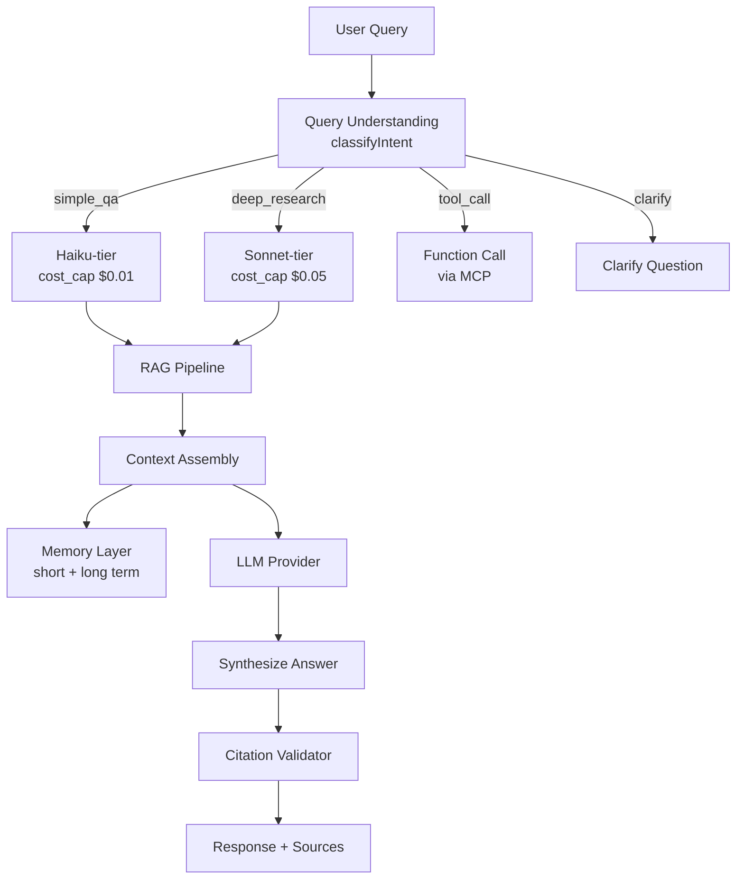
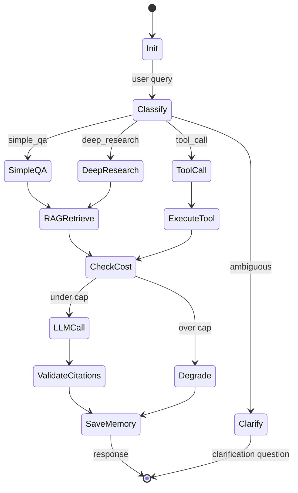

# Epic 03: Ask Agent

**Epic 编号**: 03
**模块名称**: Ask Agent（自然语言问答 Agent）
**优先级顺序**: 3（B3 中"2"位置）
**文档性质标签**: [A] + [B] + [C]
**Spec 模板**: to-spec
**最后更新**: 2026-07-19

---

## 1. Problem Statement

### 1.1 用户视角问题 [B]

Prosumer Brenda 想问"NVDA 最近财报如何，分析师怎么看？"时：

- **数据孤岛**：她在 Yahoo 看价格、在 SEC 看财报、在 StockTwits 看情绪、在 Bloomberg 看研报——每个站点都需要重新输入标的、重新阅读、自己整合结论。
- **延迟与限流**：免费行情 API 限流严苛（Alpha Vantage 25 次/天），她写一个简单的"过去 5 年所有财报日次日涨跌"分析就因为限流跑了 3 小时。
- **AI 幻觉风险**：通用 ChatGPT 回答金融问题常出现"2024 Q4 NVDA 营收 XXX 亿"——而 NVDA 财年不是日历年，Q4 实际在 1 月发布，幻觉直接误导决策。
- **没有引用**：通用 LLM 不告诉你"这个数字从哪来"，无法溯源验证。
- **无记忆**：每次新对话都要重新介绍"我是 Prosumer，关注科技股，看 NVDA 是因为持有仓位"。

### 1.2 工程视角问题 [B]

- **多模型路由**：简单 QA 用 Haiku-tier 省 Credit，深度研究用 Sonnet-tier 保质量；用户细化决策"本地 LM Studio，Cloudflare 火山引擎 Ark"
- **RAG 数据源散乱**：K 线在 Epic 02、财报在 SEC EDGAR、新闻在 RSS、宏观在 FRED——Ask Agent 需要统一检索
- **引用与防幻觉**：每个回答必须附带 source citation，数字字段必须从结构化数据提取（不能让 LLM 自由发挥）
- **多轮记忆**：短期会话记忆（当前对话）+ 长期用户画像（持仓偏好/风险偏好）
- **MCP + Function Call**：外部工具走 MCP（如未来接券商 API），内部工具走原生 function call

### 1.3 反向工程 Alva 现状 [A]

Alva Ask Agent 当前呈现 [INFERRED]：
- 基于 RAG 的财报问答
- 有限的多轮对话能力
- 价格/财报为主要数据源
- 引用标注存在但不严格

**本 Epic 要"做得比 Alva 更好"的关键点 [C]**：
- 显式多模型路由（成本可控）
- 严格 citation（每个数字字段都标注源）
- 用户画像持久化（跨会话记忆）
- Mock/Real 双模（演示可重复）

---

## 2. Solution

### 2.1 总体架构 [B]



### 2.2 LLM 路由策略 [B] - **关键决策**

**用户细化决策**："本地运行时接 LM Studio，部署到 Cloudflare 后接火山引擎 Ark"

```typescript
// src/lib/llm/router.ts
interface LLMRouter {
  route(query: ClassifiedQuery): LLMProvider;
}

const ROUTING_RULES = {
  simple_qa: {        // "AAPL 现在多少钱"
    local:  { provider: "lmstudio",  model: "qwen2.5-7b-instruct",  max_tokens: 500,  cost_cap: 0 },
    cloud:  { provider: "ark",       model: "doubao-lite-4k",      max_tokens: 500,  cost_cap: 0.001 },
  },
  deep_research: {    // "分析 NVDA 过去 3 年财报趋势"
    local:  { provider: "lmstudio",  model: "qwen2.5-32b-instruct", max_tokens: 4000, cost_cap: 0 },
    cloud:  { provider: "ark",       model: "doubao-pro-32k",     max_tokens: 4000, cost_cap: 0.05 },
  },
  tool_call: {        // "用 yfinance 查 AAPL 财报"
    local:  { provider: "lmstudio",  model: "qwen2.5-7b-instruct",  max_tokens: 800,  cost_cap: 0 },
    cloud:  { provider: "ark",       model: "doubao-pro-32k",     max_tokens: 800,  cost_cap: 0.01 },
  },
  fallback: {         // 主模型失败
    local:  { provider: "lmstudio",  model: "qwen2.5-7b-instruct",  max_tokens: 500,  cost_cap: 0 },
    cloud:  { provider: "ark",       model: "doubao-lite-4k",      max_tokens: 500,  cost_cap: 0.001 },
  }
};

function route(query: ClassifiedQuery, env: Env): LLMConfig {
  const env_mode = env.USE_MOCK === "true" ? "local" : "cloud";
  return ROUTING_RULES[query.intent][env_mode];
}
```

### 2.3 引用与防幻觉 [B] - **关键决策**

**强制 Citation 模式**：所有数字字段必须从结构化数据提取，不允许 LLM 自由生成。

```typescript
// src/lib/ask/citation.ts
interface AnswerWithCitations {
  text: string;
  citations: Citation[];
  numeric_facts: NumericFact[];  // 数字字段
}

interface Citation {
  source: "sec_edgar" | "yahoo" | "fred" | "news";
  url: string;
  accessed_at: string;
  quote: string;  // 原文片段
}

interface NumericFact {
  value: number;
  unit: string;       // "USD", "ratio", "percent"
  source: Citation;
  confidence: number; // 0-1
}

// LLM Prompt 模板强制结构化输出
const ANSWER_PROMPT = `
You are a financial analyst assistant. Answer the user's question.

RULES:
1. Every numeric value MUST come from the provided context (RAG results).
2. Do NOT fabricate numbers.
3. If you don't have data, say "I don't have current data for X."
4. For every claim, cite the source using [source_name] format.

CONTEXT:
{rag_context}

USER QUESTION:
{user_question}

RESPONSE FORMAT (JSON):
{
  "summary": "...",
  "numeric_facts": [
    { "value": 123.4, "unit": "USD", "source": "yahoo", "quote": "..." }
  ],
  "citations": [
    { "source": "yahoo", "url": "...", "quote": "..." }
  ],
  "confidence": 0.85
}
`;
```

### 2.4 RAG 流水线 [B]

```typescript
// src/lib/ask/rag.ts
class AskRAGPipeline {
  // 1. 查询向量化
  async embed(query: string): Promise<number[]> {
    // Mock 模式：返回固定向量
    // Real 模式：调用 Cloudflare Vectorize 或火山引擎 embedding
  }

  // 2. 多源检索
  async retrieve(queryEmb: number[], topK = 5): Promise<RAGResult[]> {
    const sources = [
      this.searchKlinesMetadata(queryEmb),    // Epic 02 数据
      this.searchEarnings(queryEmb),            // SEC EDGAR
      this.searchNews(queryEmb),               // 新闻 RSS
      this.searchPlaybooks(queryEmb),          // Epic 08 Playbook
      this.searchUserNotes(queryEmb, userId),  // 用户笔记
    ];
    return mergeAndRank(sources, topK);
  }

  // 3. 上下文组装
  assemble(results: RAGResult[]): string {
    return results.map(r => `[${r.source}] ${r.content}`).join("\n---\n");
  }
}
```

### 2.5 记忆层 [B]

**短期记忆**（会话内，KV 存储）：

```typescript
interface ShortTermMemory {
  sessionId: string;
  messages: Message[];
  context_window: 4096; // tokens
  last_topic?: string;  // "NVDA 财报"
}
```

**长期记忆**（D1 持久化，用户画像）：

```sql
CREATE TABLE user_profiles (
  user_id      TEXT PRIMARY KEY,
  risk_tolerance TEXT,           -- conservative/moderate/aggressive
  sectors       TEXT,            -- JSON array: ["tech", "healthcare"]
  holdings      TEXT,            -- JSON: {ticker: shares}
  preferred_sources TEXT,        -- ["yahoo", "sec_edgar"]
  created_at    TEXT,
  updated_at    TEXT
);

CREATE TABLE conversation_history (
  id           INTEGER PRIMARY KEY AUTOINCREMENT,
  user_id      TEXT NOT NULL,
  session_id   TEXT NOT NULL,
  role         TEXT NOT NULL,    -- user/assistant
  content      TEXT,
  metadata     TEXT,             -- JSON: {intent, citations, cost}
  created_at   TEXT DEFAULT (datetime('now'))
);

CREATE INDEX idx_conv_user_session ON conversation_history(user_id, session_id);
```

### 2.6 MCP 与 Function Call 协议 [B]

```typescript
// 内部工具（原生 function call）
const INTERNAL_TOOLS = [
  {
    name: "get_current_price",
    description: "Get current price for a stock ticker",
    parameters: { type: "object", properties: { ticker: { type: "string" } } }
  },
  {
    name: "get_earnings",
    description: "Get latest earnings report for a ticker",
    parameters: { type: "object", properties: { ticker: { type: "string" }, period: { type: "string" } } }
  },
  {
    name: "search_news",
    description: "Search recent news for a ticker",
    parameters: { type: "object", properties: { ticker: { type: "string" }, days: { type: "number" } } }
  }
];

// 外部工具（MCP 协议，Phase 2 启用）
const MCP_SERVERS = [
  { name: "brokerage", url: "mock://brokerage-mcp", tools: ["place_order", "get_positions"] },
  { name: "playbook_hub", url: "mock://playbooks-mcp", tools: ["search_playbooks", "install"] }
];
```

### 2.7 Ask Agent Loop（状态机）[B]



---

## 3. User Stories

### Job Stories [B]

1. **When** Brenda 问"NVDA 当前价格"，**I want to** 在 2 秒内得到答案带引用，**so that** 不需要打开 Yahoo Finance。
2. **When** Brenda 问"分析 AAPL 过去 3 年营收增长"，**I want to** 系统自动从 SEC EDGAR 检索 3 年财报并合成答案，**so that** 不需要手动去 SEC 翻找。
3. **When** Brenda 在第二次对话问"那它的 EPS 呢？"，**I want to** Ask Agent 知道"它"指 AAPL，**so that** 不需要重复输入标的。
4. **When** Brenda 问"基于我的持仓分析我下季度风险"，**I want to** Ask Agent 读取长期记忆中的 Brenda 持仓，**so that** 个性化建议。
5. **When** Ask Agent 没有某个数字（如未来盈利预测），**I want to** 系统明确说"我没有这个数据"，**so that** 不会幻觉出错误信息。
6. **When** Brenda 问一个需要查实时数据的问题，**I want to** Ask Agent 通过 function call 调用 `get_current_price`，**so that** 答案是最新值而非训练数据。
7. **When** Brenda 切换 Mock 模式，**I want to** Ask Agent 用预置问答样本立即返回，**so that** 演示流畅。
8. **When** Brenda 看到答案下方的"3 个引用"，**I want to** 点击任一引用直接跳到原文，**so that** 可以验证。

### As-a Stories [B]

1. As a Prosumer, I want to 用自然语言问任何金融问题，so that 不需要学复杂的查询语法。
2. As a Prosumer, I want to 看到每个数字字段的来源标注，so that 可以判断可信度。
3. As a Prosumer, I want to 多轮对话保持上下文，so that 不需要重复说明背景。
4. As a Developer, I want to 通过 `USE_MOCK=true` 让 Ask Agent 返回预置样本，so that 本地演示零依赖。
5. As an Interviewer, I want to 看到 Ask Agent 的 LLM 路由配置，so that 评估候选人的成本控制能力。
6. As a Free-tier User, I want to 即使超出 Credit 配额也能得到降级回答（更短/更少引用），so that 不完全卡死。
7. As a Prosumer, I want to 我的对话历史长期保留（加密存储），so that 跨会话保持上下文。
8. As a Prosumer, I want to 看到"本次回答消耗 0.05 Credit"，so that 知道成本。

### BDD Gherkin [B]

```gherkin
Feature: Ask Agent 引用与防幻觉

  Scenario: 简单 QA 走 Haiku 路由
    Given 用户问"AAPL 现在多少钱"
    When Ask Agent 分类为 simple_qa
    Then 路由到 Haiku-tier 模型
    And cost_cap = $0.01
    And max_tokens = 500

  Scenario: 深度研究走 Sonnet 路由
    Given 用户问"分析 NVDA 过去 3 年财报趋势"
    When Ask Agent 分类为 deep_research
    Then 路由到 Sonnet-tier 模型
    And cost_cap = $0.05
    And max_tokens = 4000

  Scenario: 数字字段必须从 RAG 提取
    Given RAG 上下文包含 NVDA 营收 = $22.10B
    When LLM 生成答案
    Then 答案中 "$22.10B" 必须在 numeric_facts 数组中
    And 该数字的 citation.source = "sec_edgar"
    And confidence > 0.8

  Scenario: 防幻觉
    Given RAG 上下文未包含 NVDA 2026 Q4 营收数据
    When 用户问"NVDA 2026 Q4 营收多少"
    Then 答案必须包含"I don't have current data for NVDA 2026 Q4 revenue"
    And 不允许出现具体数字

  Scenario: Mock 模式立即返回
    Given USE_MOCK=true
    And mock_data/qa_samples/aapl_price.json 存在
    When 用户问"AAPL 现在多少钱"
    Then 直接返回 mock_data/qa_samples/aapl_price.json
    And 不调用任何 LLM API

  Scenario: 跨会话长期记忆
    Given Brenda 之前对话中提到"我持有 100 股 NVDA"
    When Brenda 新对话问"基于我的持仓分析风险"
    Then Ask Agent 从 user_profiles 读取 Brenda 持仓 = {NVDA: 100}
    And 个性化分析

  Scenario: 成本超限降级
    Given 本次回答预估成本 > 用户剩余 Credit
    When Ask Agent 检测成本
    Then 降级到更便宜模型
    And 返回更简短答案 + 提示"已为你节省 Credit"
```

---

## 4. Implementation Decisions

### ID-1: 意图分类器 [B]

```typescript
type QueryIntent = "simple_qa" | "deep_research" | "tool_call" | "clarify";

function classifyIntent(query: string): QueryIntent {
  // 简单启发式（Phase 1 不用 LLM 分类，省成本）
  if (/^\s*(?:当前|现在)\s*(?:价格|股价|多少钱)/.test(query)) return "simple_qa";
  if (/分析|研究|比较|趋势/.test(query)) return "deep_research";
  if (/查|调用|搜索/.test(query)) return "tool_call";
  return "clarify";
}
```

### ID-2: Cost Budget 控制 [B]

```typescript
class CostBudget {
  constructor(private cap: number, private spent = 0) {}
  canSpend(estimated: number): boolean { return this.spent + estimated <= this.cap; }
  spend(amount: number) { this.spent += amount; }
  remaining() { return this.cap - this.spent; }
}
```

### ID-3: Citation 验证器 [B]

```typescript
function validateCitations(answer: AnswerWithCitations): ValidationResult {
  // 1. 每个数字字段必须对应一个 citation
  for (const fact of answer.numeric_facts) {
    if (!fact.source) return { valid: false, reason: `Missing source for ${fact.value}` };
  }
  // 2. 检查 citation URL 可达（Mock 模式跳过）
  // 3. 检查 quote 字段确实出现在 RAG context 中
  return { valid: true };
}
```

### ID-4: 多模型降级链 [B]

```
Primary: Sonnet-tier (cost $0.05/query)
  └─ Fallback: Haiku-tier (cost $0.001/query)
       └─ Fallback: Mock answer (cost $0)
```

### ID-5: Prompt 模板版本化 [B]

Prompts 存在 `src/prompts/ask/` 目录，版本化管理：
- `v1_simple_qa.md`
- `v1_deep_research.md`
- `v1_clarify.md`

修改 prompt 必须新建版本，不修改旧版本（保证可重现）。

### ID-6: Mock 问答样本格式 [B]

```json
{
  "$schema": "https://nova-invest.dev/schemas/qa_sample.json",
  "query_signature": "current_price_aapl",
  "query_pattern": "AAPL 当前价格|AAPL 现在多少钱|AAPL price",
  "response": {
    "summary": "AAPL 当前价格为 $187.31（截至 2025-12-15 收盘）。",
    "numeric_facts": [
      { "value": 187.31, "unit": "USD", "source": "yahoo",
        "quote": "AAPL Close 187.31 2025-12-15", "confidence": 0.95 }
    ],
    "citations": [
      { "source": "yahoo", "url": "https://finance.yahoo.com/quote/AAPL",
        "quote": "AAPL Close 187.31 2025-12-15" }
    ],
    "confidence": 0.95
  }
}
```

### ID-7: Worker 调用入口 [B]

```typescript
// src/workers/ask.ts
export default {
  async fetch(req: Request, env: Env): Promise<Response> {
    const { query, sessionId, userId } = await req.json();
    const provider = getProvider(env);
    const llm = getLLMRouter(env);
    const agent = new AskAgent(provider, llm, env);

    const response = await agent.run({ query, sessionId, userId });
    return Response.json(response);
  }
};
```

---

## 5. Testing Decisions

### 5.1 Test Seams 表 [B]

| Seam | 类型 | 测试内容 |
|---|---|---|
| TS-1 | Unit | `classifyIntent()` 分类准确性 |
| TS-2 | Unit | `CostBudget.canSpend()` 边界条件 |
| TS-3 | Unit | `validateCitations()` 检测幻觉 |
| TS-4 | Integration | LLM 路由根据 USE_MOCK 切换 Local/Cloud |
| TS-5 | Contract | Mock 问答样本格式与 LLM 真实输出结构一致 |
| TS-6 | E2E | 完整问答流程：查询 → RAG → LLM → 引用验证 → 响应 |

### 5.2 Golden Set [B]

```typescript
// tests/golden/ask_agent.golden.test.ts
const GOLDEN_QUERIES = [
  { query: "AAPL 现在多少钱", expected_intent: "simple_qa", expected_citations: 1 },
  { query: "分析 NVDA 过去 3 年财报", expected_intent: "deep_research", expected_citations: 3 },
  { query: "查 TSLA 最近新闻", expected_intent: "tool_call", expected_citations: 1 },
  { query: "你觉得我该怎么办", expected_intent: "clarify", expected_citations: 0 }
];

describe("Ask Agent Golden Set", () => {
  for (const gq of GOLDEN_QUERIES) {
    it(`分类 ${gq.query} 为 ${gq.expected_intent}`, async () => {
      const result = await askAgent.run(gq.query);
      expect(result.intent).toBe(gq.expected_intent);
      expect(result.citations.length).toBeGreaterThanOrEqual(gq.expected_citations);
    });
  }
});
```

### 5.3 测试策略 [B]

- **Unit**：纯函数（分类器、Cost Budget、Citation Validator）
- **Contract**：Mock 模式问答样本与 LLM 真实输出 schema 一致
- **E2E**：用 Miniflare 跑完整 Worker 流程
- **不测**：LLM 真实可用性（外部依赖）

---

## 6. Out of Scope

### 6.1 模块级非目标 [B]

- **实时推送通知**：Phase 2 考虑
- **多语言支持**：Phase 1 仅中英文
- **语音输入**：Phase 2
- **图表生成**：归 Epic 05 Dashboard
- **策略自动生成**：归 Epic 04 Strategy DSL（BuildAgent 负责）
- **自动下单**：归 Epic 06 Broker
- **研报 PDF 解析**：Phase 2 考虑（仅 SEC EDGAR XBRL）
- **社区问答 UGC**：归 Epic 07 Share & Community

### 6.2 模块级反模式 [B]

- ❌ **LLM 自由生成数字**：所有数字必须从 RAG 提取并带 citation
- ❌ **无 citation 的回答**：必须返回 citations 数组（即使为空也要返回）
- ❌ **跨用户共享长期记忆**：用户画像严格隔离
- ❌ **超过 cost_cap 仍调用 LLM**：超限必须降级
- ❌ **同步等待 LLM 完成才返回**：>5s 必须流式返回
- ❌ **直接暴露原始 prompt**：所有 prompt 经过版本化封装

---

## 7. Further Notes

### 7.1 参考 [KNOWN]

- Claude API function calling: https://docs.anthropic.com/en/docs/build-with-claude/tool-use
- 火山引擎 Ark: https://www.volcengine.com/docs/82379
- LM Studio local API: https://lmstudio.ai/docs/api-reference
- Cloudflare Workers AI: https://developers.cloudflare.com/workers-ai/
- MCP spec: https://modelcontextprotocol.io/

### 7.2 待解问题 [B]

- Q1: 是否需要支持图表嵌入回答？→ Phase 2
- Q2: 是否需要用户反馈闭环（thumbs up/down）？→ Phase 1.5（轻量）

### 7.3 依赖 [B]

- **上游**：Epic 01 AgentHarness（Worker 运行时）、Epic 02 DataLayer（RAG 数据源）
- **下游**：Epic 05 Dashboard（前端展示）、Epic 07 Share（分享对话片段）

---

## 8. Acceptance Criteria

- [ ] `classifyIntent()` 实现并通过 Golden Set
- [ ] `LLMRouter` 实现 local/cloud 双模切换
- [ ] `AskRAGPipeline` 实现多源检索合并
- [ ] `validateCitations()` 检测数字字段幻觉
- [ ] Prompt 模板 v1 版本化目录结构
- [ ] Mock 问答样本 ≥ 20 条覆盖 4 种意图
- [ ] 短期记忆（KV）+ 长期记忆（D1）持久化
- [ ] Cost Budget 控制实现
- [ ] 多模型降级链：Sonnet → Haiku → Mock
- [ ] MCP 工具协议占位（Phase 2 启用）
- [ ] 流式响应（>5s 时启用 SSE）
- [ ] 每个回答包含 citations 数组（即使为空）
- [ ] Mock 模式下完全不调用 LLM API

---

## 9. 版本历史

| 版本 | 日期 | 变更 |
|---|---|---|
| 0.1 | 2026-07-19 | 初稿，含 LLM 路由、引用验证、记忆层、Mock 问答样本 |
