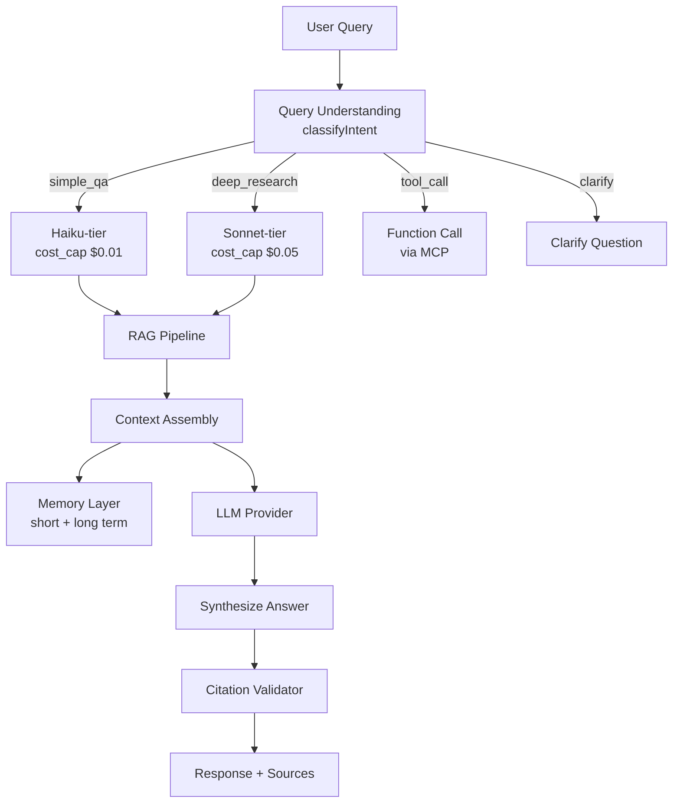
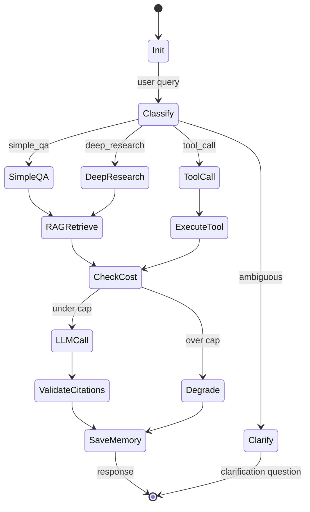

# Epic 03: Ask Agent

**Epic ID**: 03
**Module name**: Ask Agent (natural language Q&A Agent)
**Priority order**: 3 (the "2" position in B3)
**Document nature tags**: [A] + [B] + [C]
**Spec template**: to-spec
**Last updated**: 2026-07-19

---

## 1. Problem Statement

### 1.1 User-perspective Problem [B]

When Prosumer Brenda asks "How are NVDA's recent earnings, and what do analysts think?":

- **Data silos**: She views prices on Yahoo, earnings on SEC, sentiment on StockTwits, research on Bloomberg — each site requires re-entering the ticker, re-reading, and self-integrating conclusions.
- **Latency and rate limiting**: Free market data APIs have severe rate limits (Alpha Vantage 25 requests/day). A simple "next-day price change for all earnings days over the past 5 years" analysis took 3 hours due to rate limiting.
- **AI hallucination risk**: General ChatGPT answers to financial questions often produce "2024 Q4 NVDA revenue $XXX billion" — but NVDA's fiscal year is not the calendar year, Q4 is actually released in January, and the hallucination directly misleads decisions.
- **No citations**: General LLMs don't tell you "where this number comes from" — impossible to trace and verify.
- **No memory**: Each new conversation requires re-introducing "I'm a Prosumer, focused on tech stocks, watching NVDA because I hold a position".

### 1.2 Engineering-perspective Problem [B]

- **Multi-model routing**: Simple QA uses Haiku-tier to save Credits, deep research uses Sonnet-tier for quality; user's refined decision "local LM Studio, Cloudflare Volcengine Ark"
- **Scattered RAG sources**: K-lines in Epic 02, earnings in SEC EDGAR, news in RSS, macro in FRED — Ask Agent needs unified retrieval
- **Citations and anti-hallucination**: Each answer must come with source citations, numeric fields must be extracted from structured data (LLM cannot freelance)
- **Multi-turn memory**: Short-term session memory (current conversation) + long-term user profile (position preferences/risk preferences)
- **MCP + Function Call**: External tools go through MCP (e.g. future broker API integration), internal tools go through native function call

### 1.3 Competitor Status Analysis [A]

Competitor Ask Agent currently presents [INFERRED]:
- RAG-based earnings Q&A
- Limited multi-turn conversation capability
- Price/earnings as primary data sources
- Citation annotation exists but is not strict

**Core differentiating features of this Epic [C]**:
- Explicit multi-model routing (cost controllable)
- Strict citations (every numeric field annotated with source)
- User profile persistence (cross-session memory)
- Mock/Real dual mode (demo reproducible)

---

## 2. Solution

### 2.1 Overall Architecture [B]



### 2.2 LLM Routing Strategy [B] - **Key Decision**

> **Note (revised 2026-07-19)**: The original `env_mode = USE_MOCK === "true" ? "local" : "cloud"` is inconsistent with ADR-0003.
> ADR-0003 adopts a 3-tier model: `USE_MOCK` controls Mock/Real switching; `ENVIRONMENT` controls local/cloud switching.
> Aligned with ADR-0003. See [ADR-0003](../../architecture/adr-0003-llm-routing-cost-cap.md).

**User refined decision**: "Local runtime connects to LM Studio, after Cloudflare deployment connects to Volcengine Ark"

```typescript
// src/lib/llm/router.ts
interface LLMRouter {
  route(query: ClassifiedQuery): LLMProvider;
}

const ROUTING_RULES = {
  simple_qa: {        // "How much is AAPL right now"
    local:  { provider: "lmstudio",  model: "qwen2.5-7b-instruct",  max_tokens: 500,  cost_cap: 0 },
    cloud:  { provider: "ark",       model: "doubao-lite-4k",      max_tokens: 500,  cost_cap: 0.001 },
  },
  deep_research: {    // "Analyze NVDA's earnings trend over the past 3 years"
    local:  { provider: "lmstudio",  model: "qwen2.5-32b-instruct", max_tokens: 4000, cost_cap: 0 },
    cloud:  { provider: "ark",       model: "doubao-pro-32k",     max_tokens: 4000, cost_cap: 0.05 },
  },
  tool_call: {        // "Use yfinance to look up AAPL earnings"
    local:  { provider: "lmstudio",  model: "qwen2.5-7b-instruct",  max_tokens: 800,  cost_cap: 0 },
    cloud:  { provider: "ark",       model: "doubao-pro-32k",     max_tokens: 800,  cost_cap: 0.01 },
  },
  clarify: {          // Fallback when the main model can't classify (original field name `fallback` unified as `clarify` per ADR-0003)
    local:  { provider: "lmstudio",  model: "qwen2.5-7b-instruct",  max_tokens: 200,  cost_cap: 0 },
    cloud:  { provider: "ark",       model: "doubao-lite-4k",      max_tokens: 200,  cost_cap: 0.0005 },
  }
};

// 3-tier routing per ADR-0003:
//   1. USE_MOCK=true                       -> MockLLM (zero API calls)
//   2. USE_MOCK=false + ENVIRONMENT!="production" -> RealLLM with LM Studio (local)
//   3. USE_MOCK=false + ENVIRONMENT="production"  -> RealLLM with Volcengine Ark (cloud)
function route(query: ClassifiedQuery, env: Env): LLMConfig {
  if (env.USE_MOCK === "true") {
    return { provider: "mock", model: "mock-qa-sample", max_tokens: 0, cost_cap: 0 };
  }
  const env_mode = env.ENVIRONMENT === "production" ? "cloud" : "local";
  return ROUTING_RULES[query.intent][env_mode];
}
```

### 2.3 Citations and Anti-Hallucination [B] - **Key Decision**

> **Note (revised 2026-07-19)**: This section's forced citation mode + anti-hallucination contract has been formally standardized by [ADR-0007](../../architecture/adr-0007-citation-validator.md) §Decision.
> ADR-0007 defines a 3-stage validation pipeline (structural + quote substring + async URL check) + 2 failure modes (Partial strip default + Strict reject fallback). The `Citation.source` enum has been expanded to 6 values (original 4 + `playbook` + `user_note`) to cover all 5 retrieval sources of EP03 §2.4 RAG Pipeline.
> See `validateCitations()` function signature in ADR-0007 §Key Interfaces.

**Forced Citation mode**: All numeric fields must be extracted from structured data; the LLM is not allowed to freely generate them.

```typescript
// src/lib/ask/citation.ts
interface AnswerWithCitations {
  text: string;
  citations: Citation[];
  numeric_facts: NumericFact[];  // numeric fields
}

interface Citation {
  // Extended per ADR-0007 to cover all 5 RAG pipeline sources (EP03 §2.4):
  //   sec_edgar / yahoo / fred / news (original 4) + playbook / user_note (added)
  source: "sec_edgar" | "yahoo" | "fred" | "news" | "playbook" | "user_note";
  url: string;
  accessed_at: string;
  quote: string;  // original excerpt
}

interface NumericFact {
  value: number;
  unit: string;       // "USD", "ratio", "percent"
  source: Citation;
  confidence: number; // 0-1
}

// LLM Prompt template forces structured output
const ANSWER_PROMPT = `
You are a financial analyst assistant. Answer the user's question.

RULES:
1. Every numeric value MUST come from the provided context (RAG results).
2. Do NOT fabricate numbers.
3. If you don't have data, say "I don't have current data for X."
4. For every claim, cite the source using [source_name] format.

CONTEXT:
{rag_context}

USER QUESTION:
{user_question}

RESPONSE FORMAT (JSON):
{
  "summary": "...",
  "numeric_facts": [
    { "value": 123.4, "unit": "USD", "source": "yahoo", "quote": "..." }
  ],
  "citations": [
    { "source": "yahoo", "url": "...", "quote": "..." }
  ],
  "confidence": 0.85
}
`;
```

### 2.4 RAG Pipeline [B]

```typescript
// src/lib/ask/rag.ts
class AskRAGPipeline {
  // 1. Query vectorization
  async embed(query: string): Promise<number[]> {
    // Mock mode: return fixed vector
    // Real mode: call Cloudflare Vectorize or Volcengine embedding
  }

  // 2. Multi-source retrieval
  async retrieve(queryEmb: number[], topK = 5): Promise<RAGResult[]> {
    const sources = [
      this.searchKlinesMetadata(queryEmb),    // Epic 02 data
      this.searchEarnings(queryEmb),            // SEC EDGAR
      this.searchNews(queryEmb),               // News RSS
      this.searchPlaybooks(queryEmb),          // Epic 08 Playbook
      this.searchUserNotes(queryEmb, userId),  // User notes
    ];
    return mergeAndRank(sources, topK);
  }

  // 3. Context assembly
  assemble(results: RAGResult[]): string {
    return results.map(r => `[${r.source}] ${r.content}`).join("\n---\n");
  }
}
```

### 2.5 Memory Layer [B]

> **Note (revised 2026-07-19)**: This section's memory layer architecture has been formally standardized by [ADR-0005](../../architecture/adr-0005-memory-layer.md) §Decision.
> ADR-0005 defines the `MemoryRef` type (consumed by ADR-0004 `LoopContext.memory_ref`) + `MemoryStore` interface (factory: MockMemoryStore / RealMemoryStore).
> Loading strategy: short_term Message[] eager load + user_profile UserPref lazy load + vector_ref deferred (Phase 1.5).
> Mock mode: in-memory Map + seeded JSON (`web/public/mock/user_profile.json`), zero KV/D1 calls (FP-0005).
> Pronoun resolution: LLM prompt includes short_term history messages; LLM handles coreference on its own (no standalone NLP module).
> The `ShortTermMemory` interface and D1 schema below are retained for historical reference; the canonical implementation follows ADR-0005 §Key Interfaces.

**Short-term memory** (within session, KV storage):

```typescript
interface ShortTermMemory {
  sessionId: string;
  messages: Message[];
  context_window: 4096; // tokens
  last_topic?: string;  // "NVDA earnings"
}
```

**Long-term memory** (D1 persistence, user profile):

> **Note (revised 2026-07-19)**: The `user_profiles.holdings` JSON column has been removed per [ADR-0011](../../architecture/adr-0011-d1-schema-master.md).
> User positions are owned by the EP06 `positions` table as the canonical source. Ask Agent reads positions via SQL JOIN, no longer reads `user_profiles.holdings`.

```sql
CREATE TABLE user_profiles (
  user_id      TEXT PRIMARY KEY,           -- FK to users(id) per ADR-0011
  risk_tolerance TEXT,           -- conservative/moderate/aggressive
  sectors       TEXT,            -- JSON array: ["tech", "healthcare"]
  -- holdings column REMOVED per ADR-0011 - use EP06 positions table
  preferred_sources TEXT,        -- ["yahoo", "sec_edgar"]
  created_at    TEXT,
  updated_at    TEXT
);

CREATE TABLE conversation_history (
  id           INTEGER PRIMARY KEY AUTOINCREMENT,
  user_id      TEXT NOT NULL,               -- FK to users(id) per ADR-0011
  session_id   TEXT NOT NULL,
  role         TEXT NOT NULL,    -- user/assistant
  content      TEXT,
  metadata     TEXT,             -- JSON: {intent, citations, cost, trace_id}
  created_at   TEXT DEFAULT (datetime('now'))
);

CREATE INDEX idx_conv_user_session ON conversation_history(user_id, session_id);
```

### 2.6 MCP and Function Call Protocol [B]

> **Note (revised 2026-07-19)**: This section's tool protocol has been formally standardized by [ADR-0006](../../architecture/adr-0006-tool-protocol.md) §Decision.
> ADR-0006 defines `ToolCall`/`ToolResult`/`ToolHandler` interfaces + `TOOL_REGISTRY` static registry (9 Phase 1 native tools).
> **C6 conflict resolution**: Original `get_current_price` unified as `get_quote` (per EP01 §ID-2 authoritative tool table).
> **`search_news` classification**: Phase 1 is native (per this section's INTERNAL_TOOLS), overriding EP01 §ID-2's MCP classification. Phase 2 may upgrade to MCP.
> **Phase 1 scope**: 9/10 EP01 §ID-2 tools are native; `get_sentiment` deferred to Phase 2 MCP. `MCP_SERVERS` (brokerage + playbook_hub) deferred to Phase 2.
> The INTERNAL_TOOLS + MCP_SERVERS below are retained for historical reference; the canonical implementation follows ADR-0006 §Key Interfaces.

```typescript
// Internal tools (native function call)
// NOTE: get_current_price renamed to get_quote per ADR-0006 (C6 conflict resolution)
const INTERNAL_TOOLS = [
  {
    name: "get_quote",  // was: get_current_price
    description: "Get current price quote for a stock ticker",
    parameters: { type: "object", properties: { ticker: { type: "string" } } }
  },
  {
    name: "get_earnings",
    description: "Get latest earnings report for a ticker",
    parameters: { type: "object", properties: { ticker: { type: "string" }, period: { type: "string" } } }
  },
  {
    name: "search_news",
    description: "Search recent news for a ticker",
    parameters: { type: "object", properties: { ticker: { type: "string" }, days: { type: "number" } } }
  }
];

// External tools (MCP protocol, enabled in Phase 2)
const MCP_SERVERS = [
  { name: "brokerage", url: "mock://brokerage-mcp", tools: ["place_order", "get_positions"] },
  { name: "playbook_hub", url: "mock://playbooks-mcp", tools: ["search_playbooks", "install"] }
];
```

### 2.7 Ask Agent Loop (state machine) [B]

> **Note (revised 2026-07-19)**: This section's Ask Agent state machine is based on the generic `AgentLoop` implementation in [ADR-0004](../../architecture/adr-0004-agent-loop-design.md).
> ADR-0004 provides a 6-state generic loop (Init/Plan/Execute/ToolCall/Synthesize/FinalAnswer + CostExceeded/Aborted). Ask Agent injects Ask-specific behavior by implementing the `StepHandler` interface (6 methods: onInit/onPlan/onExecute/onToolCall/onSynthesize/onFinalize):
> - `onExecute` implements Classify + RAGRetrieve
> - `onSynthesize` implements LLMCall + ValidateCitations
> - `onFinalize` implements SaveMemory
>
> The state machine below is the business flow diagram from the Ask Agent's perspective; actual control flow is unified by ADR-0004 §State Machine.



---

## 3. User Stories

### Job Stories [B]

1. **When** Brenda asks "NVDA current price", **I want to** get an answer with citations within 2 seconds, **so that** she doesn't have to open Yahoo Finance.
2. **When** Brenda asks "Analyze AAPL's revenue growth over the past 3 years", **I want to** the system to automatically retrieve 3 years of earnings from SEC EDGAR and synthesize an answer, **so that** she doesn't have to manually search SEC.
3. **When** Brenda asks "What about its EPS?" in the second turn, **I want to** Ask Agent to know "it" refers to AAPL, **so that** she doesn't have to re-enter the ticker.
4. **When** Brenda asks "Analyze my next-quarter risk based on my positions", **I want to** Ask Agent to read Brenda's positions from long-term memory, **so that** it gives personalized advice.
5. **When** Ask Agent doesn't have a number (e.g. future earnings forecast), **I want to** the system to explicitly say "I don't have this data", **so that** it doesn't hallucinate wrong info.
6. **When** Brenda asks a question requiring real-time data, **I want to** Ask Agent to call `get_current_price` via function call, **so that** the answer is the latest value, not training data.
7. **When** Brenda switches to Mock mode, **I want to** Ask Agent to return preset Q&A samples immediately, **so that** the demo is smooth.
8. **When** Brenda sees "3 citations" under the answer, **I want to** click any citation to jump to the original text, **so that** she can verify.

### As-a Stories [B]

1. As a Prosumer, I want to ask any financial question in natural language, so that I don't need to learn complex query syntax.
2. As a Prosumer, I want to see source annotations for each numeric field, so that I can judge credibility.
3. As a Prosumer, I want multi-turn conversations to preserve context, so that I don't need to repeat background.
4. As a Developer, I want to make Ask Agent return preset samples via `USE_MOCK=true`, so that local demos have zero dependencies.
5. As an Interviewer, I want to see Ask Agent's LLM routing config, so that I can evaluate the candidate's cost-control ability.
6. As a Free-tier User, I want to get a degraded answer (shorter/fewer citations) even when Credit quota is exceeded, so that I'm not completely stuck.
7. As a Prosumer, I want my conversation history preserved long-term (encrypted storage), so that context is preserved across sessions.
8. As a Prosumer, I want to see "this answer consumed 0.05 Credit", so that I know the cost.

### BDD Gherkin [B]

```gherkin
Feature: Ask Agent citations and anti-hallucination

  Scenario: Simple QA goes through Haiku routing
    Given user asks "How much is AAPL right now"
    When Ask Agent classifies as simple_qa
    Then route to Haiku-tier model
    And cost_cap = $0.01
    And max_tokens = 500

  Scenario: Deep research goes through Sonnet routing
    Given user asks "Analyze NVDA's earnings trend over the past 3 years"
    When Ask Agent classifies as deep_research
    Then route to Sonnet-tier model
    And cost_cap = $0.05
    And max_tokens = 4000

  Scenario: Numeric fields must be extracted from RAG
    Given RAG context contains NVDA revenue = $22.10B
    When LLM generates answer
    Then "$22.10B" in the answer must be in the numeric_facts array
    And that number's citation.source = "sec_edgar"
    And confidence > 0.8

  Scenario: Anti-hallucination
    Given RAG context does not contain NVDA 2026 Q4 revenue data
    When user asks "What is NVDA 2026 Q4 revenue"
    Then the answer must include "I don't have current data for NVDA 2026 Q4 revenue"
    And no specific numbers are allowed

  Scenario: Mock mode returns immediately
    Given USE_MOCK=true
    And mock_data/qa_samples/aapl_price.json exists
    When user asks "How much is AAPL right now"
    Then directly return mock_data/qa_samples/aapl_price.json
    And do not call any LLM API

  Scenario: Cross-session long-term memory
    Given Brenda mentioned "I hold 100 shares of NVDA" in a prior conversation
    When Brenda starts a new conversation asking "Analyze risk based on my positions"
    Then Ask Agent reads Brenda's positions from user_profiles = {NVDA: 100}
    And personalizes the analysis

  Scenario: Cost over-limit degradation
    Given this answer's estimated cost > user's remaining Credit
    When Ask Agent checks cost
    Then degrade to a cheaper model
    And return a shorter answer + prompt "Saved Credit for you"
```

---

## 4. Implementation Decisions

### ID-1: Intent Classifier [B]

```typescript
type QueryIntent = "simple_qa" | "deep_research" | "tool_call" | "clarify";

function classifyIntent(query: string): QueryIntent {
  // Simple heuristics (Phase 1 doesn't use LLM classification, saves cost)
  if (/^\s*(?:current|now)\s*(?:price|stock price|how much)/.test(query)) return "simple_qa";
  if (/analyze|research|compare|trend/.test(query)) return "deep_research";
  if (/lookup|call|search/.test(query)) return "tool_call";
  return "clarify";
}
```

### ID-2: Cost Budget Control [B]

```typescript
class CostBudget {
  constructor(private cap: number, private spent = 0) {}
  canSpend(estimated: number): boolean { return this.spent + estimated <= this.cap; }
  spend(amount: number) { this.spent += amount; }
  remaining() { return this.cap - this.spent; }
}
```

### ID-3: Citation Validator [B]

> **Note (revised 2026-07-19)**: This section's `validateCitations()` stub has been formally standardized by [ADR-0007](../../architecture/adr-0007-citation-validator.md) §Key Interfaces.
> ADR-0007 expands the function signature to `validateCitations(answer, ragContext, env) -> ValidationResult`, returning `verified_facts` / `stripped_facts` / `url_pending_facts` / `validation_status` / `disclaimer` / `failures`.
> The stub's 3 checks have been refactored into a 3-stage pipeline: Stage 1 structural (every numeric_fact has a non-empty source + 6-field validation) + Stage 2 quote_substring (exact match in ragContext) + Stage 3 url_reachability (async, Cloud only).
> Failure modes: Partial strip (default, keeps verified facts + adds disclaimer) + Strict reject fallback (when all fail, returns "I don't have reliable data").
> Loop integration: `StepHandler.onSynthesize` calls the validator, then transitions to `onFinalize` (no LLM retry).

```typescript
// Stub retained for historical reference. Canonical implementation per ADR-0007.
// function validateCitations(answer: AnswerWithCitations): ValidationResult {
//   // 1. Every numeric field must correspond to a citation
//   for (const fact of answer.numeric_facts) {
//     if (!fact.source) return { valid: false, reason: `Missing source for ${fact.value}` };
//   }
//   // 2. Check citation URL reachability (skip in Mock mode)
//   // 3. Check that the quote field actually appears in the RAG context
//   return { valid: true };
// }
```

### ID-4: Multi-model Degradation Chain [B]

```
Primary: Sonnet-tier (cost $0.05/query)
  └─ Fallback: Haiku-tier (cost $0.001/query)
       └─ Fallback: Mock answer (cost $0)
```

### ID-5: Prompt Template Versioning [B]

Prompts are stored in the `src/prompts/ask/` directory, version-controlled:
- `v1_simple_qa.md`
- `v1_deep_research.md`
- `v1_clarify.md`

Modifying a prompt must create a new version; old versions are not modified (ensures reproducibility).

### ID-6: Mock Q&A Sample Format [B]

```json
{
  "$schema": "https://nova-invest.dev/schemas/qa_sample.json",
  "query_signature": "current_price_aapl",
  "query_pattern": "AAPL current price|AAPL how much now|AAPL price",
  "response": {
    "summary": "AAPL's current price is $187.31 (as of 2025-12-15 close).",
    "numeric_facts": [
      { "value": 187.31, "unit": "USD", "source": "yahoo",
        "quote": "AAPL Close 187.31 2025-12-15", "confidence": 0.95 }
    ],
    "citations": [
      { "source": "yahoo", "url": "https://finance.yahoo.com/quote/AAPL",
        "quote": "AAPL Close 187.31 2025-12-15" }
    ],
    "confidence": 0.95
  }
}
```

### ID-7: Worker Entry Point [B]

```typescript
// src/workers/ask.ts
export default {
  async fetch(req: Request, env: Env): Promise<Response> {
    const { query, sessionId, userId } = await req.json();
    const provider = getProvider(env);
    const llm = getLLMRouter(env);
    const agent = new AskAgent(provider, llm, env);

    const response = await agent.run({ query, sessionId, userId });
    return Response.json(response);
  }
};
```

---

## 5. Testing Decisions

### 5.1 Test Seams Table [B]

| Seam | Type | Test content |
|---|---|---|
| TS-1 | Unit | `classifyIntent()` classification accuracy |
| TS-2 | Unit | `CostBudget.canSpend()` boundary conditions |
| TS-3 | Unit | `validateCitations()` detects hallucinations |
| TS-4 | Integration | LLM routing switches Local/Cloud based on USE_MOCK |
| TS-5 | Contract | Mock Q&A sample format matches real LLM output structure |
| TS-6 | E2E | Complete Q&A flow: query → RAG → LLM → citation validation → response |

### 5.2 Golden Set [B]

```typescript
// tests/golden/ask_agent.golden.test.ts
const GOLDEN_QUERIES = [
  { query: "How much is AAPL right now", expected_intent: "simple_qa", expected_citations: 1 },
  { query: "Analyze NVDA's earnings over the past 3 years", expected_intent: "deep_research", expected_citations: 3 },
  { query: "Look up TSLA recent news", expected_intent: "tool_call", expected_citations: 1 },
  { query: "What do you think I should do", expected_intent: "clarify", expected_citations: 0 }
];

describe("Ask Agent Golden Set", () => {
  for (const gq of GOLDEN_QUERIES) {
    it(`classify ${gq.query} as ${gq.expected_intent}`, async () => {
      const result = await askAgent.run(gq.query);
      expect(result.intent).toBe(gq.expected_intent);
      expect(result.citations.length).toBeGreaterThanOrEqual(gq.expected_citations);
    });
  }
});
```

### 5.3 Test Strategy [B]

- **Unit**: pure functions (classifier, Cost Budget, Citation Validator)
- **Contract**: Mock-mode Q&A samples match real LLM output schema
- **E2E**: use Miniflare to run the full Worker flow
- **Not tested**: LLM real availability (external dependency)

---

## 6. Out of Scope

### 6.1 Module-level Non-Goals [B]

- **Real-time push notifications**: consider in Phase 2
- **Multi-language support**: Phase 1 only Chinese/English
- **Voice input**: Phase 2
- **Chart generation**: belongs to Epic 05 Dashboard
- **Auto strategy generation**: belongs to Epic 04 Strategy DSL (BuildAgent)
- **Auto order placement**: belongs to Epic 06 Broker
- **Research report PDF parsing**: consider in Phase 2 (only SEC EDGAR XBRL)
- **Community Q&A UGC**: belongs to Epic 07 Share & Community

### 6.2 Module-level Anti-Patterns [B]

- ❌ **LLM freely generates numbers**: all numbers must be extracted from RAG with citations
- ❌ **Answers without citations**: must return a citations array (return even if empty)
- ❌ **Cross-user long-term memory sharing**: user profiles strictly isolated
- ❌ **Calling LLM after exceeding cost_cap**: must degrade when over limit
- ❌ **Synchronously waiting for LLM to complete before returning**: >5s must stream
- ❌ **Directly exposing raw prompts**: all prompts go through versioned encapsulation

---

## 7. Further Notes

### 7.1 References [KNOWN]

- Claude API function calling: https://docs.anthropic.com/en/docs/build-with-claude/tool-use
- Volcengine Ark: https://www.volcengine.com/docs/82379
- LM Studio local API: https://lmstudio.ai/docs/api-reference
- Cloudflare Workers AI: https://developers.cloudflare.com/workers-ai/
- MCP spec: https://modelcontextprotocol.io/

### 7.2 Open Questions [B]

- Q1: Need to support chart embedding in answers? → Phase 2
- Q2: Need a user feedback loop (thumbs up/down)? → Phase 1.5 (lightweight)

### 7.3 Dependencies [B]

- **Upstream**: Epic 01 AgentHarness (Worker runtime), Epic 02 DataLayer (RAG data source)
- **Downstream**: Epic 05 Dashboard (frontend display), Epic 07 Share (share conversation snippets)

---

## 8. Acceptance Criteria

- [ ] `classifyIntent()` implemented and passes Golden Set
- [ ] `LLMRouter` implements local/cloud dual-mode switching
- [ ] `AskRAGPipeline` implements multi-source retrieval merge
- [ ] `validateCitations()` detects numeric-field hallucinations
- [ ] Prompt templates v1 versioned directory structure
- [ ] Mock Q&A samples ≥ 20 entries covering 4 intents
- [ ] Short-term memory (KV) + long-term memory (D1) persistence
- [ ] Cost Budget control implemented
- [ ] Multi-model degradation chain: Sonnet → Haiku → Mock
- [ ] MCP tool protocol placeholder (enabled in Phase 2)
- [ ] Streaming response (SSE when >5s)
- [ ] Each answer contains a citations array (even if empty)
- [ ] Mock mode makes zero LLM API calls

---

## 9. Version History

| Version | Date | Change |
|---|---|---|
| 0.1 | 2026-07-19 | Initial draft, including LLM routing, citation validation, memory layer, Mock Q&A samples |
