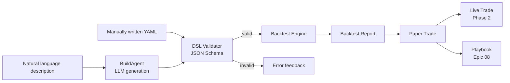
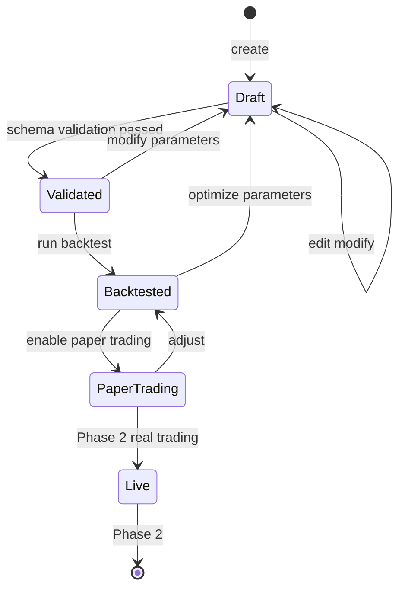

# Epic 04: Strategy DSL

**Epic ID**: 04
**Module name**: Strategy DSL (Strategy Domain-Specific Language)
**Priority order**: 4 (the "3" position in B3)
**Document nature tags**: [A] + [B] + [C]
**Spec template**: to-spec
**Last updated**: 2026-07-19

---

## 1. Problem Statement

### 1.1 User-perspective Problem [B]

When Prosumer Brenda wants to express "buy 10% position when NVDA's 50-day MA crosses above the 200-day MA, stop loss at 7% break below":

- **High code barrier**: Existing quantitative platforms (Quantopian shut down / WorldQuant Brain steep learning curve / Alpaca requires Python) all require her to write code
- **Natural language ambiguity**: Describing a strategy with ChatGPT cannot be directly executed ("buy some" is how much? "rose a lot" is what threshold?)
- **Untrustworthy backtests**: Existing AI-generated strategies often overfit (in-sample perfect, out-of-sample crash); users can't judge
- **Not composable**: She has 5 strategies she wants to combine and execute, but each platform's strategy format is closed
- **Cannot share/reuse**: Well-written strategies are hard to share with friends

### 1.2 Engineering-perspective Problem [B]

- **DSL design tradeoffs**: YAML (human-readable) vs JSON (machine-friendly) vs Python (powerful but high barrier) — user decision "custom YAML/JSON"
- **Validation strictness**: DSL must complete schema validation before execution, avoiding runtime crashes
- **Backtest engine data needs**: User explicitly stated "the backtest engine needs to use Mockup data" — must align with Epic 02 Mock K-line set
- **Playbook-ization**: DSL must be serializable to Playbook (Epic 08), shareable and composable
- **State machine**: Strategy lifecycle: draft → validated → backtested → paper → live

### 1.3 Competitor Status Analysis [A]

Competitor capabilities at the strategy layer [INFERRED]:
- Natural language → simple strategies (limited to single ticker, single condition)
- Built-in backtest (but data source opaque)
- Cannot export/share DSL

**Core differentiating features of this Epic [C]**:
- Explicit YAML DSL (human-readable and editable)
- Complete lifecycle state machine
- Transparent backtest data (annotated source + time range)
- Playbook-ization (shareable and composable)

---

## 2. Solution

### 2.1 Overall Architecture [B]



### 2.2 DSL Design [B] - **Key Decision**

**User decision**: Custom YAML/JSON DSL

**DSL Schema (YAML form)**:

```yaml
# nova-invest Strategy DSL v1
version: "1.0"
metadata:
  name: "NVDA Golden Cross / Death Cross Strategy"
  author: "brenda@example.com"
  description: "Buy on 50/200-day MA golden cross, sell on death cross"
  created_at: "2025-12-15"

universe:
  type: "single"  # single / multi / index
  symbols: ["NVDA"]

schedule:
  frequency: "daily"  # daily / hourly / on_event
  timezone: "America/New_York"

data:
  source: "mock"  # mock / yahoo / alpha / polygon
  timeframe: "1d"
  lookback_days: 250

indicators:
  - name: "sma_50"
    type: "SMA"
    params: { period: 50, field: "close" }
  - name: "sma_200"
    type: "SMA"
    params: { period: 200, field: "close" }

signals:
  entry:
    condition: "sma_50 > sma_200"
    operator: "crossover"  # crossover / crossunder / gt / lt
  exit:
    condition: "sma_50 < sma_200"
    operator: "crossunder"

position_sizing:
  method: "percent_equity"  # percent_equity / fixed_amount / kelly
  params: { percent: 10 }

risk_management:
  stop_loss: { type: "percent", value: 7 }
  take_profit: { type: "percent", value: 20 }
  max_positions: 5
  max_drawdown: 15  # percent

execution:
  order_type: "market"  # market / limit
  slippage_bps: 5
  commission_bps: 1

backtest:
  start_date: "2024-01-01"
  end_date: "2025-12-31"
  initial_capital: 100000
  benchmark: "SPY"
```

### 2.3 DSL JSON Schema (for validation) [B]

```json
{
  "$schema": "http://json-schema.org/draft-07/schema#",
  "title": "NovaInvest Strategy DSL v1",
  "type": "object",
  "required": ["version", "universe", "signals", "position_sizing"],
  "properties": {
    "version": { "type": "string", "enum": ["1.0"] },
    "universe": {
      "type": "object",
      "required": ["type", "symbols"],
      "properties": {
        "type": { "enum": ["single", "multi", "index"] },
        "symbols": { "type": "array", "items": { "type": "string" }, "minItems": 1 }
      }
    },
    "indicators": {
      "type": "array",
      "items": {
        "type": "object",
        "required": ["name", "type", "params"],
        "properties": {
          "name": { "type": "string" },
          "type": { "enum": ["SMA", "EMA", "RSI", "MACD", "Bollinger", "ATR"] },
          "params": { "type": "object" }
        }
      }
    },
    "signals": {
      "type": "object",
      "required": ["entry"],
      "properties": {
        "entry": { "$ref": "#/definitions/condition" },
        "exit": { "$ref": "#/definitions/condition" }
      }
    },
    "position_sizing": {
      "type": "object",
      "required": ["method", "params"],
      "properties": {
        "method": { "enum": ["percent_equity", "fixed_amount", "kelly"] },
        "params": { "type": "object" }
      }
    }
  },
  "definitions": {
    "condition": {
      "type": "object",
      "required": ["condition", "operator"],
      "properties": {
        "condition": { "type": "string" },
        "operator": { "enum": ["crossover", "crossunder", "gt", "lt", "eq"] }
      }
    }
  }
}
```

### 2.4 Strategy Lifecycle State Machine [B]



### 2.5 Backtest Engine [B] - **Key Decision**

**User decision**: "Open-source core + in-house extensions, data via free API (not stored locally) + needs to use Mockup data"

**Design**:

```typescript
// src/lib/backtest/engine.ts
interface BacktestConfig {
  strategy: StrategyDSL;
  start_date: Date;
  end_date: Date;
  initial_capital: number;
  benchmark: string;  // "SPY"
  data_source: "mock" | "real";
}

interface BacktestResult {
  trades: Trade[];
  equity_curve: { date: string; equity: number }[];
  metrics: {
    total_return: number;
    cagr: number;
    sharpe_ratio: number;
    max_drawdown: number;
    win_rate: number;
    profit_factor: number;
    sortino_ratio: number;
    calmar_ratio: number;
  };
  benchmark_return: number;
  alpha: number;
  beta: number;
}

class BacktestEngine {
  async run(config: BacktestConfig): Promise<BacktestResult> {
    // 1. Load strategy
    const strategy = await this.validate(config.strategy);
    // 2. Load data (Mock or real)
    const data = await this.loadData(strategy.universe.symbols,
      config.start_date, config.end_date, config.data_source);
    // 3. Compute indicators
    const indicators = this.computeIndicators(data, strategy.indicators);
    // 4. Generate signals
    const signals = this.generateSignals(data, indicators, strategy.signals);
    // 5. Simulate trades
    const trades = this.simulateTrades(signals, strategy.position_sizing,
                                       strategy.risk_management);
    // 6. Compute equity curve
    const equity = this.computeEquityCurve(trades, config.initial_capital);
    // 7. Compute metrics
    const metrics = this.computeMetrics(equity, trades);
    // 8. Compute benchmark
    const bench = await this.loadBenchmark(config.benchmark,
      config.start_date, config.end_date, config.data_source);
    return { trades, equity_curve: equity, metrics,
             benchmark_return: bench.return, alpha: ..., beta: ... };
  }
}
```

**Backtest anti-overfitting mechanisms**:

1. **In-sample/out-of-sample split**: default 70/30 split, in-sample optimization, out-of-sample validation
2. **Walk-forward**: Phase 2 implementation, Phase 1 only fixed window
3. **Multi-period**: support 1d / 1h / 5m multi-period consistency

### 2.6 Built-in Indicator Library [B]

```typescript
const INDICATOR_LIBRARY = {
  // Trend
  SMA:   (data, period) => simpleMovingAverage(data, period),
  EMA:   (data, period) => exponentialMovingAverage(data, period),
  MACD:  (data, fast, slow, signal) => macd(data, fast, slow, signal),
  // Oscillator
  RSI:   (data, period) => relativeStrengthIndex(data, period),
  Stochastic: (data, kPeriod, dPeriod) => stochastic(data, kPeriod, dPeriod),
  // Volatility
  Bollinger: (data, period, stdDev) => bollingerBands(data, period, stdDev),
  ATR:   (data, period) => averageTrueRange(data, period),
  // Volume
  OBV:   (data) => onBalanceVolume(data),
  VWAP:  (data) => volumeWeightedAveragePrice(data),
};
```

### 2.7 Signal Expression Syntax [B]

Supports simple expressions:

```yaml
signals:
  entry:
    condition: "sma_50 > sma_200 AND rsi_14 < 30"
    operator: "crossover"
  exit:
    condition: "sma_50 < sma_200 OR rsi_14 > 70"
    operator: "crossunder"
```

**Expression parser** (based on jsep):

```typescript
function evaluateCondition(expr: string, indicators: Record<string, number>): boolean {
  // Supports AND / OR / NOT / > / < / = / != operators
  const ast = jsep(expr);
  return walkAST(ast, indicators);
}
```

### 2.8 DSL Examples (3 complete strategies) [B]

**Example 1: Dual-MA Golden Cross Strategy**

```yaml
version: "1.0"
metadata: { name: "MA Cross", description: "50/200 SMA crossover" }
universe: { type: "single", symbols: ["AAPL"] }
schedule: { frequency: "daily" }
data: { source: "mock", timeframe: "1d", lookback_days: 250 }
indicators:
  - { name: "sma_50",  type: "SMA", params: { period: 50, field: "close" } }
  - { name: "sma_200", type: "SMA", params: { period: 200, field: "close" } }
signals:
  entry: { condition: "sma_50 > sma_200", operator: "crossover" }
  exit:  { condition: "sma_50 < sma_200", operator: "crossunder" }
position_sizing: { method: "percent_equity", params: { percent: 10 } }
risk_management:
  stop_loss: { type: "percent", value: 7 }
  take_profit: { type: "percent", value: 20 }
  max_positions: 5
  max_drawdown: 15
execution: { order_type: "market", slippage_bps: 5, commission_bps: 1 }
backtest: { start_date: "2024-01-01", end_date: "2025-12-31",
            initial_capital: 100000, benchmark: "SPY" }
```

**Example 2: RSI Oversold Bounce Strategy**

```yaml
version: "1.0"
metadata: { name: "RSI Oversold", description: "Buy when RSI < 30" }
universe: { type: "single", symbols: ["NVDA"] }
schedule: { frequency: "daily" }
data: { source: "mock", timeframe: "1d", lookback_days: 100 }
indicators:
  - { name: "rsi_14", type: "RSI", params: { period: 14 } }
signals:
  entry: { condition: "rsi_14 < 30", operator: "lt" }
  exit:  { condition: "rsi_14 > 70", operator: "gt" }
position_sizing: { method: "percent_equity", params: { percent: 5 } }
risk_management:
  stop_loss: { type: "percent", value: 5 }
  take_profit: { type: "percent", value: 15 }
  max_positions: 3
  max_drawdown: 10
execution: { order_type: "market", slippage_bps: 5, commission_bps: 1 }
backtest: { start_date: "2024-01-01", end_date: "2025-12-31",
            initial_capital: 100000, benchmark: "SPY" }
```

**Example 3: Bollinger Breakout Strategy**

```yaml
version: "1.0"
metadata: { name: "Bollinger Breakout" }
universe: { type: "single", symbols: ["TSLA"] }
schedule: { frequency: "daily" }
data: { source: "mock", timeframe: "1d", lookback_days: 200 }
indicators:
  - { name: "bb", type: "Bollinger", params: { period: 20, stdDev: 2 } }
signals:
  entry: { condition: "close > bb.upper", operator: "gt" }
  exit:  { condition: "close < bb.middle", operator: "lt" }
position_sizing: { method: "percent_equity", params: { percent: 8 } }
risk_management:
  stop_loss: { type: "percent", value: 5 }
  max_positions: 5
  max_drawdown: 12
execution: { order_type: "market", slippage_bps: 5, commission_bps: 1 }
backtest: { start_date: "2024-01-01", end_date: "2025-12-31",
            initial_capital: 100000, benchmark: "SPY" }
```

---

## 3. User Stories

### Job Stories [B]

1. **When** Brenda wants to express "buy on golden cross, sell on death cross", **I want to** describe it in YAML rather than write Python, **so that** the learning curve is low.
2. **When** Brenda finishes describing a strategy, **I want to** immediately see validation results (missing fields / wrong indicator names), **so that** she can iterate quickly.
3. **When** validation passes, **I want to** one-click run the backtest to see Sharpe/max drawdown, **so that** she can judge whether the strategy is effective.
4. **When** Brenda sees the backtest result, **I want to** see in-sample / out-of-sample split comparison, **so that** she can detect overfitting.
5. **When** Brenda is satisfied with the strategy, **I want to** one-click publish as Playbook, **so that** she can share with the community.
6. **When** Brenda wants to combine multiple strategies, **I want to** use Playbook reference syntax to compose, **so that** she doesn't have to rewrite.
7. **When** Brenda enables Mock mode, **I want to** the backtest to use Mock K-line data, **so that** it's zero-cost and reproducible.
8. **When** Brenda sees the backtest report, **I want to** see each trade's details (buy date/price, sell date/price, P&L), **so that** she can audit.

### As-a Stories [B]

1. As a Prosumer, I want to write strategies in YAML, so that they are easy to read and modify.
2. As a Prosumer, I want to see DSL validation error messages, so that I know what to fix.
3. As a Prosumer, I want to run a backtest and see complete metrics (Sharpe/MDD/Alpha/Beta), so that I can evaluate strategy quality.
4. As a Prosumer, I want to see in-sample vs out-of-sample comparison, so that I can detect overfitting.
5. As a Developer, I want to extend the DSL via JSON Schema, so that I can add new indicators / new position sizing methods.
6. As an Interviewer, I want to see the complete strategy lifecycle state machine, so that I can evaluate engineering rigor.
7. As a Free-tier User, I want to run with Mock data even when backtest count is limited, so that I don't consume Credits.
8. As a Prosumer, I want to export strategies as Playbook YAML, so that I can share them.

### BDD Gherkin [B]

```gherkin
Feature: Strategy DSL validation and backtest

  Scenario: DSL validation passes
    Given user submits a valid YAML DSL
    When validate() is called
    Then return { valid: true }
    And state transitions Draft → Validated

  Scenario: DSL validation fails (missing field)
    Given YAML is missing signals.entry
    When validate() is called
    Then return { valid: false, errors: ["signals.entry is required"] }
    And state remains Draft

  Scenario: Backtest uses Mock data
    Given USE_MOCK=true
    And strategy universe.symbols = ["AAPL"]
    When backtest.run() is called
    Then load web/public/mock/klines/AAPL_1d.json
    And do not call any external API

  Scenario: Backtest report includes complete metrics
    Given backtest is complete
    When generating the report
    Then the report includes total_return, cagr, sharpe_ratio, max_drawdown,
         win_rate, profit_factor, alpha, beta, at least 8 metrics

  Scenario: Overfitting detection
    Given backtest period 2024-01-01 ~ 2025-12-31
    When sample_split = 70/30 is enabled
    Then in-sample period 2024-01-01 ~ 2025-03-31
    And out-of-sample period 2025-04-01 ~ 2025-12-31
    And the report shows metrics comparison for both periods

  Scenario: Playbook-ization export
    Given strategy state is Backtested
    When user clicks "Publish as Playbook"
    Then generate Playbook YAML
    And register to Epic 08 Playbook system
    And assign a unique playbook_id
```

---

## 4. Implementation Decisions

### ID-1: YAML First, JSON Equivalent [B]

- User editing uses YAML (human-readable)
- Internal storage uses JSON (machine-friendly)
- Conversion: YAML ↔ JSON bidirectional

### ID-2: JSON Schema Strict Validation [B]

- All DSL must pass JSON Schema validation
- Unknown fields not allowed (prevents typos)
- Field types strict (e.g. `period: 50` cannot be written as `"50"`)

### ID-3: Indicator Library Versioning [B]

- Built-in indicators v1.0 fixed behavior
- New indicators go through v1.1, old strategies still reference v1.0 behavior
- Controlled via the `version` field

### ID-4: Backtest Data Source Aligns with Epic 02 [B]

```typescript
// BacktestEngine calls Epic 02's MarketDataProvider
class BacktestEngine {
  constructor(private dataProvider: MarketDataProvider) {}
  async loadData(symbols, from, to, mode) {
    // mode === "mock" → MockProvider
    // mode === "real" → RealProvider (with R2 cache)
    return this.dataProvider.getKlines(symbols[0], "1d", from, to);
  }
}
```

### ID-5: Position Sizing Algorithms [B]

```typescript
const POSITION_SIZERS = {
  percent_equity: (equity, pct) => equity * pct / 100,
  fixed_amount:   (_, amount) => amount,
  kelly: (winRate, winLossRatio) => winRate - (1 - winRate) / winLossRatio,
};
```

### ID-6: Risk Management Rules [B]

- Stop-loss types: percent / absolute / atr_multiple
- Take-profit types: percent / absolute / risk_reward_ratio
- After max_drawdown is triggered: stop opening new positions

### ID-7: D1 Schema [B]

```sql
CREATE TABLE strategies (
  id           TEXT PRIMARY KEY,
  user_id      TEXT NOT NULL,
  name         TEXT NOT NULL,
  dsl_yaml     TEXT NOT NULL,
  status       TEXT NOT NULL,  -- draft/validated/backtested/paper/live
  created_at   TEXT DEFAULT (datetime('now')),
  updated_at   TEXT
);

CREATE TABLE backtest_results (
  id           INTEGER PRIMARY KEY AUTOINCREMENT,
  strategy_id  TEXT NOT NULL REFERENCES strategies(id),
  result_json  TEXT NOT NULL,  -- BacktestResult serialized
  run_at       TEXT DEFAULT (datetime('now'))
);

CREATE INDEX idx_strategies_user ON strategies(user_id);
```

---

## 5. Testing Decisions

### 5.1 Test Seams Table [B]

| Seam | Type | Test content |
|---|---|---|
| TS-1 | Unit | DSL Validator validates valid/invalid schema |
| TS-2 | Unit | Indicator library computation (SMA/EMA/RSI/MACD/Bollinger/ATR) |
| TS-3 | Unit | Signal expression parser |
| TS-4 | Unit | Position sizing algorithms |
| TS-5 | Integration | BacktestEngine runs full backtest |
| TS-6 | Contract | 3 built-in strategies' Golden backtest results |
| TS-7 | E2E | YAML → validation → backtest → report → Playbook-ization |

### 5.2 Golden Set [B]

```typescript
// tests/golden/strategy_dsl.golden.test.ts
describe("Strategy DSL Golden Set", () => {
  it("Dual-MA golden cross strategy backtest AAPL known result", async () => {
    const strategy = loadYAML("./strategies/ma_cross.yaml");
    const result = await engine.run({ strategy, ... });
    expect(result.metrics.total_return).toBeGreaterThan(-1);
    expect(result.metrics.sharpe_ratio).toBeGreaterThan(-3);
    expect(result.trades.length).toBeGreaterThan(0);
  });

  it("RSI oversold strategy backtest NVDA result is stable", async () => {
    // Same strategy same data twice must produce identical results (deterministic)
    const r1 = await engine.run(config);
    const r2 = await engine.run(config);
    expect(r1.metrics).toEqual(r2.metrics);
  });

  it("3 built-in strategies' indicator computation matches the talib library", async () => {
    const ourSMA = computeSMA(testData, 50);
    const talibSMA = await talib.SMA(testData, 50);
    expect(ourSMA).toEqual(talibSMA);
  });
});
```

### 5.3 Test Strategy [B]

- **Unit**: pure functions + indicator library + expression parser
- **Contract**: 3 built-in strategies' Golden results frozen
- **Property-based**: randomly generate DSL to validate validator robustness
- **E2E**: use Miniflare to run the full Worker

---

## 6. Out of Scope

### 6.1 Module-level Non-Goals [B]

- **Tick-level backtest**: only daily/minute level
- **Machine-learning models**: consider integrating scikit-learn / PyTorch models as indicators in Phase 2
- **Multi-asset portfolio optimization**: consider Markowitz / Black-Litterman in Phase 2
- **Options strategies**: Phase 3
- **High-frequency strategies**: Phase 3
- **Real-time paper trading full loop**: Phase 1 only simulates history; Phase 1.5 adds real-time paper

### 6.2 Module-level Anti-Patterns [B]

- ❌ **DSL allows arbitrary Python code**: keep declarative
- ❌ **Backtest doesn't distinguish in/out-of-sample**: must report both segments
- ❌ **Indicator computation inconsistent with talib**: must match industry standard
- ❌ **Backtest results not reproducible**: must fix random seed
- ❌ **Strategies don't store history versions**: each modification generates a new version

---

## 7. Further Notes

### 7.1 References [KNOWN]

- JSON Schema: https://json-schema.org/
- ta-lib indicator library: https://github.com/TA-Lib/ta-lib
- jsep expression parser: https://github.com/donaldfeury/jsep
- Quantopian zipline (shut down but design reference): https://github.com/quantopian/zipline

### 7.2 Open Questions [B]

- Q1: Support custom indicators (user-written TypeScript)? → Phase 2
- Q2: Support multi-strategy portfolios (portfolio of strategies)? → Phase 2

### 7.3 Dependencies [B]

- **Upstream**: Epic 01 AgentHarness, Epic 02 DataLayer (backtest data)
- **Downstream**: Epic 05 Dashboard (backtest visualization), Epic 08 Playbook (DSL → Playbook)

---

## 8. Acceptance Criteria

- [ ] DSL YAML Schema v1.0 defined and documented
- [ ] JSON Schema validator implemented
- [ ] 3 complete strategy example YAMLs (golden cross/RSI/Bollinger)
- [ ] Built-in indicator library ≥ 8 (SMA/EMA/RSI/MACD/Bollinger/ATR/OBV/VWAP)
- [ ] Signal expression parser supports AND/OR/NOT/>/</=
- [ ] BacktestEngine implements full backtest flow
- [ ] Report includes ≥ 8 metrics (total_return/cagr/sharpe/mdd/win_rate/profit_factor/alpha/beta)
- [ ] in/out-of-sample 70/30 split implemented
- [ ] Position sizing 3 methods implemented
- [ ] Risk management rules (stop_loss/take_profit/max_drawdown) implemented
- [ ] Strategy state machine: Draft → Validated → Backtested → Paper
- [ ] D1 schema includes strategies + backtest_results tables
- [ ] Mock mode backtest fully uses web/public/mock/klines/*.json
- [ ] Golden backtest results frozen (3 strategies)
- [ ] Indicator computation consistency test with talib passes

---

## 9. Version History

| Version | Date | Change |
|---|---|---|
| 0.1 | 2026-07-19 | Initial draft, including YAML DSL, JSON Schema, state machine, backtest engine, 3 examples |
