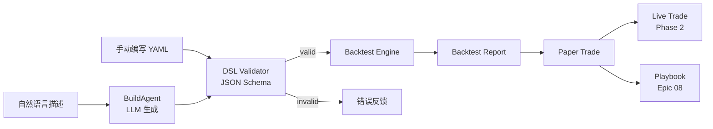
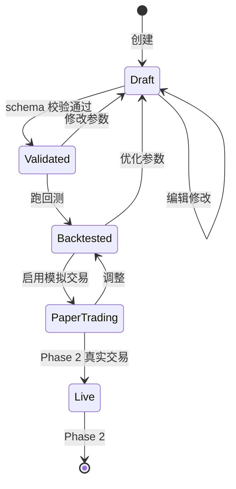

# Epic 04: Strategy DSL

**Epic 编号**: 04
**模块名称**: Strategy DSL（策略领域特定语言）
**优先级顺序**: 4（B3 中"3"位置）
**文档性质标签**: [A] + [B] + [C]
**Spec 模板**: to-spec
**最后更新**: 2026-07-19

---

## 1. Problem Statement

### 1.1 用户视角问题 [B]

Prosumer Brenda 想表达"当 NVDA 50 日均线上穿 200 日均线时买入 10% 仓位，跌破 7% 止损"时：

- **代码门槛高**：现有量化平台（Quantopian 已停 / WorldQuant Brain 学习曲线陡 / Alpaca 需写 Python）都要求她写代码
- **自然语言模糊**：用 ChatGPT 描述策略后无法直接执行（"买一些"是多少？"涨多了"是什么阈值？）
- **回测不可信**：现有 AI 生成策略常过拟合（in-sample 完美 out-of-sample 崩盘），用户无从判断
- **不可组合**：她有 5 个策略想组合执行，但每个平台策略格式封闭
- **无法分享/复用**：写好的策略难以分享给朋友

### 1.2 工程视角问题 [B]

- **DSL 设计权衡**：YAML（人类可读）vs JSON（机器友好）vs Python（强大但门槛高）—— 用户决策"自定义 YAML/JSON"
- **校验严格性**：DSL 必须能在执行前完成 schema 校验，避免运行时崩
- **回测引擎数据需求**：用户明确"回测引擎需要用到 Mockup 的数据"——必须与 Epic 02 Mock K 线集对齐
- **Playbook 化**：DSL 必须能序列化为 Playbook（Epic 08），可分享可组合
- **状态机**：策略生命周期：draft → validated → backtested → paper → live

### 1.3 反向工程 Alva 现状 [A]

Alva 当前在策略层呈现 [INFERRED]：
- 自然语言 → 简单策略（限单标的、单条件）
- 内置回测（但数据源不透明）
- 不可导出/分享 DSL

**本 Epic 要"做得比 Alva 更好"的关键点 [C]**：
- 显式 YAML DSL（人类可读可编辑）
- 完整生命周期状态机
- 回测数据透明（标注源 + 时间范围）
- Playbook 化（可分享可组合）

---

## 2. Solution

### 2.1 总体架构 [B]



### 2.2 DSL 设计 [B] - **关键决策**

**用户决策**：自定义 YAML/JSON DSL

**DSL Schema（YAML 形式）**：

```yaml
# nova-invest Strategy DSL v1
version: "1.0"
metadata:
  name: "NVDA 金叉死叉策略"
  author: "brenda@example.com"
  description: "50/200 日均线金叉买入，死叉卖出"
  created_at: "2025-12-15"

universe:
  type: "single"  # single / multi / index
  symbols: ["NVDA"]

schedule:
  frequency: "daily"  # daily / hourly / on_event
  timezone: "America/New_York"

data:
  source: "mock"  # mock / yahoo / alpha / polygon
  timeframe: "1d"
  lookback_days: 250

indicators:
  - name: "sma_50"
    type: "SMA"
    params: { period: 50, field: "close" }
  - name: "sma_200"
    type: "SMA"
    params: { period: 200, field: "close" }

signals:
  entry:
    condition: "sma_50 > sma_200"
    operator: "crossover"  # crossover / crossunder / gt / lt
  exit:
    condition: "sma_50 < sma_200"
    operator: "crossunder"

position_sizing:
  method: "percent_equity"  # percent_equity / fixed_amount / kelly
  params: { percent: 10 }

risk_management:
  stop_loss: { type: "percent", value: 7 }
  take_profit: { type: "percent", value: 20 }
  max_positions: 5
  max_drawdown: 15  # percent

execution:
  order_type: "market"  # market / limit
  slippage_bps: 5
  commission_bps: 1

backtest:
  start_date: "2024-01-01"
  end_date: "2025-12-31"
  initial_capital: 100000
  benchmark: "SPY"
```

### 2.3 DSL JSON Schema（验证用）[B]

```json
{
  "$schema": "http://json-schema.org/draft-07/schema#",
  "title": "NovaInvest Strategy DSL v1",
  "type": "object",
  "required": ["version", "universe", "signals", "position_sizing"],
  "properties": {
    "version": { "type": "string", "enum": ["1.0"] },
    "universe": {
      "type": "object",
      "required": ["type", "symbols"],
      "properties": {
        "type": { "enum": ["single", "multi", "index"] },
        "symbols": { "type": "array", "items": { "type": "string" }, "minItems": 1 }
      }
    },
    "indicators": {
      "type": "array",
      "items": {
        "type": "object",
        "required": ["name", "type", "params"],
        "properties": {
          "name": { "type": "string" },
          "type": { "enum": ["SMA", "EMA", "RSI", "MACD", "Bollinger", "ATR"] },
          "params": { "type": "object" }
        }
      }
    },
    "signals": {
      "type": "object",
      "required": ["entry"],
      "properties": {
        "entry": { "$ref": "#/definitions/condition" },
        "exit": { "$ref": "#/definitions/condition" }
      }
    },
    "position_sizing": {
      "type": "object",
      "required": ["method", "params"],
      "properties": {
        "method": { "enum": ["percent_equity", "fixed_amount", "kelly"] },
        "params": { "type": "object" }
      }
    }
  },
  "definitions": {
    "condition": {
      "type": "object",
      "required": ["condition", "operator"],
      "properties": {
        "condition": { "type": "string" },
        "operator": { "enum": ["crossover", "crossunder", "gt", "lt", "eq"] }
      }
    }
  }
}
```

### 2.4 策略生命周期状态机 [B]



### 2.5 回测引擎 [B] - **关键决策**

**用户决策**："开源核心 + 自研扩展，数据用免费 API（不本地存储）+ 需要用到 Mockup 的数据"

**设计**：

```typescript
// src/lib/backtest/engine.ts
interface BacktestConfig {
  strategy: StrategyDSL;
  start_date: Date;
  end_date: Date;
  initial_capital: number;
  benchmark: string;  // "SPY"
  data_source: "mock" | "real";
}

interface BacktestResult {
  trades: Trade[];
  equity_curve: { date: string; equity: number }[];
  metrics: {
    total_return: number;
    cagr: number;
    sharpe_ratio: number;
    max_drawdown: number;
    win_rate: number;
    profit_factor: number;
    sortino_ratio: number;
    calmar_ratio: number;
  };
  benchmark_return: number;
  alpha: number;
  beta: number;
}

class BacktestEngine {
  async run(config: BacktestConfig): Promise<BacktestResult> {
    // 1. 加载策略
    const strategy = await this.validate(config.strategy);
    // 2. 加载数据（Mock 或真实）
    const data = await this.loadData(strategy.universe.symbols,
      config.start_date, config.end_date, config.data_source);
    // 3. 计算指标
    const indicators = this.computeIndicators(data, strategy.indicators);
    // 4. 生成信号
    const signals = this.generateSignals(data, indicators, strategy.signals);
    // 5. 模拟交易
    const trades = this.simulateTrades(signals, strategy.position_sizing,
                                       strategy.risk_management);
    // 6. 计算 equity curve
    const equity = this.computeEquityCurve(trades, config.initial_capital);
    // 7. 计算指标
    const metrics = this.computeMetrics(equity, trades);
    // 8. 计算 benchmark
    const bench = await this.loadBenchmark(config.benchmark,
      config.start_date, config.end_date, config.data_source);
    return { trades, equity_curve: equity, metrics,
             benchmark_return: bench.return, alpha: ..., beta: ... };
  }
}
```

**回测防过拟合机制**：

1. **样本内/外分割**：默认 70/30 划分，in-sample 优化 out-of-sample 验证
2. **Walk-forward**：Phase 2 实现，Phase 1 仅固定窗口
3. **多周期**：支持 1d / 1h / 5m 多周期一致

### 2.6 内置指标库 [B]

```typescript
const INDICATOR_LIBRARY = {
  // 趋势类
  SMA:   (data, period) => simpleMovingAverage(data, period),
  EMA:   (data, period) => exponentialMovingAverage(data, period),
  MACD:  (data, fast, slow, signal) => macd(data, fast, slow, signal),
  // 震荡类
  RSI:   (data, period) => relativeStrengthIndex(data, period),
  Stochastic: (data, kPeriod, dPeriod) => stochastic(data, kPeriod, dPeriod),
  // 波动类
  Bollinger: (data, period, stdDev) => bollingerBands(data, period, stdDev),
  ATR:   (data, period) => averageTrueRange(data, period),
  // 成交量
  OBV:   (data) => onBalanceVolume(data),
  VWAP:  (data) => volumeWeightedAveragePrice(data),
};
```

### 2.7 信号表达式语法 [B]

支持简单表达式：

```yaml
signals:
  entry:
    condition: "sma_50 > sma_200 AND rsi_14 < 30"
    operator: "crossover"
  exit:
    condition: "sma_50 < sma_200 OR rsi_14 > 70"
    operator: "crossunder"
```

**表达式解析器**（基于 jsep）：

```typescript
function evaluateCondition(expr: string, indicators: Record<string, number>): boolean {
  // 支持 AND / OR / NOT / > / < / = / != 运算符
  const ast = jsep(expr);
  return walkAST(ast, indicators);
}
```

### 2.8 DSL 例子（3 个完整策略）[B]

**例 1：双均线金叉策略**

```yaml
version: "1.0"
metadata: { name: "MA Cross", description: "50/200 SMA crossover" }
universe: { type: "single", symbols: ["AAPL"] }
schedule: { frequency: "daily" }
data: { source: "mock", timeframe: "1d", lookback_days: 250 }
indicators:
  - { name: "sma_50",  type: "SMA", params: { period: 50, field: "close" } }
  - { name: "sma_200", type: "SMA", params: { period: 200, field: "close" } }
signals:
  entry: { condition: "sma_50 > sma_200", operator: "crossover" }
  exit:  { condition: "sma_50 < sma_200", operator: "crossunder" }
position_sizing: { method: "percent_equity", params: { percent: 10 } }
risk_management:
  stop_loss: { type: "percent", value: 7 }
  take_profit: { type: "percent", value: 20 }
  max_positions: 5
  max_drawdown: 15
execution: { order_type: "market", slippage_bps: 5, commission_bps: 1 }
backtest: { start_date: "2024-01-01", end_date: "2025-12-31",
            initial_capital: 100000, benchmark: "SPY" }
```

**例 2：RSI 超卖反弹策略**

```yaml
version: "1.0"
metadata: { name: "RSI Oversold", description: "Buy when RSI < 30" }
universe: { type: "single", symbols: ["NVDA"] }
schedule: { frequency: "daily" }
data: { source: "mock", timeframe: "1d", lookback_days: 100 }
indicators:
  - { name: "rsi_14", type: "RSI", params: { period: 14 } }
signals:
  entry: { condition: "rsi_14 < 30", operator: "lt" }
  exit:  { condition: "rsi_14 > 70", operator: "gt" }
position_sizing: { method: "percent_equity", params: { percent: 5 } }
risk_management:
  stop_loss: { type: "percent", value: 5 }
  take_profit: { type: "percent", value: 15 }
  max_positions: 3
  max_drawdown: 10
execution: { order_type: "market", slippage_bps: 5, commission_bps: 1 }
backtest: { start_date: "2024-01-01", end_date: "2025-12-31",
            initial_capital: 100000, benchmark: "SPY" }
```

**例 3：Bollinger 突破策略**

```yaml
version: "1.0"
metadata: { name: "Bollinger Breakout" }
universe: { type: "single", symbols: ["TSLA"] }
schedule: { frequency: "daily" }
data: { source: "mock", timeframe: "1d", lookback_days: 200 }
indicators:
  - { name: "bb", type: "Bollinger", params: { period: 20, stdDev: 2 } }
signals:
  entry: { condition: "close > bb.upper", operator: "gt" }
  exit:  { condition: "close < bb.middle", operator: "lt" }
position_sizing: { method: "percent_equity", params: { percent: 8 } }
risk_management:
  stop_loss: { type: "percent", value: 5 }
  max_positions: 5
  max_drawdown: 12
execution: { order_type: "market", slippage_bps: 5, commission_bps: 1 }
backtest: { start_date: "2024-01-01", end_date: "2025-12-31",
            initial_capital: 100000, benchmark: "SPY" }
```

---

## 3. User Stories

### Job Stories [B]

1. **When** Brenda 想表达"金叉买入死叉卖出"，**I want to** 用 YAML 描述而非写 Python，**so that** 学习曲线低。
2. **When** Brenda 描述完策略，**I want to** 立即看到校验结果（缺什么字段/指标名错误），**so that** 快速迭代。
3. **When** Brenda 校验通过后，**I want to** 一键跑回测看 Sharpe/最大回撤，**so that** 判断策略是否有效。
4. **When** Brenda 看到回测结果，**I want to** 看到 in-sample / out-of-sample 分割对比，**so that** 检测过拟合。
5. **When** Brenda 满意策略，**I want to** 一键发布为 Playbook，**so that** 分享给社区。
6. **When** Brenda 想组合多个策略，**I want to** 通过 Playbook 引用语法组合，**so that** 不需要重写。
7. **When** Brenda 启用 Mock 模式，**I want to** 回测用 Mock K 线数据，**so that** 零成本可重复。
8. **When** Brenda 看到回测报告，**I want to** 看到每个交易的明细（买入日期/价/卖出日期/价/盈亏），**so that** 可以审计。

### As-a Stories [B]

1. As a Prosumer, I want to 用 YAML 编写策略，so that 易读易改。
2. As a Prosumer, I want to 看到 DSL 校验错误信息，so that 知道哪里需要修正。
3. As a Prosumer, I want to 跑回测看到完整指标（Sharpe/MDD/Alpha/Beta），so that 评估策略质量。
4. As a Prosumer, I want to 看到 in-sample vs out-of-sample 对比，so that 检测过拟合。
5. As a Developer, I want to 通过 JSON Schema 扩展 DSL，so that 可以加新指标/新仓位方法。
6. As an Interviewer, I want to 看到完整的策略生命周期状态机，so that 评估工程严谨性。
7. As a Free-tier User, I want to 即使回测次数有限也能用 Mock 数据跑，so that 不消耗 Credit。
8. As a Prosumer, I want to 策略可导出为 Playbook YAML，so that 可以分享。

### BDD Gherkin [B]

```gherkin
Feature: Strategy DSL 校验与回测

  Scenario: DSL 校验通过
    Given 用户提交合法的 YAML DSL
    When 调用 validate()
    Then 返回 { valid: true }
    And 状态从 Draft → Validated

  Scenario: DSL 校验失败（缺字段）
    Given YAML 缺少 signals.entry
    When 调用 validate()
    Then 返回 { valid: false, errors: ["signals.entry is required"] }
    And 状态保持 Draft

  Scenario: 回测使用 Mock 数据
    Given USE_MOCK=true
    And 策略 universe.symbols = ["AAPL"]
    When 调用 backtest.run()
    Then 加载 web/public/mock/klines/AAPL_1d.json
    And 不调用任何外部 API

  Scenario: 回测报告包含完整指标
    Given 已完成回测
    When 生成报告
    Then 报告包含 total_return, cagr, sharpe_ratio, max_drawdown,
         win_rate, profit_factor, alpha, beta 至少 8 个指标

  Scenario: 过拟合检测
    Given 回测周期 2024-01-01 ~ 2025-12-31
    When 启用 sample_split = 70/30
    Then in-sample 期间 2024-01-01 ~ 2025-03-31
    And out-of-sample 期间 2025-04-01 ~ 2025-12-31
    And 报告显示两段期间 metrics 对比

  Scenario: Playbook 化导出
    Given 策略状态为 Backtested
    When 用户点击"Publish as Playbook"
    Then 生成 Playbook YAML
    And 注册到 Epic 08 Playbook 系统
    And 分配唯一 playbook_id
```

---

## 4. Implementation Decisions

### ID-1: YAML 优先，JSON 等价 [B]

- 用户编辑用 YAML（人类可读）
- 内部存储用 JSON（机器友好）
- 转换：YAML ↔ JSON 双向

### ID-2: JSON Schema 严格校验 [B]

- 所有 DSL 必须通过 JSON Schema 校验
- 不允许未知字段（防止 typo）
- 字段类型严格（如 `period: 50` 不能写成 `"50"`）

### ID-3: 指标库版本化 [B]

- 内置指标 v1.0 固定行为
- 新增指标走 v1.1，旧策略仍引用 v1.0 行为
- 通过 `version` 字段控制

### ID-4: 回测数据源与 Epic 02 对齐 [B]

```typescript
// BacktestEngine 调用 Epic 02 的 MarketDataProvider
class BacktestEngine {
  constructor(private dataProvider: MarketDataProvider) {}
  async loadData(symbols, from, to, mode) {
    // mode === "mock" → MockProvider
    // mode === "real" → RealProvider (含 R2 缓存)
    return this.dataProvider.getKlines(symbols[0], "1d", from, to);
  }
}
```

### ID-5: 仓位 sizing 算法 [B]

```typescript
const POSITION_SIZERS = {
  percent_equity: (equity, pct) => equity * pct / 100,
  fixed_amount:   (_, amount) => amount,
  kelly: (winRate, winLossRatio) => winRate - (1 - winRate) / winLossRatio,
};
```

### ID-6: 风控规则 [B]

- 止损类型：percent / absolute / atr_multiple
- 止盈类型：percent / absolute / risk_reward_ratio
- max_drawdown 触发后：停止开新仓

### ID-7: D1 Schema [B]

```sql
CREATE TABLE strategies (
  id           TEXT PRIMARY KEY,
  user_id      TEXT NOT NULL,
  name         TEXT NOT NULL,
  dsl_yaml     TEXT NOT NULL,
  status       TEXT NOT NULL,  -- draft/validated/backtested/paper/live
  created_at   TEXT DEFAULT (datetime('now')),
  updated_at   TEXT
);

CREATE TABLE backtest_results (
  id           INTEGER PRIMARY KEY AUTOINCREMENT,
  strategy_id  TEXT NOT NULL REFERENCES strategies(id),
  result_json  TEXT NOT NULL,  -- BacktestResult 序列化
  run_at       TEXT DEFAULT (datetime('now'))
);

CREATE INDEX idx_strategies_user ON strategies(user_id);
```

---

## 5. Testing Decisions

### 5.1 Test Seams 表 [B]

| Seam | 类型 | 测试内容 |
|---|---|---|
| TS-1 | Unit | DSL Validator 校验合法/非法 schema |
| TS-2 | Unit | 指标库计算（SMA/EMA/RSI/MACD/Bollinger/ATR） |
| TS-3 | Unit | 信号表达式解析器 |
| TS-4 | Unit | 仓位 sizing 算法 |
| TS-5 | Integration | BacktestEngine 跑完整回测 |
| TS-6 | Contract | 3 个内置策略的 Golden 回测结果 |
| TS-7 | E2E | YAML → 校验 → 回测 → 报告 → Playbook 化 |

### 5.2 Golden Set [B]

```typescript
// tests/golden/strategy_dsl.golden.test.ts
describe("Strategy DSL Golden Set", () => {
  it("双均线金叉策略回测 AAPL 已知结果", async () => {
    const strategy = loadYAML("./strategies/ma_cross.yaml");
    const result = await engine.run({ strategy, ... });
    expect(result.metrics.total_return).toBeGreaterThan(-1);
    expect(result.metrics.sharpe_ratio).toBeGreaterThan(-3);
    expect(result.trades.length).toBeGreaterThan(0);
  });

  it("RSI 超卖策略回测 NVDA 结果稳定", async () => {
    // 同一策略同一数据两次回测结果必须一致（确定性）
    const r1 = await engine.run(config);
    const r2 = await engine.run(config);
    expect(r1.metrics).toEqual(r2.metrics);
  });

  it("3 个内置策略的指标计算与 talib 库一致", async () => {
    const ourSMA = computeSMA(testData, 50);
    const talibSMA = await talib.SMA(testData, 50);
    expect(ourSMA).toEqual(talibSMA);
  });
});
```

### 5.3 测试策略 [B]

- **Unit**：纯函数 + 指标库 + 表达式解析
- **Contract**：3 个内置策略 Golden 结果固化
- **Property-based**：随机生成 DSL 验证 validator 鲁棒性
- **E2E**：用 Miniflare 跑完整 Worker

---

## 6. Out of Scope

### 6.1 模块级非目标 [B]

- **Tick 级回测**：仅日/分钟级
- **机器学习模型**：Phase 2 考虑接入 scikit-learn / PyTorch 模型作为指标
- **多资产组合优化**：Phase 2 考虑 Markowitz / Black-Litterman
- **期权策略**：Phase 3
- **高频策略**：Phase 3
- **实时 paper trading 完整闭环**：Phase 1 仅模拟历史，Phase 1.5 加实时 paper

### 6.2 模块级反模式 [B]

- ❌ **DSL 允许任意 Python 代码**：保持声明式
- ❌ **回测不区分 in/out-of-sample**：必须报告两段
- ❌ **指标计算与 talib 不一致**：必须与行业标准一致
- ❌ **回测结果不可重现**：必须固定随机种子
- ❌ **策略不存历史版本**：每次修改生成新版本

---

## 7. Further Notes

### 7.1 参考 [KNOWN]

- JSON Schema: https://json-schema.org/
- ta-lib 指标库: https://github.com/TA-Lib/ta-lib
- jsep 表达式解析: https://github.com/donaldfeury/jsep
- Quantopian zipline（已停但设计参考）: https://github.com/quantopian/zipline

### 7.2 待解问题 [B]

- Q1: 是否支持自定义指标（用户写 TypeScript）？→ Phase 2
- Q2: 是否支持多策略组合（portfolio of strategies）？→ Phase 2

### 7.3 依赖 [B]

- **上游**：Epic 01 AgentHarness、Epic 02 DataLayer（回测数据）
- **下游**：Epic 05 Dashboard（回测可视化）、Epic 08 Playbook（DSL → Playbook）

---

## 8. Acceptance Criteria

- [ ] DSL YAML Schema v1.0 定义并文档化
- [ ] JSON Schema 校验器实现
- [ ] 3 个完整策略示例 YAML（金叉/RSI/Bollinger）
- [ ] 内置指标库 ≥ 8 个（SMA/EMA/RSI/MACD/Bollinger/ATR/OBV/VWAP）
- [ ] 信号表达式解析器支持 AND/OR/NOT/>/</=
- [ ] BacktestEngine 实现完整回测流程
- [ ] 报告包含 ≥ 8 个指标（total_return/cagr/sharpe/mdd/win_rate/profit_factor/alpha/beta）
- [ ] in/out-of-sample 70/30 分割实现
- [ ] 仓位 sizing 3 种方法实现
- [ ] 风控规则（stop_loss/take_profit/max_drawdown）实现
- [ ] 策略状态机：Draft → Validated → Backtested → Paper
- [ ] D1 schema 含 strategies + backtest_results 表
- [ ] Mock 模式下回测完全用 web/public/mock/klines/*.json
- [ ] Golden 回测结果固化（3 个策略）
- [ ] 指标计算与 talib 一致性测试通过

---

## 9. 版本历史

| 版本 | 日期 | 变更 |
|---|---|---|
| 0.1 | 2026-07-19 | 初稿，含 YAML DSL、JSON Schema、状态机、回测引擎、3 个示例 |
