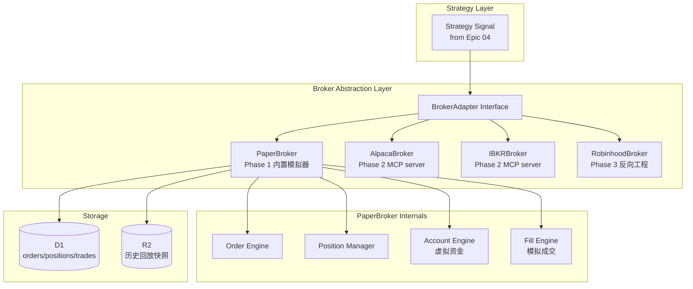
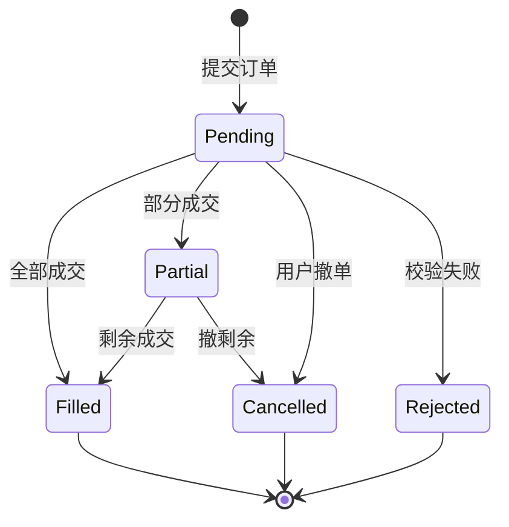

# Epic 06: Broker Integration

**Epic 编号**: 06
**模块名称**: Broker Integration（券商集成与交易执行）
**优先级顺序**: 6（B3 中"6"位置）
**文档性质标签**: [A] + [B] + [C]
**Spec 模板**: to-spec
**最后更新**: 2026-07-19

---

## 1. Problem Statement

### 1.1 用户视角问题 [B]

Prosumer Brenda 想从"分析 → 策略 → 实盘"闭环时：

- **多账户散乱**：她在 Robinhood 持有部分仓位、Alpaca 跑策略、Charles Schwab 存 IRA——每个券商一个 App，无法统一查看
- **API 接入门槛高**：Alpaca paper trading API 需注册账号 + 申请 API key，Robinhood 无官方 API，Interactive Brokers TWS API 文档厚如字典
- **不敢一键执行**：策略信号出来后还要手动切换到券商 App 下单，过程割裂，容易错过时机
- **paper → live 跨越无渐进**：直接从回测跳到实盘，没有 paper trading 中间态
- **延迟与限流**：免费行情 API 限流严苛（Alpha Vantage 25 次/天），她写一个简单的"过去 5 年所有财报日次日涨跌"分析就因为限流跑了 3 小时。

### 1.2 工程视角问题 [B]

- **券商适配抽象**：每家券商 API 协议不同（REST / WebSocket / FIX），必须抽象统一接口
- **Phase 1 不接真实券商**：用户决策"Phase 1 显式非目标 = 自建券商"，所以 Phase 1 只做 paper trading 模拟器
- **风险隔离**：执行层必须与策略层物理隔离，避免 Bug 导致真实下单
- **MCP 集成**：用户决策"外部工具走 MCP"——券商未来作为 MCP server 接入

### 1.3 反向工程 Alva 现状 [A]

Alva 当前在券商层呈现 [INFERRED]：
- 不接真实券商
- 仅模拟持仓展示
- 无 paper trading 模拟器

**本 Epic 要"做得比 Alva 更好"的关键点 [C]**：
- 完整 paper trading 模拟器
- 券商抽象层（Phase 2 接 Alpaca/IBKR）
- 持仓跨券商聚合
- MCP 协议占位

---

## 2. Solution

### 2.1 总体架构 [B]



### 2.2 Broker Adapter 接口 [B] - **关键决策**

```typescript
// src/lib/broker/types.ts
interface BrokerAdapter {
  name: string;
  mode: "paper" | "live";

  // 账户
  getAccount(): Promise<Account>;
  getBalance(): Promise<Balance>;

  // 订单
  placeOrder(order: Order): Promise<OrderResult>;
  cancelOrder(orderId: string): Promise<boolean>;
  getOrder(orderId: string): Promise<Order>;
  listOrders(status?: OrderStatus): Promise<Order[]>;

  // 持仓
  getPosition(symbol: string): Promise<Position>;
  listPositions(): Promise<Position[]>;

  // 历史成交
  listTrades(from: Date, to: Date): Promise<Trade[]>;

  // 实时（Phase 2）
  subscribeQuotes(symbols: string[], cb: (q: Quote) => void): () => void;
}
```

### 2.3 PaperBroker 模拟器设计 [B] - **关键决策**

**用户决策**：Phase 1 显式非目标 = 自建券商，所以 PaperBroker 是核心

```typescript
class PaperBroker implements BrokerAdapter {
  name = "paper";
  mode = "paper" as const;

  constructor(private db: D1Database, private dataProvider: MarketDataProvider) {}

  async placeOrder(order: Order): Promise<OrderResult> {
    // 1. 校验订单（资金/持仓/限价）
    const account = await this.getAccount();
    this.validateOrder(order, account);

    // 2. 计算成交价（含 slippage）
    const quote = await this.dataProvider.getQuote(order.symbol);
    const fillPrice = this.computeFillPrice(order, quote);

    // 3. 模拟成交
    const trade = await this.executeFill(order, fillPrice);

    // 4. 更新持仓和资金
    await this.updatePosition(order, trade);
    await this.updateBalance(order, trade);

    return { order_id: trade.id, status: "filled", fill_price: fillPrice, ... };
  }

  private computeFillPrice(order: Order, quote: Quote): number {
    const slippageBps = 5;  // 5 bps 默认滑点
    const base = order.side === "buy" ? quote.ask : quote.bid;
    const slippage = base * (slippageBps / 10000);
    return order.side === "buy" ? base + slippage : base - slippage;
  }
}
```

### 2.4 订单类型支持 [B]

```typescript
type OrderType =
  | "market"        // 市价单
  | "limit"         // 限价单
  | "stop"          // 止损单
  | "stop_limit"    // 止损限价
  | "trailing_stop"; // 跟踪止损（Phase 1.5）

type OrderSide = "buy" | "sell" | "sell_short" | "buy_to_cover";

type OrderStatus =
  | "pending"      // 待成交
  | "partial"      // 部分成交
  | "filled"       // 全部成交
  | "cancelled"    // 已撤单
  | "rejected";    // 已拒绝
```

### 2.5 订单生命周期状态机 [B]



### 2.6 D1 Schema [B]

```sql
-- 账户表
CREATE TABLE broker_accounts (
  id           TEXT PRIMARY KEY,
  user_id      TEXT NOT NULL,
  broker_name  TEXT NOT NULL,  -- paper / alpaca / ibkr
  mode         TEXT NOT NULL,  -- paper / live
  balance      REAL DEFAULT 100000,  -- 虚拟资金默认 10 万
  currency     TEXT DEFAULT "USD",
  created_at   TEXT DEFAULT (datetime('now'))
);

-- 订单表
CREATE TABLE orders (
  id           TEXT PRIMARY KEY,
  user_id      TEXT NOT NULL,
  account_id   TEXT NOT NULL REFERENCES broker_accounts(id),
  symbol       TEXT NOT NULL,
  side         TEXT NOT NULL,   -- buy/sell/sell_short/buy_to_cover
  type         TEXT NOT NULL,   -- market/limit/stop/stop_limit
  quantity     REAL NOT NULL,
  limit_price  REAL,
  stop_price   REAL,
  status       TEXT NOT NULL,
  filled_qty   REAL DEFAULT 0,
  filled_price REAL,
  created_at   TEXT DEFAULT (datetime('now')),
  updated_at   TEXT,
  strategy_id  TEXT  -- 关联策略（可选）
);

CREATE INDEX idx_orders_user ON orders(user_id, created_at);
CREATE INDEX idx_orders_status ON orders(status);

-- 持仓表
CREATE TABLE positions (
  id           INTEGER PRIMARY KEY AUTOINCREMENT,
  user_id      TEXT NOT NULL,
  account_id   TEXT NOT NULL REFERENCES broker_accounts(id),
  symbol       TEXT NOT NULL,
  quantity     REAL NOT NULL,
  avg_price    REAL NOT NULL,
  current_price REAL,
  unrealized_pnl REAL,
  updated_at   TEXT DEFAULT (datetime('now')),
  UNIQUE(user_id, account_id, symbol)
);

-- 成交表
CREATE TABLE trades (
  id           INTEGER PRIMARY KEY AUTOINCREMENT,
  order_id     TEXT NOT NULL REFERENCES orders(id),
  symbol       TEXT NOT NULL,
  side         TEXT NOT NULL,
  quantity     REAL NOT NULL,
  price        REAL NOT NULL,
  commission   REAL DEFAULT 0,
  executed_at  TEXT DEFAULT (datetime('now'))
);

CREATE INDEX idx_trades_order ON trades(order_id);
```

### 2.7 MCP 适配占位 [B]

**用户决策**：MCP 协议占位（Phase 2 启用）

```typescript
// Phase 1 占位：MCP server 注册但不连接
const MCP_BROKER_SERVERS = [
  {
    name: "alpaca-broker",
    url: "mock://alpaca-mcp",  // Phase 2 替换为真实 MCP server
    tools: ["place_order", "get_positions", "get_account"],
    status: "phase2_pending"
  },
  {
    name: "ibkr-broker",
    url: "mock://ibkr-mcp",
    tools: ["place_order", "get_positions"],
    status: "phase2_pending"
  }
];

// Phase 2 实现真实 MCP server 连接
async function connectMCPServer(server: MCPServer): Promise<void> {
  // Real implementation in Phase 2
  throw new Error("MCP broker integration is Phase 2");
}
```

### 2.8 风控规则 [B]

```typescript
class BrokerRiskManager {
  // 单笔最大金额
  maxOrderValue = 50000;
  // 单日最大交易次数
  maxDailyTrades = 100;
  // 单标的最大持仓占比
  maxPositionPercent = 30;  // 30% of equity

  validateOrder(order: Order, account: Account): ValidationResult {
    if (order.quantity * order.limit_price > this.maxOrderValue) {
      return { ok: false, reason: "Order exceeds max value" };
    }
    // ... 其他规则
    return { ok: true };
  }
}
```

---

## 3. User Stories

### Job Stories [B]

1. **When** Brenda 想执行策略信号，**I want to** 一键从策略 → 下单（paper 模式），**so that** 不需要手动切换 App。
2. **When** Brenda 提交订单，**I want to** 看到订单状态从 pending → filled 的实时更新，**so that** 知道是否成交。
3. **When** Brenda 查看持仓，**I want to** 看到当前价、平均成本、未实现盈亏，**so that** 评估持仓表现。
4. **When** Brenda 跑策略 paper trade 1 个月，**I want to** 系统自动模拟所有买卖和资金变动，**so that** 验证策略真实表现。
5. **When** Brenda 在 Mock 模式下，**I want to** PaperBroker 用 Mock K 线成交，**so that** 零成本可重复演示。
6. **When** Brenda 跨多个券商账户（Phase 2），**I want to** 看到聚合持仓视图，**so that** 全局掌控。
7. **When** Brenda 想撤单，**I want to** 一键撤单且看到撤单确认，**so that** 避免误操作。
8. **When** Brenda 下单失败（资金不足），**I want to** 看到清晰的错误原因，**so that** 知道如何修正。

### As-a Stories [B]

1. As a Prosumer, I want to paper trade 模拟交易，so that 不冒真金白银风险。
2. As a Prosumer, I want to 看到完整订单生命周期，so that 跟踪每笔交易。
3. As a Prosumer, I want to 持仓表显示 P&L，so that 评估表现。
4. As a Developer, I want to 通过 BrokerAdapter 接口扩展券商，so that Phase 2 接入真实券商。
5. As a Free-tier User, I want to 即使免费也能 paper trade，so that 试用完整闭环。
6. As an Interviewer, I want to 看到 paper broker 的成交价模拟（含滑点），so that 评估工程严谨性。
7. As a Prosumer, I want to 风控规则防止单笔过大，so that 避免灾难性损失。
8. As a Prosumer, I want to 历史成交可查询，so that 复盘交易。

### BDD Gherkin [B]

```gherkin
Feature: PaperBroker 交易执行

  Scenario: 市价单成交
    Given PaperBroker 账户余额 $100,000
    And AAPL 当前 ask = $187.50
    When 用户下 buy 100 AAPL market order
    Then 订单状态 → filled
    And 成交价 = $187.50 + 5bps = $187.59
    And 持仓 AAPL = 100 股 @ $187.59
    And 余额减少 $18,759

  Scenario: 限价单未成交
    Given AAPL 当前 bid/ask = $187.45/$187.50
    When 用户下 buy 100 AAPL limit @ $180.00
    Then 订单状态 → pending
    And 不更新持仓

  Scenario: 资金不足拒绝
    Given 账户余额 $5,000
    When 用户下 buy 100 AAPL @ $187
    Then 订单状态 → rejected
    And 错误原因 = "Insufficient funds (need $18,750, have $5,000)"

  Scenario: 卖空超出持仓
    Given 用户持有 AAPL 50 股
    When 用户下 sell 100 AAPL
    Then 订单状态 → rejected
    And 错误原因 = "Insufficient shares (have 50, want 100)"

  Scenario: Mock 模式成交价从 Mock K 线
    Given USE_MOCK=true
    And mock_data/klines/AAPL_1d.json 最新收盘 $187.31
    When 用户下 buy 100 AAPL market
    Then 成交价 = $187.31 + 5bps

  Scenario: 撤单
    Given 订单 ABC123 状态 = pending
    When 用户撤单
    Then 订单状态 → cancelled
    And 不更新持仓/资金

  Scenario: 策略自动下单
    Given 策略 MA Cross 信号 = BUY NVDA 10%
    And PaperBroker 模式
    When 信号触发
    Then 自动下 buy NVDA market order
    And 订单 strategy_id = MA Cross 的 ID
    And 持仓更新
```

---

## 4. Implementation Decisions

### ID-1: Phase 1 仅 PaperBroker [B]

**用户决策**："Phase 1 显式非目标 = 自建券商 + 不接真实券商"

Phase 1 实现：
- ✅ PaperBroker 模拟器
- ✅ 完整订单生命周期
- ✅ 持仓/资金管理
- ✅ Mock K 线成交价

Phase 1 不实现：
- ❌ Alpaca 真实连接
- ❌ IBKR TWS 连接
- ❌ 实时行情流（仅 polling）
- ❌ 真实资金

### ID-2: 成交价滑点模型 [B]

```typescript
function computeFillPrice(order, quote, slippageBps = 5) {
  const base = order.side === "buy" ? quote.ask : quote.bid;
  const slippage = base * (slippageBps / 10000);
  return order.side === "buy" ? base + slippage : base - slippage;
}
```

支持配置：
- `slippage_bps`: 0-50
- `commission_bps`: 0-10
- `market_impact`: 大单自动加价

### ID-3: 订单 ID 生成 [B]

```typescript
function generateOrderId(): string {
  // 时间戳 + 用户 ID hash + 随机数
  return `ord_${Date.now()}_${Math.random().toString(36).slice(2, 8)}`;
}
```

### ID-4: 风控硬约束 [B]

- 单笔订单金额 > $50,000 → 拒绝
- 单日交易次数 > 100 → 拒绝
- 单标的持仓占比 > 30% → 拒绝加仓
- 资金不足 → 拒绝
- 持仓不足 → 拒绝卖出

### ID-5: 资金结算 T+1（模拟） [B]

```typescript
// 实时记录但 T+1 结算（模拟真实市场）
async function settleTrades(accountId: string) {
  const unsettledTrades = await db.query(
    "SELECT * FROM trades WHERE executed_at < date('now', '-1 day') AND settled = 0"
  );
  // 批量更新 balance
}
```

### ID-6: 跨券商聚合视图（Phase 2 占位） [B]

```typescript
// Phase 1: 仅 paper broker
// Phase 2: 聚合 paper + alpaca + ibkr + robinhood
async function getAggregatedPositions(userId: string): Promise<Position[]> {
  const brokers = await listUserBrokers(userId);
  const allPositions = await Promise.all(
    brokers.map(b => b.listPositions())
  );
  return mergePositions(allPositions);
}
```

---

## 5. Testing Decisions

### 5.1 Test Seams 表 [B]

| Seam | 类型 | 测试内容 |
|---|---|---|
| TS-1 | Unit | `PaperBroker.placeOrder()` 各订单类型 |
| TS-2 | Unit | `computeFillPrice()` 滑点计算 |
| TS-3 | Unit | `BrokerRiskManager.validateOrder()` 风控规则 |
| TS-4 | Integration | 订单 → 成交 → 持仓 → 资金完整闭环 |
| TS-5 | Contract | BrokerAdapter 接口契约 |
| TS-6 | E2E | 策略信号 → 自动下单 → 持仓更新 |

### 5.2 Golden Set [B]

```typescript
describe("Broker Golden Set", () => {
  it("完整 paper trade 闭环", async () => {
    const broker = new PaperBroker(db, mockProvider);
    await broker.deposit("user-1", 100000);

    // 买入
    const buyOrder = await broker.placeOrder({
      symbol: "AAPL", side: "buy", type: "market", quantity: 100
    });
    expect(buyOrder.status).toBe("filled");

    // 检查持仓
    const pos = await broker.getPosition("user-1", "AAPL");
    expect(pos.quantity).toBe(100);

    // 卖出
    const sellOrder = await broker.placeOrder({
      symbol: "AAPL", side: "sell", type: "market", quantity: 100
    });
    expect(sellOrder.status).toBe("filled");

    // 持仓归零
    const posAfter = await broker.getPosition("user-1", "AAPL");
    expect(posAfter.quantity).toBe(0);
  });

  it("风控规则全部生效", async () => {
    // 单笔超限、单日超次、单标的超占比、资金不足、持仓不足
    // ... 5 个子用例
  });
});
```

### 5.3 测试策略 [B]

- **Unit**：纯函数 + 订单类型 + 风控规则
- **Integration**：完整交易闭环（用 Miniflare）
- **Property-based**：随机订单验证 paper broker 不崩

---

## 6. Out of Scope

### 6.1 模块级非目标 [B]

- **真实券商连接**：Phase 2
- **真实资金交易**：Phase 2
- **期权/期货下单**：Phase 3
- **港股/A股下单**：Phase 3
- **实时 WebSocket 行情**：Phase 2
- **保证金交易**：Phase 3
- **做空借券**：Phase 2

### 6.2 模块级反模式 [B]

- ❌ **Phase 1 接真实券商 API**：明确非目标
- ❌ **订单无风控直接执行**：必须经过 BrokerRiskManager
- ❌ **成交价无滑点**：默认 5bps 滑点
- ❌ **持仓和资金不一致**：每笔交易必须同步更新两者
- ❌ **跨用户共享账户**：严格隔离
- ❌ **Mock 模式下也调真实券商 API**：Mock 模式仅用 PaperBroker + Mock K 线

---

## 7. Further Notes

### 7.1 参考 [KNOWN]

- Alpaca Paper Trading API: https://alpaca.markets/docs/api-references/paper-trading-api/
- Interactive Brokers TWS API: https://interactivebrokers.github.io/tws-api/
- Polygon.io paper trading: https://polygon.io/docs/stocks/getting-started
- FIX Protocol: https://www.fixtrading.org/

### 7.2 待解问题 [B]

- Q1: Phase 2 接 Alpaca 还是 IBKR 优先？→ 待 Phase 2 评估
- Q2: 是否支持做空借券？→ Phase 2

### 7.3 依赖 [B]

- **上游**：Epic 01 AgentHarness、Epic 02 DataLayer（行情）、Epic 04 Strategy DSL（信号）
- **下游**：Epic 05 Dashboard（持仓表展示）、Epic 07 Share（分享策略表现）

---

## 8. Acceptance Criteria

- [ ] `BrokerAdapter` 接口已定义
- [ ] `PaperBroker` 实现完整订单生命周期
- [ ] 支持 4 种订单类型（market/limit/stop/stop_limit）
- [ ] 成交价滑点模型实现
- [ ] 持仓 + 资金双账本同步更新
- [ ] 风控 5 项规则实现
- [ ] D1 schema 含 broker_accounts/orders/positions/trades 4 表
- [ ] 策略自动下单接口（strategy_id 关联）
- [ ] Mock 模式下成交价来自 Mock K 线
- [ ] MCP broker server 占位（Phase 2 启用）
- [ ] Golden Set 测试通过（完整闭环 + 风控）
- [ ] 订单 ID 生成不冲突
- [ ] 撤单功能实现

---

## 9. 版本历史

| 版本 | 日期 | 变更 |
|---|---|---|
| 0.1 | 2026-07-19 | 初稿，含 PaperBroker、订单生命周期、风控、D1 schema、MCP 占位 |
