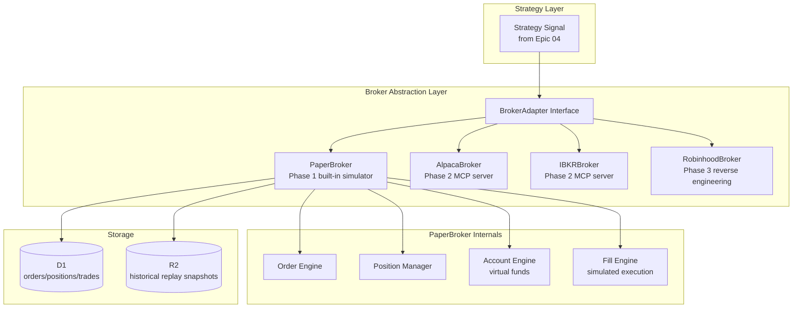
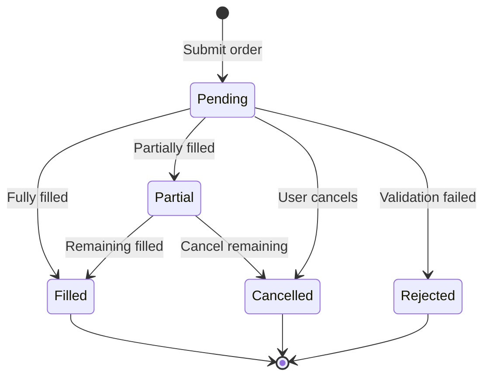

# Epic 06: Broker Integration

**Epic Number**: 06
**Module Name**: Broker Integration (Broker Integration & Trade Execution)
**Priority Order**: 6 (position "6" in B3)
**Document Nature Tag**: [A] + [B] + [C]
**Spec Template**: to-spec
**Last Updated**: 2026-07-19

---

## 1. Problem Statement

### 1.1 User Perspective Problems [B]

When Prosumer Brenda wants to close the loop from "analysis → strategy → live trading":

- **Scattered multi-account**: She holds partial positions in Robinhood, runs strategies in Alpaca, keeps IRA in Charles Schwab—each broker has its own app, no unified view
- **High API access barrier**: Alpaca paper trading API requires account registration + API key application, Robinhood has no official API, Interactive Brokers TWS API documentation is as thick as a dictionary
- **Afraid to execute in one click**: After a strategy signal appears, she still has to manually switch to the broker app to place orders, the process is fragmented and easy to miss the timing
- **No gradual paper → live transition**: Jumps directly from backtest to live trading, no paper trading intermediate state
- **Latency and rate limits**: Free market data APIs have strict rate limits (Alpha Vantage 25 calls/day). A simple "next-day price change on all earnings days over the past 5 years" analysis took 3 hours due to rate limits.

### 1.2 Engineering Perspective Problems [B]

- **Broker adaptation abstraction**: Each broker's API protocol is different (REST / WebSocket / FIX), must abstract a unified interface
- **Phase 1 doesn't connect real brokers**: User decided "Phase 1 explicit non-goal = self-built broker", so Phase 1 only does paper trading simulator
- **Risk isolation**: Execution layer must be physically isolated from strategy layer, to avoid bugs causing real orders
- **MCP integration**: User decided "external tools go through MCP"—brokers will be integrated as MCP servers in the future

### 1.3 Competitor Status Analysis [A]

Competitors currently show at broker layer [INFERRED]:
- Don't connect real brokers
- Only simulate position display
- No paper trading simulator

**This Epic's core differentiating features [C]**:
- Complete paper trading simulator
- Broker abstraction layer (Phase 2 integrates Alpaca/IBKR)
- Cross-broker position aggregation
- MCP protocol placeholder

---

## 2. Solution

### 2.1 Overall Architecture [B]



### 2.2 Broker Adapter Interface [B] - **Key Decision**

```typescript
// src/lib/broker/types.ts
interface BrokerAdapter {
  name: string;
  mode: "paper" | "live";

  // Account
  getAccount(): Promise<Account>;
  getBalance(): Promise<Balance>;

  // Orders
  placeOrder(order: Order): Promise<OrderResult>;
  cancelOrder(orderId: string): Promise<boolean>;
  getOrder(orderId: string): Promise<Order>;
  listOrders(status?: OrderStatus): Promise<Order[]>;

  // Positions
  getPosition(symbol: string): Promise<Position>;
  listPositions(): Promise<Position[]>;

  // Historical trades
  listTrades(from: Date, to: Date): Promise<Trade[]>;

  // Real-time (Phase 2)
  subscribeQuotes(symbols: string[], cb: (q: Quote) => void): () => void;
}
```

### 2.3 PaperBroker Simulator Design [B] - **Key Decision**

**User decision**: Phase 1 explicit non-goal = self-built broker, so PaperBroker is the core

```typescript
class PaperBroker implements BrokerAdapter {
  name = "paper";
  mode = "paper" as const;

  constructor(private db: D1Database, private dataProvider: MarketDataProvider) {}

  async placeOrder(order: Order): Promise<OrderResult> {
    // 1. Validate order (funds/position/limit price)
    const account = await this.getAccount();
    this.validateOrder(order, account);

    // 2. Calculate fill price (including slippage)
    const quote = await this.dataProvider.getQuote(order.symbol);
    const fillPrice = this.computeFillPrice(order, quote);

    // 3. Simulate execution
    const trade = await this.executeFill(order, fillPrice);

    // 4. Update position and balance
    await this.updatePosition(order, trade);
    await this.updateBalance(order, trade);

    return { order_id: trade.id, status: "filled", fill_price: fillPrice, ... };
  }

  private computeFillPrice(order: Order, quote: Quote): number {
    const slippageBps = 5;  // 5 bps default slippage
    const base = order.side === "buy" ? quote.ask : quote.bid;
    const slippage = base * (slippageBps / 10000);
    return order.side === "buy" ? base + slippage : base - slippage;
  }
}
```

### 2.4 Order Type Support [B]

```typescript
type OrderType =
  | "market"        // market order
  | "limit"         // limit order
  | "stop"          // stop order
  | "stop_limit"    // stop-limit order
  | "trailing_stop"; // trailing stop (Phase 1.5)

type OrderSide = "buy" | "sell" | "sell_short" | "buy_to_cover";

type OrderStatus =
  | "pending"      // pending fill
  | "partial"      // partial fill
  | "filled"       // fully filled
  | "cancelled"    // cancelled
  | "rejected";    // rejected
```

### 2.5 Order Lifecycle State Machine [B]



### 2.6 D1 Schema [B]

> **Note (revised 2026-07-19)**: `symbol` column unified to `ticker` per [ADR-0011](../../architecture/adr-0011-d1-schema-master.md).
> `orders.status` renamed to `order_status` to avoid confusion with `lifecycle_status`/`moderation_status`.
> All FKs explicitly declared. Canonical schema see ADR-0011 §Master Schema.

```sql
-- Account table
CREATE TABLE broker_accounts (
  id           TEXT PRIMARY KEY,
  user_id      TEXT NOT NULL REFERENCES users(id) ON DELETE CASCADE,
  broker_name  TEXT NOT NULL,  -- paper / alpaca / ibkr
  mode         TEXT NOT NULL,  -- paper / live
  balance      REAL DEFAULT 100000,  -- virtual funds default 100k
  currency     TEXT DEFAULT "USD",
  created_at   TEXT DEFAULT (datetime('now'))
);

-- Orders table
CREATE TABLE orders (
  id           TEXT PRIMARY KEY,           -- ord_<timestamp>_<random6>
  user_id      TEXT NOT NULL REFERENCES users(id) ON DELETE CASCADE,
  account_id   TEXT NOT NULL REFERENCES broker_accounts(id) ON DELETE CASCADE,
  ticker       TEXT NOT NULL REFERENCES symbols(ticker),  -- renamed from `symbol` per ADR-0011
  side         TEXT NOT NULL,   -- buy/sell/sell_short/buy_to_cover
  type         TEXT NOT NULL,   -- market/limit/stop/stop_limit
  quantity     REAL NOT NULL,
  limit_price  REAL,
  stop_price   REAL,
  order_status TEXT NOT NULL DEFAULT 'pending',  -- renamed from `status` per ADR-0011
  filled_qty   REAL DEFAULT 0,
  filled_price REAL,
  created_at   TEXT DEFAULT (datetime('now')),
  updated_at   TEXT,
  strategy_id  TEXT REFERENCES strategies(id) ON DELETE SET NULL  -- FK added per ADR-0011
);

CREATE INDEX idx_orders_user ON orders(user_id, created_at);
CREATE INDEX idx_orders_status ON orders(order_status);

-- Positions table
CREATE TABLE positions (
  id           INTEGER PRIMARY KEY AUTOINCREMENT,
  user_id      TEXT NOT NULL REFERENCES users(id) ON DELETE CASCADE,
  account_id   TEXT NOT NULL REFERENCES broker_accounts(id) ON DELETE CASCADE,
  ticker       TEXT NOT NULL REFERENCES symbols(ticker),  -- renamed from `symbol` per ADR-0011
  quantity     REAL NOT NULL,
  avg_price    REAL NOT NULL,
  current_price REAL,
  unrealized_pnl REAL,
  updated_at   TEXT DEFAULT (datetime('now')),
  UNIQUE(user_id, account_id, ticker)
);

-- Trades table
CREATE TABLE trades (
  id           INTEGER PRIMARY KEY AUTOINCREMENT,
  order_id     TEXT NOT NULL REFERENCES orders(id) ON DELETE CASCADE,
  ticker       TEXT NOT NULL REFERENCES symbols(ticker),  -- renamed from `symbol` per ADR-0011
  side         TEXT NOT NULL,
  quantity     REAL NOT NULL,
  price        REAL NOT NULL,
  commission   REAL DEFAULT 0,
  executed_at  TEXT DEFAULT (datetime('now'))
);

CREATE INDEX idx_trades_order ON trades(order_id);
```

### 2.7 MCP Adaptation Placeholder [B]

**User decision**: MCP protocol placeholder (enabled in Phase 2)

```typescript
// Phase 1 placeholder: MCP server registered but not connected
const MCP_BROKER_SERVERS = [
  {
    name: "alpaca-broker",
    url: "mock://alpaca-mcp",  // Phase 2 replace with real MCP server
    tools: ["place_order", "get_positions", "get_account"],
    status: "phase2_pending"
  },
  {
    name: "ibkr-broker",
    url: "mock://ibkr-mcp",
    tools: ["place_order", "get_positions"],
    status: "phase2_pending"
  }
];

// Phase 2 implement real MCP server connection
async function connectMCPServer(server: MCPServer): Promise<void> {
  // Real implementation in Phase 2
  throw new Error("MCP broker integration is Phase 2");
}
```

### 2.8 Risk Management Rules [B]

```typescript
class BrokerRiskManager {
  // Max single order value
  maxOrderValue = 50000;
  // Max daily trade count
  maxDailyTrades = 100;
  // Max position percent per ticker
  maxPositionPercent = 30;  // 30% of equity

  validateOrder(order: Order, account: Account): ValidationResult {
    if (order.quantity * order.limit_price > this.maxOrderValue) {
      return { ok: false, reason: "Order exceeds max value" };
    }
    // ... other rules
    return { ok: true };
  }
}
```

---

## 3. User Stories

### Job Stories [B]

1. **When** Brenda wants to execute a strategy signal, **I want to** go from strategy → order (paper mode) in one click, **so that** I don't need to manually switch apps.
2. **When** Brenda submits an order, **I want to** see real-time updates from pending → filled, **so that** I know whether it executed.
3. **When** Brenda checks positions, **I want to** see current price, average cost, and unrealized P&L, **so that** I can evaluate position performance.
4. **When** Brenda runs a strategy paper trade for 1 month, **I want to** the system to automatically simulate all buys/sells and capital changes, **so that** I can verify the strategy's real performance.
5. **When** Brenda is in Mock mode, **I want to** PaperBroker to fill using Mock K-lines, **so that** I have zero-cost repeatable demos.
6. **When** Brenda spans multiple broker accounts (Phase 2), **I want to** see an aggregated position view, **so that** I have global control.
7. **When** Brenda wants to cancel an order, **I want to** one-click cancel with confirmation, **so that** I avoid misoperation.
8. **When** Brenda's order fails (insufficient funds), **I want to** see a clear error reason, **so that** I know how to fix it.

### As-a Stories [B]

1. As a Prosumer, I want to paper trade simulated trading, so that I don't risk real money.
2. As a Prosumer, I want to see the complete order lifecycle, so that I can track every trade.
3. As a Prosumer, I want to the positions table to show P&L, so that I can evaluate performance.
4. As a Developer, I want to extend brokers via the BrokerAdapter interface, so that Phase 2 can integrate real brokers.
5. As a Free-tier User, I want to paper trade even for free, so that I can try the full loop.
6. As an Interviewer, I want to see the paper broker's fill price simulation (including slippage), so that I can evaluate engineering rigor.
7. As a Prosumer, I want to risk management rules to prevent oversized single orders, so that I avoid catastrophic losses.
8. As a Prosumer, I want to query historical trades, so that I can review trades.

### BDD Gherkin [B]

```gherkin
Feature: PaperBroker trade execution

  Scenario: Market order fill
    Given PaperBroker account balance $100,000
    And AAPL current ask = $187.50
    When user places buy 100 AAPL market order
    Then order status → filled
    And fill price = $187.50 + 5bps = $187.59
    And position AAPL = 100 shares @ $187.59
    And balance decreases by $18,759

  Scenario: Limit order not filled
    Given AAPL current bid/ask = $187.45/$187.50
    When user places buy 100 AAPL limit @ $180.00
    Then order status → pending
    And do not update position

  Scenario: Insufficient funds rejected
    Given account balance $5,000
    When user places buy 100 AAPL @ $187
    Then order status → rejected
    And error reason = "Insufficient funds (need $18,750, have $5,000)"

  Scenario: Sell short exceeds position
    Given user holds AAPL 50 shares
    When user places sell 100 AAPL
    Then order status → rejected
    And error reason = "Insufficient shares (have 50, want 100)"

  Scenario: Mock mode fill price from Mock K-line
    Given USE_MOCK=true
    And web/public/mock/klines/AAPL_1d.json latest close $187.31
    When user places buy 100 AAPL market
    Then fill price = $187.31 + 5bps

  Scenario: Cancel order
    Given order ABC123 status = pending
    When user cancels
    Then order status → cancelled
    And do not update position/balance

  Scenario: Strategy auto-order
    Given strategy MA Cross signal = BUY NVDA 10%
    And PaperBroker mode
    When signal triggers
    Then auto place buy NVDA market order
    And order strategy_id = MA Cross's ID
    And position updated
```

---

## 4. Implementation Decisions

### ID-1: Phase 1 PaperBroker Only [B]

**User decision**: "Phase 1 explicit non-goal = self-built broker + no real broker connection"

Phase 1 implements:
- ✅ PaperBroker simulator
- ✅ Complete order lifecycle
- ✅ Position/balance management
- ✅ Mock K-line fill price

Phase 1 does not implement:
- ❌ Alpaca real connection
- ❌ IBKR TWS connection
- ❌ Real-time quote stream (polling only)
- ❌ Real funds

### ID-2: Fill Price Slippage Model [B]

```typescript
function computeFillPrice(order, quote, slippageBps = 5) {
  const base = order.side === "buy" ? quote.ask : quote.bid;
  const slippage = base * (slippageBps / 10000);
  return order.side === "buy" ? base + slippage : base - slippage;
}
```

Supports configuration:
- `slippage_bps`: 0-50
- `commission_bps`: 0-10
- `market_impact`: large orders auto-markup

### ID-3: Order ID Generation [B]

```typescript
function generateOrderId(): string {
  // timestamp + user ID hash + random
  return `ord_${Date.now()}_${Math.random().toString(36).slice(2, 8)}`;
}
```

### ID-4: Risk Management Hard Constraints [B]

- Single order value > $50,000 → reject
- Daily trade count > 100 → reject
- Single ticker position percent > 30% → reject adding
- Insufficient funds → reject
- Insufficient position → reject sell

### ID-5: Fund Settlement T+1 (simulated) [B]

```typescript
// Real-time record but T+1 settlement (simulates real market)
async function settleTrades(accountId: string) {
  const unsettledTrades = await db.query(
    "SELECT * FROM trades WHERE executed_at < date('now', '-1 day') AND settled = 0"
  );
  // Batch update balance
}
```

### ID-6: Cross-broker Aggregation View (Phase 2 placeholder) [B]

```typescript
// Phase 1: paper broker only
// Phase 2: aggregate paper + alpaca + ibkr + robinhood
async function getAggregatedPositions(userId: string): Promise<Position[]> {
  const brokers = await listUserBrokers(userId);
  const allPositions = await Promise.all(
    brokers.map(b => b.listPositions())
  );
  return mergePositions(allPositions);
}
```

---

## 5. Testing Decisions

### 5.1 Test Seams Table [B]

| Seam | Type | Test Content |
|---|---|---|
| TS-1 | Unit | `PaperBroker.placeOrder()` various order types |
| TS-2 | Unit | `computeFillPrice()` slippage calculation |
| TS-3 | Unit | `BrokerRiskManager.validateOrder()` risk management rules |
| TS-4 | Integration | Order → trade → position → balance full loop |
| TS-5 | Contract | BrokerAdapter interface contract |
| TS-6 | E2E | Strategy signal → auto-order → position update |

### 5.2 Golden Set [B]

```typescript
describe("Broker Golden Set", () => {
  it("complete paper trade loop", async () => {
    const broker = new PaperBroker(db, mockProvider);
    await broker.deposit("user-1", 100000);

    // Buy
    const buyOrder = await broker.placeOrder({
      symbol: "AAPL", side: "buy", type: "market", quantity: 100
    });
    expect(buyOrder.status).toBe("filled");

    // Check position
    const pos = await broker.getPosition("user-1", "AAPL");
    expect(pos.quantity).toBe(100);

    // Sell
    const sellOrder = await broker.placeOrder({
      symbol: "AAPL", side: "sell", type: "market", quantity: 100
    });
    expect(sellOrder.status).toBe("filled");

    // Position zero
    const posAfter = await broker.getPosition("user-1", "AAPL");
    expect(posAfter.quantity).toBe(0);
  });

  it("all risk management rules take effect", async () => {
    // Single order over limit, daily count over limit, single ticker over percent, insufficient funds, insufficient position
    // ... 5 subcases
  });
});
```

### 5.3 Testing Strategy [B]

- **Unit**: pure functions + order types + risk management rules
- **Integration**: complete trade loop (using Miniflare)
- **Property-based**: random orders verify paper broker doesn't crash

---

## 6. Out of Scope

### 6.1 Module-level Non-goals [B]

- **Real broker connection**: Phase 2
- **Real funds trading**: Phase 2
- **Options/futures orders**: Phase 3
- **HK-shares/A-shares orders**: Phase 3
- **Real-time WebSocket quotes**: Phase 2
- **Margin trading**: Phase 3
- **Short borrowing**: Phase 2

### 6.2 Module-level Anti-patterns [B]

- ❌ **Phase 1 connecting real broker API**: explicit non-goal
- ❌ **Order executed without risk management**: must go through BrokerRiskManager
- ❌ **Fill price without slippage**: default 5bps slippage
- ❌ **Position and balance inconsistent**: every trade must synchronously update both
- ❌ **Cross-user account sharing**: strict isolation
- ❌ **Mock mode calling real broker API**: Mock mode uses only PaperBroker + Mock K-line

---

## 7. Further Notes

### 7.1 References [KNOWN]

- Alpaca Paper Trading API: https://alpaca.markets/docs/api-references/paper-trading-api/
- Interactive Brokers TWS API: https://interactivebrokers.github.io/tws-api/
- Polygon.io paper trading: https://polygon.io/docs/stocks/getting-started
- FIX Protocol: https://www.fixtrading.org/

### 7.2 Open Questions [B]

- Q1: Phase 2 priority Alpaca or IBKR? → to be evaluated in Phase 2
- Q2: Support short borrowing? → Phase 2

### 7.3 Dependencies [B]

- **Upstream**: Epic 01 AgentHarness, Epic 02 DataLayer (quotes), Epic 04 Strategy DSL (signals)
- **Downstream**: Epic 05 Dashboard (positions table display), Epic 07 Share (sharing strategy performance)

---

## 8. Acceptance Criteria

- [ ] `BrokerAdapter` interface defined
- [ ] `PaperBroker` implements complete order lifecycle
- [ ] Supports 4 order types (market/limit/stop/stop_limit)
- [ ] Fill price slippage model implemented
- [ ] Position + balance dual-ledger sync update
- [ ] 5 risk management rules implemented
- [ ] D1 schema contains broker_accounts/orders/positions/trades 4 tables
- [ ] Strategy auto-order interface (strategy_id association)
- [ ] Mock mode fill price from Mock K-line
- [ ] MCP broker server placeholder (enabled in Phase 2)
- [ ] Golden Set tests pass (complete loop + risk management)
- [ ] Order ID generation no conflicts
- [ ] Cancel order function implemented

---

## 9. Version History

| Version | Date | Changes |
|---|---|---|
| 0.1 | 2026-07-19 | Initial draft, including PaperBroker, order lifecycle, risk management, D1 schema, MCP placeholder |
