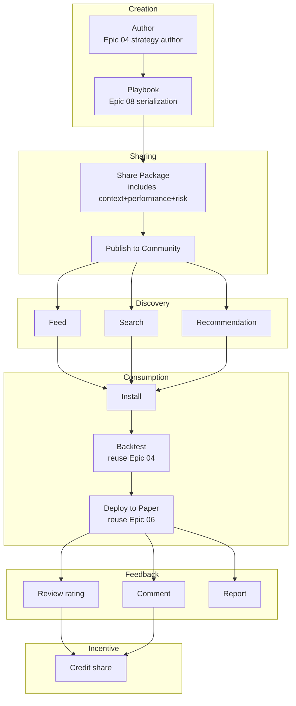

# Epic 07: Share & Community

**Epic Number**: 07
**Module Name**: Share & Community (Sharing & Community)
**Priority Order**: 7 (position "7" in B3)
**Document Nature Tag**: [A] + [B] + [C]
**Spec Template**: to-spec
**Last Updated**: 2026-07-19

---

## 1. Problem Statement

### 1.1 User Perspective Problems [B]

When Prosumer Brenda writes a good strategy and wants to share with friend Alex:

- **Closed-source platforms not shareable**: Quantopian shut down, WorldQuant Brain strategies not public, Alpaca only personal strategies visible—cannot share
- **Single sharing format**: Existing platforms only "copy strategy ID", lack a complete sharing package with "context + performance + risk explanation"
- **Uneven UGC quality**: Reddit r/algotrading is full of non-executable "idea" posts, no one-click run verification
- **No feedback loop**: After sharing, don't know who used it, how it performed, whether there are improvement suggestions
- **No incentive mechanism**: Quality strategy authors earn nothing, leading to content drought

### 1.2 Engineering Perspective Problems [B]

- **Playbook vs Share relationship**: User decided "Playbook System is Epic 08"—this Epic only handles the "share/discover/install/feedback" chain, Playbook itself is defined in Epic 08
- **UGC moderation**: Strategy sharing needs schema validation + anti-abuse + risk disclosure
- **Community governance**: Comment/like/report/ban mechanism
- **Cloudflare free tier constraints**: D1 stores metadata, R2 stores Playbook YAML large files

### 1.3 Competitor Status Analysis [A]

Competitors currently show at community layer [INFERRED]:
- Don't support public strategy sharing
- No UGC community
- Only "copy strategy ID to friend" private sharing

**This Epic's core differentiating features [C]**:
- Complete UGC community (share/discover/install/feedback)
- Playbook package (including context + performance + risk disclosure)
- Creator incentives (Credit share)

---

## 2. Solution

### 2.1 Overall Architecture [B]



### 2.2 Share Package Design [B] - **Key Decision**

**Share Package = Playbook YAML + metadata + performance snapshot + risk disclosure**

```yaml
# share_package example
package_id: "pkg_abc123"
version: "1.0"

playbook:
  playbook_id: "pb_nvda_macross_v1"
  yaml_ref: "r2://playbooks/pb_nvda_macross_v1.yaml"

metadata:
  title: "NVDA Dual Moving Average Golden Cross Strategy"
  author: { id: "brenda", name: "Brenda", avatar: "..." }
  description: "50/200 SMA crossover on NVDA, paper-tested 6 months"
  tags: ["momentum", "single-stock", "low-frequency"]
  created_at: "2025-12-15T10:00:00Z"
  installed_count: 0
  rating_avg: 0

performance_snapshot:
  backtest_period: "2024-01-01 to 2025-12-31"
  total_return: 23.5
  sharpe: 1.42
  max_drawdown: 8.3
  win_rate: 58
  benchmark: "SPY"
  benchmark_return: 18.2
  alpha: 5.3

risk_disclosure:
  - "Past performance does not guarantee future results."
  - "Strategy optimized on NVDA may not generalize to other stocks."
  - "No stop-loss configured; user should add own risk management."
  - "Backtest period included bull market; bear market performance unknown."

license:
  type: "CC-BY-4.0"
  commercial_use: true
  attribution_required: true
```

### 2.3 Community Feature Matrix [B]

| Feature | Description | Phase |
|---|---|---|
| Publish | Publish Playbook to community | 1 |
| Feed | Time-series display of latest/popular | 1 |
| Search | Search by tag/author/title | 1 |
| Install | One-click install to own strategy library | 1 |
| Rating | 1-5 star rating | 1 |
| Comment | Public comments | 1 |
| Report | Report violating content | 1 |
| Recommendation | Behavior-based recommendation of similar Playbooks | 1.5 |
| Follow Author | Subscribe to author updates | 1.5 |
| Credit Share | Author earns 0.5 Credit per install | 2 |

### 2.4 D1 Schema [B]

> **Note (revised 2026-07-19)**: `community_playbooks.yaml_r2_key` column removed per [ADR-0011](../../architecture/adr-0011-d1-schema-master.md).
> Get R2 key via `playbook_id` JOIN `playbook_versions.yaml_r2_key`.
> `status` column renamed to `moderation_status` to avoid ambiguity.
> `playbook_installs` table merged into `user_playbook_installs` (shared with EP08). Canonical schema see ADR-0011 §Master Schema.

```sql
-- Published Playbooks
CREATE TABLE community_playbooks (
  package_id     TEXT PRIMARY KEY,
  playbook_id    TEXT NOT NULL REFERENCES playbooks(id) ON DELETE CASCADE,  -- FK added per ADR-0011
  author_id      TEXT NOT NULL REFERENCES users(id) ON DELETE CASCADE,
  title          TEXT NOT NULL,
  description    TEXT,
  tags           TEXT,  -- JSON array
  -- yaml_r2_key column REMOVED per ADR-0011 - JOIN playbook_versions via playbook_id+version
  version        TEXT DEFAULT "1.0",
  moderation_status TEXT DEFAULT "active",  -- renamed from `status` per ADR-0011: active/removed/banned
  installed_count INTEGER DEFAULT 0,
  rating_avg     REAL DEFAULT 0,
  rating_count   INTEGER DEFAULT 0,
  created_at     TEXT DEFAULT (datetime('now'))
);

CREATE INDEX idx_cp_status_created ON community_playbooks(moderation_status, created_at);
CREATE INDEX idx_cp_author ON community_playbooks(author_id);

-- Install records (MERGED with EP08 user_playbooks into user_playbook_installs per ADR-0011)
-- Old playbook_installs table is DEPRECATED. Use user_playbook_installs (see ADR-0011 §Master Schema Migration 007):
-- CREATE TABLE user_playbook_installs (
--   user_id            TEXT NOT NULL REFERENCES users(id) ON DELETE CASCADE,
--   playbook_id        TEXT NOT NULL REFERENCES playbooks(id) ON DELETE CASCADE,
--   package_id         TEXT NOT NULL REFERENCES community_playbooks(package_id) ON DELETE CASCADE,
--   installed_version  TEXT NOT NULL,
--   installed_at       TEXT DEFAULT (datetime('now')),
--   PRIMARY KEY (user_id, playbook_id)
-- );

-- Ratings
CREATE TABLE playbook_ratings (
  user_id        TEXT NOT NULL REFERENCES users(id) ON DELETE CASCADE,
  package_id     TEXT NOT NULL REFERENCES community_playbooks(package_id) ON DELETE CASCADE,
  rating         INTEGER NOT NULL,  -- 1-5
  created_at     TEXT DEFAULT (datetime('now')),
  PRIMARY KEY (user_id, package_id)
);

-- Comments
CREATE TABLE playbook_comments (
  id             INTEGER PRIMARY KEY AUTOINCREMENT,
  package_id     TEXT NOT NULL REFERENCES community_playbooks(package_id) ON DELETE CASCADE,
  user_id        TEXT NOT NULL REFERENCES users(id) ON DELETE CASCADE,
  content        TEXT NOT NULL,
  parent_id      INTEGER REFERENCES playbook_comments(id) ON DELETE CASCADE,  -- FK added per ADR-0011 (self-reference)
  moderation_status TEXT DEFAULT "active",  -- renamed from `status` per ADR-0011: active/hidden/deleted
  created_at     TEXT DEFAULT (datetime('now'))
);

-- Reports
CREATE TABLE playbook_reports (
  id             INTEGER PRIMARY KEY AUTOINCREMENT,
  package_id     TEXT NOT NULL REFERENCES community_playbooks(package_id) ON DELETE CASCADE,
  reporter_id    TEXT NOT NULL REFERENCES users(id) ON DELETE CASCADE,
  reason         TEXT NOT NULL,
  description    TEXT,
  moderation_status TEXT DEFAULT "pending",  -- renamed from `status` per ADR-0011: pending/resolved/rejected
  created_at     TEXT DEFAULT (datetime('now'))
);
```

### 2.5 Anti-Abuse Mechanism [B]

```typescript
class AntiAbuseFilter {
  // 1. Content moderation
  async reviewPlaybook(yaml: string): Promise<ReviewResult> {
    // Check for sensitive words (political/discriminatory)
    if (this.containsForbiddenWords(yaml)) {
      return { ok: false, reason: "Contains forbidden content" };
    }
    // Check for plagiarism (hash comparison)
    const hash = sha256(yaml);
    const existing = await db.query("SELECT * FROM community_playbooks WHERE hash = ?", hash);
    if (existing) return { ok: false, reason: "Duplicate" };
    return { ok: true };
  }

  // 2. Rate limiting
  async checkRate(userId: string): Promise<boolean> {
    const todayCount = await db.query(
      "SELECT COUNT(*) as c FROM community_playbooks WHERE author_id = ? AND created_at > date('now', '-1 day')",
      userId
    );
    return todayCount.c < 5;  // 5 per day limit
  }

  // 3. Rating fraud detection
  async detectRatingFraud(packageId: string): Promise<boolean> {
    const ratings = await db.query("SELECT user_id FROM playbook_ratings WHERE package_id = ?", packageId);
    // Detect concentrated rating from same IP range
    // ...
    return false;
  }
}
```

### 2.6 Recommendation Algorithm (Phase 1.5) [B]

```typescript
class PlaybookRecommender {
  // Phase 1: simple tag matching + popularity
  async recommend(userId: string, limit = 10): Promise<Playbook[]> {
    const userTags = await getUserInterestedTags(userId);
    return db.query(`
      SELECT * FROM community_playbooks
      WHERE status = 'active'
      AND (tags LIKE ? OR installed_count > 100)
      ORDER BY installed_count DESC, rating_avg DESC
      LIMIT ?
    `, userTags, limit);
  }

  // Phase 1.5: Vectorize semantic retrieval
  async recommendByVector(userId: string): Promise<Playbook[]> {
    const userProfile = await getUserEmbedding(userId);
    const candidates = await vectorize.query(userProfile, { topK: 50 });
    return rerankByPopularity(candidates);
  }
}
```

### 2.7 Creator Incentive (Phase 2) [B]

```typescript
// Phase 2 enabled: each install author earns 0.5 Credit
async function onInstall(packageId: string, installerId: string) {
  const pkg = await db.query("SELECT author_id FROM community_playbooks WHERE package_id = ?", packageId);
  await creditSystem.grant(pkg.author_id, 0.5, {
    reason: "playbook_install",
    package_id: packageId,
    installer_id: installerId
  });
}
```

---

## 3. User Stories

### Job Stories [B]

1. **When** Brenda finishes writing a strategy, **I want to** one-click publish to community, **so that** friend Alex can one-click install.
2. **When** Alex browses the community, **I want to** see popular Playbook feed, **so that** I discover good strategies.
3. **When** Alex searches "momentum" tag, **I want to** see all momentum strategies, **so that** I can find by topic.
4. **When** Alex views a Playbook, **I want to** see the author's backtest snapshot + risk disclosure, **so that** I can evaluate credibility.
5. **When** Alex installs a Playbook, **I want to** auto-reuse the author's backtest params and run once more, **so that** I can verify consistency.
6. **When** Alex uses it for a week and likes it, **I want to** give 5 stars + comment, **so that** I help the author and other users.
7. **When** Brenda sees her Playbook has 100 installs, **I want to** see the full install list and rating distribution, **so that** I feel accomplished.
8. **When** Alex finds a Playbook plagiarizing Brenda's, **I want to** report and see the resolution, **so that** I maintain community quality.

### As-a Stories [B]

1. As a Prosumer, I want to one-click publish Playbook, so that I share with community.
2. As a Free User, I want to browse community without registration, so that I explore value.
3. As a Prosumer, I want to second-edit after installing Playbook, so that I improve the strategy.
4. As an Author, I want to see install count/rating/comment stats, so that I understand feedback.
5. As a User, I want to see risk disclosure, so that I know strategy limitations.
6. As a Developer, I want to validate Playbook package format via Schema, so that I ensure quality.
7. As an Admin, I want to handle reports and ban violating content, so that I maintain community.
8. As an Interviewer, I want to see complete UGC loop design, so that I evaluate product thinking.

### BDD Gherkin [B]

```gherkin
Feature: Playbook community sharing

  Scenario: Publish Playbook
    Given Brenda has strategy MA Cross, status = backtested
    When Brenda clicks "Publish to Community"
    Then generate Share Package (with metadata + performance_snapshot + risk_disclosure)
    And upload Playbook YAML to R2
    And insert record in community_playbooks table
    And status = active
    And install count = 0

  Scenario: Install Playbook
    Given Alex browses community
    When Alex installs Brenda's NVDA MA Cross
    Then playbook_installs inserts record (alex, pkg_abc)
    And installed_count += 1
    And Alex strategy library adds one strategy (editable but preserves author_id reference)

  Scenario: Rating
    Given Alex has installed Brenda's Playbook
    When Alex gives 5-star rating
    Then playbook_ratings inserts or updates (alex, pkg_abc, 5)
    And rating_avg recalculated
    And rating_count += 1 (first-time rating)

  Scenario: Comment nested reply
    Given Alex comments on Brenda's Playbook
    When Brenda replies to Alex's comment
    Then playbook_comments inserts record with parent_id = Alex's comment id

  Scenario: Report
    Given Alex sees plagiarized Playbook
    When Alex reports reason = "plagiarism"
    Then playbook_reports inserts record status = pending
    And admin notified

  Scenario: Anti-abuse - duplicate publish detection
    Given Brenda has already published Playbook with same hash
    When Brenda republishes
    Then return error "Duplicate package"

  Scenario: Anti-abuse - rate limit
    Given Brenda has published 5 Playbooks today
    When Brenda publishes 6th
    Then return error "Daily limit exceeded"

  Scenario: Mock mode preset community data
    Given USE_MOCK=true
    When user visits community
    Then display 10 preset Playbooks (mock_data/community/*.json)
    And install count/rating/comments are preset values
```

---

## 4. Implementation Decisions

### ID-1: Share Package is Playbook's "Wrapper" [B]

- Playbook (Epic 08) = executable YAML
- Share Package = Playbook + metadata + performance + risk + license
- Publish flow: strategy → Playbook → Share Package → community

### ID-2: R2 Stores Playbook YAML Large Files [B]

```typescript
async function uploadPlaybook(yaml: string): Promise<string> {
  const key = `playbooks/pb_${generateId()}.yaml`;
  await R2.put(key, yaml);
  return key;
}
```

D1 stores only metadata + R2 key references, to avoid D1 single row being too large.

### ID-3: Install is "Copy Reference" not "Copy Content" [B]

```typescript
async function installPackage(userId: string, packageId: string) {
  // Don't copy Playbook content, only create reference
  await db.run(`
    INSERT INTO user_strategies (user_id, package_id, source = "community")
    VALUES (?, ?, "community")
  `, userId, packageId);
  // User can fork their own version based on this
}
```

### ID-4: Comments Support 2-Level Nesting [B]

- Comment → Reply (1 level)
- Reply → Reply to reply (2 levels)
- Deeper nesting not supported (prevent spam comment trees)

### ID-5: Rating Deduplication [B]

- Each user has only 1 rating per Playbook
- Re-rating overwrites old rating

### ID-6: Report Tiering [B]

| Severity | Type | Handling |
|---|---|---|
| High | Plagiarism/fraud | Auto-hide + manual review |
| Medium | Misleading description | Manual review |
| Low | Inappropriate content | Review within 7 days |

### ID-7: Mock Mode Preset Community Data [B]

> **Note (revised 2026-07-19)**: Original referenced `mock_data/community/playbooks.json`, inconsistent with ADR-0001 §API-0002 canonical path.
> Aligned to `web/public/mock/community/`. See [ADR-0001](../../architecture/adr-0001-use-mock-dual-mode-switch.md).

```json
// web/public/mock/community/index.json (canonical path per ADR-0001 API-0002)
{
  "playbooks": [
    {
      "package_id": "pkg_mock_001",
      "title": "NVDA Momentum Master",
      "author": { "id": "mock_brenda", "name": "Brenda" },
      "installed_count": 234,
      "rating_avg": 4.5,
      "rating_count": 87,
      "tags": ["momentum", "single-stock"]
    },
    // ... 10 preset Playbooks total
  ]
}
```

---

## 5. Testing Decisions

### 5.1 Test Seams Table [B]

| Seam | Type | Test Content |
|---|---|---|
| TS-1 | Unit | Share Package schema validation |
| TS-2 | Unit | Anti-abuse - duplicate detection/rate limit |
| TS-3 | Integration | Publish → install → rate → comment loop |
| TS-4 | E2E | Complete community flow |
| TS-5 | Contract | Mock preset data format consistent with production |

### 5.2 Golden Set [B]

```typescript
describe("Community Golden Set", () => {
  it("complete UGC loop", async () => {
    // Brenda publishes
    const pkg = await publishPackage(brendaStrategy);
    // Alex installs
    await installPackage("alex", pkg.id);
    // Alex rates
    await ratePackage("alex", pkg.id, 5);
    // Alex comments
    await commentPackage("alex", pkg.id, "Great strategy!");
    // Brenda replies
    await replyComment("brenda", commentId, "Thanks!");
    // Verify
    const updated = await getPackage(pkg.id);
    expect(updated.installed_count).toBe(1);
    expect(updated.rating_avg).toBe(5);
    expect(updated.rating_count).toBe(1);
  });

  it("all anti-abuse take effect", async () => {
    // Duplicate publish, rate limit exceeded, rating fraud detection
  });
});
```

### 5.3 Testing Strategy [B]

- **Unit**: pure functions + anti-abuse rules
- **Integration**: UGC loop (using Miniflare)
- **E2E**: browser automation simulating Brenda/Alex interaction

---

## 6. Out of Scope

### 6.1 Module-level Non-goals [B]

- **Real social graph** (follow/DM): Phase 2
- **Paid Playbook marketplace**: Phase 3
- **Creator cash share**: Phase 3
- **Video/live content**: Phase 3
- **Forum/BBS module**: Phase 2 consideration
- **Multi-language community**: Phase 2

### 6.2 Module-level Anti-patterns [B]

- ❌ **Publish without validation**: must go through schema + anti-abuse review
- ❌ **Install as copy Playbook content**: only create reference, avoid data redundancy
- ❌ **Rating without dedup**: 1 rating per user per Playbook
- ❌ **Comment nesting infinitely deep**: max 2 levels
- ❌ **Report without priority**: must tier handling
- ❌ **Mock mode without preset data**: must preset 10 Playbook samples

---

## 7. Further Notes

### 7.1 References [KNOWN]

- Reddit API: https://www.reddit.com/dev/api
- Hashnode community design: https://hashnode.com/
- Discourse forum: https://www.discourse.org/

### 7.2 Open Questions [B]

- Q1: Need DM feature? → Phase 2
- Q2: Need creator share? → Phase 2

### 7.3 Dependencies [B]

- **Upstream**: Epic 04 Strategy DSL (strategy source), Epic 08 Playbook System (serialization)
- **Downstream**: Epic 05 Dashboard (community Feed widget)

---

## 8. Acceptance Criteria

- [ ] Share Package schema defined and validated
- [ ] Publish flow: strategy → Playbook → Share Package → community
- [ ] Feed (by time + by popularity)
- [ ] Search (by tag/author/title)
- [ ] Install (create reference, don't copy content)
- [ ] Rating (1-5 stars, deduped)
- [ ] Comments (2-level nesting)
- [ ] Report (tiered handling)
- [ ] Anti-abuse: duplicate detection + rate limit
- [ ] R2 storage for Playbook YAML large files
- [ ] D1 schema contains 6 tables
- [ ] Mock mode presets 10 Playbooks
- [ ] Creator incentive placeholder (enabled in Phase 2)
- [ ] Golden Set tests pass

---

## 9. Version History

| Version | Date | Changes |
|---|---|---|
| 0.1 | 2026-07-19 | Initial draft, including Share Package design, UGC loop, anti-abuse, Mock preset |
