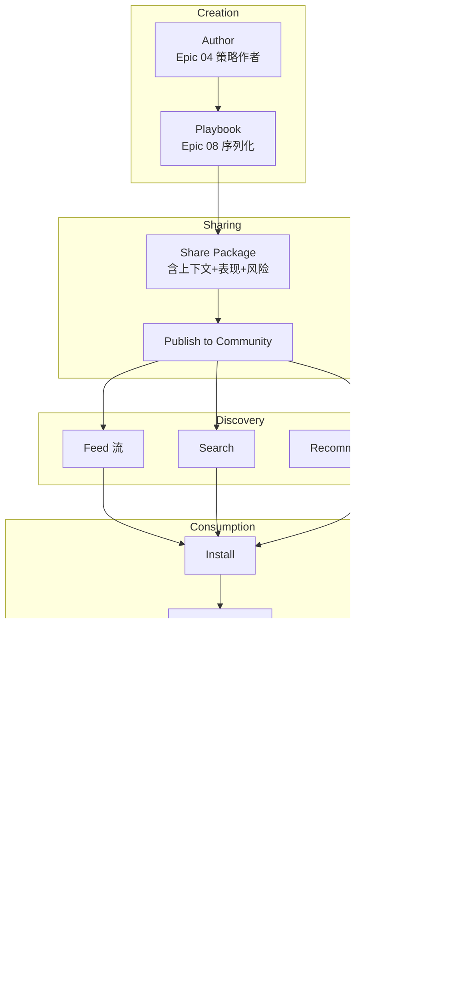

# Epic 07: Share & Community

**Epic 编号**: 07
**模块名称**: Share & Community（分享与社区）
**优先级顺序**: 7（B3 中"7"位置）
**文档性质标签**: [A] + [B] + [C]
**Spec 模板**: to-spec
**最后更新**: 2026-07-19

---

## 1. Problem Statement

### 1.1 用户视角问题 [B]

Prosumer Brenda 写了一个好策略，想分享给朋友 Alex 时：

- **闭源平台不可分享**：Quantopian 已停、WorldQuant Brain 策略不公开、Alpaca 仅个人策略可见——无法分享
- **分享形式单一**：现有平台仅"复制策略 ID"，缺少"上下文 + 表现 + 风险说明"的完整分享包
- **UGC 质量参差**：Reddit r/algotrading 充斥不可执行的"想法"贴，无法一键运行验证
- **缺乏反馈闭环**：分享后不知道谁用了、用得怎么样、有没有改进建议
- **无激励机制**：优质策略作者无收益，导致内容枯竭

### 1.2 工程视角问题 [B]

- **Playbook 与 Share 关系**：用户决策"Playbook System 是 Epic 08"——本 Epic 仅负责"分享/发现/安装/反馈"链路，Playbook 本身定义归 Epic 08
- **UGC 审核**：策略分享需经过 schema 校验 + 反作弊 + 风险提示
- **社区治理**：评论/点赞/举报/封禁机制
- **Cloudflare 免费层约束**：D1 存元数据，R2 存 Playbook YAML 大文件

### 1.3 竞品现状分析 [A]

竞品当前在社区层呈现 [INFERRED]：
- 不支持公开分享策略
- 无 UGC 社区
- 仅"复制策略 ID 给朋友"私下分享

**本 Epic 核心差异化特性 [C]**：
- 完整 UGC 社区（分享/发现/安装/反馈）
- Playbook 包（含上下文 + 表现 + 风险说明）
- 创作者激励（Credit 分成）

---

## 2. Solution

### 2.1 总体架构 [B]



### 2.2 Share Package 设计 [B] - **关键决策**

**Share Package = Playbook YAML + 元数据 + 表现快照 + 风险提示**

```yaml
# share_package 示例
package_id: "pkg_abc123"
version: "1.0"

playbook:
  playbook_id: "pb_nvda_macross_v1"
  yaml_ref: "r2://playbooks/pb_nvda_macross_v1.yaml"

metadata:
  title: "NVDA 双均线金叉策略"
  author: { id: "brenda", name: "Brenda", avatar: "..." }
  description: "50/200 SMA crossover on NVDA, paper-tested 6 months"
  tags: ["momentum", "single-stock", "low-frequency"]
  created_at: "2025-12-15T10:00:00Z"
  installed_count: 0
  rating_avg: 0

performance_snapshot:
  backtest_period: "2024-01-01 to 2025-12-31"
  total_return: 23.5
  sharpe: 1.42
  max_drawdown: 8.3
  win_rate: 58
  benchmark: "SPY"
  benchmark_return: 18.2
  alpha: 5.3

risk_disclosure:
  - "Past performance does not guarantee future results."
  - "Strategy optimized on NVDA may not generalize to other stocks."
  - "No stop-loss configured; user should add own risk management."
  - "Backtest period included bull market; bear market performance unknown."

license:
  type: "CC-BY-4.0"
  commercial_use: true
  attribution_required: true
```

### 2.3 社区功能矩阵 [B]

| 功能 | 描述 | Phase |
|---|---|---|
| 发布 | 把 Playbook 发布到社区 | 1 |
| Feed 流 | 时间序展示最新/热门 | 1 |
| 搜索 | 按标签/作者/标题搜索 | 1 |
| 安装 | 一键安装到自己的策略库 | 1 |
| 评分 | 1-5 星评分 | 1 |
| 评论 | 公开评论 | 1 |
| 举报 | 举报违规内容 | 1 |
| 推荐 | 基于行为推荐相似 Playbook | 1.5 |
| 关注作者 | 订阅作者更新 | 1.5 |
| Credit 分成 | 安装时作者获 0.5 Credit | 2 |

### 2.4 D1 Schema [B]

> **注意（2026-07-19 修订）**：`community_playbooks.yaml_r2_key` 列已移除 per [ADR-0011](../../architecture/adr-0011-d1-schema-master.md)。
> 通过 `playbook_id` JOIN `playbook_versions.yaml_r2_key` 获取 R2 key。
> `status` 列已重命名为 `moderation_status` 以避免歧义。
> `playbook_installs` 表已合并入 `user_playbook_installs`(与 EP08 共享)。Canonical schema 见 ADR-0011 §Master Schema。

```sql
-- 已发布 Playbook
CREATE TABLE community_playbooks (
  package_id     TEXT PRIMARY KEY,
  playbook_id    TEXT NOT NULL REFERENCES playbooks(id) ON DELETE CASCADE,  -- FK added per ADR-0011
  author_id      TEXT NOT NULL REFERENCES users(id) ON DELETE CASCADE,
  title          TEXT NOT NULL,
  description    TEXT,
  tags           TEXT,  -- JSON array
  -- yaml_r2_key column REMOVED per ADR-0011 - JOIN playbook_versions via playbook_id+version
  version        TEXT DEFAULT "1.0",
  moderation_status TEXT DEFAULT "active",  -- renamed from `status` per ADR-0011: active/removed/banned
  installed_count INTEGER DEFAULT 0,
  rating_avg     REAL DEFAULT 0,
  rating_count   INTEGER DEFAULT 0,
  created_at     TEXT DEFAULT (datetime('now'))
);

CREATE INDEX idx_cp_status_created ON community_playbooks(moderation_status, created_at);
CREATE INDEX idx_cp_author ON community_playbooks(author_id);

-- 安装记录 (MERGED with EP08 user_playbooks into user_playbook_installs per ADR-0011)
-- Old playbook_installs table is DEPRECATED. Use user_playbook_installs (see ADR-0011 §Master Schema Migration 007):
-- CREATE TABLE user_playbook_installs (
--   user_id            TEXT NOT NULL REFERENCES users(id) ON DELETE CASCADE,
--   playbook_id        TEXT NOT NULL REFERENCES playbooks(id) ON DELETE CASCADE,
--   package_id         TEXT NOT NULL REFERENCES community_playbooks(package_id) ON DELETE CASCADE,
--   installed_version  TEXT NOT NULL,
--   installed_at       TEXT DEFAULT (datetime('now')),
--   PRIMARY KEY (user_id, playbook_id)
-- );

-- 评分
CREATE TABLE playbook_ratings (
  user_id        TEXT NOT NULL REFERENCES users(id) ON DELETE CASCADE,
  package_id     TEXT NOT NULL REFERENCES community_playbooks(package_id) ON DELETE CASCADE,
  rating         INTEGER NOT NULL,  -- 1-5
  created_at     TEXT DEFAULT (datetime('now')),
  PRIMARY KEY (user_id, package_id)
);

-- 评论
CREATE TABLE playbook_comments (
  id             INTEGER PRIMARY KEY AUTOINCREMENT,
  package_id     TEXT NOT NULL REFERENCES community_playbooks(package_id) ON DELETE CASCADE,
  user_id        TEXT NOT NULL REFERENCES users(id) ON DELETE CASCADE,
  content        TEXT NOT NULL,
  parent_id      INTEGER REFERENCES playbook_comments(id) ON DELETE CASCADE,  -- FK added per ADR-0011 (self-reference)
  moderation_status TEXT DEFAULT "active",  -- renamed from `status` per ADR-0011: active/hidden/deleted
  created_at     TEXT DEFAULT (datetime('now'))
);

-- 举报
CREATE TABLE playbook_reports (
  id             INTEGER PRIMARY KEY AUTOINCREMENT,
  package_id     TEXT NOT NULL REFERENCES community_playbooks(package_id) ON DELETE CASCADE,
  reporter_id    TEXT NOT NULL REFERENCES users(id) ON DELETE CASCADE,
  reason         TEXT NOT NULL,
  description    TEXT,
  moderation_status TEXT DEFAULT "pending",  -- renamed from `status` per ADR-0011: pending/resolved/rejected
  created_at     TEXT DEFAULT (datetime('now'))
);
```

### 2.5 反作弊机制 [B]

```typescript
class AntiAbuseFilter {
  // 1. 内容审核
  async reviewPlaybook(yaml: string): Promise<ReviewResult> {
    // 检查是否含敏感词（政治/歧视）
    if (this.containsForbiddenWords(yaml)) {
      return { ok: false, reason: "Contains forbidden content" };
    }
    // 检查是否抄袭（hash 比对）
    const hash = sha256(yaml);
    const existing = await db.query("SELECT * FROM community_playbooks WHERE hash = ?", hash);
    if (existing) return { ok: false, reason: "Duplicate" };
    return { ok: true };
  }

  // 2. 频率限制
  async checkRate(userId: string): Promise<boolean> {
    const todayCount = await db.query(
      "SELECT COUNT(*) as c FROM community_playbooks WHERE author_id = ? AND created_at > date('now', '-1 day')",
      userId
    );
    return todayCount.c < 5;  // 每天 5 篇上限
  }

  // 3. 刷评分检测
  async detectRatingFraud(packageId: string): Promise<boolean> {
    const ratings = await db.query("SELECT user_id FROM playbook_ratings WHERE package_id = ?", packageId);
    // 检测同一 IP 段集中评分
    // ...
    return false;
  }
}
```

### 2.6 推荐算法（Phase 1.5）[B]

```typescript
class PlaybookRecommender {
  // Phase 1: 简单标签匹配 + 热度
  async recommend(userId: string, limit = 10): Promise<Playbook[]> {
    const userTags = await getUserInterestedTags(userId);
    return db.query(`
      SELECT * FROM community_playbooks
      WHERE status = 'active'
      AND (tags LIKE ? OR installed_count > 100)
      ORDER BY installed_count DESC, rating_avg DESC
      LIMIT ?
    `, userTags, limit);
  }

  // Phase 1.5: Vectorize 语义检索
  async recommendByVector(userId: string): Promise<Playbook[]> {
    const userProfile = await getUserEmbedding(userId);
    const candidates = await vectorize.query(userProfile, { topK: 50 });
    return rerankByPopularity(candidates);
  }
}
```

### 2.7 创作者激励（Phase 2）[B]

```typescript
// Phase 2 启用：每次安装作者获 0.5 Credit
async function onInstall(packageId: string, installerId: string) {
  const pkg = await db.query("SELECT author_id FROM community_playbooks WHERE package_id = ?", packageId);
  await creditSystem.grant(pkg.author_id, 0.5, {
    reason: "playbook_install",
    package_id: packageId,
    installer_id: installerId
  });
}
```

---

## 3. User Stories

### Job Stories [B]

1. **When** Brenda 写好策略，**I want to** 一键发布到社区，**so that** 朋友 Alex 可以一键安装。
2. **When** Alex 浏览社区，**I want to** 看到热门 Playbook Feed 流，**so that** 发现好策略。
3. **When** Alex 搜索"momentum"标签，**I want to** 看到所有 momentum 策略，**so that** 按主题找。
4. **When** Alex 看到一个 Playbook，**I want to** 看到作者的回测快照 + 风险提示，**so that** 评估可信度。
5. **When** Alex 安装 Playbook，**I want to** 自动复用作者回测参数再跑一次，**so that** 验证一致性。
6. **When** Alex 用了一周觉得好，**I want to** 给 5 星好评 + 评论，**so that** 帮助作者也帮助其他用户。
7. **When** Brenda 看到自己的 Playbook 有 100 安装，**I want to** 看到完整安装列表和评分分布，**so that** 有成就感。
8. **When** Alex 发现一个 Playbook 抄袭 Brenda 的，**I want to** 举报且看到处理结果，**so that** 维护社区质量。

### As-a Stories [B]

1. As a Prosumer, I want to 一键发布 Playbook，so that 分享给社区。
2. As a Free User, I want to 浏览社区不需注册，so that 探索价值。
3. As a Prosumer, I want to 安装 Playbook 后可二次编辑，so that 改进策略。
4. As an Author, I want to 看到安装数/评分/评论统计，so that 了解反馈。
5. As a User, I want to 看到风险提示，so that 知道策略局限。
6. As a Developer, I want to 通过 Schema 校验 Playbook 包格式，so that 保证质量。
7. As an Admin, I want to 处理举报和封禁违规内容，so that 维护社区。
8. As an Interviewer, I want to 看到完整 UGC 闭环设计，so that 评估产品思维。

### BDD Gherkin [B]

```gherkin
Feature: Playbook 社区分享

  Scenario: 发布 Playbook
    Given Brenda 已有策略 MA Cross，状态 = backtested
    When Brenda 点击 "Publish to Community"
    Then 生成 Share Package（含 metadata + performance_snapshot + risk_disclosure）
    And 上传 Playbook YAML 到 R2
    And 在 community_playbooks 表插入记录
    And 状态 = active
    And 安装数 = 0

  Scenario: 安装 Playbook
    Given Alex 浏览社区
    When Alex 安装 Brenda 的 NVDA MA Cross
    Then playbook_installs 插入记录 (alex, pkg_abc)
    And installed_count += 1
    And Alex 策略库新增一条策略（可编辑但保留 author_id 引用）

  Scenario: 评分
    Given Alex 已安装 Brenda 的 Playbook
    When Alex 给 5 星评分
    Then playbook_ratings 插入或更新 (alex, pkg_abc, 5)
    And rating_avg 重新计算
    And rating_count += 1（首次评分）

  Scenario: 评论嵌套回复
    Given Alex 评论 Brenda 的 Playbook
    When Brenda 回复 Alex 的评论
    Then playbook_comments 插入 parent_id = Alex 评论 id 的记录

  Scenario: 举报
    Given Alex 看到抄袭 Playbook
    When Alex 举报 reason = "plagiarism"
    Then playbook_reports 插入记录 status = pending
    And 管理员收到通知

  Scenario: 反作弊 - 重复发布检测
    Given Brenda 已发布相同 hash 的 Playbook
    When Brenda 重新发布
    Then 返回错误 "Duplicate package"

  Scenario: 反作弊 - 频率限制
    Given Brenda 今日已发布 5 个 Playbook
    When Brenda 再发布第 6 个
    Then 返回错误 "Daily limit exceeded"

  Scenario: Mock 模式预置社区数据
    Given USE_MOCK=true
    When 用户访问社区
    Then 显示 10 个预置 Playbook（mock_data/community/*.json）
    And 安装数/评分/评论均为预置值
```

---

## 4. Implementation Decisions

### ID-1: Share Package 是 Playbook 的"包装" [B]

- Playbook（Epic 08）= 可执行 YAML
- Share Package = Playbook + metadata + performance + risk + license
- 发布流程：策略 → Playbook → Share Package → 社区

### ID-2: R2 存 Playbook YAML 大文件 [B]

```typescript
async function uploadPlaybook(yaml: string): Promise<string> {
  const key = `playbooks/pb_${generateId()}.yaml`;
  await R2.put(key, yaml);
  return key;
}
```

D1 仅存元数据 + R2 key 引用，避免 D1 单行过大。

### ID-3: 安装即"复制引用"而非"复制内容" [B]

```typescript
async function installPackage(userId: string, packageId: string) {
  // 不复制 Playbook 内容，仅创建引用
  await db.run(`
    INSERT INTO user_strategies (user_id, package_id, source = "community")
    VALUES (?, ?, "community")
  `, userId, packageId);
  // 用户可以基于此 fork 自己的版本
}
```

### ID-4: 评论支持嵌套 2 层 [B]

- 评论 → 回复（1 层）
- 回复 → 回复的回复（2 层）
- 不支持更深嵌套（防垃圾评论树）

### ID-5: 评分去重 [B]

- 每个用户对每个 Playbook 仅 1 个评分
- 重新评分覆盖旧评分

### ID-6: 举报分级 [B]

| 严重度 | 类型 | 处理 |
|---|---|---|
| 高 | 抄袭/欺诈 | 自动隐藏 + 人工复核 |
| 中 | 误导性描述 | 人工复核 |
| 低 | 内容不当 | 7 天内复核 |

### ID-7: Mock 模式预置社区数据 [B]

> **注意（2026-07-19 修订）**：原稿引用 `mock_data/community/playbooks.json`，与 ADR-0001 §API-0002 canonical path 不一致。
> 已对齐为 `web/public/mock/community/`。详见 [ADR-0001](../../architecture/adr-0001-use-mock-dual-mode-switch.md)。

```json
// web/public/mock/community/index.json (canonical path per ADR-0001 API-0002)
{
  "playbooks": [
    {
      "package_id": "pkg_mock_001",
      "title": "NVDA Momentum Master",
      "author": { "id": "mock_brenda", "name": "Brenda" },
      "installed_count": 234,
      "rating_avg": 4.5,
      "rating_count": 87,
      "tags": ["momentum", "single-stock"]
    },
    // ... 共 10 个预置 Playbook
  ]
}
```

---

## 5. Testing Decisions

### 5.1 Test Seams 表 [B]

| Seam | 类型 | 测试内容 |
|---|---|---|
| TS-1 | Unit | Share Package schema 校验 |
| TS-2 | Unit | 反作弊 - 重复检测/频率限制 |
| TS-3 | Integration | 发布 → 安装 → 评分 → 评论 闭环 |
| TS-4 | E2E | 完整社区流程 |
| TS-5 | Contract | Mock 预置数据格式与生产一致 |

### 5.2 Golden Set [B]

```typescript
describe("Community Golden Set", () => {
  it("完整 UGC 闭环", async () => {
    // Brenda 发布
    const pkg = await publishPackage(brendaStrategy);
    // Alex 安装
    await installPackage("alex", pkg.id);
    // Alex 评分
    await ratePackage("alex", pkg.id, 5);
    // Alex 评论
    await commentPackage("alex", pkg.id, "Great strategy!");
    // Brenda 回复
    await replyComment("brenda", commentId, "Thanks!");
    // 验证
    const updated = await getPackage(pkg.id);
    expect(updated.installed_count).toBe(1);
    expect(updated.rating_avg).toBe(5);
    expect(updated.rating_count).toBe(1);
  });

  it("反作弊全部生效", async () => {
    // 重复发布、频率超限、刷评分检测
  });
});
```

### 5.3 测试策略 [B]

- **Unit**：纯函数 + 反作弊规则
- **Integration**：UGC 闭环（用 Miniflare）
- **E2E**：浏览器自动化模拟 Brenda/Alex 互动

---

## 6. Out of Scope

### 6.1 模块级非目标 [B]

- **真实社交关系链**（关注/私信）：Phase 2
- **付费 Playbook 市场**：Phase 3
- **创作者现金分成**：Phase 3
- **视频/直播内容**：Phase 3
- **论坛/BBS 模块**：Phase 2 考虑
- **多语言社区**：Phase 2

### 6.2 模块级反模式 [B]

- ❌ **未校验直接发布**：必须经过 schema + 反作弊审核
- ❌ **安装即复制 Playbook 内容**：仅创建引用，避免数据冗余
- ❌ **评分无去重**：每用户每 Playbook 1 评分
- ❌ **评论嵌套无限深**：最多 2 层
- ❌ **举报无优先级**：必须分级处理
- ❌ **Mock 模式无预置数据**：必须预置 10 个 Playbook 样本

---

## 7. Further Notes

### 7.1 参考 [KNOWN]

- Reddit API: https://www.reddit.com/dev/api
- Hashnode community design: https://hashnode.com/
- Discourse forum: https://www.discourse.org/

### 7.2 待解问题 [B]

- Q1: 是否需要私信功能？→ Phase 2
- Q2: 是否需要创作者分成？→ Phase 2

### 7.3 依赖 [B]

- **上游**：Epic 04 Strategy DSL（策略源）、Epic 08 Playbook System（序列化）
- **下游**：Epic 05 Dashboard（社区 Feed widget）

---

## 8. Acceptance Criteria

- [ ] Share Package schema 定义并校验
- [ ] 发布流程：策略 → Playbook → Share Package → 社区
- [ ] Feed 流（按时间序 + 按热度）
- [ ] 搜索（按标签/作者/标题）
- [ ] 安装（创建引用，不复制内容）
- [ ] 评分（1-5 星，去重）
- [ ] 评论（嵌套 2 层）
- [ ] 举报（分级处理）
- [ ] 反作弊：重复检测 + 频率限制
- [ ] R2 存储 Playbook YAML 大文件
- [ ] D1 schema 含 6 张表
- [ ] Mock 模式预置 10 个 Playbook
- [ ] 创作者激励占位（Phase 2 启用）
- [ ] Golden Set 测试通过

---

## 9. 版本历史

| 版本 | 日期 | 变更 |
|---|---|---|
| 0.1 | 2026-07-19 | 初稿，含 Share Package 设计、UGC 闭环、反作弊、Mock 预置 |
