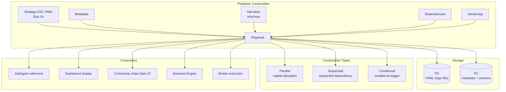
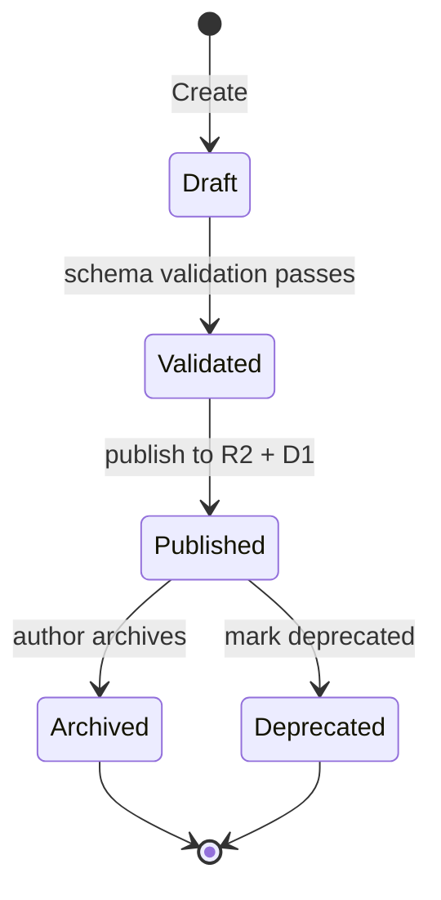

# Epic 08: Playbook System

**Epic Number**: 08
**Module Name**: Playbook System (Composable Strategy Package System)
**Priority Order**: 8 (position "8" in B3, the last one)
**Document Nature Tag**: [A] + [B] + [C]
**Spec Template**: to-spec
**Last Updated**: 2026-07-19

---

## 1. Problem Statement

### 1.1 User Perspective Problems [B]

When Prosumer Brenda has 3 strategies she wants to combine and execute:

- **Strategy silos**: Each strategy runs independently, no combination management mechanism—cannot express "50% funds run MA Cross + 30% run RSI + 20% run Bollinger"
- **Not composable**: Existing platforms' strategy formats are closed, strategy A's output cannot be strategy B's input
- **No version management**: Changed a line in the strategy, don't know what changed, when, or why
- **No dependencies**: Strategy A needs to "first get NVDA earnings"—cannot express this prerequisite
- **No contentization**: Strategy is just code, lacks the narrative of "why written this way"
- **JD requirement**: JD.md item 3 "Design a Playbook system to make it a composable content and distribution engine"—this is the core deliverable of the CPO role

### 1.2 Engineering Perspective Problems [B]

- **Playbook vs DSL relationship**: DSL is the strategy syntax (Epic 04), Playbook is the executable package containing DSL + metadata + narrative + dependencies
- **Composition semantics**: How to express "composition"—parallel execution/sequential dependency/conditional trigger
- **Versioning**: Each modification generates a new version, old versions still accessible
- **R2 storage**: Playbook YAML large files in R2, D1 stores metadata
- **Discoverability**: Playbook must be referenceable by Ask Agent / Community / Dashboard

### 1.3 Competitor Status Analysis [A]

Competitors currently show in Playbook system [INFERRED]:
- Single-strategy DSL (Epic 04 scope)
- No composition support
- No explicit version management
- No narrative contentization

**This Epic's core differentiating features [C]**:
- Complete Playbook package (DSL + metadata + narrative + dependencies)
- Explicit composition semantics
- Versioning (semantic versioning)
- Narrative contentization (why + how)

---

## 2. Solution

### 2.1 Overall Architecture [B]



### 2.2 Playbook Schema Design [B] - **Key Decision**

```yaml
# NovaInvest Playbook v1.0
api_version: "playbook.nova-invest.dev/v1"
kind: "Playbook"

metadata:
  id: "pb_nvda_macross_v1"               # globally unique
  title: "NVDA Dual Moving Average Golden Cross Strategy"
  description: "50/200 SMA crossover for NVDA, paper-tested 6 months"
  author:
    id: "brenda@example.com"
    name: "Brenda Liu"
  created_at: "2025-12-15T10:00:00Z"
  updated_at: "2025-12-15T10:00:00Z"

versioning:
  semantic_version: "1.2.0"               # MAJOR.MINOR.PATCH
  changelog:
    - version: "1.0.0"
      date: "2025-10-01"
      changes: "Initial version"
    - version: "1.1.0"
      date: "2025-11-01"
      changes: "Added stop-loss at 7%"
    - version: "1.2.0"
      date: "2025-12-15"
      changes: "Tuned SMA periods based on backtest"

narrative:
  why: |
    NVDA is a high-momentum stock in bull markets. The 50/200 SMA crossover
    captures medium-term trends while filtering short-term noise.
  how: |
    Buy when 50-day SMA crosses above 200-day SMA. Sell on crossunder.
    Use 10% position sizing with 7% stop-loss.
  risks:
    - "Whipsaw in sideways markets"
    - "Lagging signal; may enter late"
    - "No protection against gap-down moves"
  references:
    - "Investopedia: https://www.investopedia.com/terms/d/deathcross.asp"
    - "My backtest report: backtest_abc123"

dependencies:
  data:
    - source: "yahoo"        # or "mock"
      symbols: ["NVDA"]
      timeframe: "1d"
  tools:
    - name: "sma_calculator"
      version: ">=1.0"
  playbooks:                  # reference other Playbooks
    - id: "pb_risk_manager_v1"
      version: ">=1.0"

strategy:                      # reference Epic 04 DSL
  dsl_ref: "r2://strategies/str_nvda_macross_v1.2.yaml"
  # or inline
  # dsl_inline: ...

composition:                   # only exists when composing Playbooks
  type: "parallel"             # parallel / sequential / conditional
  allocation:                   # allocate capital when parallel
    - playbook_id: "pb_nvda_macross_v1"
      weight: 0.5
    - playbook_id: "pb_aapl_rsi_v1"
      weight: 0.3
    - playbook_id: "pb_tsla_bollinger_v1"
      weight: 0.2

  # or sequential
  # sequence:
  #   - playbook_id: "pb_fetch_earnings_v1"
  #   - playbook_id: "pb_macross_v1"
  #     depends_on: "pb_fetch_earnings_v1"

  # or conditional
  # condition:
  #   if: "earnings_beat"
  #   then: "pb_macross_v1"
  #   else: "pb_hold_v1"

execution:
  default_mode: "paper"        # paper / live
  schedule: "daily"
  max_concurrent: 5

compliance:
  risk_warning: "Past performance does not guarantee future results."
  license: "CC-BY-4.0"
  commercial_use: true
```

### 2.3 Playbook Types [B]

| Type | Purpose | Example |
|---|---|---|
| `strategy` | Single-strategy Playbook | "NVDA MA Cross" |
| `composite` | Combine multiple Playbooks | "Momentum 50% + RSI 30% + Bollinger 20%" |
| `data_fetcher` | Data fetch Playbook (dependency only) | "Fetch NVDA earnings daily" |
| `risk_manager` | Risk management Playbook | "Enforce 5% stop-loss across all strategies" |
| `alert` | Alert Playbook | "Email me when portfolio drawdown > 10%" |
| `narrative` | Pure narrative Playbook (not executable) | "My investment thesis on NVDA" |

### 2.4 Composition Semantics [B] - **Key Decision**

#### 2.4.1 Parallel

```yaml
composition:
  type: "parallel"
  allocation:
    - playbook_id: "pb_ma_cross"
      weight: 0.5
    - playbook_id: "pb_rsi"
      weight: 0.3
    - playbook_id: "pb_bollinger"
      weight: 0.2
  # total weight must = 1.0
```

Capital allocated to each sub-Playbook by weight.

#### 2.4.2 Sequential (sequential dependency)

```yaml
composition:
  type: "sequential"
  sequence:
    - playbook_id: "pb_fetch_earnings"
    - playbook_id: "pb_analyze_earnings"
      depends_on: "pb_fetch_earnings"
    - playbook_id: "pb_trade_on_earnings"
      depends_on: "pb_analyze_earnings"
```

Execution order: A → B (after A completes) → C (after B completes).

#### 2.4.3 Conditional (conditional trigger)

```yaml
composition:
  type: "conditional"
  condition:
    if:
      field: "earnings.surprise"
      op: ">"
      value: 0
    then: "pb_trade_long"
    else: "pb_hold"
```

#### 2.4.4 Composition Nesting

Composite Playbooks can nest other composite Playbooks:

```yaml
composition:
  type: "parallel"
  allocation:
    - playbook_id: "pb_momentum_combo"   # itself is composite
      weight: 0.7
    - playbook_id: "pb_value_combo"
      weight: 0.3
```

### 2.5 Versioning Strategy [B]

**Semantic Versioning SemVer**:

- MAJOR: DSL incompatible change (schema change)
- MINOR: backward-compatible feature addition
- PATCH: bug fix / parameter tweak

**Version management D1 Schema**:

```sql
CREATE TABLE playbook_versions (
  playbook_id    TEXT NOT NULL,
  version        TEXT NOT NULL,  -- "1.2.0"
  yaml_r2_key    TEXT NOT NULL,
  changelog      TEXT,
  published_by   TEXT NOT NULL,
  published_at   TEXT DEFAULT (datetime('now')),
  PRIMARY KEY (playbook_id, version)
);

CREATE INDEX idx_pbv_playbook ON playbook_versions(playbook_id, published_at DESC);
```

**Version query**:

```typescript
async function getPlaybook(id: string, version?: string): Promise<Playbook> {
  if (version) {
    return db.query("SELECT * FROM playbook_versions WHERE playbook_id = ? AND version = ?", id, version);
  }
  // default return latest version
  return db.query("SELECT * FROM playbook_versions WHERE playbook_id = ? ORDER BY published_at DESC LIMIT 1", id);
}
```

### 2.6 Narrative Contentization [B] - **Key Decision**

**JD requirement**: "Design a Playbook system to make it a composable content and distribution engine"

**Narrative fields = make Playbook not just code, but a knowledge carrier**:

```yaml
narrative:
  why: "..."        # why designed this way
  how: "..."        # how to implement
  risks: [...]      # risk disclosures
  references: [...] # references
  lessons_learned: "..."   # lessons learned (optional)
  faq:               # FAQ (optional)
    - q: "Why SMA 50/200?"
      a: "Industry standard for medium-term trend"
```

**Narrative content Markdown rendering**:

```typescript
// src/components/PlaybookNarrative.tsx
function PlaybookNarrative({ playbook }: { playbook: Playbook }) {
  return (
    <div className="prose prose-invert max-w-none">
      <h2>Why</h2>
      <ReactMarkdown>{playbook.narrative.why}</ReactMarkdown>
      <h2>How</h2>
      <ReactMarkdown>{playbook.narrative.how}</ReactMarkdown>
      <h2>Risks</h2>
      <ul>{playbook.narrative.risks.map(r => <li key={r}>{r}</li>)}</ul>
      <h2>References</h2>
      <ul>{playbook.narrative.references.map(r => <li key={r}><a href={r}>{r}</a></li>)}</ul>
    </div>
  );
}
```

### 2.7 Playbook Lifecycle [B]



### 2.8 D1 Schema Complete [B]

> **Note (revised 2026-07-19)**: `playbooks.status` renamed to `lifecycle_status` per [ADR-0011](../../architecture/adr-0011-d1-schema-master.md).
> `playbook_dependencies` primary key fixed (removed `dependency_type`, changed to `(parent_id, child_id)`).
> `user_playbooks` table merged into `user_playbook_installs` (shared with EP07). Canonical schema see ADR-0011 §Master Schema.

```sql
-- Playbook main table (latest version)
CREATE TABLE playbooks (
  id             TEXT PRIMARY KEY,
  title          TEXT NOT NULL,
  description    TEXT,
  author_id      TEXT NOT NULL REFERENCES users(id) ON DELETE CASCADE,
  kind           TEXT NOT NULL,  -- strategy/composite/data_fetcher/risk_manager/alert/narrative
  current_version TEXT NOT NULL,
  lifecycle_status TEXT DEFAULT "published",  -- renamed from `status` per ADR-0011: draft/published/archived/deprecated
  created_at     TEXT DEFAULT (datetime('now')),
  updated_at     TEXT DEFAULT (datetime('now'))
);

-- Version table (defined in 2.5)
-- playbook_versions: PRIMARY KEY (playbook_id, version) per ADR-0011

-- Playbook reference relations (composition)
CREATE TABLE playbook_dependencies (
  parent_id      TEXT NOT NULL REFERENCES playbooks(id) ON DELETE CASCADE,
  child_id       TEXT NOT NULL REFERENCES playbooks(id) ON DELETE CASCADE,
  child_version  TEXT,  -- optional pinned version
  dependency_type TEXT NOT NULL,  -- parallel/sequential/conditional/data
  weight         REAL,  -- weight when parallel
  created_at     TEXT DEFAULT (datetime('now')),
  PRIMARY KEY (parent_id, child_id)  -- FIX per ADR-0011: removed dependency_type from PK
);

-- User install records (MERGED with EP07 playbook_installs into user_playbook_installs per ADR-0011)
-- Old user_playbooks table is DEPRECATED. Use user_playbook_installs (see ADR-0011 §Master Schema Migration 007):
-- CREATE TABLE user_playbook_installs (
--   user_id            TEXT NOT NULL REFERENCES users(id) ON DELETE CASCADE,
--   playbook_id        TEXT NOT NULL REFERENCES playbooks(id) ON DELETE CASCADE,
--   package_id         TEXT NOT NULL REFERENCES community_playbooks(package_id) ON DELETE CASCADE,
--   installed_version  TEXT NOT NULL,
--   installed_at       TEXT DEFAULT (datetime('now')),
--   PRIMARY KEY (user_id, playbook_id)
-- );
```

### 2.9 Core API [B]

```typescript
// POST /api/playbooks
interface CreatePlaybookRequest {
  title: string;
  description: string;
  kind: PlaybookKind;
  dsl_yaml: string;        // inline or R2 reference
  narrative?: Narrative;
  composition?: Composition;
}

// GET /api/playbooks/:id?version=1.2.0
interface GetPlaybookResponse {
  playbook: Playbook;
  yaml_content: string;  // read from R2
}

// POST /api/playbooks/:id/versions
interface PublishVersionRequest {
  version: string;  // "1.3.0"
  changelog: string;
  yaml: string;
}

// POST /api/playbooks/:id/compose
interface ComposeRequest {
  composition: Composition;
}
```

---

## 3. User Stories

### Job Stories [B]

1. **When** Brenda finishes writing a strategy, **I want to** wrap it as a Playbook with narrative content, **so that** it's not just code but knowledge.
2. **When** Brenda wants to combine multiple strategies, **I want to** use parallel/sequential/conditional three composition methods, **so that** I can express complex logic.
3. **When** Brenda modifies strategy parameters, **I want to** generate a new version number and preserve old versions, **so that** I can trace history.
4. **When** Brenda views a Playbook, **I want to** see why/how/risks/references complete narrative, **so that** I understand the design thinking.
5. **When** Ask Agent answers questions about strategies, **I want to** reference the Playbook's narrative field, **so that** answers have context.
6. **When** Brenda shares a Playbook in community (Epic 07), **I want to** complete narrative auto-included in the Share Package, **so that** recipients understand.
7. **When** Brenda wants to roll back to an old version, **I want to** select a historical version to one-click switch, **so that** I can fix introduced regressions.
8. **When** Brenda creates a composite Playbook, **I want to** system auto-validate total weight = 1, **so that** I avoid errors.

### As-a Stories [B]

1. As a Prosumer, I want to describe Playbook in YAML, so that it's easy to read and modify.
2. As a Prosumer, I want to see version history and changelog, so that I can trace changes.
3. As a Prosumer, I want to combine multiple Playbooks, so that I can express complex strategies.
4. As a Prosumer, I want to Playbook contains narrative content, so that it's not just code.
5. As a Developer, I want to query/create/version Playbooks via API, so that I can operate programmatically.
6. As an Interviewer, I want to see Playbook system design, so that I can evaluate CPO role core deliverable capability.
7. As a Community User, I want to view narrative after installing others' Playbooks, so that I understand why.
8. As an Admin, I want to archive/deprecate Playbooks, so that I maintain quality.

### BDD Gherkin [B]

```gherkin
Feature: Playbook System

  Scenario: Create single-strategy Playbook
    Given Brenda has strategy DSL YAML
    When calls POST /api/playbooks
    Then generates playbook_id = "pb_xxx"
    And uploads YAML to R2
    And D1 playbooks table inserts record
    And playbook_versions inserts version 1.0.0

  Scenario: Publish new version
    Given Playbook pb_xxx current version 1.0.0
    When calls POST /api/playbooks/pb_xxx/versions version="1.1.0"
    Then playbook_versions inserts new record
    And playbooks.current_version updates to "1.1.0"
    And 1.0.0 version still accessible

  Scenario: Parallel composition
    Given 3 existing Playbooks: A, B, C
    When creates composite Playbook D, type=parallel
    And allocation: A=0.5, B=0.3, C=0.2
    Then playbook_dependencies inserts 3 records
    And total weight = 1.0 (validation passes)

  Scenario: Composition weight validation fails
    Given creates parallel composition weight A=0.5, B=0.3, C=0.4
    When calls create API
    Then returns error "Total weight must equal 1.0 (got 1.2)"

  Scenario: Dependency chain resolution
    Given Playbook D depends on A, B, C
    When loads D
    Then auto recursively loads A, B, C
    And returns complete dependency tree

  Scenario: Narrative field required
    Given creates Playbook missing narrative.why
    When calls create API
    Then returns error "narrative.why is required"

  Scenario: Version rollback
    Given Playbook currently 1.2.0 but has bug
    When user rolls back to 1.0.0
    And executes backtest
    Then uses 1.0.0 YAML
    And playbooks.current_version remains 1.2.0 (no auto-change)

  Scenario: Archive
    Given author archives Playbook pb_xxx
    When calls archive API
    Then playbooks.status = "archived"
    And new installs rejected
    And existing installed users unaffected
```

---

## 4. Implementation Decisions

### ID-1: Playbook YAML Stored in R2 [B]

```typescript
async function uploadPlaybookYAML(yaml: string, playbookId: string, version: string): Promise<string> {
  const key = `playbooks/${playbookId}/${version}.yaml`;
  await R2.put(key, yaml);
  return key;
}
```

### ID-2: Version Number Strict SemVer [B]

```typescript
import semver from "semver";

function validateVersion(oldVersion: string, newVersion: string): ValidationResult {
  if (!semver.valid(newVersion)) return { ok: false, reason: "Invalid semver" };
  if (!semver.gt(newVersion, oldVersion)) return { ok: false, reason: "Must be greater than current" };
  return { ok: true };
}
```

### ID-3: Composition Weight Validation [B]

```typescript
function validateComposition(comp: Composition): ValidationResult {
  if (comp.type === "parallel") {
    const total = comp.allocation.reduce((s, a) => s + a.weight, 0);
    if (Math.abs(total - 1.0) > 0.001) {
      return { ok: false, reason: `Total weight must equal 1.0 (got ${total})` };
    }
  }
  // Check circular dependency
  if (hasCircularDependency(comp)) {
    return { ok: false, reason: "Circular dependency detected" };
  }
  return { ok: true };
}
```

### ID-4: Circular Dependency Detection [B]

```typescript
function hasCircularDependency(root: Playbook, visited = new Set<string>()): boolean {
  if (visited.has(root.id)) return true;
  visited.add(root.id);
  for (const dep of root.composition?.allocation ?? []) {
    if (hasCircularDependency(dep, visited)) return true;
  }
  return false;
}
```

### ID-5: Narrative Field Enforcement [B]

Required fields:
- `narrative.why`: explain why
- `narrative.how`: explain how
- `narrative.risks`: at least 1 risk

Optional fields:
- `narrative.references`
- `narrative.lessons_learned`
- `narrative.faq`

### ID-6: Playbook JSON Schema [B]

Complete JSON Schema see `e:\git\nova-invest\docs\spec\playbook_schema.json` (in spec/ directory).

### ID-7: Execution Engine Integration [B]

```typescript
class PlaybookExecutor {
  async execute(playbook: Playbook, context: ExecutionContext) {
    if (playbook.kind === "strategy") {
      // Single strategy: directly call Epic 04 BacktestEngine or Epic 06 Broker
      return await this.runStrategy(playbook.dsl, context);
    } else if (playbook.kind === "composite") {
      // Composition: dispatch by composition type
      switch (playbook.composition.type) {
        case "parallel":   return await this.runParallel(playbook.composition, context);
        case "sequential": return await this.runSequential(playbook.composition, context);
        case "conditional": return await this.runConditional(playbook.composition, context);
      }
    }
  }

  private async runParallel(comp: Composition, ctx: ExecutionContext) {
    // Allocate capital by weight
    const totalCapital = ctx.capital;
    const promises = comp.allocation.map(async a => {
      const childCtx = { ...ctx, capital: totalCapital * a.weight };
      const child = await this.loadPlaybook(a.playbook_id);
      return this.execute(child, childCtx);
    });
    return Promise.all(promises);
  }
}
```

---

## 5. Testing Decisions

### 5.1 Test Seams Table [B]

| Seam | Type | Test Content |
|---|---|---|
| TS-1 | Unit | Playbook schema validation |
| TS-2 | Unit | Version number SemVer validation |
| TS-3 | Unit | Composition weight total validation |
| TS-4 | Unit | Circular dependency detection |
| TS-5 | Integration | Create → version → compose → execute |
| TS-6 | E2E | Complete Playbook lifecycle |

### 5.2 Golden Set [B]

```typescript
describe("Playbook Golden Set", () => {
  it("complete Playbook lifecycle", async () => {
    // create v1.0.0
    const v1 = await createPlaybook({ ... });
    // publish v1.1.0
    const v11 = await publishVersion(v1.id, "1.1.0", "Added stop-loss");
    // create composite Playbook
    const combo = await createPlaybook({
      kind: "composite",
      composition: { type: "parallel", allocation: [
        { playbook_id: v1.id, weight: 0.5 },
        { playbook_id: otherPb.id, weight: 0.5 }
      ]}
    });
    // load composite and execute
    const result = await executor.execute(combo, ctx);
    expect(result).toBeDefined();
  });

  it("all 3 composition types take effect", async () => {
    // parallel + sequential + conditional
  });

  it("circular dependency rejected", async () => {
    const a = await createPlaybook(...);
    const b = await createPlaybook({
      composition: { type: "parallel", allocation: [{ playbook_id: a.id, weight: 1.0 }] }
    });
    // try to make a depend on b (creating cycle)
    await expect(updatePlaybook(a.id, {
      composition: { type: "parallel", allocation: [{ playbook_id: b.id, weight: 1.0 }] }
    })).rejects.toThrow("Circular dependency");
  });
});
```

### 5.3 Testing Strategy [B]

- **Unit**: schema validation, version numbers, composition weights, circular dependency
- **Integration**: Playbook lifecycle (using Miniflare)
- **E2E**: complete flow + narrative rendering

---

## 6. Out of Scope

### 6.1 Module-level Non-goals [B]

- **Playbook marketplace (paid)**: Phase 3
- **Creator cash share**: Phase 3
- **Complex dependency graph (DAG)**: Phase 2 only supports tree
- **Playbook SDK (external developers)**: Phase 3
- **Playbook version rollback automation**: Phase 1.5 (manual version selection only)

### 6.2 Module-level Anti-patterns [B]

- ❌ **Playbook YAML stored in D1**: D1 only stores metadata, YAML goes to R2
- ❌ **Overwrite without version number**: every change must be versioned
- ❌ **Composition weight ≠ 1.0**: parallel strictly validated
- ❌ **Circular dependency**: must detect
- ❌ **No narrative field**: why/how/risks required
- ❌ **Playbook directly executed without validation**: must first schema validate

---

## 7. Further Notes

### 7.1 References [KNOWN]

- SemVer: https://semver.org/
- Kubernetes YAML design reference: https://kubernetes.io/docs/concepts/overview/working-with-objects/kubernetes-objects/
- ArgoCD Workflows: https://argoproj.github.io/argo-workflows/
- GitHub Actions YAML: https://docs.github.com/en/actions/using-workflows/workflow-syntax-for-github-actions

### 7.2 Open Questions [B]

- Q1: Need Playbook template library? → Phase 1.5
- Q2: Support external Git repo as Playbook source? → Phase 2

### 7.3 Dependencies [B]

- **Upstream**: Epic 04 Strategy DSL (DSL content), Epic 01 AgentHarness (execution runtime)
- **Downstream**: Epic 07 Share & Community (sharing), Epic 05 Dashboard (display), Epic 03 AskAgent (reference narrative)

---

## 8. Acceptance Criteria

- [ ] Playbook YAML Schema v1 defined
- [ ] 6 Playbook kinds supported
- [ ] 3 composition types (parallel/sequential/conditional)
- [ ] Composition weight total validation
- [ ] Circular dependency detection
- [ ] SemVer versioning
- [ ] Narrative field required validation
- [ ] D1 schema contains playbooks + playbook_versions + playbook_dependencies + user_playbooks 4 tables
- [ ] R2 storage for Playbook YAML large files
- [ ] PlaybookExecutor implements 3 composition executions
- [ ] Mock mode presets ≥ 5 Playbook samples
- [ ] Golden Set tests pass
- [ ] API complete (create/get/publish-version/list)

---

## 9. Version History

| Version | Date | Changes |
|---|---|---|
| 0.1 | 2026-07-19 | Initial draft, including Playbook Schema, composition semantics, versioning, narrative fields, execution engine |
