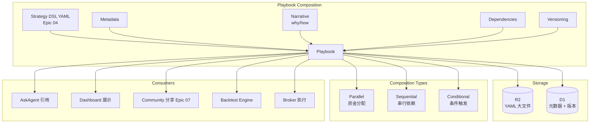
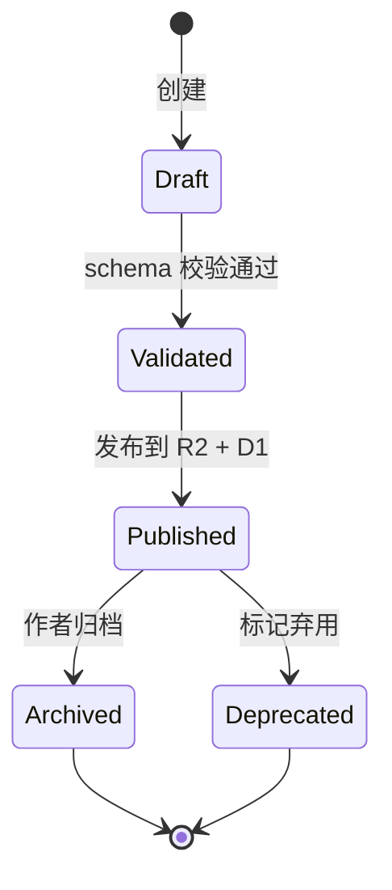

# Epic 08: Playbook System

**Epic 编号**: 08
**模块名称**: Playbook System（可组合策略包系统）
**优先级顺序**: 8（B3 中"8"位置，最后一个）
**文档性质标签**: [A] + [B] + [C]
**Spec 模板**: to-spec
**最后更新**: 2026-07-19

---

## 1. Problem Statement

### 1.1 用户视角问题 [B]

Prosumer Brenda 有 3 个策略想组合执行时：

- **策略孤岛**：每个策略独立运行，无组合管理机制——无法表达"50% 资金跑 MA Cross + 30% 跑 RSI + 20% 跑 Bollinger"
- **不可组合**：现有平台的策略格式封闭，A 策略的输出不能作为 B 策略的输入
- **无版本管理**：策略改了一行不知道改了什么、何时改的、为什么改
- **无依赖关系**：策略 A 需要"先获取 NVDA 财报"——无法表达这种 prerequisite
- **无内容化**：策略只是代码，缺少"为什么这么写"的叙事
- **JD 要求**：JD.md 第 3 条"设计 Playbook 体系，使其成为可组合的内容与分发引擎"——这是 CPO 岗位的核心交付物

### 1.2 工程视角问题 [B]

- **Playbook vs DSL 关系**：DSL 是策略语法（Epic 04），Playbook 是包含 DSL + 元数据 + 叙事 + 依赖的可执行包
- **组合语义**：如何表达"组合"——并行执行/串行依赖/条件触发
- **版本化**：每次修改生成新版本，旧版本仍可访问
- **R2 存储**：Playbook YAML 大文件存 R2，D1 存元数据
- **可发现性**：Playbook 必须可被 Ask Agent / Community / Dashboard 引用

### 1.3 竞品现状分析 [A]

竞品当前 Playbook 系统呈现 [INFERRED]：
- 单策略 DSL（Epic 04 范畴）
- 不支持组合
- 无显式版本管理
- 无叙事内容化

**本 Epic 核心差异化特性 [C]**：
- 完整 Playbook 包（DSL + 元数据 + 叙事 + 依赖）
- 显式组合语义
- 版本化（语义化版本号）
- 叙事内容化（why + how）

---

## 2. Solution

### 2.1 总体架构 [B]



### 2.2 Playbook Schema 设计 [B] - **关键决策**

```yaml
# NovaInvest Playbook v1.0
api_version: "playbook.nova-invest.dev/v1"
kind: "Playbook"

metadata:
  id: "pb_nvda_macross_v1"               # 全局唯一
  title: "NVDA 双均线金叉策略"
  description: "50/200 SMA crossover for NVDA, paper-tested 6 months"
  author:
    id: "brenda@example.com"
    name: "Brenda Liu"
  created_at: "2025-12-15T10:00:00Z"
  updated_at: "2025-12-15T10:00:00Z"

versioning:
  semantic_version: "1.2.0"               # MAJOR.MINOR.PATCH
  changelog:
    - version: "1.0.0"
      date: "2025-10-01"
      changes: "Initial version"
    - version: "1.1.0"
      date: "2025-11-01"
      changes: "Added stop-loss at 7%"
    - version: "1.2.0"
      date: "2025-12-15"
      changes: "Tuned SMA periods based on backtest"

narrative:
  why: |
    NVDA is a high-momentum stock in bull markets. The 50/200 SMA crossover
    captures medium-term trends while filtering short-term noise.
  how: |
    Buy when 50-day SMA crosses above 200-day SMA. Sell on crossunder.
    Use 10% position sizing with 7% stop-loss.
  risks:
    - "Whipsaw in sideways markets"
    - "Lagging signal; may enter late"
    - "No protection against gap-down moves"
  references:
    - "Investopedia: https://www.investopedia.com/terms/d/deathcross.asp"
    - "My backtest report: backtest_abc123"

dependencies:
  data:
    - source: "yahoo"        # 或 "mock"
      symbols: ["NVDA"]
      timeframe: "1d"
  tools:
    - name: "sma_calculator"
      version: ">=1.0"
  playbooks:                  # 引用其他 Playbook
    - id: "pb_risk_manager_v1"
      version: ">=1.0"

strategy:                      # 引用 Epic 04 DSL
  dsl_ref: "r2://strategies/str_nvda_macross_v1.2.yaml"
  # 或内联
  # dsl_inline: ...

composition:                   # 仅在组合 Playbook 时存在
  type: "parallel"             # parallel / sequential / conditional
  allocation:                   # parallel 时分配资金
    - playbook_id: "pb_nvda_macross_v1"
      weight: 0.5
    - playbook_id: "pb_aapl_rsi_v1"
      weight: 0.3
    - playbook_id: "pb_tsla_bollinger_v1"
      weight: 0.2

  # 或 sequential
  # sequence:
  #   - playbook_id: "pb_fetch_earnings_v1"
  #   - playbook_id: "pb_macross_v1"
  #     depends_on: "pb_fetch_earnings_v1"

  # 或 conditional
  # condition:
  #   if: "earnings_beat"
  #   then: "pb_macross_v1"
  #   else: "pb_hold_v1"

execution:
  default_mode: "paper"        # paper / live
  schedule: "daily"
  max_concurrent: 5

compliance:
  risk_warning: "Past performance does not guarantee future results."
  license: "CC-BY-4.0"
  commercial_use: true
```

### 2.3 Playbook 类型 [B]

| 类型 | 用途 | 示例 |
|---|---|---|
| `strategy` | 单策略 Playbook | "NVDA MA Cross" |
| `composite` | 组合多个 Playbook | "Momentum 50% + RSI 30% + Bollinger 20%" |
| `data_fetcher` | 数据获取 Playbook（仅 dependency） | "Fetch NVDA earnings daily" |
| `risk_manager` | 风险管理 Playbook | "Enforce 5% stop-loss across all strategies" |
| `alert` | 告警 Playbook | "Email me when portfolio drawdown > 10%" |
| `narrative` | 纯叙事 Playbook（不可执行） | "My investment thesis on NVDA" |

### 2.4 组合语义 [B] - **关键决策**

#### 2.4.1 Parallel（并行）

```yaml
composition:
  type: "parallel"
  allocation:
    - playbook_id: "pb_ma_cross"
      weight: 0.5
    - playbook_id: "pb_rsi"
      weight: 0.3
    - playbook_id: "pb_bollinger"
      weight: 0.2
  # 总权重必须 = 1.0
```

资金按权重分配给各子 Playbook。

#### 2.4.2 Sequential（串行依赖）

```yaml
composition:
  type: "sequential"
  sequence:
    - playbook_id: "pb_fetch_earnings"
    - playbook_id: "pb_analyze_earnings"
      depends_on: "pb_fetch_earnings"
    - playbook_id: "pb_trade_on_earnings"
      depends_on: "pb_analyze_earnings"
```

执行顺序：A → B（A 完成后）→ C（B 完成后）。

#### 2.4.3 Conditional（条件触发）

```yaml
composition:
  type: "conditional"
  condition:
    if:
      field: "earnings.surprise"
      op: ">"
      value: 0
    then: "pb_trade_long"
    else: "pb_hold"
```

#### 2.4.4 组合嵌套

组合 Playbook 可以嵌套其他组合 Playbook：

```yaml
composition:
  type: "parallel"
  allocation:
    - playbook_id: "pb_momentum_combo"   # 本身是 composite
      weight: 0.7
    - playbook_id: "pb_value_combo"
      weight: 0.3
```

### 2.5 版本化策略 [B]

**语义化版本号 SemVer**：

- MAJOR：DSL 不兼容变更（schema 改动）
- MINOR：向后兼容的功能新增
- PATCH：bug 修复 / 参数微调

**版本管理 D1 Schema**：

```sql
CREATE TABLE playbook_versions (
  playbook_id    TEXT NOT NULL,
  version        TEXT NOT NULL,  -- "1.2.0"
  yaml_r2_key    TEXT NOT NULL,
  changelog      TEXT,
  published_by   TEXT NOT NULL,
  published_at   TEXT DEFAULT (datetime('now')),
  PRIMARY KEY (playbook_id, version)
);

CREATE INDEX idx_pbv_playbook ON playbook_versions(playbook_id, published_at DESC);
```

**版本查询**：

```typescript
async function getPlaybook(id: string, version?: string): Promise<Playbook> {
  if (version) {
    return db.query("SELECT * FROM playbook_versions WHERE playbook_id = ? AND version = ?", id, version);
  }
  // 默认返回最新版本
  return db.query("SELECT * FROM playbook_versions WHERE playbook_id = ? ORDER BY published_at DESC LIMIT 1", id);
}
```

### 2.6 叙事内容化 [B] - **关键决策**

**JD 要求**："设计 Playbook 体系，使其成为可组合的内容与分发引擎"

**叙事字段 = 让 Playbook 不只是代码，更是知识载体**：

```yaml
narrative:
  why: "..."        # 为什么这么设计
  how: "..."        # 怎么实现
  risks: [...]      # 风险提示
  references: [...] # 参考资料
  lessons_learned: "..."   # 经验教训（可选）
  faq:               # 常见问题（可选）
    - q: "Why SMA 50/200?"
      a: "Industry standard for medium-term trend"
```

**叙事内容的 Markdown 渲染**：

```typescript
// src/components/PlaybookNarrative.tsx
function PlaybookNarrative({ playbook }: { playbook: Playbook }) {
  return (
    <div className="prose prose-invert max-w-none">
      <h2>Why</h2>
      <ReactMarkdown>{playbook.narrative.why}</ReactMarkdown>
      <h2>How</h2>
      <ReactMarkdown>{playbook.narrative.how}</ReactMarkdown>
      <h2>Risks</h2>
      <ul>{playbook.narrative.risks.map(r => <li key={r}>{r}</li>)}</ul>
      <h2>References</h2>
      <ul>{playbook.narrative.references.map(r => <li key={r}><a href={r}>{r}</a></li>)}</ul>
    </div>
  );
}
```

### 2.7 Playbook 生命周期 [B]



### 2.8 D1 Schema 完整 [B]

> **注意（2026-07-19 修订）**：`playbooks.status` 已重命名为 `lifecycle_status` per [ADR-0011](../../architecture/adr-0011-d1-schema-master.md)。
> `playbook_dependencies` 主键已修正（移除 `dependency_type`,改为 `(parent_id, child_id)`）。
> `user_playbooks` 表已合并入 `user_playbook_installs`(与 EP07 共享)。Canonical schema 见 ADR-0011 §Master Schema。

```sql
-- Playbook 主表（最新版本）
CREATE TABLE playbooks (
  id             TEXT PRIMARY KEY,
  title          TEXT NOT NULL,
  description    TEXT,
  author_id      TEXT NOT NULL REFERENCES users(id) ON DELETE CASCADE,
  kind           TEXT NOT NULL,  -- strategy/composite/data_fetcher/risk_manager/alert/narrative
  current_version TEXT NOT NULL,
  lifecycle_status TEXT DEFAULT "published",  -- renamed from `status` per ADR-0011: draft/published/archived/deprecated
  created_at     TEXT DEFAULT (datetime('now')),
  updated_at     TEXT DEFAULT (datetime('now'))
);

-- 版本表（已定义在 2.5）
-- playbook_versions: PRIMARY KEY (playbook_id, version) per ADR-0011

-- Playbook 引用关系（组合）
CREATE TABLE playbook_dependencies (
  parent_id      TEXT NOT NULL REFERENCES playbooks(id) ON DELETE CASCADE,
  child_id       TEXT NOT NULL REFERENCES playbooks(id) ON DELETE CASCADE,
  child_version  TEXT,  -- 可选固定版本
  dependency_type TEXT NOT NULL,  -- parallel/sequential/conditional/data
  weight         REAL,  -- parallel 时的权重
  created_at     TEXT DEFAULT (datetime('now')),
  PRIMARY KEY (parent_id, child_id)  -- FIX per ADR-0011: removed dependency_type from PK
);

-- 用户安装记录 (MERGED with EP07 playbook_installs into user_playbook_installs per ADR-0011)
-- Old user_playbooks table is DEPRECATED. Use user_playbook_installs (see ADR-0011 §Master Schema Migration 007):
-- CREATE TABLE user_playbook_installs (
--   user_id            TEXT NOT NULL REFERENCES users(id) ON DELETE CASCADE,
--   playbook_id        TEXT NOT NULL REFERENCES playbooks(id) ON DELETE CASCADE,
--   package_id         TEXT NOT NULL REFERENCES community_playbooks(package_id) ON DELETE CASCADE,
--   installed_version  TEXT NOT NULL,
--   installed_at       TEXT DEFAULT (datetime('now')),
--   PRIMARY KEY (user_id, playbook_id)
-- );
```

### 2.9 核心 API [B]

```typescript
// POST /api/playbooks
interface CreatePlaybookRequest {
  title: string;
  description: string;
  kind: PlaybookKind;
  dsl_yaml: string;        // 内联或 R2 引用
  narrative?: Narrative;
  composition?: Composition;
}

// GET /api/playbooks/:id?version=1.2.0
interface GetPlaybookResponse {
  playbook: Playbook;
  yaml_content: string;  // 从 R2 读取
}

// POST /api/playbooks/:id/versions
interface PublishVersionRequest {
  version: string;  // "1.3.0"
  changelog: string;
  yaml: string;
}

// POST /api/playbooks/:id/compose
interface ComposeRequest {
  composition: Composition;
}
```

---

## 3. User Stories

### Job Stories [B]

1. **When** Brenda 写好策略，**I want to** 包装为 Playbook 加叙事内容，**so that** 不只是代码更是知识。
2. **When** Brenda 想组合多个策略，**I want to** 用 parallel/sequential/conditional 三种组合方式，**so that** 表达复杂逻辑。
3. **When** Brenda 修改策略参数，**I want to** 生成新版本号且保留旧版本，**so that** 可追溯历史。
4. **When** Brenda 查看一个 Playbook，**I want to** 看到 why/how/risks/references 完整叙事，**so that** 理解设计思路。
5. **When** Ask Agent 回答关于策略的问题，**I want to** 引用 Playbook 的 narrative 字段，**so that** 答案有上下文。
6. **When** Brenda 在社区分享 Playbook（Epic 07），**I want to** 完整叙事自动包含在 Share Package 中，**so that** 接收者理解。
7. **When** Brenda 想回退到旧版本，**I want to** 选择历史版本一键切换，**so that** 修复引入的回归。
8. **When** Brenda 创建组合 Playbook，**I want to** 系统自动校验权重总和 = 1，**so that** 避免错误。

### As-a Stories [B]

1. As a Prosumer, I want to 用 YAML 描述 Playbook，so that 易读易改。
2. As a Prosumer, I want to 看到版本历史和 changelog，so that 追溯变更。
3. As a Prosumer, I want to 组合多个 Playbook，so that 表达复杂策略。
4. As a Prosumer, I want to Playbook 含叙事内容，so that 不只是代码。
5. As a Developer, I want to 通过 API 查询/创建/版本化 Playbook，so that 程序化操作。
6. As an Interviewer, I want to 看到 Playbook 系统设计，so that 评估 CPO 岗位核心交付物能力。
7. As a Community User, I want to 安装他人 Playbook 后查看叙事，so that 理解为什么。
8. As an Admin, I want to 归档/弃用 Playbook，so that 维护质量。

### BDD Gherkin [B]

```gherkin
Feature: Playbook System

  Scenario: 创建单策略 Playbook
    Given Brenda 有策略 DSL YAML
    When 调用 POST /api/playbooks
    Then 生成 playbook_id = "pb_xxx"
    And 上传 YAML 到 R2
    And D1 playbooks 表插入记录
    And playbook_versions 插入版本 1.0.0

  Scenario: 发布新版本
    Given Playbook pb_xxx 当前版本 1.0.0
    When 调用 POST /api/playbooks/pb_xxx/versions version="1.1.0"
    Then playbook_versions 插入新记录
    And playbooks.current_version 更新为 "1.1.0"
    And 1.0.0 版本仍可访问

  Scenario: Parallel 组合
    Given 3 个已存在 Playbook: A, B, C
    When 创建组合 Playbook D，type=parallel
    And allocation: A=0.5, B=0.3, C=0.2
    Then playbook_dependencies 插入 3 条记录
    And 总权重 = 1.0（校验通过）

  Scenario: 组合权重校验失败
    Given 创建 parallel 组合权重 A=0.5, B=0.3, C=0.4
    When 调用创建 API
    Then 返回错误 "Total weight must equal 1.0 (got 1.2)"

  Scenario: 依赖链解析
    Given Playbook D 依赖 A, B, C
    When 加载 D
    Then 自动递归加载 A, B, C
    And 返回完整依赖树

  Scenario: 叙事字段必填
    Given 创建 Playbook 缺 narrative.why
    When 调用创建 API
    Then 返回错误 "narrative.why is required"

  Scenario: 版本回退
    Given Playbook 当前 1.2.0 但有 bug
    When 用户回退到 1.0.0
    And 执行回测
    Then 使用 1.0.0 的 YAML
    And playbooks.current_version 仍为 1.2.0（不自动改）

  Scenario: 归档
    Given 作者归档 Playbook pb_xxx
    When 调用归档 API
    Then playbooks.status = "archived"
    And 新安装被拒绝
    And 已安装用户不受影响
```

---

## 4. Implementation Decisions

### ID-1: Playbook YAML 存 R2 [B]

```typescript
async function uploadPlaybookYAML(yaml: string, playbookId: string, version: string): Promise<string> {
  const key = `playbooks/${playbookId}/${version}.yaml`;
  await R2.put(key, yaml);
  return key;
}
```

### ID-2: 版本号严格 SemVer [B]

```typescript
import semver from "semver";

function validateVersion(oldVersion: string, newVersion: string): ValidationResult {
  if (!semver.valid(newVersion)) return { ok: false, reason: "Invalid semver" };
  if (!semver.gt(newVersion, oldVersion)) return { ok: false, reason: "Must be greater than current" };
  return { ok: true };
}
```

### ID-3: 组合权重校验 [B]

```typescript
function validateComposition(comp: Composition): ValidationResult {
  if (comp.type === "parallel") {
    const total = comp.allocation.reduce((s, a) => s + a.weight, 0);
    if (Math.abs(total - 1.0) > 0.001) {
      return { ok: false, reason: `Total weight must equal 1.0 (got ${total})` };
    }
  }
  // 检查循环依赖
  if (hasCircularDependency(comp)) {
    return { ok: false, reason: "Circular dependency detected" };
  }
  return { ok: true };
}
```

### ID-4: 循环依赖检测 [B]

```typescript
function hasCircularDependency(root: Playbook, visited = new Set<string>()): boolean {
  if (visited.has(root.id)) return true;
  visited.add(root.id);
  for (const dep of root.composition?.allocation ?? []) {
    if (hasCircularDependency(dep, visited)) return true;
  }
  return false;
}
```

### ID-5: 叙事字段强制 [B]

必填字段：
- `narrative.why`：解释为什么
- `narrative.how`：解释怎么做
- `narrative.risks`：至少 1 条风险

可选字段：
- `narrative.references`
- `narrative.lessons_learned`
- `narrative.faq`

### ID-6: Playbook JSON Schema [B]

完整 JSON Schema 见 `e:\git\nova-invest\docs\spec\playbook_schema.json`（在 spec/ 目录中）。

### ID-7: 执行引擎集成 [B]

```typescript
class PlaybookExecutor {
  async execute(playbook: Playbook, context: ExecutionContext) {
    if (playbook.kind === "strategy") {
      // 单策略：直接调 Epic 04 BacktestEngine 或 Epic 06 Broker
      return await this.runStrategy(playbook.dsl, context);
    } else if (playbook.kind === "composite") {
      // 组合：按 composition 类型分发
      switch (playbook.composition.type) {
        case "parallel":   return await this.runParallel(playbook.composition, context);
        case "sequential": return await this.runSequential(playbook.composition, context);
        case "conditional": return await this.runConditional(playbook.composition, context);
      }
    }
  }

  private async runParallel(comp: Composition, ctx: ExecutionContext) {
    // 按权重分配资金
    const totalCapital = ctx.capital;
    const promises = comp.allocation.map(async a => {
      const childCtx = { ...ctx, capital: totalCapital * a.weight };
      const child = await this.loadPlaybook(a.playbook_id);
      return this.execute(child, childCtx);
    });
    return Promise.all(promises);
  }
}
```

---

## 5. Testing Decisions

### 5.1 Test Seams 表 [B]

| Seam | 类型 | 测试内容 |
|---|---|---|
| TS-1 | Unit | Playbook schema 校验 |
| TS-2 | Unit | 版本号 SemVer 校验 |
| TS-3 | Unit | 组合权重总和校验 |
| TS-4 | Unit | 循环依赖检测 |
| TS-5 | Integration | 创建 → 版本化 → 组合 → 执行 |
| TS-6 | E2E | 完整 Playbook 生命周期 |

### 5.2 Golden Set [B]

```typescript
describe("Playbook Golden Set", () => {
  it("完整 Playbook 生命周期", async () => {
    // 创建 v1.0.0
    const v1 = await createPlaybook({ ... });
    // 发布 v1.1.0
    const v11 = await publishVersion(v1.id, "1.1.0", "Added stop-loss");
    // 创建组合 Playbook
    const combo = await createPlaybook({
      kind: "composite",
      composition: { type: "parallel", allocation: [
        { playbook_id: v1.id, weight: 0.5 },
        { playbook_id: otherPb.id, weight: 0.5 }
      ]}
    });
    // 加载组合并执行
    const result = await executor.execute(combo, ctx);
    expect(result).toBeDefined();
  });

  it("3 种组合类型全部生效", async () => {
    // parallel + sequential + conditional
  });

  it("循环依赖被拒绝", async () => {
    const a = await createPlaybook(...);
    const b = await createPlaybook({
      composition: { type: "parallel", allocation: [{ playbook_id: a.id, weight: 1.0 }] }
    });
    // 尝试让 a 依赖 b（造成循环）
    await expect(updatePlaybook(a.id, {
      composition: { type: "parallel", allocation: [{ playbook_id: b.id, weight: 1.0 }] }
    })).rejects.toThrow("Circular dependency");
  });
});
```

### 5.3 测试策略 [B]

- **Unit**：schema 校验、版本号、组合权重、循环依赖
- **Integration**：Playbook 生命周期（用 Miniflare）
- **E2E**：完整流程 + 叙事渲染

---

## 6. Out of Scope

### 6.1 模块级非目标 [B]

- **Playbook 市场（付费）**：Phase 3
- **创作者现金分成**：Phase 3
- **复杂依赖图（DAG）**：Phase 2 仅支持树形
- **Playbook SDK（外部开发者）**：Phase 3
- **Playbook 版本回滚自动化**：Phase 1.5（仅手动选择版本）

### 6.2 模块级反模式 [B]

- ❌ **Playbook YAML 存 D1**：D1 仅存元数据，YAML 走 R2
- ❌ **无版本号直接覆盖**：每次修改必须版本化
- ❌ **组合权重 ≠ 1.0**：parallel 严格校验
- ❌ **循环依赖**：必须检测
- ❌ **无 narrative 字段**：why/how/risks 必填
- ❌ **Playbook 直接执行不校验**：必须先 schema 校验

---

## 7. Further Notes

### 7.1 参考 [KNOWN]

- SemVer: https://semver.org/
- Kubernetes YAML 设计参考: https://kubernetes.io/docs/concepts/overview/working-with-objects/kubernetes-objects/
- ArgoCD Workflows: https://argoproj.github.io/argo-workflows/
- GitHub Actions YAML: https://docs.github.com/en/actions/using-workflows/workflow-syntax-for-github-actions

### 7.2 待解问题 [B]

- Q1: 是否需要 Playbook 模板库？→ Phase 1.5
- Q2: 是否支持外部 Git repo 作为 Playbook 源？→ Phase 2

### 7.3 依赖 [B]

- **上游**：Epic 04 Strategy DSL（DSL 内容）、Epic 01 AgentHarness（执行运行时）
- **下游**：Epic 07 Share & Community（分享）、Epic 05 Dashboard（展示）、Epic 03 AskAgent（引用叙事）

---

## 8. Acceptance Criteria

- [ ] Playbook YAML Schema v1 定义
- [ ] 6 种 Playbook kind 支持
- [ ] 3 种组合类型（parallel/sequential/conditional）
- [ ] 组合权重总和校验
- [ ] 循环依赖检测
- [ ] SemVer 版本化
- [ ] 叙事字段必填校验
- [ ] D1 schema 含 playbooks + playbook_versions + playbook_dependencies + user_playbooks 4 表
- [ ] R2 存储 Playbook YAML 大文件
- [ ] PlaybookExecutor 实现 3 种组合执行
- [ ] Mock 模式预置 ≥ 5 个 Playbook 样本
- [ ] Golden Set 测试通过
- [ ] API 完整（create/get/publish-version/list）

---

## 9. 版本历史

| 版本 | 日期 | 变更 |
|---|---|---|
| 0.1 | 2026-07-19 | 初稿，含 Playbook Schema、组合语义、版本化、叙事字段、执行引擎 |
