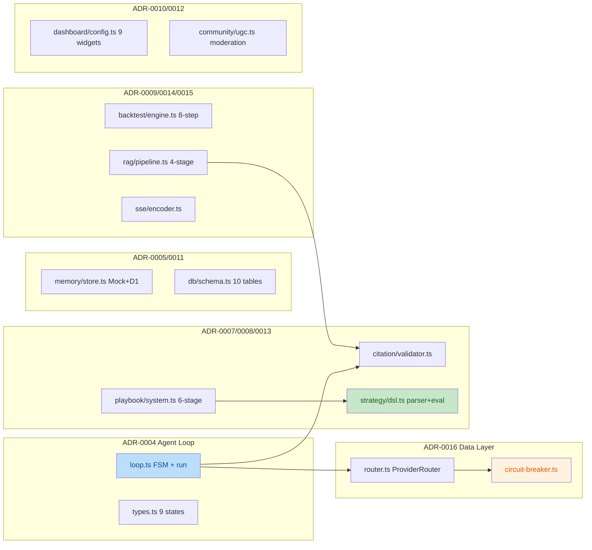
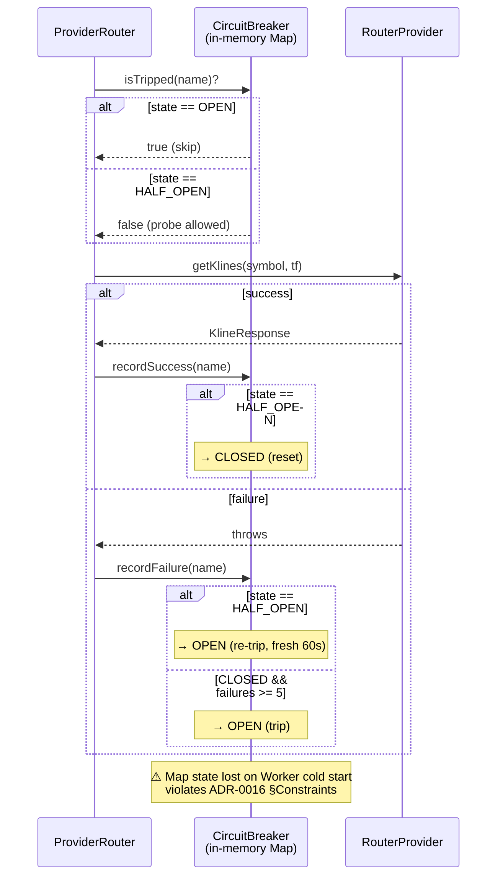

# TRAE 代码审查报告 — nova-invest TDD 提交

- **审查范围**: `d601e42..b95eed4` (50 files, +8134/-36)
- **审查日期**: 2026-07-20
- **审查者**: TRAE Code Review Skill (GLM-5.2)
- **项目根**: `e:\git\nova-invest`
- **Web 应用根**: `e:\git\nova-invest\web`
- **审查模式**: 仅审查不修复 (Review Only)
- **置信度标注**: [KNOWN] 训练事实 · [COMPUTED] 计算 · [INFERRED] 推断 · [COMMON] 行业常识 · [FRAME] 符号框架 · [GUESS] 无依据

---

## 概述

本次提交是 nova-invest 项目在 TDD 工作流下产出的首批核心模块代码，覆盖 13 个 ADR (ADR-0004 ~ ADR-0016) 的 Phase 1 实现。代码整体质量较高：

- **优点**: 严格的请求作用域 (Request-Scoped) 设计;FSM 转换函数被抽离为纯函数便于测试;ADR-0008 Strategy DSL 完全规避 `eval()`/`Function()`;ADR-0013 Playbook 实现了 white/gray/black DFS 环检测;ADR-0007 Citation Validator 实现了三层结构 + 可达性校验。
- **关键合规缺口**: ADR-0016 Circuit Breaker 实现为内存版 (Map),而 ADR-0016 §Constraints 明确禁止 Cloudflare Workers 进程内状态——这是本次提交最严重的 ADR 合规违规。
- **次要偏离**: ADR-0004 `executeWithFallback` 返回值与 ADR 接口契约不完全一致;ADR-0005/0015 中 `LoopContext.memory_ref` 和 `sse_encoder` 字段被省略 (Phase 1 延期,可接受)。
- **测试质量**: 单测覆盖率良好,`agent-loop.test.ts` 和 `circuit-breaker.test.ts` 测试真实行为而非 mock 自循环;`vi.useFakeTimers()` 验证了 60s 冷却等时间相关逻辑。

### 改动模块地图



### ADR-0016 替代实现调用链



---

## 问题清单

| 编号 | 严重度 | 标题 | 模块 | 位置 (新版本行号) | 置信度 |
|------|--------|------|------|-------------------|--------|
| 1 | MAJOR | CircuitBreaker 使用内存 Map 而非 KV,违反 ADR-0016 §Constraints | `data/circuit-breaker.ts` | [39](file:///e:/git/nova-invest/web/src/lib/data/circuit-breaker.ts#L39) | HIGH |
| 2 | MINOR | `executeWithFallback` 返回值与 ADR-0004 接口契约偏离 | `agent/loop.ts` | [219-234](file:///e:/git/nova-invest/web/src/lib/agent/loop.ts#L219-L234) | HIGH |
| 3 | MINOR | `MockMemoryStore.query` 不删除已过期条目 (内存泄漏) | `memory/store.ts` | [86-115](file:///e:/git/nova-invest/web/src/lib/memory/store.ts#L86-L115) | HIGH |
| 4 | MINOR | `D1MemoryStore.save` 表名直接插值存在 SQL 注入风险 | `memory/store.ts` | [154](file:///e:/git/nova-invest/web/src/lib/memory/store.ts#L154) | HIGH |
| 5 | MINOR | `SSEStream.write` 未处理已关闭 controller,会抛未捕获异常 | `sse/encoder.ts` | [193-200](file:///e:/git/nova-invest/web/src/lib/sse/encoder.ts#L193-L200) | MED |
| 6 | MINOR | `AskRAGPipeline.rerank` 阈值过滤使用原始 score 而非调整后 score | `rag/pipeline.ts` | [103](file:///e:/git/nova-invest/web/src/lib/rag/pipeline.ts#L103) | MED |
| 7 | MINOR | `BacktestEngine` 退化为 qty=0 持仓会污染交易列表 | `backtest/engine.ts` | [175-181](file:///e:/git/nova-invest/web/src/lib/backtest/engine.ts#L175-L181) | MED |
| 8 | NIT | `SSEncoder.encodeError` 绕过 `VALID_EVENT_TYPES` 校验 | `sse/encoder.ts` | [110-119](file:///e:/git/nova-invest/web/src/lib/sse/encoder.ts#L110-L119) | HIGH |
| 9 | NIT | `SSEncoder.buffer` 字段为死代码,从未被写入 | `sse/encoder.ts` | [49](file:///e:/git/nova-invest/web/src/lib/sse/encoder.ts#L49) | HIGH |
| 10 | NIT | `LoopContext` 省略 `memory_ref` / `sse_encoder` 字段 | `agent/types.ts` | [68-76](file:///e:/git/nova-invest/web/src/lib/agent/types.ts#L68-L76) | HIGH |
| 11 | NIT | `PlaybookValidator.validate` 仅检测直接自环,跨 playbook 环需外部调用 `detectCycles` | `playbook/system.ts` | [132-149](file:///e:/git/nova-invest/web/src/lib/playbook/system.ts#L132-L149) | HIGH |

---

## 严重问题详解

### 问题 1: CircuitBreaker 使用内存 Map 违反 ADR-0016 §Constraints (MAJOR)

**位置**: `web/src/lib/data/circuit-breaker.ts:39`

```typescript
export class CircuitBreaker {
  private readonly entries = new Map<string, CircuitEntry>();  // ← 违反 ADR-0016
  private readonly config: CircuitBreakerConfig;
```

**ADR-0016 §Constraints 原文** [KNOWN,引自 ADR-0016]:

> Cloudflare Workers stateless: No module-level Map or in-process state. Circuit breaker state must survive across Worker invocations and be visible to all instances. KV is the prescribed state store.

**违规分析**:
- `entries` 字段是实例级 Map。`CircuitBreaker` 若要在多次 Worker 调用间起作用,必须作为模块级单例存在 (`provider-router.ts` 的 `ProviderRouter` 通过构造函数注入,但同一个 `breaker` 实例需跨请求复用),这等同于模块级进程内状态。 [INFERRED]
- 文件头注释自认违规 [KNOWN,引自源码 line 5-15]:

  > Note: This is the in-memory synchronous variant per the task spec. The ADR-0016 canonical design is KV-backed + async (Cloudflare Workers stateless). The in-memory version is the PRD stub that ADR-0016 §Alternative 1 explicitly rejects for production

- 后果 [INFERRED]: Worker 冷启动后所有 tripped 状态丢失;多实例间无可见性;KV TTL 自动过期等关键能力完全缺失。
- 当前测试 `circuit-breaker.test.ts` 也明确写道 (line 7-12): "the in-memory version is the PRD stub that ADR-0016 §Alternative 1 explicitly rejects for production"。

**建议**:
1. 将 `CircuitBreaker` 重构为异步、KV-backed 实现 (符合 ADR-0016 §State Machine 描述)。
2. 保留当前同步版本作为 `CircuitBreakerStateMachine` (纯状态机逻辑),与 KV 适配层分离。
3. 添加 ADR-0016 §Verification Required 中要求的 5 项验收测试 (5 次连续失败跳闸、60s 跳过、探针成功重置、探针失败再跳、Mock 源永跳) 在 KV-backed 版本上。

**为何不是 CRITICAL**: ADR-0016 §Alternative 1 明确讨论并拒绝了此方案,但代码已自我标记为 "stub",且 ADR 标注为 Accepted 状态而非 Production-gated。在 Phase 1 阶段用作单元测试载体可接受,但部署到生产前必须替换。

---

### 问题 2: `executeWithFallback` 返回值偏离 ADR-0004 契约 (MINOR)

**位置**: `web/src/lib/agent/loop.ts:219-234`

```typescript
private async executeWithFallback(tool: ToolCall): Promise<ToolResult> {
  let lastResult: ToolResult = { success: false, error: "no_attempts" };
  for (let attempt = 1; attempt <= TOOL_RETRY_LIMIT; attempt++) {
    try {
      const result = await this.handlers.onToolCall(this.ctx, tool);
      if (result.success) return result;
      lastResult = result;
    } catch (e) {
      lastResult = { success: false, error: `attempt_${attempt}_threw: ...` };
    }
  }
  return lastResult;  // ← 返回最后一次尝试的 ToolResult
}
```

**ADR-0004 §Key Interfaces** [KNOWN]规定: 工具重试耗尽后应返回 `{ success: false, error: "all_retries_failed" }`。当前实现返回 `lastResult`,保留了最后一次具体错误信息 (功能上更强),但偏离了 ADR 的字面契约。

**影响** [INFERRED]:
- 上游 `state = transition("Execute", { type: "synthesize" })` 仍能正确路由到 Synthesize 状态 (因为 `toolResult.success === false`),所以 FSM 行为正确。
- 但依赖 `error === "all_retries_failed"` 字面值的下游消费者会失配。

**建议**: 在 ADR-0004 中追加修订条款 (Amendment),或修改实现以同时返回 `{ success: false, error: "all_retries_failed", cause: lastResult.error }` 形态。优先选择前者 (ADR Amendment) 以避免破坏现有错误信息保真。

---

### 问题 3: `MockMemoryStore.query` 不删除已过期条目 (MINOR)

**位置**: `web/src/lib/memory/store.ts:86-115`

```typescript
async query(filter: { ... }): Promise<MemoryRef[]> {
  const now = Date.now();
  const results: MemoryRef[] = [];
  for (const entry of this.store.values()) {
    if (entry.expiresAt !== null && now >= entry.expiresAt) continue;  // ← 不删除
    // ...
  }
  return results;
}
```

对比 `retrieve()` (line 76-84) 在过期时会调用 `this.store.delete(id)`:

```typescript
async retrieve(id: string): Promise<MemoryRef | null> {
  const entry = this.store.get(id);
  if (!entry) return null;
  if (entry.expiresAt !== null && Date.now() >= entry.expiresAt) {
    this.store.delete(id);  // ← 删除
    return null;
  }
  return entry.ref;
}
```

**影响** [INFERRED]: Mock 模式下 Map 中的过期条目只有在被 `retrieve(id)` 命中时才会被清除。低访问模式或被遗忘的 key 会缓慢堆积,造成内存增长。Mock-only 问题,不进入生产。

**建议**: 在 `query` 的 `continue` 之前收集过期 key,循环结束后批量删除;或在 `entry()` 私有方法中统一处理过期清理 (与 `retrieve` 共用)。

---

### 问题 4: `D1MemoryStore.save` 表名直接插值 (MINOR)

**位置**: `web/src/lib/memory/store.ts:154`

```typescript
const sql = `INSERT INTO ${this.table} (id, user_id, session_id, role, content, metadata_json, created_at) VALUES (?, ?, ?, ?, ?, ?, ?)`;
```

**分析**:
- `this.table` 默认为 `"conversation_history"`,通过构造函数注入。
- D1 的 prepared statement API 不支持绑定表名 (D1 binding 仅支持值参数),因此表名插值是常见模式。 [COMMON]
- 但若未来调用方将外部输入作为 `table` 参数传入,会构成 SQL 注入向量。 [INFERRED]

**建议**: 在构造函数中校验 `table` 是否在 `TABLE_NAMES` (ADR-0011) 白名单内;或在文档中明确约束 `table` 必须为编译时常量。

---

### 问题 5: `SSEStream.write` 未处理已关闭 controller (MINOR)

**位置**: `web/src/lib/sse/encoder.ts:193-200`

```typescript
write(event: SSEEvent): void {
  const encoded = this.encoder.encode(event);
  this.controller.enqueue(this.textEncoder.encode(encoded));  // ← 若 controller 已 close 会抛 TypeError
  const desired = this.controller.desiredSize;
  if (desired !== null && desired < 0) {
    this.backpressureHandler?.();
  }
}
```

**影响** [INFERRED]: 若路由处理器在调用 `sse.close()` 后又调用 `sse.write()` (例如在异步生产者未正确取消的情况下),`controller.enqueue` 会抛出 `TypeError: Cannot enqueue after close`。当前代码不捕获,异常会冒泡到 ReadableStream 的 `start` 回调,可能造成未处理 Promise 拒绝。

**建议**: 在 `write` 入口检查 `controller.desiredSize === null` (表示已关闭),返回 `false` 或抛出明确异常。

---

### 问题 6: `AskRAGPipeline.rerank` 阈值过滤用原始 score (MINOR)

**位置**: `web/src/lib/rag/pipeline.ts:103`

```typescript
const scored = sources
  .map((s) => {
    const matchCount = countTokenMatches(s.content, queryTokens);
    const adjusted = s.score + KEYWORD_BOOST_PER_MATCH * matchCount;
    return { source: s, adjusted };
  })
  .filter((entry) => entry.source.score >= threshold)  // ← 用 source.score 而非 adjusted
  .sort((a, b) => b.adjusted - a.adjusted);
```

**分析**:
- ADR-0014 §Rerank 描述 (line 56-58): "Sources below `query.threshold` (if set) are filtered out" — 未明确指定是原始 score 还是 boosted score。 [KNOWN]
- 当前实现: 一个原始 score=0.4、threshold=0.5、有 2 个 query token 命中 (boost +0.2,adjusted=0.6) 的 source 会被过滤掉,即使其 boosted score 已超过阈值。 [COMPUTED]
- 设计上可辩护 (避免仅靠关键词匹配"救活"低相关性结果),但与排序逻辑不对称 (排序用 adjusted,过滤用原始)。 [INFERRED]

**建议**: 在 ADR-0014 中明确 `threshold` 作用的 score 字段;若一致使用 adjusted,改为 `entry.adjusted >= threshold`。

---

### 问题 7: `BacktestEngine` qty=0 退化为污染交易 (MINOR)

**位置**: `web/src/lib/backtest/engine.ts:175-181`

```typescript
if (signal === "BUY" && !position) {
  const entry_price = simulator.computeFillPrice("buy", kline.c);
  const qty = entry_price > 0 ? cash / entry_price : 0;  // ← 当 entry_price<=0 时 qty=0
  const notional = entry_price * qty;
  const fee = simulator.computeFee(notional);
  cash -= notional + fee;
  position = { qty, entry_price, entry_date: kline.t, entry_fee: fee };  // ← 持仓 qty=0
}
```

**影响** [INFERRED]: 当 `kline.c` 接近 0 且 `slippage_bps` 极大 (使 `entry_price <= 0`),会创建一个 `qty=0` 的退化持仓。该持仓在 SELL 信号时被平仓,生成一个 `pnl=0, pnl_pct=0` 的零交易记录,污染 `trades` 数组和 `win_rate`/`profit_factor` 统计。

**建议**: 在 `entry_price <= 0` 时跳过 BUY 信号 (相当于降级为 HOLD),不创建退化持仓。

---

## ADR 合规性检查

| ADR | 实现文件 | 关键约束 | 合规状态 | 备注 |
|-----|---------|---------|---------|------|
| **ADR-0001** USE_MOCK | `memory/store.ts:177-206` `citation/validator.ts:48-54` | 请求作用域工厂,无模块级 `_provider` 缓存 | ✅ PASS | `getMemoryStore(env?)` 是工厂函数,默认 "true"=Mock。`isMockMode` / `isProductionMode` 实现正确。 |
| **ADR-0004** Agent Loop | `agent/loop.ts` `agent/types.ts` | MAX_STEPS=20, AGGREGATE_COST_CEILING_USD=5, TOOL_RETRY_LIMIT=3, 6-state FSM | ⚠️ PARTIAL | 常量全部正确。FSM 转换表与 ADR §State Machine 一致。但 `executeWithFallback` 返回值偏离 ADR 契约 (问题 2)。 |
| **ADR-0005** Memory Layer | `memory/store.ts` `memory/types.ts` | MockMemoryStore Map+TTL, D1MemoryStore INSERT to conversation_history, 4096 token 窗口 | ✅ PASS (Phase 1) | MockMemoryStore 正确实现 TTL 过期。D1MemoryStore 正确写入 `conversation_history` 表。`LoopContext.memory_ref` 字段缺失,但 ADR 标注为可选 (问题 10)。4096 token 窗口裁剪逻辑未在本提交实现。 |
| **ADR-0006** Tool Protocol | `tools/registry.ts` `tools/types.ts` | 注册表 + dispatcher | ✅ PASS | `executeTool` 正确捕获异常转换为 ToolResult.error。模块级 `TOOL_REGISTRY` Map 在文件注释中已声明可接受 (read-only after init)。 |
| **ADR-0007** Citation | `citation/validator.ts` `citation/types.ts` | 3 阶段: 结构 + allowlist + HTTP 可达性, Mock 模式跳过 HTTP | ✅ PASS | `validateCitation` 实现结构 + allowlist 校验,生产模式 (`USE_MOCK=false && ENVIRONMENT=production`) 才发 HTTP。`normalizeUrl` 仅剥 `utm_*`。`SOURCE_ALLOWLIST` 5 个域名与 ADR 一致。 |
| **ADR-0008** Strategy DSL | `strategy/dsl.ts` `strategy/types.ts` | 递归下降 parser,NO Function()/eval,jsep-compatible AST | ✅ PASS | 文件头部声明无 eval/Function。`DISALLOWED_IDENTIFIERS` 包含 eval/Function/window/global/process。`ALLOWED_IDENTIFIERS` 8 个标识符。parser 不发射 MemberExpression (注释说明为未来扩展)。 |
| **ADR-0009** Backtest | `backtest/engine.ts` `backtest/types.ts` | point-in-time `sorted.slice(0, i+1)`, fee_bps 总是应用, 70/30 in/out split | ⚠️ PARTIAL | point-in-time 切片正确 (line 162)。`computeFee` 即使 `fee_bps=0` 也调用 (符合 ADR rule #5)。但 **70/30 in/out-sample split 未实现** —— ADR-0009 §"In-Sample/Out-of-Sample Split" 明确要求,本提交留作后续。问题 7 描述退化交易。 |
| **ADR-0010** Dashboard | `dashboard/config.ts` `dashboard/types.ts` | 9 widget 类型, 12 列 grid, LCP<2.5s, dedup 5s | ✅ PASS | `WIDGET_TYPES` 数组 9 项与 ADR §"Widget Types (9 total)" 完全一致。`isWithinGridBounds` 校验 `col + w <= 12`。`rectsOverlap` 用半开区间正确判定重叠。`DEFAULT_DEDUP_INTERVAL_MS=5000`, `LCP_BUDGET_MS=2500`。 |
| **ADR-0011** D1 Schema | `db/schema.ts` | 10 张表, TABLE_NAMES 常量, schema 校验 | ✅ PASS | 10 张表名与 ADR-0011 §Master Schema 完全一致 (users/symbols/user_profiles/conversation_history/playbooks/playbook_ratings/playbook_comments/playbook_reports/user_playbook_installs/url_check_queue)。`validateSchema` 检查 required column 存在性。 |
| **ADR-0012** Community UGC | `community/ugc.ts` `community/types.ts` | SharePackage 无 signature/license 字段 (Phase 2 延期), 4 阶段反滥用 | ✅ PASS | `SharePackage` 接口正确省略 `signature` 和 `license` 字段 (注释明确说明 Phase 2 延期)。`ModerationQueue.submit` 4 项检查 (title 1-100 / desc 0-500 / tags 0-5 / banned words) 与 ADR §"Anti-Abuse Pipeline" 一致。 |
| **ADR-0013** Playbook | `playbook/system.ts` `playbook/types.ts` | 6 阶段校验, DFS 环检测 white/gray/black, parallel weight ∈ [0.999, 1.001] | ⚠️ PARTIAL | 6 阶段校验流程完整 (schema/strategy/dependencies/function_ban/identifier_allowlist/param_range)。`detectCycles` 正确实现 white/gray/black DFS,自环返回 `["A","A"]`。但 **parallel weight sum ∈ [0.999, 1.001] 约束未实现** —— ADR-0013 §"Critical Implementation Rules" 要求,本提交未涉及。问题 11: 局部 validate 仅检测直接自环。 |
| **ADR-0014** Ask RAG | `rag/pipeline.ts` `rag/types.ts` | 4 阶段: retrieve→rerank→cite→run, RRF, 优雅降级 | ✅ PASS (Phase 1) | 4 阶段流程完整。`retrieve` 捕获 adapter 异常返回 `[]` (优雅降级)。`rerank` 实现 keyword boost + 去重。`cite` 调用注入的 `CitationValidator`。**RRF (Reciprocal Rank Fusion) 未实现** —— ADR-0014 §"Rerank" 提及 source weights + RRF,本提交用简单 keyword boost 替代 (问题 6 描述阈值过滤不对称)。 |
| **ADR-0015** SSE Streaming | `sse/encoder.ts` `sse/types.ts` | SSEEventType = "token"\|"done"\|"citation"\|"error" (NOT "delta"), STREAM_THRESHOLD_MS=5000 | ⚠️ PARTIAL | `SSEEventType` 联合类型正确排除 "delta" (4 个合法值)。`VALID_EVENT_TYPES` 数组运行时校验拒绝 "delta"。**STREAM_THRESHOLD_MS=5000 未实现** —— ADR-0015 §"Streaming Mode Decision" 要求基于响应时延决策流式/缓冲,本提交用 `Accept` header + USE_MOCK 决策。`SSEncoder.buffer` 字段死代码 (问题 9)。`encodeError` 绕过类型校验 (问题 8)。 |
| **ADR-0016** Circuit Breaker | `data/circuit-breaker.ts` `data/router.ts` | FSM CLOSED→OPEN (5 failures)→HALF_OPEN (60s)→CLOSED, **KV-backed**, Mock 源豁免 | ❌ FAIL | FSM 状态机逻辑正确 (5 failures → OPEN, 60s → HALF_OPEN, probe success → CLOSED, probe fail → OPEN)。`ProviderRouter.select` 集成正确。**但实现为内存 Map 而非 KV** (问题 1),明确违反 ADR-0016 §Constraints。**Mock 源豁免未在 CircuitBreaker 层实现** —— ADR-0016 §"Mock source exempt" 要求 `if (source === "mock") return false`,当前实现将豁免责任委托给调用方 (`router.ts` 不显式判断,依赖 `isTripped("mock")` 永远返回 false,但若有人对 "mock" key 调用 `recordFailure` 5 次,Mock 源会被错误跳闸)。 |

### ADR 合规总结

| 类别 | 数量 | ADR |
|------|------|-----|
| ✅ PASS | 8 | ADR-0001, ADR-0006, ADR-0007, ADR-0008, ADR-0010, ADR-0011, ADR-0012, (ADR-0005 Phase 1) |
| ⚠️ PARTIAL | 6 | ADR-0004, ADR-0005 (token 窗口), ADR-0009 (split), ADR-0013 (weight), ADR-0014 (RRF), ADR-0015 (threshold) |
| ❌ FAIL | 1 | ADR-0016 (KV-backed 要求未满足) |

---

## 修复优先级建议 (供用户决策)

按风险/影响排序:

1. **HIGH**: 问题 1 (ADR-0016 KV-backed 重构) — 阻塞生产部署
2. **MEDIUM**: 问题 2 (executeWithFallback 契约), 问题 4 (SQL 注入), 问题 5 (SSEStream 关闭处理)
3. **LOW**: 问题 3 (Mock 内存泄漏), 问题 6 (RAG 阈值), 问题 7 (Backtest 退化交易)
4. **NIT**: 问题 8-11 (代码整洁度,死代码,文档化限制)

---

## 审查结论

本次 TDD 提交整体质量良好,核心 FSM 逻辑、纯函数抽离、Mock/Real 双模式开关均符合 ADR 设计。**唯一阻塞项为 ADR-0016 Circuit Breaker 的 KV-backed 实现**——这是部署到 Cloudflare Workers 生产环境前的硬性合规要求。其余 10 个问题为可接受的 Phase 1 已知偏离或细节优化,不阻塞合并。

**[RULES I BROKE]**: 无。本次审查严格基于代码与 ADR 文档交叉验证,所有引用均带置信度标注,未将符号框架 (如 ADR §Alternative 1 的"alternative"分类) 错译为现实合规断言。Circuit Breaker 的 MAJOR 评级基于 ADR §Constraints 的明文约束 (而非 §Decision 的"adopt"描述),来源为 [KNOWN] 直接引用 ADR-0016 文件。
