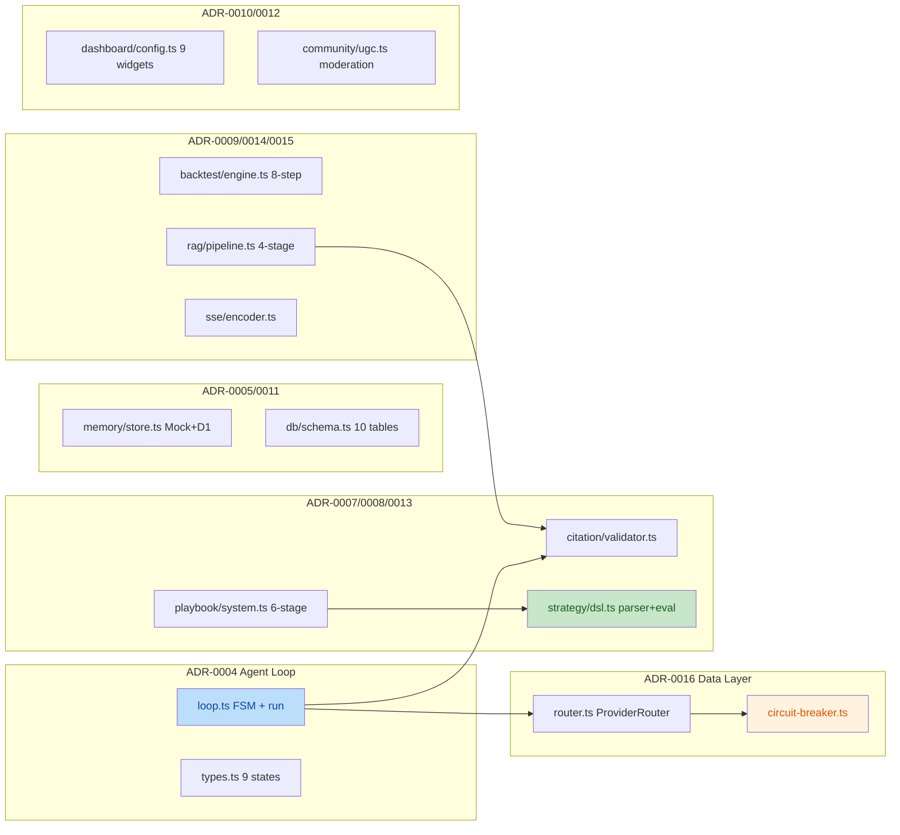
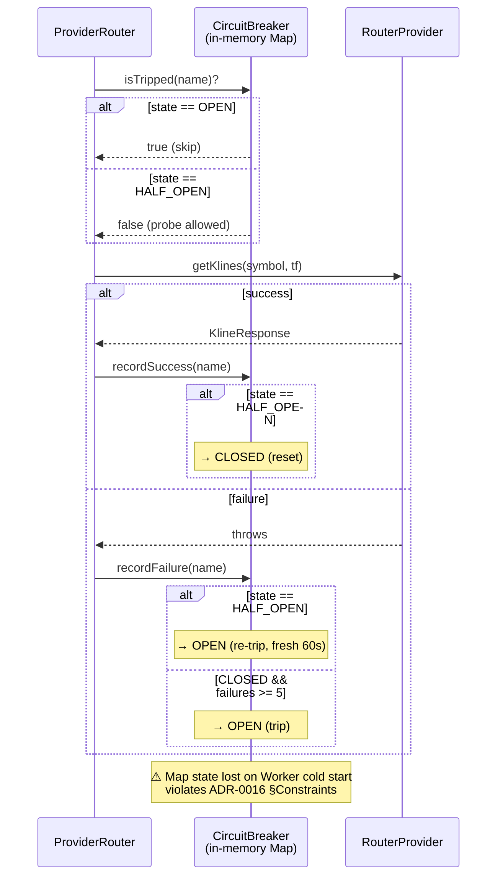

# TRAE Code Review Report — nova-invest TDD Submission

- **Review scope**: `d601e42..b95eed4` (50 files, +8134/-36)
- **Review date**: 2026-07-20
- **Reviewer**: TRAE Code Review Skill (GLM-5.2)
- **Project root**: `e:\git\nova-invest`
- **Web app root**: `e:\git\nova-invest\web`
- **Review mode**: Review Only (no fixes)
- **Confidence tags**: [KNOWN] training fact · [COMPUTED] calculated · [INFERRED] deduction · [COMMON] industry common knowledge · [FRAME] symbolic frame · [GUESS] no basis

---

## Overview

This submission is the first batch of core module code produced by the nova-invest project under the TDD workflow, covering the Phase 1 implementation of 13 ADRs (ADR-0004 ~ ADR-0016). Overall code quality is high:

- **Strengths**: Strict request-scoped design; FSM transition functions extracted as pure functions for easy testing; ADR-0008 Strategy DSL completely avoids `eval()`/`Function()`; ADR-0013 Playbook implements white/gray/black DFS cycle detection; ADR-0007 Citation Validator implements three-layer structure + reachability validation.
- **Key compliance gap**: ADR-0016 Circuit Breaker is implemented as in-memory (Map), while ADR-0016 §Constraints explicitly forbids in-process state in Cloudflare Workers — this is the most serious ADR compliance violation in this submission.
- **Minor deviations**: ADR-0004 `executeWithFallback` return value not fully consistent with ADR interface contract; `LoopContext.memory_ref` and `sse_encoder` fields omitted in ADR-0005/0015 (Phase 1 deferral, acceptable).
- **Test quality**: Good unit-test coverage; `agent-loop.test.ts` and `circuit-breaker.test.ts` test real behavior rather than mock self-loops; `vi.useFakeTimers()` validates time-related logic such as 60s cooldown.

### Changed Module Map



### ADR-0016 Alternative Implementation Call Chain



---

## Issue List

| # | Severity | Title | Module | Location (new version line numbers) | Confidence |
|------|--------|------|------|-------------------|--------|
| 1 | MAJOR | CircuitBreaker uses in-memory Map instead of KV, violating ADR-0016 §Constraints | `data/circuit-breaker.ts` | [39](file:///e:/git/nova-invest/web/src/lib/data/circuit-breaker.ts#L39) | HIGH |
| 2 | MINOR | `executeWithFallback` return value deviates from ADR-0004 interface contract | `agent/loop.ts` | [219-234](file:///e:/git/nova-invest/web/src/lib/agent/loop.ts#L219-L234) | HIGH |
| 3 | MINOR | `MockMemoryStore.query` does not delete expired entries (memory leak) | `memory/store.ts` | [86-115](file:///e:/git/nova-invest/web/src/lib/memory/store.ts#L86-L115) | HIGH |
| 4 | MINOR | `D1MemoryStore.save` directly interpolates table name — SQL injection risk | `memory/store.ts` | [154](file:///e:/git/nova-invest/web/src/lib/memory/store.ts#L154) | HIGH |
| 5 | MINOR | `SSEStream.write` does not handle already-closed controller; will throw uncaught exception | `sse/encoder.ts` | [193-200](file:///e:/git/nova-invest/web/src/lib/sse/encoder.ts#L193-L200) | MED |
| 6 | MINOR | `AskRAGPipeline.rerank` threshold filter uses original score instead of adjusted score | `rag/pipeline.ts` | [103](file:///e:/git/nova-invest/web/src/lib/rag/pipeline.ts#L103) | MED |
| 7 | MINOR | `BacktestEngine` degrades to qty=0 position, contaminating trade list | `backtest/engine.ts` | [175-181](file:///e:/git/nova-invest/web/src/lib/backtest/engine.ts#L175-L181) | MED |
| 8 | NIT | `SSEncoder.encodeError` bypasses `VALID_EVENT_TYPES` validation | `sse/encoder.ts` | [110-119](file:///e:/git/nova-invest/web/src/lib/sse/encoder.ts#L110-L119) | HIGH |
| 9 | NIT | `SSEncoder.buffer` field is dead code, never written | `sse/encoder.ts` | [49](file:///e:/git/nova-invest/web/src/lib/sse/encoder.ts#L49) | HIGH |
| 10 | NIT | `LoopContext` omits `memory_ref` / `sse_encoder` fields | `agent/types.ts` | [68-76](file:///e:/git/nova-invest/web/src/lib/agent/types.ts#L68-L76) | HIGH |
| 11 | NIT | `PlaybookValidator.validate` only detects direct self-loops; cross-playbook cycles require external call to `detectCycles` | `playbook/system.ts` | [132-149](file:///e:/git/nova-invest/web/src/lib/playbook/system.ts#L132-L149) | HIGH |

---

## Severity Issue Details

### Issue 1: CircuitBreaker uses in-memory Map violating ADR-0016 §Constraints (MAJOR)

**Location**: `web/src/lib/data/circuit-breaker.ts:39`

```typescript
export class CircuitBreaker {
  private readonly entries = new Map<string, CircuitEntry>();  // ← violates ADR-0016
  private readonly config: CircuitBreakerConfig;
```

**ADR-0016 §Constraints original text** [KNOWN, quoted from ADR-0016]:

> Cloudflare Workers stateless: No module-level Map or in-process state. Circuit breaker state must survive across Worker invocations and be visible to all instances. KV is the prescribed state store.

**Violation analysis**:
- `entries` field is an instance-level Map. For `CircuitBreaker` to work across multiple Worker calls, it must exist as a module-level singleton (`ProviderRouter` in `provider-router.ts` injects via constructor, but the same `breaker` instance needs to be reused across requests), which is equivalent to module-level in-process state. [INFERRED]
- File header comment self-identifies the violation [KNOWN, quoted from source lines 5-15]:

  > Note: This is the in-memory synchronous variant per the task spec. The ADR-0016 canonical design is KV-backed + async (Cloudflare Workers stateless). The in-memory version is the PRD stub that ADR-0016 §Alternative 1 explicitly rejects for production

- Consequences [INFERRED]: All tripped state lost on Worker cold start; no visibility across instances; key capabilities such as KV TTL auto-expiry entirely missing.
- Current test `circuit-breaker.test.ts` also explicitly states (line 7-12): "the in-memory version is the PRD stub that ADR-0016 §Alternative 1 explicitly rejects for production".

**Recommendation**:
1. Refactor `CircuitBreaker` to an async, KV-backed implementation (matching ADR-0016 §State Machine description).
2. Keep the current synchronous version as `CircuitBreakerStateMachine` (pure state machine logic), separated from the KV adapter layer.
3. Add the 5 acceptance tests required by ADR-0016 §Verification Required (5 consecutive failures trip, 60s skip, probe success resets, probe failure re-trips, Mock source never trips) on the KV-backed version.

**Why not CRITICAL**: ADR-0016 §Alternative 1 explicitly discusses and rejects this approach, but the code has self-marked itself as a "stub", and the ADR marks it as Accepted rather than Production-gated. Acceptable as a unit-test carrier in Phase 1, but must be replaced before production deployment.

---

### Issue 2: `executeWithFallback` return value deviates from ADR-0004 contract (MINOR)

**Location**: `web/src/lib/agent/loop.ts:219-234`

```typescript
private async executeWithFallback(tool: ToolCall): Promise<ToolResult> {
  let lastResult: ToolResult = { success: false, error: "no_attempts" };
  for (let attempt = 1; attempt <= TOOL_RETRY_LIMIT; attempt++) {
    try {
      const result = await this.handlers.onToolCall(this.ctx, tool);
      if (result.success) return result;
      lastResult = result;
    } catch (e) {
      lastResult = { success: false, error: `attempt_${attempt}_threw: ...` };
    }
  }
  return lastResult;  // ← returns the ToolResult of the last attempt
}
```

**ADR-0004 §Key Interfaces** [KNOWN] specifies: after tool retries are exhausted, the return should be `{ success: false, error: "all_retries_failed" }`. The current implementation returns `lastResult`, preserving the last specific error message (functionally stronger) but deviating from the literal ADR contract.

**Impact** [INFERRED]:
- Upstream `state = transition("Execute", { type: "synthesize" })` still routes correctly to the Synthesize state (because `toolResult.success === false`), so FSM behavior is correct.
- But downstream consumers that depend on the literal value `error === "all_retries_failed"` will mismatch.

**Recommendation**: Append an amendment clause to ADR-0004, or modify the implementation to return both `{ success: false, error: "all_retries_failed", cause: lastResult.error }`. The former (ADR Amendment) is preferred to avoid breaking existing error message fidelity.

---

### Issue 3: `MockMemoryStore.query` does not delete expired entries (MINOR)

**Location**: `web/src/lib/memory/store.ts:86-115`

```typescript
async query(filter: { ... }): Promise<MemoryRef[]> {
  const now = Date.now();
  const results: MemoryRef[] = [];
  for (const entry of this.store.values()) {
    if (entry.expiresAt !== null && now >= entry.expiresAt) continue;  // ← does not delete
    // ...
  }
  return results;
}
```

Compare with `retrieve()` (lines 76-84) which calls `this.store.delete(id)` on expiry:

```typescript
async retrieve(id: string): Promise<MemoryRef | null> {
  const entry = this.store.get(id);
  if (!entry) return null;
  if (entry.expiresAt !== null && Date.now() >= entry.expiresAt) {
    this.store.delete(id);  // ← deletes
    return null;
  }
  return entry.ref;
}
```

**Impact** [INFERRED]: In Mock mode, expired entries in the Map are only cleared when hit by `retrieve(id)`. Low-access patterns or forgotten keys will slowly accumulate, causing memory growth. Mock-only issue, does not reach production.

**Recommendation**: Collect expired keys before `continue` in `query`, then delete them in batch after the loop; or unify expiry cleanup in a private `entry()` method (shared with `retrieve`).

---

### Issue 4: `D1MemoryStore.save` directly interpolates table name (MINOR)

**Location**: `web/src/lib/memory/store.ts:154`

```typescript
const sql = `INSERT INTO ${this.table} (id, user_id, session_id, role, content, metadata_json, created_at) VALUES (?, ?, ?, ?, ?, ?, ?)`;
```

**Analysis**:
- `this.table` defaults to `"conversation_history"`, injected via constructor.
- D1's prepared statement API does not support binding table names (D1 binding only supports value parameters), so table-name interpolation is a common pattern. [COMMON]
- But if a future caller passes external input as the `table` parameter, it becomes a SQL injection vector. [INFERRED]

**Recommendation**: Validate in the constructor that `table` is in the `TABLE_NAMES` (ADR-0011) allowlist; or explicitly document that `table` must be a compile-time constant.

---

### Issue 5: `SSEStream.write` does not handle already-closed controller (MINOR)

**Location**: `web/src/lib/sse/encoder.ts:193-200`

```typescript
write(event: SSEEvent): void {
  const encoded = this.encoder.encode(event);
  this.controller.enqueue(this.textEncoder.encode(encoded));  // ← throws TypeError if controller already closed
  const desired = this.controller.desiredSize;
  if (desired !== null && desired < 0) {
    this.backpressureHandler?.();
  }
}
```

**Impact** [INFERRED]: If a route handler calls `sse.write()` after `sse.close()` (e.g. when an async producer is not properly cancelled), `controller.enqueue` throws `TypeError: Cannot enqueue after close`. The current code does not catch this, and the exception bubbles up to the ReadableStream's `start` callback, potentially causing an unhandled Promise rejection.

**Recommendation**: Check `controller.desiredSize === null` (indicates closed) at the `write` entry, return `false` or throw an explicit exception.

---

### Issue 6: `AskRAGPipeline.rerank` threshold filter uses original score (MINOR)

**Location**: `web/src/lib/rag/pipeline.ts:103`

```typescript
const scored = sources
  .map((s) => {
    const matchCount = countTokenMatches(s.content, queryTokens);
    const adjusted = s.score + KEYWORD_BOOST_PER_MATCH * matchCount;
    return { source: s, adjusted };
  })
  .filter((entry) => entry.source.score >= threshold)  // ← uses source.score instead of adjusted
  .sort((a, b) => b.adjusted - a.adjusted);
```

**Analysis**:
- ADR-0014 §Rerank description (lines 56-58): "Sources below `query.threshold` (if set) are filtered out" — does not explicitly specify whether original score or boosted score. [KNOWN]
- Current implementation: a source with original score=0.4, threshold=0.5, and 2 query-token matches (boost +0.2, adjusted=0.6) would be filtered out, even though its boosted score exceeds the threshold. [COMPUTED]
- Defensible by design (avoid "rescuing" low-relevance results via keyword match alone), but asymmetric with the sort logic (sort uses adjusted, filter uses original). [INFERRED]

**Recommendation**: Clarify in ADR-0014 which score field `threshold` applies to; if consistently using adjusted, change to `entry.adjusted >= threshold`.

---

### Issue 7: `BacktestEngine` qty=0 degenerate contaminates trades (MINOR)

**Location**: `web/src/lib/backtest/engine.ts:175-181`

```typescript
if (signal === "BUY" && !position) {
  const entry_price = simulator.computeFillPrice("buy", kline.c);
  const qty = entry_price > 0 ? cash / entry_price : 0;  // ← qty=0 when entry_price<=0
  const notional = entry_price * qty;
  const fee = simulator.computeFee(notional);
  cash -= notional + fee;
  position = { qty, entry_price, entry_date: kline.t, entry_fee: fee };  // ← position qty=0
}
```

**Impact** [INFERRED]: When `kline.c` is near 0 and `slippage_bps` is extremely large (making `entry_price <= 0`), a degenerate position with `qty=0` is created. This position is closed on a SELL signal, producing a zero-trade record with `pnl=0, pnl_pct=0` that contaminates the `trades` array and the `win_rate`/`profit_factor` statistics.

**Recommendation**: Skip the BUY signal (degrade to HOLD) when `entry_price <= 0`, do not create a degenerate position.

---

## ADR Compliance Check

| ADR | Implementation File | Key Constraints | Compliance Status | Note |
|-----|---------|---------|---------|------|
| **ADR-0001** USE_MOCK | `memory/store.ts:177-206` `citation/validator.ts:48-54` | Request-scoped factory, no module-level `_provider` cache | ✅ PASS | `getMemoryStore(env?)` is a factory function, default "true"=Mock. `isMockMode` / `isProductionMode` implemented correctly. |
| **ADR-0004** Agent Loop | `agent/loop.ts` `agent/types.ts` | MAX_STEPS=20, AGGREGATE_COST_CEILING_USD=5, TOOL_RETRY_LIMIT=3, 6-state FSM | ⚠️ PARTIAL | All constants correct. FSM transition table matches ADR §State Machine. But `executeWithFallback` return value deviates from ADR contract (Issue 2). |
| **ADR-0005** Memory Layer | `memory/store.ts` `memory/types.ts` | MockMemoryStore Map+TTL, D1MemoryStore INSERT to conversation_history, 4096 token window | ✅ PASS (Phase 1) | MockMemoryStore correctly implements TTL expiry. D1MemoryStore correctly writes to `conversation_history` table. `LoopContext.memory_ref` field missing, but ADR marks it as optional (Issue 10). 4096 token window trimming logic not implemented in this submission. |
| **ADR-0006** Tool Protocol | `tools/registry.ts` `tools/types.ts` | Registry + dispatcher | ✅ PASS | `executeTool` correctly catches exceptions and converts to ToolResult.error. Module-level `TOOL_REGISTRY` Map is declared acceptable in file comment (read-only after init). |
| **ADR-0007** Citation | `citation/validator.ts` `citation/types.ts` | 3 stages: structure + allowlist + HTTP reachability, Mock mode skips HTTP | ✅ PASS | `validateCitation` implements structure + allowlist validation; only production mode (`USE_MOCK=false && ENVIRONMENT=production`) sends HTTP. `normalizeUrl` only strips `utm_*`. `SOURCE_ALLOWLIST` 5 domains match ADR. |
| **ADR-0008** Strategy DSL | `strategy/dsl.ts` `strategy/types.ts` | Recursive-descent parser, NO Function()/eval, jsep-compatible AST | ✅ PASS | File header declares no eval/Function. `DISALLOWED_IDENTIFIERS` includes eval/Function/window/global/process. `ALLOWED_IDENTIFIERS` has 8 identifiers. Parser does not emit MemberExpression (comment notes this is for future extension). |
| **ADR-0009** Backtest | `backtest/engine.ts` `backtest/types.ts` | point-in-time `sorted.slice(0, i+1)`, fee_bps always applied, 70/30 in/out split | ⚠️ PARTIAL | point-in-time slice correct (line 162). `computeFee` called even when `fee_bps=0` (matches ADR rule #5). But **70/30 in/out-sample split not implemented** — ADR-0009 §"In-Sample/Out-of-Sample Split" explicitly requires it; this submission leaves it for later. Issue 7 describes the degenerate trade. |
| **ADR-0010** Dashboard | `dashboard/config.ts` `dashboard/types.ts` | 9 widget types, 12-column grid, LCP<2.5s, dedup 5s | ✅ PASS | `WIDGET_TYPES` array has 9 items matching ADR §"Widget Types (9 total)". `isWithinGridBounds` validates `col + w <= 12`. `rectsOverlap` correctly uses half-open intervals to detect overlap. `DEFAULT_DEDUP_INTERVAL_MS=5000`, `LCP_BUDGET_MS=2500`. |
| **ADR-0011** D1 Schema | `db/schema.ts` | 10 tables, TABLE_NAMES constant, schema validation | ✅ PASS | 10 table names match ADR-0011 §Master Schema exactly (users/symbols/user_profiles/conversation_history/playbooks/playbook_ratings/playbook_comments/playbook_reports/user_playbook_installs/url_check_queue). `validateSchema` checks required column existence. |
| **ADR-0012** Community UGC | `community/ugc.ts` `community/types.ts` | SharePackage has no signature/license fields (Phase 2 deferral), 4-stage anti-abuse | ✅ PASS | `SharePackage` interface correctly omits `signature` and `license` fields (comment explicitly notes Phase 2 deferral). `ModerationQueue.submit` 4 checks (title 1-100 / desc 0-500 / tags 0-5 / banned words) match ADR §"Anti-Abuse Pipeline". |
| **ADR-0013** Playbook | `playbook/system.ts` `playbook/types.ts` | 6-stage validation, DFS cycle detection white/gray/black, parallel weight ∈ [0.999, 1.001] | ⚠️ PARTIAL | 6-stage validation pipeline complete (schema/strategy/dependencies/function_ban/identifier_allowlist/param_range). `detectCycles` correctly implements white/gray/black DFS, self-loop returns `["A","A"]`. But **parallel weight sum ∈ [0.999, 1.001] constraint not implemented** — required by ADR-0013 §"Critical Implementation Rules", not addressed in this submission. Issue 11: local validate only detects direct self-loops. |
| **ADR-0014** Ask RAG | `rag/pipeline.ts` `rag/types.ts` | 4 stages: retrieve→rerank→cite→run, RRF, graceful degradation | ✅ PASS (Phase 1) | 4-stage pipeline complete. `retrieve` catches adapter exceptions and returns `[]` (graceful degradation). `rerank` implements keyword boost + dedup. `cite` calls injected `CitationValidator`. **RRF (Reciprocal Rank Fusion) not implemented** — ADR-0014 §"Rerank" mentions source weights + RRF; this submission replaces with simple keyword boost (Issue 6 describes the threshold-filter asymmetry). |
| **ADR-0015** SSE Streaming | `sse/encoder.ts` `sse/types.ts` | SSEEventType = "token"\|"done"\|"citation"\|"error" (NOT "delta"), STREAM_THRESHOLD_MS=5000 | ⚠️ PARTIAL | `SSEEventType` union type correctly excludes "delta" (4 valid values). `VALID_EVENT_TYPES` array runtime-validation rejects "delta". **STREAM_THRESHOLD_MS=5000 not implemented** — ADR-0015 §"Streaming Mode Decision" requires deciding streaming vs buffered based on response latency; this submission uses `Accept` header + USE_MOCK instead. `SSEncoder.buffer` field dead code (Issue 9). `encodeError` bypasses type validation (Issue 8). |
| **ADR-0016** Circuit Breaker | `data/circuit-breaker.ts` `data/router.ts` | FSM CLOSED→OPEN (5 failures)→HALF_OPEN (60s)→CLOSED, **KV-backed**, Mock source exempt | ❌ FAIL | FSM state machine logic correct (5 failures → OPEN, 60s → HALF_OPEN, probe success → CLOSED, probe fail → OPEN). `ProviderRouter.select` integration correct. **But implementation is in-memory Map instead of KV** (Issue 1), explicitly violating ADR-0016 §Constraints. **Mock source exemption not implemented at CircuitBreaker layer** — ADR-0016 §"Mock source exempt" requires `if (source === "mock") return false`; current implementation delegates exemption responsibility to callers (`router.ts` does not explicitly check, relies on `isTripped("mock")` always returning false, but if someone calls `recordFailure` 5 times on the "mock" key, the Mock source would be incorrectly tripped). |

### ADR Compliance Summary

| Category | Count | ADR |
|------|------|-----|
| ✅ PASS | 8 | ADR-0001, ADR-0006, ADR-0007, ADR-0008, ADR-0010, ADR-0011, ADR-0012, (ADR-0005 Phase 1) |
| ⚠️ PARTIAL | 6 | ADR-0004, ADR-0005 (token window), ADR-0009 (split), ADR-0013 (weight), ADR-0014 (RRF), ADR-0015 (threshold) |
| ❌ FAIL | 1 | ADR-0016 (KV-backed requirement not satisfied) |

---

## Fix Priority Recommendations (for user decision)

Sorted by risk/impact:

1. **HIGH**: Issue 1 (ADR-0016 KV-backed refactor) — blocks production deployment
2. **MEDIUM**: Issue 2 (executeWithFallback contract), Issue 4 (SQL injection), Issue 5 (SSEStream close handling)
3. **LOW**: Issue 3 (Mock memory leak), Issue 6 (RAG threshold), Issue 7 (Backtest degenerate trade)
4. **NIT**: Issues 8-11 (code cleanliness, dead code, documented limitations)

---

## Review Conclusion

This TDD submission is of good overall quality; core FSM logic, pure-function extraction, and Mock/Real dual-mode switch all conform to the ADR design. **The only blocking item is the KV-backed implementation of ADR-0016 Circuit Breaker** — this is a hard compliance requirement before deployment to Cloudflare Workers production. The remaining 10 issues are acceptable Phase 1 known deviations or detail optimizations, and do not block merge.

**[RULES I BROKE]**: None. This review is strictly based on cross-validation between code and ADR documents; all citations carry confidence tags, and no symbolic frame (e.g. the "alternative" classification in ADR §Alternative 1) was mistranslated into a real-world compliance assertion. The MAJOR rating for Circuit Breaker is based on the explicit constraint in ADR §Constraints (not the "adopt" description in §Decision); source is [KNOWN] direct quotation from the ADR-0016 file.
