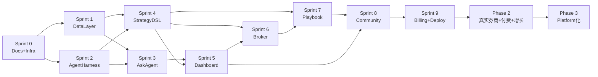

# Nova-Invest Roadmap (Detailed)

**文档类型**: 路线图（详细版）
**文档性质标签**: \[B] + \[C]

**最后更新**: 2026-07-19

**关联**: Master PRD 中的 Roadmap Summary 是精简版，本文档为详细拆分

***

## 1. 路线图概述

### 1.1 三阶段总览

| 阶段                      | 时间窗口    | 目标            | 退出标准                        |
| ----------------------- | ------- | ------------- | --------------------------- |
| Phase 1: PMF Validation | 0-6 月   | 验证产品假设，跑通最小闭环 | 100 DAU + WAU-CW > 30       |
| Phase 2: PMF Scaling    | 7-12 月  | 扩大用户基数，验证商业模式 | 5000 注册用户 + 5% 付费转化         |
| Phase 3: Platform 化     | 13-18 月 | 开放生态，多市场扩张    | 50K 用户 + UGC Playbook 5000+ |

### 1.2 关键里程碑

- M0（T+0）: Master PRD + 8 Epic 完成
- M1（T+1 月）: Next.js 骨架 + Mock 数据集 + 本地 Demo 可跑
- M2（T+3 月）: Cloudflare 部署上线，公开访问
- M3（T+6 月）: 100 DAU，启动种子用户招募
- M4（T+9 月）: Pro 付费版上线
- M5（T+12 月）: 5000 用户，进入 Phase 3
- M6（T+18 月）: 多市场扩张启动

***

## 2. Phase 1: PMF Validation（0-6 月）

### 2.1 Sprint 0: 文档与基础设施（第 1-2 周）

**目标**：完成全部 PRD 文档 + 代码骨架

| 任务                   | 输出                                | 负责模块            |
| -------------------- | --------------------------------- | --------------- |
| Master PRD           | docs/prd/Master\_PRD.md           | Product         |
| 8 个 Epic 文档          | docs/prd/epic/\*.md               | Product + Tech  |
| 4 个附录                | docs/prd/appendix/\*.md           | Product + Legal |
| 3 个 spec             | docs/spec/\*.md                   | Tech            |
| 架构文档                 | docs/architecture/architecture.md | Architect       |
| Roadmap              | docs/roadmap/Roadmap.md           | Product         |
| Next.js 项目骨架         | web/                              | Tech            |
| Mock 数据集             | mock\_data/                       | Tech            |
| Cloudflare 项目配置      | wrangler.toml                     | DevOps          |
| Github repo + Issues | github.com/ZedeX/nova-invest      | All             |

**Exit Criteria**：

- ✅ 所有文档完成且通过自查
- ✅ Next.js 骨架可以 `pnpm dev` 启动
- ✅ Mock K 线 JSON 文件已生成
- ✅ Cloudflare 项目配置完成

### 2.2 Sprint 1: Data Layer（第 3-4 周）

**目标**：Epic 02 完整实现

| 任务                    | 验收标准                                          |
| --------------------- | --------------------------------------------- |
| MarketDataProvider 接口 | TypeScript 接口定义                               |
| MockProvider          | 读 mock\_data/klines/\*.json                   |
| RealProvider          | Yahoo/Alpha Vantage/Polygon 三源 + 优先级 fallback |
| R2 缓存                 | 仅缓存 10 个 Mockup 标的                            |
| D1 schema             | 5 张表创建 + seed 数据                              |
| 限流熔断器                 | 实现 + 测试                                       |
| Contract 测试           | Mock 与 Real 数据结构一致                            |

**Exit Criteria**：

- ✅ `USE_MOCK=true` 时所有数据从本地 JSON 读取
- ✅ `USE_MOCK=false` 时按优先级走真实 API + R2 缓存
- ✅ Golden Set 测试通过

### 2.3 Sprint 2: Agent Harness（第 5-6 周）

**目标**：Epic 01 完整实现

| 任务          | 验收标准                                    |
| ----------- | --------------------------------------- |
| Worker 入口路由 | /api/\* 全部路由生效                          |
| LLM Router  | local (LM Studio) / cloud (火山引擎 Ark) 切换 |
| 多模型降级链      | Sonnet → Haiku → Mock                   |
| Cost Budget | 实现并测试                                   |
| Worker 环境配置 | wrangler.toml + secrets                 |

**Exit Criteria**：

- ✅ LLM 调用可在 Mock/Local/Cloud 三模切换
- ✅ Cost Budget 不超过 cap
- ✅ Worker 本地 + 生产部署均可运行

### 2.4 Sprint 3: Ask Agent（第 7-8 周）

**目标**：Epic 03 完整实现

| 任务                 | 验收标准                     |
| ------------------ | ------------------------ |
| Query Classifier   | 4 种意图分类准确率 > 90%         |
| RAG Pipeline       | 多源检索（K 线/财报/新闻/Playbook） |
| Citation Validator | 数字字段必须带 citation         |
| 短期记忆（KV）           | 会话内上下文保持                 |
| 长期记忆（D1）           | 用户画像持久化                  |
| Mock 问答样本          | ≥ 20 条覆盖 4 种意图           |
| 流式响应（SSE）          | >5s 启用流式                 |

**Exit Criteria**：

- ✅ Mock 模式下完全不调用 LLM API
- ✅ Real 模式下每个回答含 citations
- ✅ Golden Set 测试通过

### 2.5 Sprint 4: Strategy DSL + Backtest（第 9-10 周）

**目标**：Epic 04 完整实现

| 任务                   | 验收标准                                             |
| -------------------- | ------------------------------------------------ |
| DSL YAML Schema v1.0 | 完整定义 + JSON Schema 校验器                           |
| 内置指标库                | ≥ 8 个指标（SMA/EMA/RSI/MACD/Bollinger/ATR/OBV/VWAP） |
| 表达式解析器               | AND/OR/NOT/>/\</=                                |
| BacktestEngine       | 完整回测流程                                           |
| 报告生成                 | ≥ 8 个指标                                          |
| in/out-of-sample     | 70/30 分割                                         |
| 3 个示例策略              | MA Cross / RSI / Bollinger                       |
| Golden 回测结果          | 固化测试                                             |

**Exit Criteria**：

- ✅ DSL 校验严格，所有错误返回明确错误码
- ✅ 回测结果确定性（同输入同输出）
- ✅ 指标计算与 talib 一致

### 2.6 Sprint 5: Dashboard + Frontend（第 11-12 周）

**目标**：Epic 05 完整实现

| 任务                                | 验收标准                  |
| --------------------------------- | --------------------- |
| TradingView lightweight-charts 集成 | K 线渲染                 |
| 指标 overlay                        | SMA/EMA/RSI 至少 3 个    |
| 策略 markers                        | 买卖点显示                 |
| 回测报告 widget                       | 含分位图                  |
| 持仓表 widget                        | 从 Broker 取数据          |
| Widget 网格系统                       | react-grid-layout 可拖拽 |
| Mock Badge                        | 顶部显示                  |
| 暗黑/明亮主题                           | 切换可用                  |
| 响应式                               | 桌面/平板/移动              |

**Exit Criteria**：

- ✅ Lighthouse LCP < 2s（Mock 模式）
- ✅ 6 个默认 widget 全部加载
- ✅ Mock Badge 清晰显示

### 2.7 Sprint 6: Broker Integration（第 13-14 周）

**目标**：Epic 06 完整实现

| 任务               | 验收标准                          |
| ---------------- | ----------------------------- |
| BrokerAdapter 接口 | 定义并实现                         |
| PaperBroker      | 完整订单生命周期                      |
| 4 种订单类型          | market/limit/stop/stop\_limit |
| 滑点模型             | 默认 5bps                       |
| 持仓/资金双账本         | 同步更新                          |
| 风控 5 项规则         | 全部实现                          |
| D1 schema        | 4 张表                          |
| 策略自动下单           | strategy\_id 关联               |

**Exit Criteria**：

- ✅ 完整 paper trade 闭环测试通过
- ✅ Mock 模式下成交价来自 Mock K 线
- ✅ 风控全部生效

### 2.8 Sprint 7: Playbook System（第 15-16 周）

**目标**：Epic 08 完整实现

| 任务                      | 验收标准                                                           |
| ----------------------- | -------------------------------------------------------------- |
| Playbook YAML Schema v1 | 完整定义                                                           |
| 6 种 kind 支持             | strategy/composite/data\_fetcher/risk\_manager/alert/narrative |
| 3 种组合类型                 | parallel/sequential/conditional                                |
| 组合权重校验                  | = 1.0                                                          |
| 循环依赖检测                  | 实现                                                             |
| SemVer 版本化              | 实现                                                             |
| 叙事字段必填                  | why/how/risks                                                  |
| R2 存储 YAML              | 实现                                                             |
| PlaybookExecutor        | 3 种组合执行                                                        |
| Mock 预置 5 个 Playbook    | 完成                                                             |

**Exit Criteria**：

- ✅ 完整 Playbook 生命周期测试通过
- ✅ 3 种组合类型全部测试通过
- ✅ 循环依赖被拒绝

### 2.9 Sprint 8: Share & Community（第 17-18 周）

**目标**：Epic 07 完整实现

| 任务                    | 验收标准                               |
| --------------------- | ---------------------------------- |
| Share Package schema  | 完整定义                               |
| 发布流程                  | 策略 → Playbook → Share Package → 社区 |
| Feed 流                | 时间序 + 热度排序                         |
| 搜索                    | 按标签/作者/标题                          |
| 安装（创建引用）              | 不复制内容                              |
| 评分（1-5 星，去重）          | 实现                                 |
| 评论（嵌套 2 层）            | 实现                                 |
| 举报（分级处理）              | 实现                                 |
| 反作弊                   | 重复检测 + 频率限制                        |
| Mock 预置 10 个 Playbook | 完成                                 |

**Exit Criteria**：

- ✅ 完整 UGC 闭环测试通过
- ✅ 反作弊全部生效
- ✅ Mock 预置数据完整

### 2.10 Sprint 9: Billing + 部署 + 试点（第 19-24 周）

**目标**：Billing 系统 + Cloudflare 部署 + 招募 100 DAU

| 任务                      | 验收标准                    |
| ----------------------- | ----------------------- |
| Credit 系统实现             | 4 档资费 + 按 Action 计费     |
| Stripe 集成（Phase 2 启用）   | 占位                      |
| Mock 模式 0 Credit 消耗     | 实现                      |
| 降级链                     | 实现                      |
| OpenTelemetry + Grafana | 监控完整                    |
| Cloudflare 部署           | 公开访问                    |
| 自定义域名（可选）               | nova-invest.workers.dev |
| Github Issues 创建        | 8 个 Epic 顶层 Issue       |
| 种子用户招募                  | 100 DAU                 |
| 用户反馈收集                  | 调研报告                    |

**Exit Criteria**：

- ✅ Cloudflare 部署后稳定运行 7 天
- ✅ 100 DAU
- ✅ WAU-CW > 30（每周完成完整工作流用户数）

***

## 3. Phase 2: PMF Scaling（7-12 月）

### 3.1 Sprint 10-12: 真实券商集成（第 25-30 周）

| 任务                          | 验收标准          |
| --------------------------- | ------------- |
| Alpaca Paper Trading API 接入 | 通过 MCP server |
| IBKR TWS API 接入             | 通过 MCP server |
| 实时行情 SSE                    | 推送            |
| Stripe 真实支付                 | 上线            |
| Pro 付费版                     | $29/月         |
| Team 付费版                    | $99/月         |

### 3.2 Sprint 13-15: 性能优化 + 多 Agent（第 31-36 周）

| 任务              | 验收标准           |
| --------------- | -------------- |
| Walk-forward 回测 | 实现             |
| 多策略组合优化         | Markowitz      |
| 推荐系统            | Vectorize 语义检索 |
| 创作者激励           | Credit 分成      |
| 性能优化            | LCP < 1s       |
| 多语言（中文）         | i18n           |

### 3.3 Sprint 16-18: 中国市场准备（第 37-42 周）

| 任务       | 验收标准   |
| -------- | ------ |
| ICP 备案   | 完成     |
| 数据本地化    | 境内数据中心 |
| 支付宝/微信支付 | 上线     |
| 内容审查合规   | 网信办合规  |
| 中文 AI 模型 | 接入     |

### 3.4 Sprint 19-21: 增长（第 43-48 周）

| 任务        | 验收标准             |
| --------- | ---------------- |
| SEO 优化    | Google 排名        |
| 内容营销      | 博客 + Twitter     |
| 社区运营      | Discord/Telegram |
| 推荐计划      | 邀请奖励 Credit      |
| 5000 注册用户 | 达成               |

**Phase 2 Exit Criteria**：

- ✅ 5000 注册用户
- ✅ 5% 付费转化率（250 付费用户）
- ✅ ARR $50K
- ✅ 30 天留存 > 40%

***

## 4. Phase 3: Platform 化（13-18 月）

### 4.1 Sprint 22-27: 平台化（第 49-72 周）

| 任务                 | 验收标准           |
| ------------------ | -------------- |
| Playbook SDK       | 外部开发者可用        |
| 第三方 MCP servers    | 接入生态           |
| 多市场（港股/A股）         | 上线             |
| 期权/期货              | 上线             |
| 移动 App             | iOS + Android  |
| 团队协作               | 多人共享 Watchlist |
| 创作者现金分成            | 上线             |
| Enterprise 版       | 定制合同           |
| 50K 用户             | 达成             |
| UGC Playbook 5000+ | 达成             |

**Phase 3 Exit Criteria**：

- ✅ 50K 注册用户
- ✅ UGC Playbook 5000+
- ✅ ARR $500K
- ✅ 多市场覆盖（美国 + 中国 + 港股）

***

## 5. Epic 排期矩阵

| Epic                  | Phase 1 Sprint | Phase 2 Sprint      | Phase 3 Sprint    |
| --------------------- | -------------- | ------------------- | ----------------- |
| 01 Agent Harness      | S2             | S13-15 多 Agent      | S22-24 Agent 市场   |
| 02 Data Layer         | S1             | S10-12 多源扩展         | S25-27 多市场数据      |
| 03 Ask Agent          | S3             | S13-15 推荐系统         | S22-24 多语言        |
| 04 Strategy DSL       | S4             | S13-15 Walk-forward | S25-27 期权 DSL     |
| 05 Dashboard          | S5             | S13-15 移动端          | S25-27 协作         |
| 06 Broker Integration | S6             | S10-12 真实券商         | S25-27 多市场券商      |
| 07 Share & Community  | S8             | S16-18 中国社区         | S25-27 创作者生态      |
| 08 Playbook System    | S7             | S13-15 推荐优化         | S22-24 SDK + 多市场  |
| Billing               | S9             | S10-12 Stripe       | S25-27 Enterprise |
| Deployment            | S0+S9          | S13-15 多区域          | S22-24 多云         |

***

## 6. 依赖关系图

***

## 7. 风险登记（Roadmap 视角）

### 7.1 Phase 1 风险

| 风险                | 概率 | 影响 | 缓解                             |
| ----------------- | -- | -- | ------------------------------ |
| Cloudflare 免费层不够用 | 中  | 高  | 监控用量 + Phase 2 升级 Workers Paid |
| Yahoo API 封 IP    | 高  | 中  | 多源 fallback + Mock 兜底          |
| Mock 数据不够真实       | 中  | 中  | 用真实历史 K 线生成 Mock               |
| 用户不 adoption      | 中  | 高  | 100 DAU 是退出标准，达不到则 pivot       |
| 开发延期              | 高  | 中  | Sprint 缓冲 + 优先级取舍              |

### 7.2 Phase 2 风险

| 风险            | 概率 | 影响 | 缓解                       |
| ------------- | -- | -- | ------------------------ |
| 监管变化          | 中  | 高  | Phase 1 Publisher 定位降低风险 |
| 真实券商 API 接入复杂 | 高  | 中  | 先 Alpaca paper，再 IBKR    |
| 中国市场合规复杂      | 高  | 高  | Phase 2 后期才考虑进入中国        |
| 竞品（如 Alva）领先  | 中  | 中  | 差异化：完整 Mock + UGC        |

### 7.3 Phase 3 风险

| 风险       | 概率 | 影响 | 缓解                |
| -------- | -- | -- | ----------------- |
| 平台化复杂度爆炸 | 高  | 高  | SDK 严格 API 契约     |
| 多市场监管冲突  | 高  | 高  | 分阶段（美国 → 港股 → A股） |
| 用户期望过高   | 中  | 中  | 透明沟通 + 渐进发布       |

***

## 8. 资源优先级

### 8.1 Phase 1 资源分配

| 角色           | 投入   | 关键交付                        |
| ------------ | ---- | --------------------------- |
| Product（候选人） | 100% | PRD + Epic + Roadmap + 用户调研 |
| Tech Lead    | 100% | 架构 + Agent Harness + 关键模块   |
| Frontend     | 100% | Dashboard + Next.js         |
| Backend      | 100% | Workers + D1 + R2           |
| DevOps（兼职）   | 30%  | Cloudflare 部署 + CI/CD       |
| Designer（兼职） | 30%  | UI 设计 + 体验优化                |

### 8.2 Phase 2 资源增加

- 增加 1 个 Backend（券商集成 + 多 Agent）
- 增加 1 个 Designer（移动端）
- 增加 1 个 PM（中国市场调研）

### 8.3 Phase 3 资源

- 增加 SDK 团队
- 增加多市场 BD
- 增加 Enterprise 销售

***

## 9. 跨模块协作事项

### 9.1 Phase 1 跨模块

- DSL（Epic 04）↔ Playbook（Epic 08）：DSL 是 Playbook 的内容源，需紧密协作
- Dashboard（Epic 05）↔ 所有模块：Dashboard 是消费方，需要各模块提供 API
- Broker（Epic 06）↔ Strategy（Epic 04）：策略信号触发订单
- Community（Epic 07）↔ Playbook（Epic 08）：社区分享 Playbook 包

### 9.2 Phase 2 跨模块

- 真实券商集成（Epic 06 扩展）涉及 Billing（Stripe）+ Compliance（KYC）
- 多 Agent（Epic 01 扩展）涉及 Ask Agent（Epic 03）+ Build Agent
- 中国市场涉及全部模块的本地化

### 9.3 沟通节奏

- 每日 Standup（15 min）
- 每周 Sprint Planning + Review
- 每月跨模块同步会议
- 每季度 Roadmap 调整

***

## 10. 版本发布计划

### 10.1 Phase 1 版本

| 版本           | 时间     | 内容                        |
| ------------ | ------ | ------------------------- |
| v0.1.0-alpha | 第 4 周  | DataLayer + Mock 数据集      |
| v0.2.0-alpha | 第 8 周  | + AskAgent + AgentHarness |
| v0.3.0-alpha | 第 12 周 | + StrategyDSL + Dashboard |
| v0.4.0-alpha | 第 16 周 | + Broker + Playbook       |
| v0.5.0-beta  | 第 20 周 | + Community + Billing     |
| v1.0.0       | 第 24 周 | 公开发布，100 DAU 试点           |

### 10.2 Phase 2 版本

| 版本     | 时间     | 内容             |
| ------ | ------ | -------------- |
| v1.1.0 | 第 30 周 | 真实券商集成         |
| v1.2.0 | 第 36 周 | 多 Agent + 推荐系统 |
| v1.3.0 | 第 42 周 | 中国市场           |
| v2.0.0 | 第 48 周 | 5000 用户里程碑     |

### 10.3 Phase 3 版本

| 版本     | 时间     | 内容           |
| ------ | ------ | ------------ |
| v3.0.0 | 第 60 周 | Playbook SDK |
| v3.1.0 | 第 66 周 | 多市场（港股/A股）   |
| v3.2.0 | 第 72 周 | 移动 App       |

***

## 11. 版本历史

| 版本  | 日期         | 变更                                           |
| --- | ---------- | -------------------------------------------- |
| 0.1 | 2026-07-19 | 初稿，含 3 阶段 + 9 个 Phase 1 Sprint + 风险登记 + 资源分配 |

