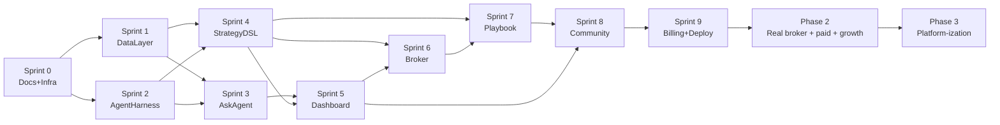

# Nova-Invest Roadmap (Detailed)

**Document type**: Roadmap (Detailed)
**Document nature tag**: \[B] + \[C]

**Last updated**: 2026-07-19

**Related**: The Roadmap Summary in the Master PRD is the condensed version; this document is the detailed breakdown

***

## 1. Roadmap Overview

### 1.1 Three-Phase Summary

| Phase                   | Time Window | Goal                                          | Exit Criteria                  |
| ----------------------- | ----------- | --------------------------------------------- | ------------------------------ |
| Phase 1: PMF Validation | 0-6 mo      | Validate product hypothesis, run minimal loop | 100 DAU + WAU-CW > 30          |
| Phase 2: PMF Scaling    | 7-12 mo     | Grow user base, validate business model       | 5000 registered users + 5% paid conversion |
| Phase 3: Platform-ization | 13-18 mo  | Open ecosystem, multi-market expansion        | 50K users + UGC Playbook 5000+ |

### 1.2 Key Milestones

- M0 (T+0): Master PRD + 8 Epics complete
- M1 (T+1 mo): Next.js skeleton + Mock dataset + local Demo runnable
- M2 (T+3 mo): Cloudflare deployment online, public access
- M3 (T+6 mo): 100 DAU, start recruiting seed users
- M4 (T+9 mo): Pro paid version launched
- M5 (T+12 mo): 5000 users, enter Phase 3
- M6 (T+18 mo): Multi-market expansion started

***

## 2. Phase 1: PMF Validation (0-6 mo)

### 2.1 Sprint 0: Documentation and Infrastructure (Weeks 1-2)

**Goal**: Complete all PRD documentation + code skeleton

| Task                  | Output                            | Module          |
| --------------------- | --------------------------------- | --------------- |
| Master PRD            | docs/prd/Master\_PRD.md           | Product         |
| 8 Epic documents      | docs/prd/epic/\*.md               | Product + Tech  |
| 4 appendices          | docs/prd/appendix/\*.md           | Product + Legal |
| 3 specs               | docs/spec/\*.md                   | Tech            |
| Architecture document | docs/architecture/architecture.md | Architect       |
| Roadmap               | docs/roadmap/Roadmap.md           | Product         |
| Next.js project skeleton | web/                           | Tech            |
| Mock dataset          | mock\_data/                       | Tech            |
| Cloudflare project config | wrangler.toml                 | DevOps          |
| Github repo + Issues  | github.com/ZedeX/nova-invest      | All             |

**Exit Criteria**:

- ✅ All documents complete and self-reviewed
- ✅ Next.js skeleton can be started with `pnpm dev`
- ✅ Mock K-line JSON files generated
- ✅ Cloudflare project configuration complete

### 2.2 Sprint 1: Data Layer (Weeks 3-4)

**Goal**: Epic 02 fully implemented

| Task                  | Acceptance Criteria                             |
| --------------------- | ----------------------------------------------- |
| MarketDataProvider interface | TypeScript interface definition          |
| MockProvider          | Read mock\_data/klines/\*.json                  |
| RealProvider          | Yahoo/Alpha Vantage/Polygon three sources + priority fallback |
| R2 cache              | Cache only 10 Mockup symbols                    |
| D1 schema             | 5 tables created + seed data                    |
| Rate-limit circuit breaker | Implementation + test                     |
| Contract test         | Mock and Real data structures consistent        |

**Exit Criteria**:

- ✅ When `USE_MOCK=true`, all data read from local JSON
- ✅ When `USE_MOCK=false`, real API + R2 cache used by priority
- ✅ Golden Set test passes

### 2.3 Sprint 2: Agent Harness (Weeks 5-6)

**Goal**: Epic 01 fully implemented

| Task              | Acceptance Criteria                            |
| ----------------- | ---------------------------------------------- |
| Worker entry route | All /api/\* routes active                     |
| LLM Router        | Switch between local (LM Studio) / cloud (Volcano Engine Ark) |
| Multi-model degradation chain | Sonnet → Haiku → Mock                  |
| Cost Budget       | Implemented and tested                         |
| Worker environment config | wrangler.toml + secrets                 |

**Exit Criteria**:

- ✅ LLM calls can switch between Mock/Local/Cloud modes
- ✅ Cost Budget does not exceed cap
- ✅ Worker runs both locally and in production deployment

### 2.4 Sprint 3: Ask Agent (Weeks 7-8)

**Goal**: Epic 03 fully implemented

| Task                 | Acceptance Criteria      |
| -------------------- | ------------------------ |
| Query Classifier     | 4 intent classification accuracy > 90% |
| RAG Pipeline         | Multi-source retrieval (K-line/financial reports/news/Playbook) |
| Citation Validator   | Numeric fields must carry citation |
| Short-term memory (KV) | In-session context preserved |
| Long-term memory (D1) | User profile persisted   |
| Mock Q&A samples     | ≥ 20 entries covering 4 intents |
| Streaming response (SSE) | >5s enables streaming |

**Exit Criteria**:

- ✅ Mock mode never calls LLM API
- ✅ Real mode: every answer contains citations
- ✅ Golden Set test passes

### 2.5 Sprint 4: Strategy DSL + Backtest (Weeks 9-10)

**Goal**: Epic 04 fully implemented

| Task                  | Acceptance Criteria                                            |
| --------------------- | -------------------------------------------------------------- |
| DSL YAML Schema v1.0  | Full definition + JSON Schema validator                        |
| Built-in indicator library | ≥ 8 indicators (SMA/EMA/RSI/MACD/Bollinger/ATR/OBV/VWAP) |
| Expression parser     | AND/OR/NOT/>/\</=                                              |
| BacktestEngine        | Full backtest pipeline                                         |
| Report generation     | ≥ 8 metrics                                                    |
| in/out-of-sample      | 70/30 split                                                    |
| 3 example strategies  | MA Cross / RSI / Bollinger                                     |
| Golden backtest result | Pinned test                                                   |

**Exit Criteria**:

- ✅ DSL validation is strict, all errors return clear error codes
- ✅ Backtest result is deterministic (same input, same output)
- ✅ Indicator calculation matches talib

### 2.6 Sprint 5: Dashboard + Frontend (Weeks 11-12)

**Goal**: Epic 05 fully implemented

| Task                               | Acceptance Criteria    |
| ---------------------------------- | ---------------------- |
| TradingView lightweight-charts integration | K-line rendering |
| Indicator overlay                  | At least 3 of SMA/EMA/RSI |
| Strategy markers                   | Buy/sell point display |
| Backtest report widget             | Includes quantile chart |
| Position table widget              | Pulls data from Broker |
| Widget grid system                 | react-grid-layout draggable |
| Mock Badge                         | Shown at top           |
| Dark/Light theme                   | Switchable             |
| Responsive                         | Desktop/tablet/mobile  |

**Exit Criteria**:

- ✅ Lighthouse LCP < 2s (Mock mode)
- ✅ All 6 default widgets loaded
- ✅ Mock Badge clearly visible

### 2.7 Sprint 6: Broker Integration (Weeks 13-14)

**Goal**: Epic 06 fully implemented

| Task               | Acceptance Criteria              |
| ------------------ | -------------------------------- |
| BrokerAdapter interface | Defined and implemented     |
| PaperBroker        | Full order lifecycle             |
| 4 order types      | market/limit/stop/stop\_limit    |
| Slippage model     | Default 5bps                     |
| Position/cash dual ledger | Synchronous update          |
| Risk management 5 rules | All implemented             |
| D1 schema          | 4 tables                         |
| Strategy auto-ordering | strategy\_id association      |

**Exit Criteria**:

- ✅ Complete paper trade closed-loop test passes
- ✅ In Mock mode, fill price comes from Mock K-line
- ✅ All risk management rules effective

### 2.8 Sprint 7: Playbook System (Weeks 15-16)

**Goal**: Epic 08 fully implemented

| Task                     | Acceptance Criteria                                              |
| ------------------------ | ---------------------------------------------------------------- |
| Playbook YAML Schema v1  | Full definition                                                  |
| 6 kind support           | strategy/composite/data\_fetcher/risk\_manager/alert/narrative   |
| 3 composition types      | parallel/sequential/conditional                                  |
| Composition weight validation | = 1.0                                                       |
| Circular dependency detection | Implemented                                                 |
| SemVer versioning        | Implemented                                                      |
| Narrative fields required | why/how/risks                                                   |
| R2 storage YAML          | Implemented                                                      |
| PlaybookExecutor         | 3 composition executions                                         |
| Mock prebuilt 5 Playbooks | Complete                                                        |

**Exit Criteria**:

- ✅ Complete Playbook lifecycle test passes
- ✅ All 3 composition types tested and passing
- ✅ Circular dependencies rejected

### 2.9 Sprint 8: Share & Community (Weeks 17-18)

**Goal**: Epic 07 fully implemented

| Task                     | Acceptance Criteria                       |
| ------------------------ | ----------------------------------------- |
| Share Package schema     | Full definition                           |
| Publish flow             | Strategy → Playbook → Share Package → Community |
| Feed stream              | Time order + popularity sort              |
| Search                   | By tag/author/title                       |
| Install (creates reference) | Does not copy content                  |
| Rating (1-5 stars, dedup) | Implemented                              |
| Comments (nested 2 levels) | Implemented                             |
| Report (tiered handling) | Implemented                              |
| Anti-cheat               | Duplicate detection + frequency limit     |
| Mock prebuilt 10 Playbooks | Complete                                |

**Exit Criteria**:

- ✅ Complete UGC closed-loop test passes
- ✅ All anti-cheat measures effective
- ✅ Mock prebuilt data complete

### 2.10 Sprint 9: Billing + Deployment + Pilot (Weeks 19-24)

**Goal**: Billing system + Cloudflare deployment + recruit 100 DAU

| Task                   | Acceptance Criteria     |
| ---------------------- | ----------------------- |
| Credit system implementation | 4 pricing tiers + per-Action billing |
| Stripe integration (enabled in Phase 2) | Placeholder     |
| Mock mode 0 Credit consumption | Implemented        |
| Degradation chain      | Implemented             |
| OpenTelemetry + Grafana | Monitoring complete    |
| Cloudflare deployment  | Public access           |
| Custom domain (optional) | nova-invest.workers.dev |
| Github Issues creation | 8 Epic top-level Issues |
| Seed user recruitment  | 100 DAU                 |
| User feedback collection | Research report        |

**Exit Criteria**:

- ✅ Cloudflare deployment runs stably for 7 days
- ✅ 100 DAU
- ✅ WAU-CW > 30 (number of users completing full workflow per week)

***

## 3. Phase 2: PMF Scaling (7-12 mo)

### 3.1 Sprint 10-12: Real Broker Integration (Weeks 25-30)

| Task                            | Acceptance Criteria |
| ------------------------------- | ------------------- |
| Alpaca Paper Trading API integration | Through MCP server |
| IBKR TWS API integration        | Through MCP server  |
| Real-time quotes SSE             | Push                |
| Stripe real payment              | Online              |
| Pro paid version                 | $29/month           |
| Team paid version                | $99/month           |

### 3.2 Sprint 13-15: Performance Optimization + Multi-Agent (Weeks 31-36)

| Task                 | Acceptance Criteria |
| -------------------- | ------------------- |
| Walk-forward backtest | Implemented        |
| Multi-strategy portfolio optimization | Markowitz |
| Recommendation system | Vectorize semantic retrieval |
| Creator incentives   | Credit revenue share |
| Performance optimization | LCP < 1s        |
| Multi-language (Chinese) | i18n            |

### 3.3 Sprint 16-18: China Market Preparation (Weeks 37-42)

| Task        | Acceptance Criteria |
| ----------- | ------------------- |
| ICP filing  | Complete            |
| Data localization | Domestic data center |
| Alipay/WeChat Pay | Online          |
| Content review compliance | CAC compliant |
| Chinese AI model | Integrated      |

### 3.4 Sprint 19-21: Growth (Weeks 43-48)

| Task        | Acceptance Criteria           |
| ----------- | ----------------------------- |
| SEO optimization | Google ranking          |
| Content marketing | Blog + Twitter          |
| Community operations | Discord/Telegram     |
| Referral program | Invite reward Credit       |
| 5000 registered users | Achieved              |

**Phase 2 Exit Criteria**:

- ✅ 5000 registered users
- ✅ 5% paid conversion rate (250 paid users)
- ✅ ARR $50K
- ✅ 30-day retention > 40%

***

## 4. Phase 3: Platform-ization (13-18 mo)

### 4.1 Sprint 22-27: Platform-ization (Weeks 49-72)

| Task                 | Acceptance Criteria |
| -------------------- | ------------------- |
| Playbook SDK         | Available to external developers |
| Third-party MCP servers | Ecosystem integration |
| Multi-market (HK/A-shares) | Online            |
| Options/futures      | Online              |
| Mobile App           | iOS + Android       |
| Team collaboration   | Multi-user shared Watchlist |
| Creator cash revenue share | Online        |
| Enterprise edition   | Custom contract     |
| 50K users            | Achieved            |
| UGC Playbook 5000+   | Achieved            |

**Phase 3 Exit Criteria**:

- ✅ 50K registered users
- ✅ UGC Playbook 5000+
- ✅ ARR $500K
- ✅ Multi-market coverage (US + China + HK)

***

## 5. Epic Schedule Matrix

| Epic                  | Phase 1 Sprint | Phase 2 Sprint      | Phase 3 Sprint    |
| --------------------- | -------------- | ------------------- | ----------------- |
| 01 Agent Harness      | S2             | S13-15 Multi-Agent  | S22-24 Agent market |
| 02 Data Layer         | S1             | S10-12 Multi-source expansion | S25-27 Multi-market data |
| 03 Ask Agent          | S3             | S13-15 Recommendation system | S22-24 Multi-language |
| 04 Strategy DSL       | S4             | S13-15 Walk-forward | S25-27 Options DSL |
| 05 Dashboard          | S5             | S13-15 Mobile       | S25-27 Collaboration |
| 06 Broker Integration | S6             | S10-12 Real broker  | S25-27 Multi-market broker |
| 07 Share & Community  | S8             | S16-18 China community | S25-27 Creator ecosystem |
| 08 Playbook System    | S7             | S13-15 Recommendation optimization | S22-24 SDK + multi-market |
| Billing               | S9             | S10-12 Stripe       | S25-27 Enterprise |
| Deployment            | S0+S9          | S13-15 Multi-region | S22-24 Multi-cloud |

***

## 6. Dependency Graph

***

## 7. Risk Register (Roadmap Perspective)

### 7.1 Phase 1 Risks

| Risk                       | Probability | Impact | Mitigation                                |
| -------------------------- | ----------- | ------ | ----------------------------------------- |
| Cloudflare free tier insufficient | Medium  | High   | Monitor usage + upgrade to Workers Paid in Phase 2 |
| Yahoo API IP-banned        | High        | Medium | Multi-source fallback + Mock fallback     |
| Mock data not realistic    | Medium      | Medium | Generate Mock from real historical K-line |
| User non-adoption          | Medium      | High   | 100 DAU is exit criterion; pivot if not met |
| Development delay          | High        | Medium | Sprint buffer + priority tradeoffs        |

### 7.2 Phase 2 Risks

| Risk                          | Probability | Impact | Mitigation                                |
| ----------------------------- | ----------- | ------ | ----------------------------------------- |
| Regulatory changes            | Medium      | High   | Phase 1 Publisher positioning reduces risk |
| Real broker API integration complex | High | Medium | Alpaca paper first, then IBKR             |
| China market compliance complex | High      | High   | Consider entering China only in late Phase 2 |
| Competitors ahead             | Medium      | Medium | Differentiation: complete Mock + UGC      |

### 7.3 Phase 3 Risks

| Risk                  | Probability | Impact | Mitigation                                |
| --------------------- | ----------- | ------ | ----------------------------------------- |
| Platform-ization complexity explosion | High | High | Strict SDK API contracts                  |
| Multi-market regulatory conflict | High | High   | Phased (US → HK → A-shares)              |
| User expectations too high | Medium  | Medium | Transparent communication + progressive release |

***

## 8. Resource Priority

### 8.1 Phase 1 Resource Allocation

| Role              | Investment | Key Deliverables                       |
| ----------------- | ---------- | -------------------------------------- |
| Product (candidate) | 100%     | PRD + Epic + Roadmap + user research   |
| Tech Lead         | 100%       | Architecture + Agent Harness + key modules |
| Frontend          | 100%       | Dashboard + Next.js                    |
| Backend           | 100%       | Workers + D1 + R2                       |
| DevOps (part-time) | 30%        | Cloudflare deployment + CI/CD          |
| Designer (part-time) | 30%      | UI design + experience optimization    |

### 8.2 Phase 2 Resource Additions

- Add 1 Backend (broker integration + multi-Agent)
- Add 1 Designer (mobile)
- Add 1 PM (China market research)

### 8.3 Phase 3 Resources

- Add SDK team
- Add multi-market BD
- Add Enterprise sales

***

## 9. Cross-Module Collaboration

### 9.1 Phase 1 Cross-Module

- DSL (Epic 04) ↔ Playbook (Epic 08): DSL is the content source for Playbook, needs tight collaboration
- Dashboard (Epic 05) ↔ all modules: Dashboard is the consumer, each module provides APIs
- Broker (Epic 06) ↔ Strategy (Epic 04): strategy signals trigger orders
- Community (Epic 07) ↔ Playbook (Epic 08): community shares Playbook packages

### 9.2 Phase 2 Cross-Module

- Real broker integration (Epic 06 extension) involves Billing (Stripe) + Compliance (KYC)
- Multi-Agent (Epic 01 extension) involves Ask Agent (Epic 03) + Build Agent
- China market involves localization across all modules

### 9.3 Communication Cadence

- Daily Standup (15 min)
- Weekly Sprint Planning + Review
- Monthly cross-module sync meeting
- Quarterly Roadmap adjustment

***

## 10. Version Release Plan

### 10.1 Phase 1 Versions

| Version       | Time      | Content                      |
| ------------- | --------- | ---------------------------- |
| v0.1.0-alpha  | Week 4    | DataLayer + Mock dataset     |
| v0.2.0-alpha  | Week 8    | + AskAgent + AgentHarness    |
| v0.3.0-alpha  | Week 12   | + StrategyDSL + Dashboard    |
| v0.4.0-alpha  | Week 16   | + Broker + Playbook          |
| v0.5.0-beta   | Week 20   | + Community + Billing        |
| v1.0.0        | Week 24   | Public release, 100 DAU pilot |

### 10.2 Phase 2 Versions

| Version | Time      | Content                  |
| ------- | --------- | ------------------------ |
| v1.1.0  | Week 30   | Real broker integration  |
| v1.2.0  | Week 36   | Multi-Agent + recommendation system |
| v1.3.0  | Week 42   | China market             |
| v2.0.0  | Week 48   | 5000-user milestone      |

### 10.3 Phase 3 Versions

| Version | Time      | Content           |
| ------- | --------- | ----------------- |
| v3.0.0  | Week 60   | Playbook SDK      |
| v3.1.0  | Week 66   | Multi-market (HK/A-shares) |
| v3.2.0  | Week 72   | Mobile App        |

***

## 11. Version History

| Version | Date        | Change                                                                  |
| ------- | ----------- | ----------------------------------------------------------------------- |
| 0.1     | 2026-07-19  | Initial draft, including 3 phases + 9 Phase 1 Sprints + risk register + resource allocation |
