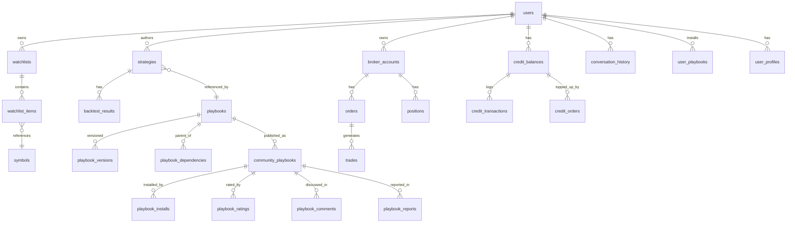

# Data Model Specification

**文档类型**: 技术规格 / 数据模型
**文档性质标签**: [B] + [C]
**最后更新**: 2026-07-19
**关联**: 各 Epic 文档的 D1 schema 聚合 + 统一 ER 图

---

## 1. 概述

本文档汇总 nova-invest 全部 8 个 Epic 涉及的 D1 数据表，提供：
- 统一 ER 图
- 表清单
- 字段规范
- 索引策略
- 数据生命周期

---

## 2. ER 图 [B]



---

## 3. 表清单 [B]

### 3.1 Auth & User

#### `users` (Phase 1.5，Auth 暂时简化)

| 字段 | 类型 | 说明 |
|---|---|---|
| id | TEXT PK | UUID |
| email | TEXT UNIQUE | 注册邮箱 |
| name | TEXT | 显示名 |
| plan | TEXT | free / pro / team / enterprise |
| created_at | TEXT | 创建时间 |
| updated_at | TEXT | 更新时间 |

#### `user_profiles` (Epic 03)

| 字段 | 类型 | 说明 |
|---|---|---|
| user_id | TEXT PK | FK → users.id |
| risk_tolerance | TEXT | conservative/moderate/aggressive |
| sectors | TEXT | JSON array |
| holdings | TEXT | JSON object {ticker: shares} |
| preferred_sources | TEXT | JSON array |
| created_at | TEXT | |
| updated_at | TEXT | |

### 3.2 Data Layer (Epic 02)

#### `symbols`

| 字段 | 类型 | 说明 |
|---|---|---|
| ticker | TEXT PK | "AAPL" |
| name | TEXT | "Apple Inc." |
| exchange | TEXT | NYSE/NASDAQ/AMEX |
| sector | TEXT | "Technology" |
| industry | TEXT | "Consumer Electronics" |
| market_cap | INTEGER | USD |
| is_mockup | INTEGER | 1 = 在 Mockup 池 |
| created_at | TEXT | |

#### `watchlists`

| 字段 | 类型 | 说明 |
|---|---|---|
| id | INTEGER PK AUTOINCREMENT | |
| user_id | TEXT | FK → users.id |
| name | TEXT | "我的科技股" |
| created_at | TEXT | |

#### `watchlist_items`

| 字段 | 类型 | 说明 |
|---|---|---|
| watchlist_id | INTEGER | FK → watchlists.id |
| ticker | TEXT | FK → symbols.ticker |
| added_at | TEXT | |
| PK | | (watchlist_id, ticker) |

#### `kline_cache_index`

| 字段 | 类型 | 说明 |
|---|---|---|
| ticker | TEXT | |
| timeframe | TEXT | 1d/5m/15m/1h |
| cached_at | TEXT | |
| r2_key | TEXT | R2 对象 key |
| PK | | (ticker, timeframe) |

#### `fundamentals`

| 字段 | 类型 | 说明 |
|---|---|---|
| ticker | TEXT | |
| field | TEXT | pe_ratio/eps/revenue/... |
| value | TEXT | |
| period | TEXT | 2024-Q4 / 2024-FY |
| updated_at | TEXT | |
| PK | | (ticker, field, period) |

### 3.3 Ask Agent (Epic 03)

#### `conversation_history`

| 字段 | 类型 | 说明 |
|---|---|---|
| id | INTEGER PK AUTOINCREMENT | |
| user_id | TEXT | |
| session_id | TEXT | |
| role | TEXT | user/assistant |
| content | TEXT | |
| metadata | TEXT | JSON: {intent, citations, cost} |
| created_at | TEXT | |

**索引**: `idx_conv_user_session (user_id, session_id)`

### 3.4 Strategy DSL (Epic 04)

#### `strategies`

| 字段 | 类型 | 说明 |
|---|---|---|
| id | TEXT PK | UUID |
| user_id | TEXT | |
| name | TEXT | "NVDA MA Cross" |
| dsl_yaml | TEXT | 完整 DSL YAML |
| status | TEXT | draft/validated/backtested/paper/live |
| created_at | TEXT | |
| updated_at | TEXT | |

**索引**: `idx_strategies_user (user_id)`

#### `backtest_results`

| 字段 | 类型 | 说明 |
|---|---|---|
| id | INTEGER PK AUTOINCREMENT | |
| strategy_id | TEXT | FK → strategies.id |
| result_json | TEXT | BacktestResult 序列化 |
| run_at | TEXT | |

### 3.5 Broker (Epic 06)

#### `broker_accounts`

| 字段 | 类型 | 说明 |
|---|---|---|
| id | TEXT PK | UUID |
| user_id | TEXT | |
| broker_name | TEXT | paper/alpaca/ibkr |
| mode | TEXT | paper/live |
| balance | REAL | 默认 100000 |
| currency | TEXT | "USD" |
| created_at | TEXT | |

#### `orders`

| 字段 | 类型 | 说明 |
|---|---|---|
| id | TEXT PK | "ord_xxx" |
| user_id | TEXT | |
| account_id | TEXT | FK → broker_accounts.id |
| symbol | TEXT | |
| side | TEXT | buy/sell/sell_short/buy_to_cover |
| type | TEXT | market/limit/stop/stop_limit |
| quantity | REAL | |
| limit_price | REAL | |
| stop_price | REAL | |
| status | TEXT | pending/partial/filled/cancelled/rejected |
| filled_qty | REAL | |
| filled_price | REAL | |
| strategy_id | TEXT | 可选关联策略 |
| created_at | TEXT | |
| updated_at | TEXT | |

**索引**: `idx_orders_user (user_id, created_at)`, `idx_orders_status (status)`

#### `positions`

| 字段 | 类型 | 说明 |
|---|---|---|
| id | INTEGER PK AUTOINCREMENT | |
| user_id | TEXT | |
| account_id | TEXT | FK → broker_accounts.id |
| symbol | TEXT | |
| quantity | REAL | |
| avg_price | REAL | |
| current_price | REAL | |
| unrealized_pnl | REAL | |
| updated_at | TEXT | |
| UNIQUE | | (user_id, account_id, symbol) |

#### `trades`

| 字段 | 类型 | 说明 |
|---|---|---|
| id | INTEGER PK AUTOINCREMENT | |
| order_id | TEXT | FK → orders.id |
| symbol | TEXT | |
| side | TEXT | |
| quantity | REAL | |
| price | REAL | |
| commission | REAL | |
| executed_at | TEXT | |

**索引**: `idx_trades_order (order_id)`

### 3.6 Community (Epic 07)

#### `community_playbooks`

| 字段 | 类型 | 说明 |
|---|---|---|
| package_id | TEXT PK | "pkg_xxx" |
| playbook_id | TEXT | FK → playbooks.id |
| author_id | TEXT | |
| title | TEXT | |
| description | TEXT | |
| tags | TEXT | JSON array |
| yaml_r2_key | TEXT | R2 引用 |
| version | TEXT | "1.0" |
| status | TEXT | active/removed/banned |
| installed_count | INTEGER | |
| rating_avg | REAL | |
| rating_count | INTEGER | |
| created_at | TEXT | |

**索引**: `idx_cp_status_created (status, created_at)`, `idx_cp_author (author_id)`

#### `playbook_installs`

| 字段 | 类型 | 说明 |
|---|---|---|
| id | INTEGER PK AUTOINCREMENT | |
| user_id | TEXT | |
| package_id | TEXT | FK → community_playbooks.package_id |
| installed_at | TEXT | |
| UNIQUE | | (user_id, package_id) |

#### `playbook_ratings`

| 字段 | 类型 | 说明 |
|---|---|---|
| user_id | TEXT | |
| package_id | TEXT | |
| rating | INTEGER | 1-5 |
| created_at | TEXT | |
| PK | | (user_id, package_id) |

#### `playbook_comments`

| 字段 | 类型 | 说明 |
|---|---|---|
| id | INTEGER PK AUTOINCREMENT | |
| package_id | TEXT | |
| user_id | TEXT | |
| content | TEXT | |
| parent_id | INTEGER | 嵌套回复 |
| status | TEXT | active/hidden/deleted |
| created_at | TEXT | |

#### `playbook_reports`

| 字段 | 类型 | 说明 |
|---|---|---|
| id | INTEGER PK AUTOINCREMENT | |
| package_id | TEXT | |
| reporter_id | TEXT | |
| reason | TEXT | plagiarism/misleading/inappropriate |
| description | TEXT | |
| status | TEXT | pending/resolved/rejected |
| created_at | TEXT | |

### 3.7 Playbook System (Epic 08)

#### `playbooks`

| 字段 | 类型 | 说明 |
|---|---|---|
| id | TEXT PK | "pb_xxx" |
| title | TEXT | |
| description | TEXT | |
| author_id | TEXT | |
| kind | TEXT | strategy/composite/data_fetcher/risk_manager/alert/narrative |
| current_version | TEXT | "1.2.0" |
| status | TEXT | draft/published/archived/deprecated |
| created_at | TEXT | |
| updated_at | TEXT | |

#### `playbook_versions`

| 字段 | 类型 | 说明 |
|---|---|---|
| playbook_id | TEXT | FK → playbooks.id |
| version | TEXT | "1.2.0" |
| yaml_r2_key | TEXT | R2 引用 |
| changelog | TEXT | |
| published_by | TEXT | |
| published_at | TEXT | |
| PK | | (playbook_id, version) |

**索引**: `idx_pbv_playbook (playbook_id, published_at DESC)`

#### `playbook_dependencies`

| 字段 | 类型 | 说明 |
|---|---|---|
| parent_id | TEXT | FK → playbooks.id |
| child_id | TEXT | FK → playbooks.id |
| child_version | TEXT | 可选固定版本 |
| dependency_type | TEXT | parallel/sequential/conditional/data |
| weight | REAL | parallel 时权重 |
| created_at | TEXT | |
| PK | | (parent_id, child_id, dependency_type) |

#### `user_playbooks`

| 字段 | 类型 | 说明 |
|---|---|---|
| user_id | TEXT | |
| playbook_id | TEXT | |
| installed_version | TEXT | |
| installed_at | TEXT | |
| PK | | (user_id, playbook_id) |

### 3.8 Billing (Appendix A)

#### `credit_balances`

| 字段 | 类型 | 说明 |
|---|---|---|
| user_id | TEXT | |
| period | TEXT | "2026-07" |
| plan | TEXT | free/pro/team/enterprise |
| granted | INTEGER | |
| used | INTEGER | |
| topped_up | INTEGER | |
| carried_over | INTEGER | |
| updated_at | TEXT | |
| PK | | (user_id, period) |

#### `credit_transactions`

| 字段 | 类型 | 说明 |
|---|---|---|
| id | INTEGER PK AUTOINCREMENT | |
| user_id | TEXT | |
| action | TEXT | ask_simple/ask_deep/backtest/... |
| amount | INTEGER | 正数=扣除，负数=返还 |
| balance_after | INTEGER | |
| metadata | TEXT | JSON |
| created_at | TEXT | |

**索引**: `idx_credit_tx_user_time (user_id, created_at)`

#### `credit_orders`

| 字段 | 类型 | 说明 |
|---|---|---|
| id | TEXT PK | "ord_xxx" |
| user_id | TEXT | |
| amount_usd | REAL | |
| credits | INTEGER | |
| status | TEXT | pending/paid/failed |
| stripe_id | TEXT | |
| created_at | TEXT | |

---

## 4. 索引策略汇总 [B]

| 表 | 索引 | 用途 |
|---|---|---|
| watchlists | (user_id) | 用户 watchlist 查询 |
| conversation_history | (user_id, session_id) | 会话历史查询 |
| strategies | (user_id) | 用户策略列表 |
| orders | (user_id, created_at) | 用户订单时间序 |
| orders | (status) | 待处理订单筛选 |
| trades | (order_id) | 订单成交明细 |
| community_playbooks | (status, created_at) | Feed 流 |
| community_playbooks | (author_id) | 作者主页 |
| playbook_versions | (playbook_id, published_at DESC) | 版本历史 |
| credit_transactions | (user_id, created_at) | 流水查询 |

---

## 5. 数据生命周期 [B]

### 5.1 保留策略

| 数据类型 | 保留期 | 删除方式 |
|---|---|---|
| 用户账户 | 永久（用户主动删除） | 软删除 → 30 天后硬删除 |
| 对话历史 | 7 年 | 合规要求 |
| 订单/成交 | 7 年 | 合规要求 |
| 回测结果 | 1 年 | 用户可主动清理 |
| Mock 数据 | 永久 | 静态资产 |
| Playbook | 永久（作者归档后软删除） | |
| Credit 流水 | 7 年 | 合规要求 |
| 社区评论 | 永久（用户删除后软删除） | |

### 5.2 GDPR 删除流程

```typescript
async function deleteUserData(userId: string) {
  // 1. 软删除主表
  await db.run("UPDATE users SET deleted_at = ? WHERE id = ?", new Date(), userId);

  // 2. 30 天后硬删除（cron job）
  // 包括：users, user_profiles, watchlists, strategies, orders, positions,
  //       trades, conversation_history, user_playbooks, credit_balances,
  //       credit_transactions, credit_orders, playbook_ratings, playbook_comments

  // 3. R2 中用户策略导出删除
  await R2.delete(`strategy_exports/${userId}/`);

  // 4. Vectorize 中用户相关向量删除
  // （通过 metadata.user_id 过滤删除）

  // 5. 通知 Stripe 取消订阅
  await stripe.subscriptions.cancel(user.stripe_sub_id);
}
```

---

## 6. Mock 模式数据预置 [B]

### 6.1 预置用户

```sql
-- migrations/0003_seed_mock_users.sql
INSERT INTO users (id, email, name, plan) VALUES
  ('mock-user-1', 'brenda@mock.dev', 'Brenda Liu', 'pro'),
  ('mock-user-2', 'alex@mock.dev',  'Alex Chen',   'free'),
  ('mock-user-3', 'charles@mock.dev','Charles Wang','team');

INSERT INTO user_profiles (user_id, risk_tolerance, sectors, holdings, preferred_sources)
VALUES
  ('mock-user-1', 'moderate', '["tech","healthcare"]', '{"AAPL":100,"NVDA":50}', '["yahoo","sec_edgar"]'),
  ('mock-user-2', 'conservative', '["index"]', '{"SPY":200}', '["yahoo"]'),
  ('mock-user-3', 'aggressive', '["tech"]', '{"TSLA":300,"NVDA":200}', '["yahoo","polygon"]');
```

### 6.2 预置 Playbook

```sql
-- migrations/0004_seed_mock_playbooks.sql
INSERT INTO playbooks (id, title, author_id, kind, current_version, status) VALUES
  ('pb_mock_macross',    'NVDA MA Cross',       'mock-user-1', 'strategy',  '1.0.0', 'published'),
  ('pb_mock_rsi',        'RSI Oversold',        'mock-user-1', 'strategy',  '1.0.0', 'published'),
  ('pb_mock_bollinger',  'Bollinger Breakout', 'mock-user-2', 'strategy',  '1.0.0', 'published'),
  ('pb_mock_combo',      'Multi-Strategy Combo','mock-user-3', 'composite', '1.0.0', 'published');
```

### 6.3 预置社区数据

```sql
-- migrations/0005_seed_mock_community.sql
INSERT INTO community_playbooks (package_id, playbook_id, author_id, title, tags, yaml_r2_key, version, status, installed_count, rating_avg, rating_count)
VALUES
  ('pkg_mock_001', 'pb_mock_macross',    'mock-user-1', 'NVDA Momentum Master',  '["momentum","single-stock"]',     'r2://playbooks/pb_mock_macross/1.0.0.yaml',    '1.0', 'active', 234, 4.5, 87),
  ('pkg_mock_002', 'pb_mock_rsi',        'mock-user-1', 'RSI Reversal Strategy', '["reversal","oversold"]',         'r2://playbooks/pb_mock_rsi/1.0.0.yaml',        '1.0', 'active', 189, 4.2, 65),
  ('pkg_mock_003', 'pb_mock_bollinger',  'mock-user-2', 'Bollinger Breakout',    '["breakout","volatility"]',       'r2://playbooks/pb_mock_bollinger/1.0.0.yaml',  '1.0', 'active', 156, 4.0, 52),
  ('pkg_mock_004', 'pb_mock_combo',      'mock-user-3', 'Multi-Strategy Combo', '["diversified","multi-strategy"]','r2://playbooks/pb_mock_combo/1.0.0.yaml',      '1.0', 'active', 98,  4.8, 34);
```

---

## 7. 迁移文件清单 [B]

```
migrations/
├── 0001_init.sql              # 所有表 CREATE
├── 0002_seed_symbols.sql      # 预置 10 个 Mockup 标的 + S&P 100
├── 0003_seed_mock_users.sql   # 预置 3 个 Mock 用户
├── 0004_seed_mock_playbooks.sql # 预置 5 个 Mock Playbook
├── 0005_seed_mock_community.sql # 预置社区数据
├── 0006_seed_mock_strategies.sql # 预置策略 + 回测结果
└── 0007_seed_mock_orders.sql   # 预置订单 + 持仓 + 成交
```

---

## 8. 版本历史

| 版本 | 日期 | 变更 |
|---|---|---|
| 0.1 | 2026-07-19 | 初稿，汇总 8 Epic + 1 Appendix 共 27 张表 |
