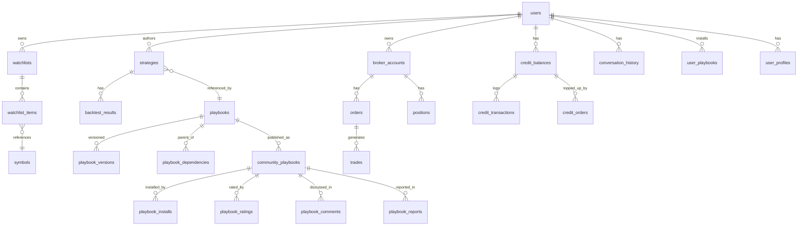

# Data Model Specification

**Document type**: Technical spec / Data model
**Document nature tag**: [B] + [C]
**Last updated**: 2026-07-19
**Related**: D1 schema aggregation of each Epic + unified ER diagram

---

## 1. Overview

This document aggregates the D1 data tables involved in all 8 Epics of nova-invest, providing:
- Unified ER diagram
- Table list
- Field specifications
- Index strategy
- Data lifecycle

---

## 2. ER Diagram [B]



---

## 3. Table List [B]

### 3.1 Auth & User

#### `users` (Phase 1.5, Auth is temporarily simplified)

| Field | Type | Description |
|---|---|---|
| id | TEXT PK | UUID |
| email | TEXT UNIQUE | Registration email |
| name | TEXT | Display name |
| plan | TEXT | free / pro / team / enterprise |
| created_at | TEXT | Creation time |
| updated_at | TEXT | Update time |

#### `user_profiles` (Epic 03)

| Field | Type | Description |
|---|---|---|
| user_id | TEXT PK | FK → users.id |
| risk_tolerance | TEXT | conservative/moderate/aggressive |
| sectors | TEXT | JSON array |
| holdings | TEXT | JSON object {ticker: shares} |
| preferred_sources | TEXT | JSON array |
| created_at | TEXT | |
| updated_at | TEXT | |

### 3.2 Data Layer (Epic 02)

#### `symbols`

| Field | Type | Description |
|---|---|---|
| ticker | TEXT PK | "AAPL" |
| name | TEXT | "Apple Inc." |
| exchange | TEXT | NYSE/NASDAQ/AMEX |
| sector | TEXT | "Technology" |
| industry | TEXT | "Consumer Electronics" |
| market_cap | INTEGER | USD |
| is_mockup | INTEGER | 1 = in Mockup pool |
| created_at | TEXT | |

#### `watchlists`

| Field | Type | Description |
|---|---|---|
| id | INTEGER PK AUTOINCREMENT | |
| user_id | TEXT | FK → users.id |
| name | TEXT | "My Tech Stocks" |
| created_at | TEXT | |

#### `watchlist_items`

| Field | Type | Description |
|---|---|---|
| watchlist_id | INTEGER | FK → watchlists.id |
| ticker | TEXT | FK → symbols.ticker |
| added_at | TEXT | |
| PK | | (watchlist_id, ticker) |

#### `kline_cache_index`

| Field | Type | Description |
|---|---|---|
| ticker | TEXT | |
| timeframe | TEXT | 1d/5m/15m/1h |
| cached_at | TEXT | |
| r2_key | TEXT | R2 object key |
| PK | | (ticker, timeframe) |

#### `fundamentals`

| Field | Type | Description |
|---|---|---|
| ticker | TEXT | |
| field | TEXT | pe_ratio/eps/revenue/... |
| value | TEXT | |
| period | TEXT | 2024-Q4 / 2024-FY |
| updated_at | TEXT | |
| PK | | (ticker, field, period) |

### 3.3 Ask Agent (Epic 03)

#### `conversation_history`

| Field | Type | Description |
|---|---|---|
| id | INTEGER PK AUTOINCREMENT | |
| user_id | TEXT | |
| session_id | TEXT | |
| role | TEXT | user/assistant |
| content | TEXT | |
| metadata | TEXT | JSON: {intent, citations, cost} |
| created_at | TEXT | |

**Index**: `idx_conv_user_session (user_id, session_id)`

### 3.4 Strategy DSL (Epic 04)

#### `strategies`

| Field | Type | Description |
|---|---|---|
| id | TEXT PK | UUID |
| user_id | TEXT | |
| name | TEXT | "NVDA MA Cross" |
| dsl_yaml | TEXT | Full DSL YAML |
| status | TEXT | draft/validated/backtested/paper/live |
| created_at | TEXT | |
| updated_at | TEXT | |

**Index**: `idx_strategies_user (user_id)`

#### `backtest_results`

| Field | Type | Description |
|---|---|---|
| id | INTEGER PK AUTOINCREMENT | |
| strategy_id | TEXT | FK → strategies.id |
| result_json | TEXT | BacktestResult serialized |
| run_at | TEXT | |

### 3.5 Broker (Epic 06)

#### `broker_accounts`

| Field | Type | Description |
|---|---|---|
| id | TEXT PK | UUID |
| user_id | TEXT | |
| broker_name | TEXT | paper/alpaca/ibkr |
| mode | TEXT | paper/live |
| balance | REAL | Default 100000 |
| currency | TEXT | "USD" |
| created_at | TEXT | |

#### `orders`

| Field | Type | Description |
|---|---|---|
| id | TEXT PK | "ord_xxx" |
| user_id | TEXT | |
| account_id | TEXT | FK → broker_accounts.id |
| symbol | TEXT | |
| side | TEXT | buy/sell/sell_short/buy_to_cover |
| type | TEXT | market/limit/stop/stop_limit |
| quantity | REAL | |
| limit_price | REAL | |
| stop_price | REAL | |
| status | TEXT | pending/partial/filled/cancelled/rejected |
| filled_qty | REAL | |
| filled_price | REAL | |
| strategy_id | TEXT | Optional associated strategy |
| created_at | TEXT | |
| updated_at | TEXT | |

**Index**: `idx_orders_user (user_id, created_at)`, `idx_orders_status (status)`

#### `positions`

| Field | Type | Description |
|---|---|---|
| id | INTEGER PK AUTOINCREMENT | |
| user_id | TEXT | |
| account_id | TEXT | FK → broker_accounts.id |
| symbol | TEXT | |
| quantity | REAL | |
| avg_price | REAL | |
| current_price | REAL | |
| unrealized_pnl | REAL | |
| updated_at | TEXT | |
| UNIQUE | | (user_id, account_id, symbol) |

#### `trades`

| Field | Type | Description |
|---|---|---|
| id | INTEGER PK AUTOINCREMENT | |
| order_id | TEXT | FK → orders.id |
| symbol | TEXT | |
| side | TEXT | |
| quantity | REAL | |
| price | REAL | |
| commission | REAL | |
| executed_at | TEXT | |

**Index**: `idx_trades_order (order_id)`

### 3.6 Community (Epic 07)

#### `community_playbooks`

| Field | Type | Description |
|---|---|---|
| package_id | TEXT PK | "pkg_xxx" |
| playbook_id | TEXT | FK → playbooks.id |
| author_id | TEXT | |
| title | TEXT | |
| description | TEXT | |
| tags | TEXT | JSON array |
| yaml_r2_key | TEXT | R2 reference |
| version | TEXT | "1.0" |
| status | TEXT | active/removed/banned |
| installed_count | INTEGER | |
| rating_avg | REAL | |
| rating_count | INTEGER | |
| created_at | TEXT | |

**Index**: `idx_cp_status_created (status, created_at)`, `idx_cp_author (author_id)`

#### `playbook_installs`

| Field | Type | Description |
|---|---|---|
| id | INTEGER PK AUTOINCREMENT | |
| user_id | TEXT | |
| package_id | TEXT | FK → community_playbooks.package_id |
| installed_at | TEXT | |
| UNIQUE | | (user_id, package_id) |

#### `playbook_ratings`

| Field | Type | Description |
|---|---|---|
| user_id | TEXT | |
| package_id | TEXT | |
| rating | INTEGER | 1-5 |
| created_at | TEXT | |
| PK | | (user_id, package_id) |

#### `playbook_comments`

| Field | Type | Description |
|---|---|---|
| id | INTEGER PK AUTOINCREMENT | |
| package_id | TEXT | |
| user_id | TEXT | |
| content | TEXT | |
| parent_id | INTEGER | Nested reply |
| status | TEXT | active/hidden/deleted |
| created_at | TEXT | |

#### `playbook_reports`

| Field | Type | Description |
|---|---|---|
| id | INTEGER PK AUTOINCREMENT | |
| package_id | TEXT | |
| reporter_id | TEXT | |
| reason | TEXT | plagiarism/misleading/inappropriate |
| description | TEXT | |
| status | TEXT | pending/resolved/rejected |
| created_at | TEXT | |

### 3.7 Playbook System (Epic 08)

#### `playbooks`

| Field | Type | Description |
|---|---|---|
| id | TEXT PK | "pb_xxx" |
| title | TEXT | |
| description | TEXT | |
| author_id | TEXT | |
| kind | TEXT | strategy/composite/data_fetcher/risk_manager/alert/narrative |
| current_version | TEXT | "1.2.0" |
| status | TEXT | draft/published/archived/deprecated |
| created_at | TEXT | |
| updated_at | TEXT | |

#### `playbook_versions`

| Field | Type | Description |
|---|---|---|
| playbook_id | TEXT | FK → playbooks.id |
| version | TEXT | "1.2.0" |
| yaml_r2_key | TEXT | R2 reference |
| changelog | TEXT | |
| published_by | TEXT | |
| published_at | TEXT | |
| PK | | (playbook_id, version) |

**Index**: `idx_pbv_playbook (playbook_id, published_at DESC)`

#### `playbook_dependencies`

| Field | Type | Description |
|---|---|---|
| parent_id | TEXT | FK → playbooks.id |
| child_id | TEXT | FK → playbooks.id |
| child_version | TEXT | Optional fixed version |
| dependency_type | TEXT | parallel/sequential/conditional/data |
| weight | REAL | Weight in parallel case |
| created_at | TEXT | |
| PK | | (parent_id, child_id, dependency_type) |

#### `user_playbooks`

| Field | Type | Description |
|---|---|---|
| user_id | TEXT | |
| playbook_id | TEXT | |
| installed_version | TEXT | |
| installed_at | TEXT | |
| PK | | (user_id, playbook_id) |

### 3.8 Billing (Appendix A)

#### `credit_balances`

| Field | Type | Description |
|---|---|---|
| user_id | TEXT | |
| period | TEXT | "2026-07" |
| plan | TEXT | free/pro/team/enterprise |
| granted | INTEGER | |
| used | INTEGER | |
| topped_up | INTEGER | |
| carried_over | INTEGER | |
| updated_at | TEXT | |
| PK | | (user_id, period) |

#### `credit_transactions`

| Field | Type | Description |
|---|---|---|
| id | INTEGER PK AUTOINCREMENT | |
| user_id | TEXT | |
| action | TEXT | ask_simple/ask_deep/backtest/... |
| amount | INTEGER | Positive = deducted, negative = refunded |
| balance_after | INTEGER | |
| metadata | TEXT | JSON |
| created_at | TEXT | |

**Index**: `idx_credit_tx_user_time (user_id, created_at)`

#### `credit_orders`

| Field | Type | Description |
|---|---|---|
| id | TEXT PK | "ord_xxx" |
| user_id | TEXT | |
| amount_usd | REAL | |
| credits | INTEGER | |
| status | TEXT | pending/paid/failed |
| stripe_id | TEXT | |
| created_at | TEXT | |

---

## 4. Index Strategy Summary [B]

| Table | Index | Purpose |
|---|---|---|
| watchlists | (user_id) | User watchlist query |
| conversation_history | (user_id, session_id) | Conversation history query |
| strategies | (user_id) | User strategy list |
| orders | (user_id, created_at) | User order timeline |
| orders | (status) | Pending order filtering |
| trades | (order_id) | Order trade details |
| community_playbooks | (status, created_at) | Feed stream |
| community_playbooks | (author_id) | Author profile |
| playbook_versions | (playbook_id, published_at DESC) | Version history |
| credit_transactions | (user_id, created_at) | Transaction query |

---

## 5. Data Lifecycle [B]

### 5.1 Retention Policy

| Data type | Retention period | Deletion method |
|---|---|---|
| User account | Permanent (user-initiated deletion) | Soft delete → hard delete after 30 days |
| Conversation history | 7 years | Compliance requirement |
| Orders/Trades | 7 years | Compliance requirement |
| Backtest results | 1 year | User can manually clean |
| Mock data | Permanent | Static asset |
| Playbook | Permanent (soft-deleted after author archives) | |
| Credit transactions | 7 years | Compliance requirement |
| Community comments | Permanent (soft-deleted after user deletion) | |

### 5.2 GDPR Deletion Process

```typescript
async function deleteUserData(userId: string) {
  // 1. Soft delete primary tables
  await db.run("UPDATE users SET deleted_at = ? WHERE id = ?", new Date(), userId);

  // 2. Hard delete after 30 days (cron job)
  // Includes: users, user_profiles, watchlists, strategies, orders, positions,
  //       trades, conversation_history, user_playbooks, credit_balances,
  //       credit_transactions, credit_orders, playbook_ratings, playbook_comments

  // 3. Delete user strategy exports in R2
  await R2.delete(`strategy_exports/${userId}/`);

  // 4. Delete user-related vectors in Vectorize
  // (Filtered and deleted via metadata.user_id)

  // 5. Notify Stripe to cancel subscription
  await stripe.subscriptions.cancel(user.stripe_sub_id);
}
```

---

## 6. Mock Mode Data Preset [B]

### 6.1 Preset Users

```sql
-- migrations/0003_seed_mock_users.sql
INSERT INTO users (id, email, name, plan) VALUES
  ('mock-user-1', 'brenda@mock.dev', 'Brenda Liu', 'pro'),
  ('mock-user-2', 'alex@mock.dev',  'Alex Chen',   'free'),
  ('mock-user-3', 'charles@mock.dev','Charles Wang','team');

INSERT INTO user_profiles (user_id, risk_tolerance, sectors, holdings, preferred_sources)
VALUES
  ('mock-user-1', 'moderate', '["tech","healthcare"]', '{"AAPL":100,"NVDA":50}', '["yahoo","sec_edgar"]'),
  ('mock-user-2', 'conservative', '["index"]', '{"SPY":200}', '["yahoo"]'),
  ('mock-user-3', 'aggressive', '["tech"]', '{"TSLA":300,"NVDA":200}', '["yahoo","polygon"]');
```

### 6.2 Preset Playbooks

```sql
-- migrations/0004_seed_mock_playbooks.sql
INSERT INTO playbooks (id, title, author_id, kind, current_version, status) VALUES
  ('pb_mock_macross',    'NVDA MA Cross',       'mock-user-1', 'strategy',  '1.0.0', 'published'),
  ('pb_mock_rsi',        'RSI Oversold',        'mock-user-1', 'strategy',  '1.0.0', 'published'),
  ('pb_mock_bollinger',  'Bollinger Breakout', 'mock-user-2', 'strategy',  '1.0.0', 'published'),
  ('pb_mock_combo',      'Multi-Strategy Combo','mock-user-3', 'composite', '1.0.0', 'published');
```

### 6.3 Preset Community Data

```sql
-- migrations/0005_seed_mock_community.sql
INSERT INTO community_playbooks (package_id, playbook_id, author_id, title, tags, yaml_r2_key, version, status, installed_count, rating_avg, rating_count)
VALUES
  ('pkg_mock_001', 'pb_mock_macross',    'mock-user-1', 'NVDA Momentum Master',  '["momentum","single-stock"]',     'r2://playbooks/pb_mock_macross/1.0.0.yaml',    '1.0', 'active', 234, 4.5, 87),
  ('pkg_mock_002', 'pb_mock_rsi',        'mock-user-1', 'RSI Reversal Strategy', '["reversal","oversold"]',         'r2://playbooks/pb_mock_rsi/1.0.0.yaml',        '1.0', 'active', 189, 4.2, 65),
  ('pkg_mock_003', 'pb_mock_bollinger',  'mock-user-2', 'Bollinger Breakout',    '["breakout","volatility"]',       'r2://playbooks/pb_mock_bollinger/1.0.0.yaml',  '1.0', 'active', 156, 4.0, 52),
  ('pkg_mock_004', 'pb_mock_combo',      'mock-user-3', 'Multi-Strategy Combo', '["diversified","multi-strategy"]','r2://playbooks/pb_mock_combo/1.0.0.yaml',      '1.0', 'active', 98,  4.8, 34);
```

---

## 7. Migration File List [B]

```
migrations/
├── 0001_init.sql              # All tables CREATE
├── 0002_seed_symbols.sql      # Preset 10 Mockup symbols + S&P 100
├── 0003_seed_mock_users.sql   # Preset 3 Mock users
├── 0004_seed_mock_playbooks.sql # Preset 5 Mock Playbooks
├── 0005_seed_mock_community.sql # Preset community data
├── 0006_seed_mock_strategies.sql # Preset strategies + backtest results
└── 0007_seed_mock_orders.sql   # Preset orders + positions + trades
```

---

## 8. Version History

| Version | Date | Change |
|---|---|---|
| 0.1 | 2026-07-19 | Initial draft, aggregating 8 Epics + 1 Appendix with 27 tables |
